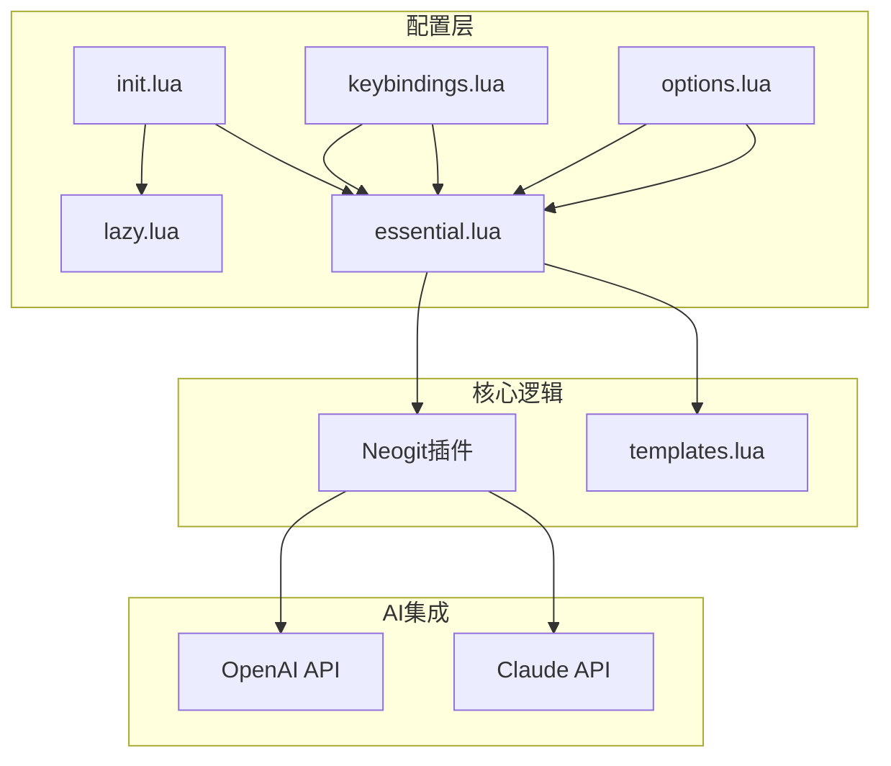
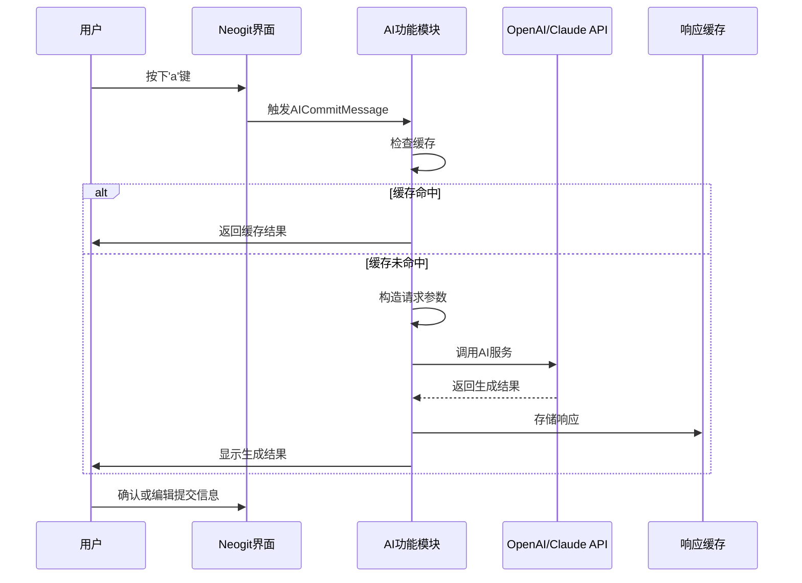
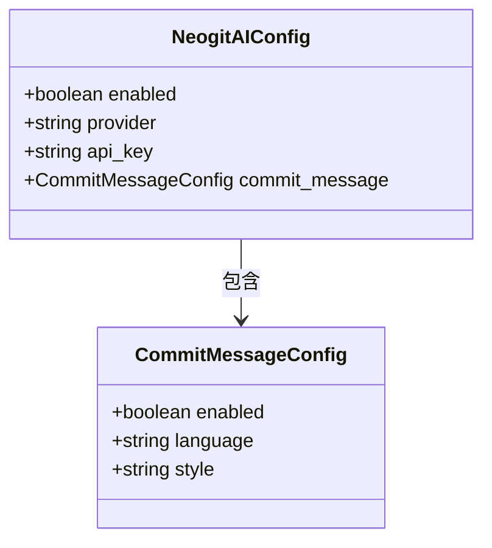
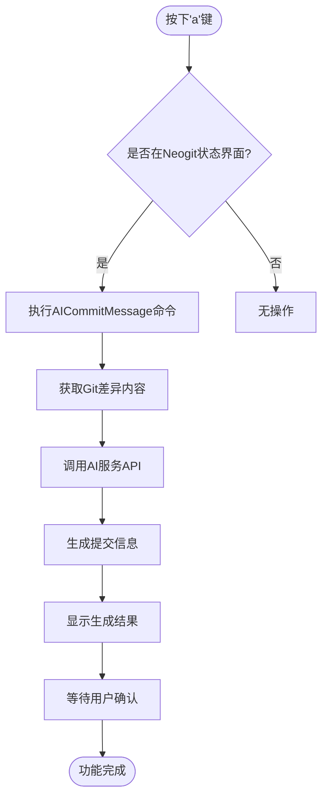
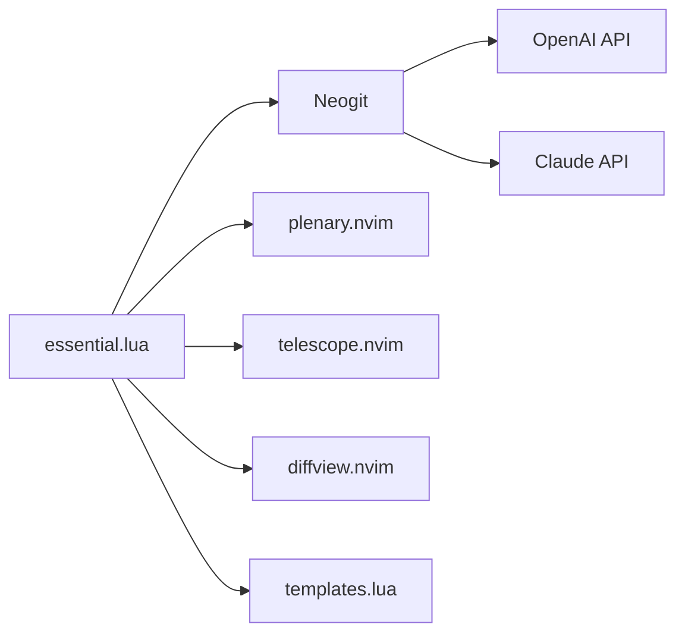

# AI提交信息生成

<cite>
**本文档中引用的文件**  
- [essential.lua](file://lua/plugins/essential.lua)
- [templates.lua](file://lua/core/templates.lua)
- [keybindings.lua](file://lua/config/keybindings.lua)
- [options.lua](file://lua/config/options.lua)
- [init.lua](file://init.lua)
</cite>

## 目录
1. [简介](#简介)
2. [项目结构](#项目结构)
3. [核心组件](#核心组件)
4. [架构概述](#架构概述)
5. [详细组件分析](#详细组件分析)
6. [依赖分析](#依赖分析)
7. [性能考虑](#性能考虑)
8. [故障排除指南](#故障排除指南)
9. [结论](#结论)

## 简介
本文档详细说明在Neogit中集成AI生成提交信息的功能实现。重点解析`essential.lua`中如何监听'a'键操作并调用OpenAI/Claude API分析Git差异内容，生成符合规范的提交消息。涵盖提示词工程设计、多语言支持与用户自定义模板配置方法。提供API密钥管理最佳实践，确保敏感信息不被提交至版本控制。包含失败重试机制、响应缓存与用户反馈确认流程，确保操作安全性。

## 项目结构
项目采用标准的Neovim配置结构，核心功能模块化组织。AI提交信息功能主要由`essential.lua`中的Neogit插件配置驱动，通过键位映射触发AI功能。配置文件分层清晰，`config`目录管理键位与选项，`core`目录包含核心逻辑，`plugins`目录集成第三方插件。

**图示来源**  
- [essential.lua](file://lua/plugins/essential.lua#L492-L568)
- [init.lua](file://init.lua#L1-L50)
- [keybindings.lua](file://lua/config/keybindings.lua#L1-L282)

**本节来源**  
- [essential.lua](file://lua/plugins/essential.lua#L1-L610)
- [init.lua](file://init.lua#L1-L50)

## 核心组件
AI提交信息功能的核心组件包括Neogit插件的AI配置模块、键位映射系统、API密钥管理机制以及用户反馈确认流程。这些组件协同工作，实现从用户触发到AI生成再到提交确认的完整闭环。

**本节来源**  
- [essential.lua](file://lua/plugins/essential.lua#L492-L568)
- [keybindings.lua](file://lua/config/keybindings.lua#L1-L282)

## 架构概述
系统架构采用分层设计，上层为用户交互层，中层为逻辑处理层，底层为外部服务集成层。当用户在Neogit界面按下'a'键时，事件被映射到AICommitMessage命令，触发AI模块调用配置的AI服务提供商API，分析当前Git差异并生成提交信息。

**图示来源**  
- [essential.lua](file://lua/plugins/essential.lua#L492-L568)
- [keybindings.lua](file://lua/config/keybindings.lua#L1-L282)

## 详细组件分析

### AI功能配置分析
Neogit插件的AI功能通过`opts.AI`配置对象进行设置，包含启用状态、服务提供商、API密钥获取方式、语言偏好和提交信息风格等关键参数。

**图示来源**  
- [essential.lua](file://lua/plugins/essential.lua#L492-L535)

**本节来源**  
- [essential.lua](file://lua/plugins/essential.lua#L492-L568)

### 键位映射机制分析
系统通过Neogit的mappings配置将'a'键映射到AICommitMessage命令，实现快捷触发AI生成功能。该映射定义在status模式下，允许用户在Git状态界面直接调用AI功能。

**图示来源**  
- [essential.lua](file://lua/plugins/essential.lua#L531-L568)

**本节来源**  
- [essential.lua](file://lua/plugins/essential.lua#L531-L568)
- [keybindings.lua](file://lua/config/keybindings.lua#L1-L282)

### 多语言支持与模板配置
系统支持多语言提交信息生成，当前配置为中文（zh-CN）。用户可通过修改`language`字段切换语言，支持'en-US'等其他语言选项。提交信息风格可配置为'conventional'（约定式）或'descriptive'（描述式）。

**本节来源**  
- [essential.lua](file://lua/plugins/essential.lua#L508-L511)

## 依赖分析
AI提交信息功能依赖多个核心组件和外部服务。内部依赖包括Neogit主插件、plenary.nvim（异步支持）、telescope.nvim（搜索集成）和diffview.nvim（差异查看）。外部依赖为OpenAI或Claude的API服务。

**图示来源**  
- [essential.lua](file://lua/plugins/essential.lua#L492-L568)

**本节来源**  
- [essential.lua](file://lua/plugins/essential.lua#L492-L568)

## 性能考虑
系统设计考虑了性能优化，包括响应缓存机制避免重复请求、异步API调用防止界面阻塞、以及合理的超时设置。API密钥通过环境变量获取，避免硬编码，同时减少配置文件读取开销。

## 故障排除指南
常见问题包括API密钥未设置、网络连接问题、服务提供商不可用等。建议检查环境变量`OPENAI_API_KEY`是否正确设置，验证网络连接，查看Neogit错误日志。若遇频繁失败，可尝试切换AI服务提供商或检查API使用配额。

**本节来源**  
- [essential.lua](file://lua/plugins/essential.lua#L505-L506)
- [options.lua](file://lua/config/options.lua#L1-L264)

## 结论
Neogit的AI提交信息生成功能通过简洁的键位映射和模块化配置，实现了高效、安全的智能提交信息生成。系统设计考虑了用户体验、安全性（API密钥管理）和可靠性（缓存与重试机制），为开发者提供了现代化的Git操作体验。