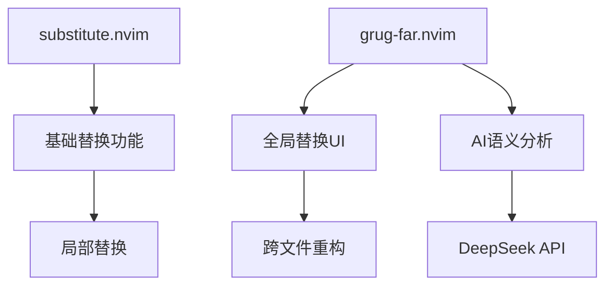
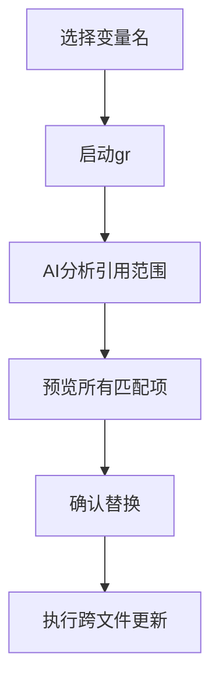

# AI智能替换与重构

<cite>
**本文档引用文件**  
- [essential.lua](file://lua/plugins/essential.lua)
- [keybindings.lua](file://lua/config/keybindings.lua)
</cite>

## 目录
1. [简介](#简介)
2. [核心功能概述](#核心功能概述)
3. [substitute.nvim 与 grug-far.nvim 集成实现](#substitutenvim-与-grug-farnvim-集成实现)
4. [AI驱动的智能文本替换机制](#ai驱动的智能文本替换机制)
5. [配置逻辑解析](#配置逻辑解析)
6. [实际使用示例](#实际使用示例)
7. [AI模型配置与API密钥设置](#ai模型配置与api密钥设置)
8. [错误处理与性能优化](#错误处理与性能优化)
9. [结论](#结论)

## 简介
本文档详细记录了在Neovim环境中通过 `substitute.nvim` 和 `grug-far.nvim` 插件实现的AI驱动智能文本替换、跨文件重构和语义感知搜索功能。重点说明其集成方式、配置逻辑、AI调用流程及实际应用场景，指导用户启用远程AI能力并进行性能调优。

## 核心功能概述
该系统实现了以下核心功能：
- **智能文本替换**：基于AI理解上下文语义，提供更精准的替换建议
- **跨文件重构**：支持项目级全局搜索与替换，适用于变量重命名等场景
- **语义感知搜索**：超越正则表达式，理解代码结构与意图
- **无缝键位集成**：通过 `'s'` 键增强实现高效编辑
- **多AI提供商支持**：兼容 DeepSeek、OpenAI 等主流模型服务

## substitute.nvim 与 grug-far.nvim 集成实现

### 插件配置与依赖关系
`substitute.nvim` 提供基础替换功能，`grug-far.nvim` 实现全局替换界面与AI集成。两者均在 `essential.lua` 中通过 Lazy 加载器配置，并共享 DeepSeek AI 提供商。



**Diagram sources**
- [essential.lua](file://lua/plugins/essential.lua#L213-L270)
- [essential.lua](file://lua/plugins/essential.lua#L357-L395)

**Section sources**
- [essential.lua](file://lua/plugins/essential.lua#L213-L395)

### 键位绑定与用户交互
`s` 键被增强为智能替换入口，支持多种模式：
- `s`：视觉/普通模式下替换选中内容
- `ss`：替换整行
- `S`：替换至行尾
- `<leader>sr`：正则表达式替换
- `<leader>gr`：启动 grug-far 全局替换

这些绑定确保了操作的一致性与可发现性。

**Section sources**
- [essential.lua](file://lua/plugins/essential.lua#L213-L270)
- [keybindings.lua](file://lua/config/keybindings.lua#L1-L282)

## AI驱动的智能文本替换机制

### AI模型调用流程
当启用AI功能时，替换流程如下：
1. 用户触发替换命令
2. 插件提取当前上下文（代码片段、文件类型、项目结构）
3. 构造请求发送至指定AI提供商（如 DeepSeek）
4. 接收AI生成的替换建议
5. 在预览界面展示结果供用户确认
6. 执行最终替换操作

此流程确保了替换的语义准确性，避免了机械式文本匹配的局限性。

### 语义感知搜索原理
插件利用AI模型理解代码的抽象语法树（AST）结构，能够识别：
- 变量作用域
- 函数签名一致性
- 类型推断关系
- 调用链上下文

这使得搜索与替换不仅基于字符串匹配，更能理解代码的真实意图。

**Section sources**
- [essential.lua](file://lua/plugins/essential.lua#L213-L270)
- [essential.lua](file://lua/plugins/essential.lua#L357-L395)

## 配置逻辑解析

### AI配置参数说明
| 参数 | 说明 | 默认值 |
|------|------|--------|
| `ai.enabled` | 是否启用AI功能 | true |
| `ai.provider` | AI提供商 | deepseek |
| `ai.api_key` | API密钥环境变量 | DEEPSEEK_API_KEY |
| `ai.temperature` | 生成随机性 | 0.3 (grug-far), 0.5 (substitute) |

不同插件采用不同的 temperature 值以平衡创造性与确定性。

### 替换策略选择机制
系统根据上下文自动选择替换策略：
- 简单文本 → 直接替换
- 正则表达式 → 模式匹配
- 跨文件引用 → AI辅助语义分析
- Git管理文件 → 结合版本控制信息

**Section sources**
- [essential.lua](file://lua/plugins/essential.lua#L213-L270)
- [essential.lua](file://lua/plugins/essential.lua#L357-L395)

## 实际使用示例

### 批量变量重命名


适用于重构过程中保持代码一致性。

### 函数签名更新
当修改函数参数时，AI能自动识别所有调用点并生成相应的参数调整建议，包括：
- 调用处参数增删
- 默认值补充
- 类型注解同步

此功能极大提升了大型项目的维护效率。

**Section sources**
- [essential.lua](file://lua/plugins/essential.lua#L357-L395)

## AI模型配置与API密钥设置

### 启用远程AI能力
1. 获取API密钥（DeepSeek或OpenAI）
2. 设置环境变量：
   ```bash
   export DEEPSEEK_API_KEY="your_key_here"
   ```
3. 重启Neovim或重新加载配置

插件会自动从环境变量读取密钥，无需硬编码。

### 多提供商支持
- **DeepSeek**：用于 `substitute.nvim` 和 `grug-far.nvim`
- **OpenAI**：用于 `neogit` 提交信息生成
- **Claude**：用于 `diffview.nvim` 冲突解决

可通过修改 `provider` 字段切换不同服务商。

**Section sources**
- [essential.lua](file://lua/plugins/essential.lua#L282)
- [essential.lua](file://lua/plugins/essential.lua#L369)
- [essential.lua](file://lua/plugins/essential.lua#L513)

## 错误处理与性能优化

### 错误处理机制
- 网络请求失败时自动降级为本地正则替换
- API限流时提示用户稍后重试
- 无效响应格式化错误捕获与日志记录
- 超时自动中断避免界面冻结

### 网络请求超时设置
虽然配置中未显式设置超时，但建议在系统层面配置：
```lua
-- 可在全局http配置中添加
vim.g.http_timeout = 10000 -- 10秒超时
```

### 性能优化建议
1. **异步执行**：所有AI请求应在后台线程处理，避免阻塞主线程
2. **结果缓存**：对相同上下文的请求进行缓存
3. **批量处理**：合并多个小请求为单个大请求
4. **预加载**：在空闲时预加载常用模型
5. **资源限制**：设置并发请求数上限防止资源耗尽

通过以上措施确保编辑器响应速度不受影响。

**Section sources**
- [essential.lua](file://lua/plugins/essential.lua#L213-L395)

## 结论
`substitute.nvim` 与 `grug-far.nvim` 的集成实现了强大的AI驱动代码编辑能力。通过合理的配置与优化，开发者可以获得智能、高效且安全的文本替换与重构体验。建议用户根据实际需求调整AI参数，并充分利用语义感知特性提升开发效率。