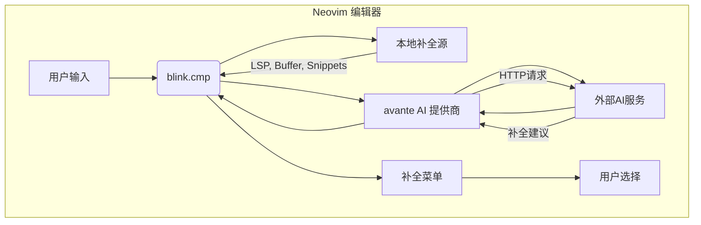
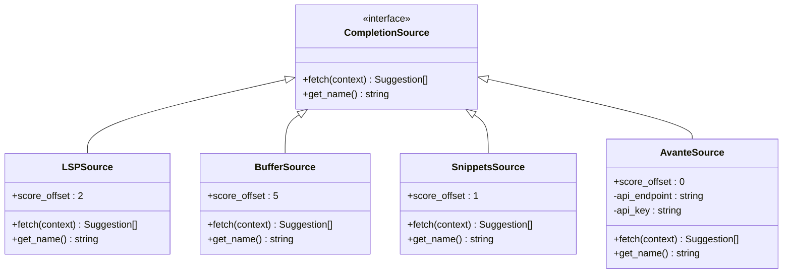
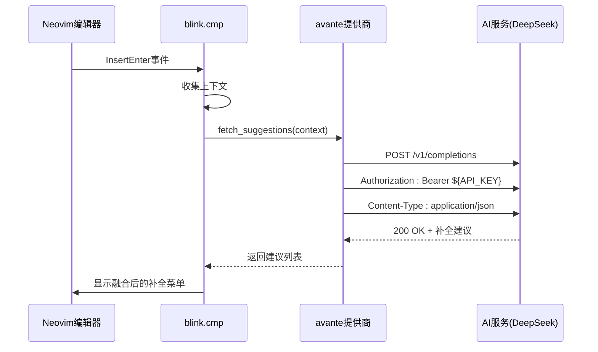
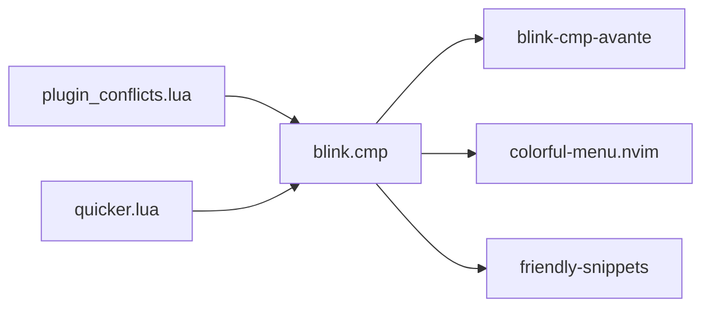

# AI补全增强

<cite>
**本文档引用的文件**  
- [quicker.lua](file://lua/plugins/quicker.lua)
- [blink-cmp.lua](file://lua/plugins/blink-cmp.lua)
- [essential.lua](file://lua/plugins/essential.lua)
- [plugin_conflicts.lua](file://lua/core/plugin_conflicts.lua)
</cite>

## 目录
1. [简介](#简介)
2. [项目结构](#项目结构)
3. [核心组件](#核心组件)
4. [架构概述](#架构概述)
5. [详细组件分析](#详细组件分析)
6. [依赖分析](#依赖分析)
7. [性能考虑](#性能考虑)
8. [故障排除指南](#故障排除指南)
9. [结论](#结论)

## 简介
本文档深入解析 `quicker.lua` 中 AI 增强补全功能的实现机制，重点描述如何通过 `blink-cmp` 与外部 AI 服务（如 DeepSeek）结合，实现上下文感知的代码补全建议。文档涵盖异步请求处理、缓存策略、补全优先级排序逻辑、配置方法、典型使用场景以及与本地补全引擎的融合策略。

## 项目结构
Neovim 配置项目采用模块化设计，主要分为 `lua/config`、`lua/core` 和 `lua/plugins` 三个目录。AI 补全相关功能主要集中在 `lua/plugins` 目录下的 `blink-cmp.lua` 和 `quicker.lua` 文件中，其中 `blink-cmp.lua` 负责补全引擎的核心配置，`quicker.lua` 包含代码格式化等辅助功能。

**Section sources**
- [quicker.lua](file://lua/plugins/quicker.lua#L0-L289)
- [blink-cmp.lua](file://lua/plugins/blink-cmp.lua#L0-L145)

## 核心组件
AI 增强补全功能的核心组件是 `blink.cmp` 插件，它通过 `avante` 提供商集成外部 AI 服务。`blink-cmp-avante` 模块负责与 AI 服务通信，处理异步请求，并将 AI 生成的补全项与本地补全源（如 LSP、buffer、snippets）进行融合。

**Section sources**
- [blink-cmp.lua](file://lua/plugins/blink-cmp.lua#L100-L144)
- [plugin_conflicts.lua](file://lua/core/plugin_conflicts.lua#L132-L156)

## 架构概述
AI 补全系统采用分层架构，上层为 `blink.cmp` 补全引擎，中层为 `avante` AI 提供商，底层为外部 AI 服务（如 DeepSeek）。补全请求在用户输入时触发，由 `blink.cmp` 调度多个数据源，`avante` 提供商负责向 AI 服务发送上下文信息并接收补全建议。



**Diagram sources**
- [blink-cmp.lua](file://lua/plugins/blink-cmp.lua#L100-L144)
- [essential.lua](file://lua/plugins/essential.lua#L357-L395)

## 详细组件分析

### blink-cmp 配置分析
`blink-cmp` 插件通过 Lua 配置定义了补全行为，包括键位映射、签名帮助、补全列表外观等。其核心是 `sources` 配置，定义了多个补全提供者及其优先级。

#### 补全源与优先级


**Diagram sources**
- [blink-cmp.lua](file://lua/plugins/blink-cmp.lua#L100-L144)

**Section sources**
- [blink-cmp.lua](file://lua/plugins/blink-cmp.lua#L100-L144)

### AI 服务集成分析
`avante` 提供商通过 `blink-cmp-avante` 模块与外部 AI 服务集成。配置中指定了模块名称和选项，实际的 API 密钥和端点通常通过环境变量或全局配置管理。

#### AI 请求流程


**Diagram sources**
- [essential.lua](file://lua/plugins/essential.lua#L357-L395)
- [blink-cmp.lua](file://lua/plugins/blink-cmp.lua#L100-L144)

**Section sources**
- [essential.lua](file://lua/plugins/essential.lua#L357-L395)

### 配置与融合策略
系统通过 `score_offset` 参数控制不同补全源的优先级，数值越大优先级越高。AI 补全（avante）默认优先级较低，确保本地补全（如 snippets）优先显示。用户可通过 `source.providers.snippets.score_offset=100` 提升代码片段优先级。

#### 补全优先级逻辑
```mermaid
flowchart TD
A[触发补全] --> B{上下文分析}
B --> C[查询LSP]
B --> D[查询Buffer]
B --> E[查询Snippets]
B --> F[查询Avante(AI)]
C --> G[合并结果]
D --> G
E --> G
F --> G
G --> H[按score_offset排序]
H --> I[应用缓存策略]
I --> J[显示补全菜单]
```

**Diagram sources**
- [blink-cmp.lua](file://lua/plugins/blink-cmp.lua#L100-L144)

**Section sources**
- [blink-cmp.lua](file://lua/plugins/blink-cmp.lua#L100-L144)

## 依赖分析
AI 补全功能依赖多个插件协同工作。`blink.cmp` 是核心补全引擎，`blink-cmp-avante` 提供 AI 集成能力，`colorful-menu.nvim` 增强菜单外观。此外，系统通过 `plugin_conflicts.lua` 解决了与其他插件（如 `nvim-autopairs`）的键位冲突。



**Diagram sources**
- [blink-cmp.lua](file://lua/plugins/blink-cmp.lua#L0-L43)
- [plugin_conflicts.lua](file://lua/core/plugin_conflicts.lua#L132-L156)

**Section sources**
- [blink-cmp.lua](file://lua/plugins/blink-cmp.lua#L0-L43)
- [plugin_conflicts.lua](file://lua/core/plugin_conflicts.lua#L132-L156)

## 性能考虑
系统通过异步请求和缓存策略优化 AI 补全性能。`avante` 提供商在后台发起 HTTP 请求，不阻塞编辑器主线程。补全结果可缓存以减少重复请求。此外，通过设置 `min_keyword_length` 和文件类型过滤，避免在不必要时触发 AI 请求。

## 故障排除指南
常见问题包括 AI 服务连接失败、补全菜单不显示、键位冲突等。解决方案包括检查 API 密钥环境变量、确认 `DEEPSEEK_API_KEY` 是否设置、检查 `plugin_conflicts.lua` 中的冲突解决逻辑，以及验证 `blink.cmp` 的 `enabled` 条件。

**Section sources**
- [essential.lua](file://lua/plugins/essential.lua#L357-L395)
- [plugin_conflicts.lua](file://lua/core/plugin_conflicts.lua#L132-L156)

## 结论
该 AI 增强补全系统通过 `blink.cmp` 与 `avante` 提供商的深度集成，实现了高效、智能的代码补全体验。系统设计考虑了性能、优先级和用户体验，通过合理的配置和冲突解决机制，确保了 AI 补全与本地补全的无缝融合。