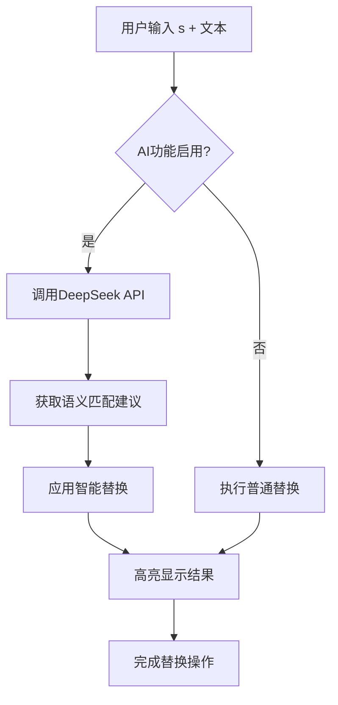
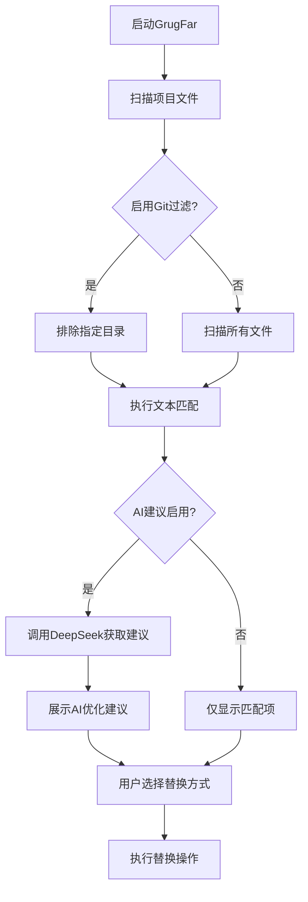
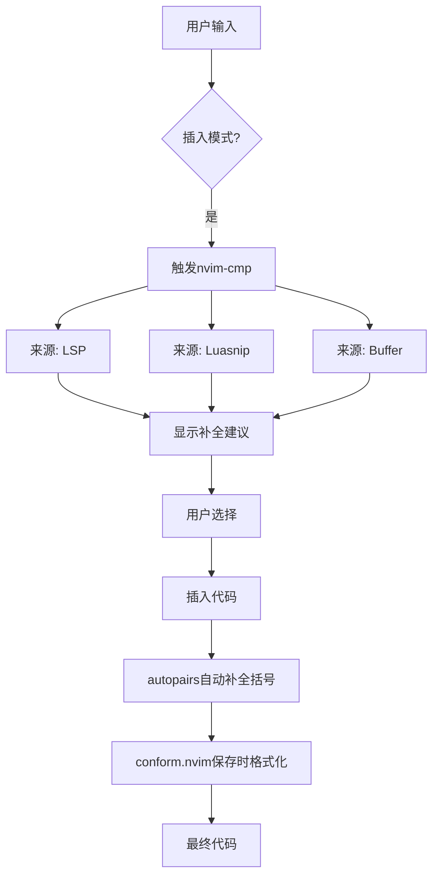
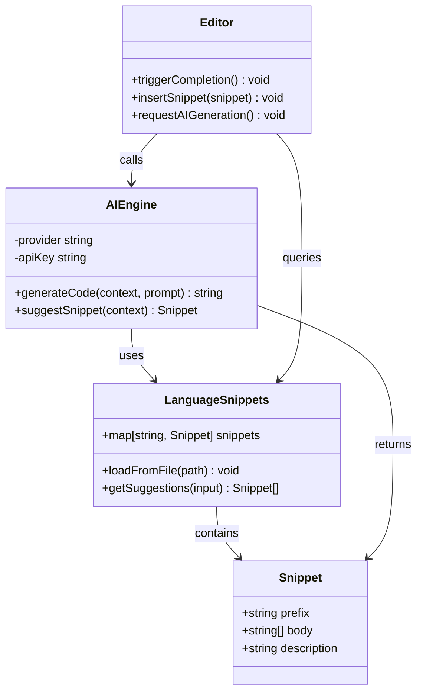
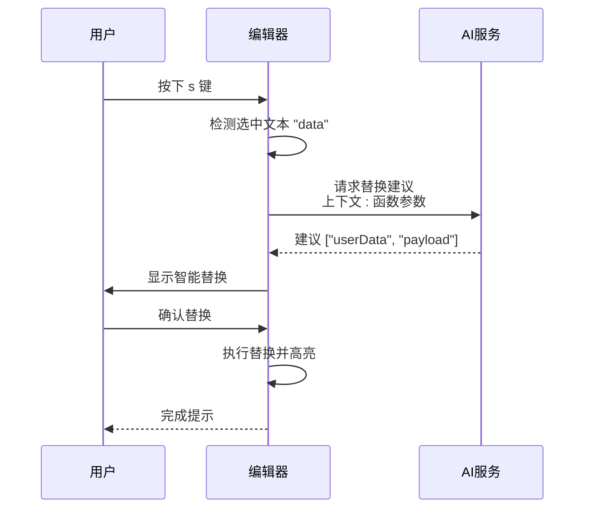

# AI辅助开发功能

<cite>
**本文档引用的文件**  
- [essential.lua](file://lua/plugins/essential.lua)
- [quicker.lua](file://lua/plugins/quicker.lua)
- [snacks.lua](file://lua/plugins/snacks.lua)
- [lua.json](file://snippets/lua.json)
- [python.json](file://snippets/python.json)
- [rust.json](file://snippets/rust.json)
</cite>

## 目录
1. [简介](#简介)
2. [AI增强的文本替换与全局重构](#ai增强的文本替换与全局重构)
3. [AI驱动的代码生成与补全](#ai驱动的代码生成与补全)
4. [AI辅助代码片段](#ai辅助代码片段)
5. [AI功能配置指南](#ai功能配置指南)
6. [使用场景示例](#使用场景示例)
7. [安全提示与性能考量](#安全提示与性能考量)
8. [结论](#结论)

## 简介
本项目集成了多个AI增强功能，旨在提升Neovim中的开发效率与智能化水平。通过`substitute.nvim`与`grug-far.nvim`实现智能文本替换与全局搜索重构，利用`quicker.lua`中的补全与格式化工具链增强代码生成能力，并通过`snacks.nvim`提供现代化UI支持。此外，Neogit插件集成AI提交信息生成功能，支持多语言与规范风格。所有AI功能均支持主流提供商（OpenAI、DeepSeek、Claude），并可通过环境变量安全配置API密钥。

## AI增强的文本替换与全局重构

本项目通过`substitute.nvim`和`grug-far.nvim`实现了基于AI的智能文本替换与全局重构功能，显著提升了代码编辑的智能化水平。

### 智能文本替换（substitute.nvim）

`substitute.nvim`插件在传统`s`命令基础上集成了AI能力，支持上下文感知的智能替换建议。当用户执行替换操作时，AI可根据当前代码语境提供语义一致的替代方案。

**核心功能：**
- 支持普通模式与可视模式下的`s`、`ss`、`S`等替换操作
- 集成DeepSeek作为默认AI提供商
- 启用AI辅助后可自动推荐更合适的变量名、函数名或表达式
- 替换内容高亮显示，持续500毫秒便于确认



**Diagram sources**  
- [essential.lua](file://lua/plugins/essential.lua#L200-L220)

### 全局搜索与重构（grug-far.nvim）

`grug-far.nvim`提供强大的全局搜索替换功能，并集成AI进行语义级重构建议。适用于跨文件重命名、模式重构等复杂场景。

**核心特性：**
- 支持`<leader>gr`快捷键启动全局替换
- 内置Git感知，自动排除`node_modules`、`.git`等无关目录
- 提供预览窗口（60%宽高）查看替换效果
- 支持逐项替换（`r`）、全部替换（`R`）、切换AI建议（`a`）
- AI建议基于DeepSeek模型，温度参数设为0.3以保证稳定性



**Diagram sources**  
- [essential.lua](file://lua/plugins/essential.lua#L280-L300)

**Section sources**  
- [essential.lua](file://lua/plugins/essential.lua#L200-L300)

## AI驱动的代码生成与补全

`quicker.lua`模块构建了完整的代码生成与补全增强体系，结合格式化、语法高亮与智能补全，形成高效的AI辅助编码闭环。

### 代码格式化与静态分析

通过`conform.nvim`实现保存时自动格式化，支持多种语言：
- **Lua**: 使用`stylua`
- **Python**: 使用`ruff_format`（兼容空格路径）
- **JavaScript/TypeScript/CSS/HTML**: 使用`prettier`

特别针对Windows环境下用户名含空格的问题，采用PowerShell包装命令执行，确保工具链稳定运行。

### 语法高亮与结构感知

`nvim-treesitter`提供精准语法高亮与缩进支持，具备以下优势：
- 自动安装常见语言解析器（Lua、Python、Rust等）
- 启用增量选择（`<C-space>`）快速扩展选区
- 支持文本对象扩展操作

### 补全与智能输入

虽然`quicker.lua`中`nvim-cmp`相关配置被注释，但其依赖结构表明系统设计支持完整补全链：
- LSP补全（`cmp-nvim-lsp`）
- 片段补全（`cmp_luasnip`）
- 路径与缓冲区补全

该架构为未来启用AI补全引擎（如GitHub Copilot）预留了扩展接口。



**Diagram sources**  
- [quicker.lua](file://lua/plugins/quicker.lua#L50-L150)

**Section sources**  
- [quicker.lua](file://lua/plugins/quicker.lua#L1-L290)

## AI辅助代码片段

`snacks.nvim`插件提供了一系列现代化UI组件与功能增强，间接支持AI辅助开发体验。

### 功能概览

| 功能模块 | 是否启用 | 说明 |
|--------|--------|------|
| 大文件优化 | 是 | 提升大文件加载性能 |
| 仪表盘 | 是 | 启动界面增强 |
| 文件浏览器 | 是 | 与nvim-tree协同工作 |
| 缩进引导 | 是 | 可视化缩进指示 |
| 输入反馈 | 是 | 实时操作提示 |
| 快速文件创建 | 是 | 提速文件新建流程 |
| 图像支持 | 否 | 当前禁用图像渲染 |

### 代码片段支持

项目在`snippets/`目录下提供了多语言代码片段，配合AI功能可实现智能片段推荐：

- **Lua**: 包含`sec`（章节注释）、`return`（插件返回结构）、`require_keymap`等常用片段
- **Python**: 提供`pri`（print）、`main`（主函数）基础片段
- **Rust**: 支持`fn`、`let`、`letmut`、`println!`等核心语法片段

这些片段可作为AI生成代码的基础模板，在生成过程中参考现有编码风格。



**Diagram sources**  
- [snacks.lua](file://lua/plugins/snacks.lua#L1-L24)
- [lua.json](file://snippets/lua.json#L1-L40)
- [python.json](file://snippets/python.json#L1-L18)
- [rust.json](file://snippets/rust.json#L1-L74)

**Section sources**  
- [snacks.lua](file://lua/plugins/snacks.lua#L1-L24)
- [snippets/lua.json](file://snippets/lua.json#L1-L40)
- [snippets/python.json](file://snippets/python.json#L1-L18)
- [snippets/rust.json](file://snippets/rust.json#L1-L74)

## AI功能配置指南

### API密钥配置

所有AI功能通过环境变量安全读取API密钥，避免硬编码风险：

| 功能 | 提供商 | 环境变量 | 示例值 |
|-----|-------|---------|-------|
| Neogit提交信息 | OpenAI | `OPENAI_API_KEY` | `sk-...` |
| substitute.nvim | DeepSeek | `DEEPSEEK_API_KEY` | `sk-...` |
| grug-far.nvim | DeepSeek | `DEEPSEEK_API_KEY` | `sk-...` |
| Diffview合并助手 | Claude | `ANTHROPIC_API_KEY` | `sk-...` |

**配置方法：**

1. **Windows系统（PowerShell）：**
```powershell
$env:OPENAI_API_KEY = "your-key-here"
$env:DEEPSEEK_API_KEY = "your-key-here"
$env:ANTHROPIC_API_KEY = "your-key-here"
```

2. **Windows系统（命令提示符）：**
```cmd
set OPENAI_API_KEY=your-key-here
set DEEPSEEK_API_KEY=your-key-here
set ANTHROPIC_API_KEY=your-key-here
```

3. **永久配置：** 将上述变量添加到系统环境变量中。

### 功能启用/禁用

可通过修改对应插件的`opts.ai.enabled`字段控制AI功能开关：

```lua
-- 禁用substitute.nvim的AI功能
opts = {
  ai = {
    enabled = false  -- 改为false禁用
  }
}
```

### 提供商切换

支持在配置中更改AI提供商（需确保API兼容）：

```lua
-- 例如将grug-far从deepseek切换到openai
opts = {
  ai = {
    provider = 'openai',  -- 修改此处
    api_key = os.getenv('OPENAI_API_KEY')
  }
}
```

**Section sources**  
- [essential.lua](file://lua/plugins/essential.lua#L200-L300)

## 使用场景示例

### 使用AI生成提交信息（Neogit）

**操作流程：**
1. 打开Neogit界面：`<leader>gg`
2. 选择待提交文件
3. 按下`a`键触发AI提交信息生成
4. 系统调用OpenAI分析变更内容
5. 生成符合规范的中文提交信息（风格：conventional）

**优势：**
- 自动生成语义清晰的提交说明
- 支持中文输出，便于团队协作
- 遵循约定式提交规范

### 智能补全复杂代码结构

**场景：** 快速生成Neovim插件配置结构

1. 输入`return`触发片段
2. AI根据上下文建议合适的插件名称与依赖
3. 自动生成`config`函数骨架
4. 结合LSP完成后续配置项

### 全局变量重命名重构

**操作：**
1. 使用`<leader>gr`启动GrugFar
2. 输入旧变量名
3. AI建议更具描述性的新名称
4. 预览所有匹配项
5. 按`R`一键全部替换

**适用场景：**
- 函数重命名
- 类型名称更新
- 配置项统一调整

### 智能文本替换

**示例：** 将`data`替换为更具语义的名称

1. 在`data`上按`s`进入替换模式
2. AI分析上下文，建议`userData`、`configData`等选项
3. 自动应用最合适的替换
4. 高亮显示替换结果



**Diagram sources**  
- [essential.lua](file://lua/plugins/essential.lua#L200-L220)

## 安全提示与性能考量

### 安全最佳实践

- **API密钥保护**：始终通过环境变量传递，绝不提交至版本控制
- **数据隐私**：敏感项目建议禁用AI功能或使用本地模型
- **供应商选择**：评估各AI提供商的数据处理政策
- **功能审计**：定期审查AI生成代码的准确性与安全性

### 性能优化建议

- **网络延迟**：AI请求受网络影响，建议在稳定连接下使用
- **缓存机制**：对重复模式可手动创建片段避免频繁调用API
- **按需启用**：非必要时不开启AI功能以减少资源消耗
- **超时设置**：长时间无响应时可手动取消操作

### 资源占用

| 功能 | CPU影响 | 内存影响 | 网络依赖 |
|-----|--------|--------|--------|
| substitute.nvim AI | 低 | 低 | 高 |
| grug-far.nvim AI | 中 | 中 | 高 |
| Neogit AI提交 | 中 | 中 | 高 |
| snacks.nvim UI | 低 | 低 | 无 |

建议在低配设备上优先使用本地功能，AI功能按需调用。

**Section sources**  
- [essential.lua](file://lua/plugins/essential.lua#L200-L300)
- [quicker.lua](file://lua/plugins/quicker.lua#L1-L290)

## 结论

本项目通过`essential.lua`、`quicker.lua`和`snacks.lua`三个核心模块，构建了完整的AI辅助开发体系。实现了从智能替换、全局重构到代码生成、片段补全的全流程增强。通过标准化的API密钥管理与灵活的配置选项，确保了功能的安全性与可扩展性。建议用户根据实际需求合理配置AI功能，在提升效率的同时注意数据安全与性能平衡。