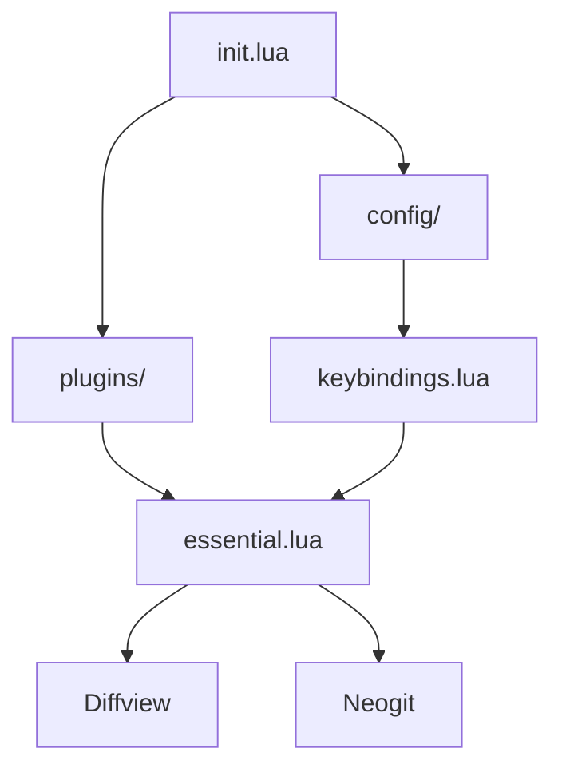
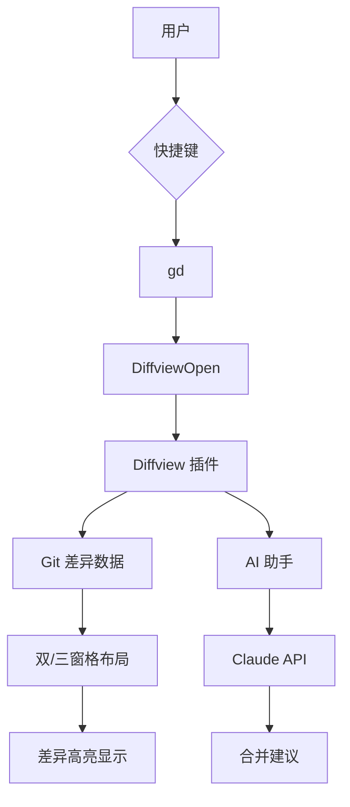
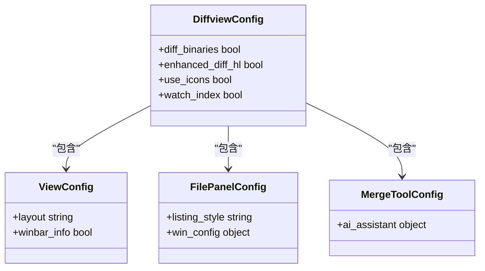
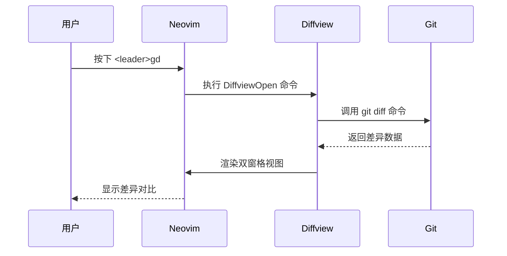
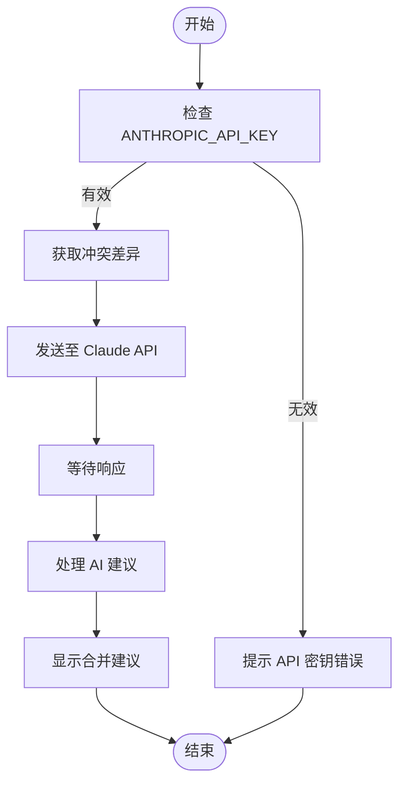
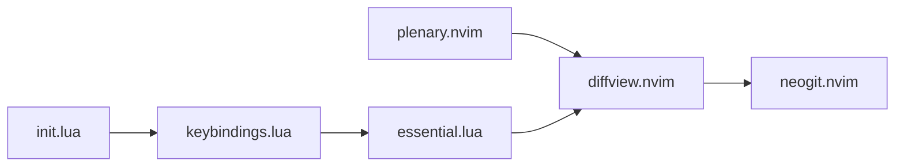

# Diffview 差异查看集成

<cite>
**本文档引用的文件**
- [essential.lua](file://lua/plugins/essential.lua)
- [keybindings.lua](file://lua/config/keybindings.lua)
- [init.lua](file://init.lua)
</cite>

## 目录
1. [简介](#简介)
2. [项目结构](#项目结构)
3. [核心组件](#核心组件)
4. [架构概览](#架构概览)
5. [详细组件分析](#详细组件分析)
6. [依赖分析](#依赖分析)
7. [性能考虑](#性能考虑)
8. [故障排除指南](#故障排除指南)
9. [结论](#结论)

## 简介
本文档深入解析 Diffview 插件在 Neovim 配置中的集成机制与使用场景。重点说明如何通过 `<leader>gd` 快捷键打开差异对比视图，查看工作区、暂存区或提交间的文件变更。详细描述 Diffview 的双窗格/三窗格布局、行内差异高亮、导航快捷键等核心功能。特别阐述 AI 在合并冲突分析中的应用，包括通过 Claude 提供智能合并建议的实现路径。结合 `essential.lua` 中的配置项，解释 Diffview 的加载条件与键位绑定逻辑。提供典型用例：解决合并冲突时使用 AI 辅助分析差异，并涵盖常见问题如差异视图无法打开、AI 分析无响应的解决方案。

## 项目结构
本项目采用模块化 Lua 配置结构，主要分为 `lua/config`、`lua/core` 和 `lua/plugins` 三个目录。`lua/plugins/essential.lua` 文件集中管理关键插件配置，包括 Diffview、Neogit 等 Git 协作工具。`lua/config/keybindings.lua` 统一处理所有快捷键映射，避免冲突。`init.lua` 作为入口文件加载核心配置。

**Diagram sources**
- [init.lua](file://init.lua#L1-L50)
- [essential.lua](file://lua/plugins/essential.lua#L1-L610)
- [keybindings.lua](file://lua/config/keybindings.lua#L1-L282)

**Section sources**
- [init.lua](file://init.lua#L1-L50)
- [essential.lua](file://lua/plugins/essential.lua#L1-L610)

## 核心组件
Diffview 插件通过 `sindrets/diffview.nvim` 集成，依赖 `nvim-lua/plenary.nvim` 提供异步支持。插件通过 `cmd` 字段声明 `DiffviewOpen`、`DiffviewClose` 等命令，并通过 `keys` 字段绑定 `<leader>gd` 等快捷键。配置中启用了增强的差异高亮、图标支持和文件面板树形展示。特别地，`merge_tool.ai_assistant` 配置项启用了基于 Claude 的 AI 冲突解决建议功能。

**Section sources**
- [essential.lua](file://lua/plugins/essential.lua#L400-L450)

## 架构概览
系统通过模块化配置实现功能分离。`essential.lua` 负责插件声明与核心配置，`keybindings.lua` 统一管理快捷键并解决冲突，`init.lua` 作为启动入口加载配置。Diffview 与 Neogit 插件协同工作，提供完整的 Git 工作流支持。

**Diagram sources**
- [essential.lua](file://lua/plugins/essential.lua#L400-L450)

## 详细组件分析

### Diffview 集成分析
Diffview 插件通过 LazyVim 的插件管理系统加载，配置中定义了多种视图布局：默认的 `diff2_horizontal` 双窗格布局用于常规差异查看，`merge_tool` 使用 `diff3_horizontal` 三窗格布局专门处理合并冲突。文件面板采用树形结构展示，宽度固定为 35 列，位于左侧。差异高亮通过 `enhanced_diff_hl` 启用，提供更精细的行内差异标记。

#### 配置结构

**Diagram sources**
- [essential.lua](file://lua/plugins/essential.lua#L420-L450)

### 快捷键绑定机制
快捷键系统通过 `keybindings.lua` 统一管理，避免冲突。`<leader>gd` 直接绑定到 `DiffviewOpen` 命令，`<leader>gD` 用于查看上一次提交的差异。系统采用 `<leader>` 前缀策略，将 Git 相关功能集中管理。`keybindings.lua` 中的冲突检测机制确保不会出现重复或冲突的快捷键映射。

#### 快捷键流程

**Diagram sources**
- [essential.lua](file://lua/plugins/essential.lua#L403-L406)
- [keybindings.lua](file://lua/config/keybindings.lua#L1-L282)

### AI 合并冲突分析
Diffview 的 `merge_tool.ai_assistant` 配置启用了 AI 辅助功能，使用 Claude 作为提供者。当用户进入三窗格合并工具视图时，系统可调用 Claude API 分析冲突代码，提供智能合并建议。AI 助手需要配置有效的 `ANTHROPIC_API_KEY` 环境变量才能正常工作。该功能特别适用于复杂代码冲突的场景，可显著提高合并效率。

#### AI 分析流程

**Diagram sources**
- [essential.lua](file://lua/plugins/essential.lua#L445-L450)

**Section sources**
- [essential.lua](file://lua/plugins/essential.lua#L400-L450)

## 依赖分析
Diffview 插件依赖 `nvim-lua/plenary.nvim` 提供基础工具函数和异步支持。在 `essential.lua` 中，Neogit 插件显式声明依赖 Diffview，实现功能集成。`init.lua` 通过 `require("config.keybindings")` 加载快捷键配置，形成完整的依赖链。所有插件通过 LazyVim 的延迟加载机制优化启动性能。

**Diagram sources**
- [essential.lua](file://lua/plugins/essential.lua#L400-L450)
- [init.lua](file://init.lua#L1-L50)

**Section sources**
- [essential.lua](file://lua/plugins/essential.lua#L400-L450)
- [init.lua](file://init.lua#L1-L50)

## 性能考虑
Diffview 采用按需加载策略，仅在执行 `DiffviewOpen` 命令时才加载插件，减少启动开销。`watch_index` 配置启用索引监控，实时更新差异状态。文件面板的 `flatten_dirs` 选项优化大型项目中的目录展示性能。三窗格布局仅在合并冲突时激活，避免不必要的资源消耗。

## 故障排除指南
常见问题包括差异视图无法打开和 AI 分析无响应。对于差异视图问题，检查 `<leader>` 前缀是否正确设置，确认 `sindrets/diffview.nvim` 插件已正确安装。AI 分析无响应通常由 `ANTHROPIC_API_KEY` 环境变量未设置或网络问题导致。可通过 `:checkhealth` 命令验证插件状态，使用 `:DiffviewOpen` 直接测试命令可用性。

**Section sources**
- [essential.lua](file://lua/plugins/essential.lua#L400-L450)
- [keybindings.lua](file://lua/config/keybindings.lua#L1-L282)

## 结论
Diffview 插件通过精心设计的配置实现了强大的差异查看功能。结合快捷键系统和 AI 助手，为开发者提供了高效的代码审查和冲突解决体验。模块化的配置结构确保了系统的可维护性和扩展性。建议用户正确配置 API 密钥以充分利用 AI 辅助功能，并定期检查快捷键冲突以保持工作流顺畅。