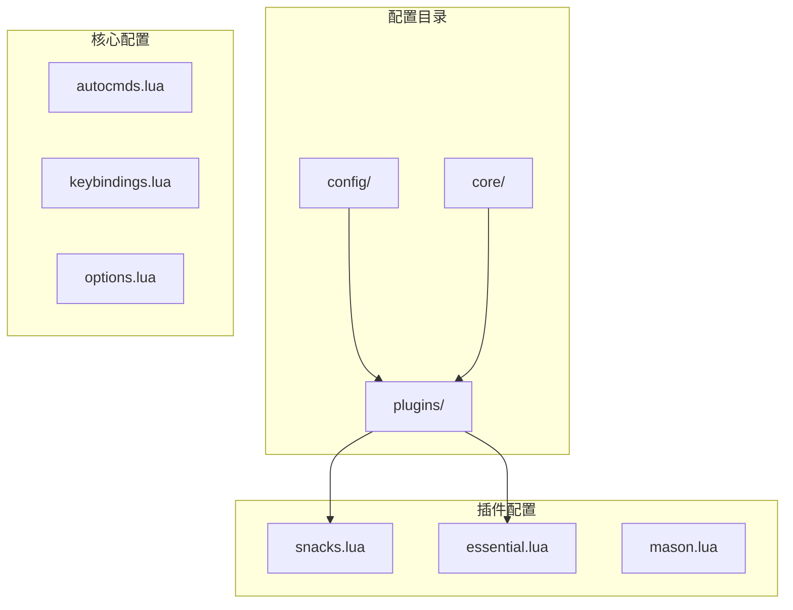
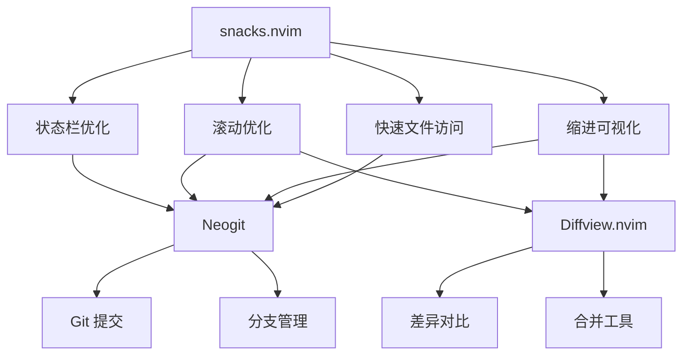
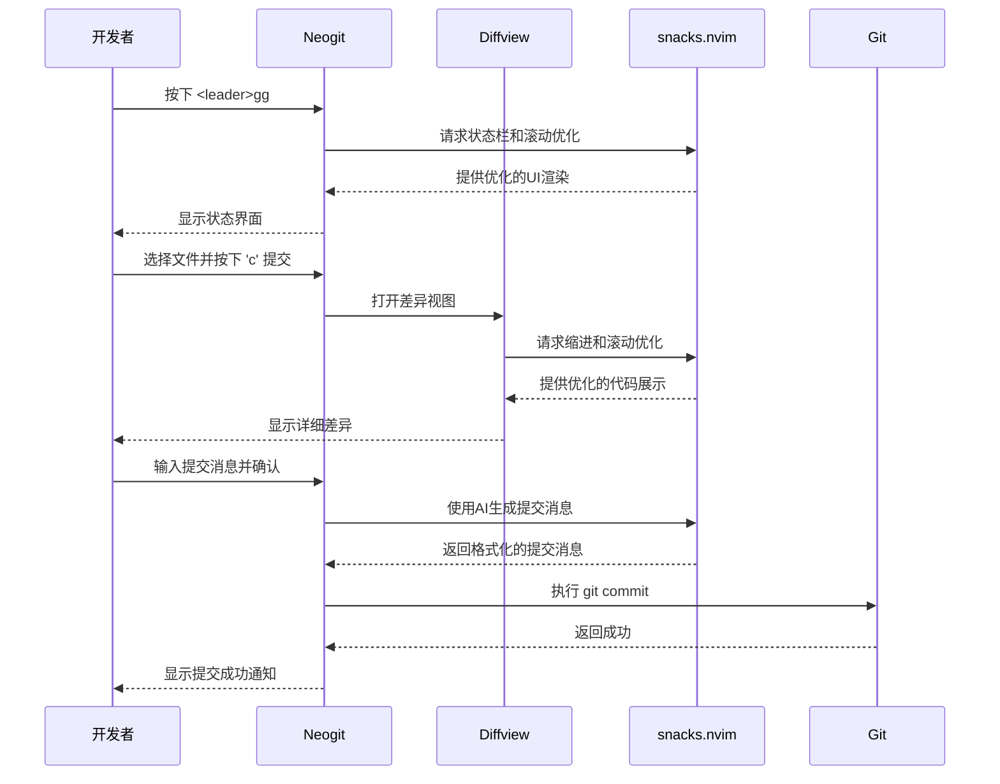
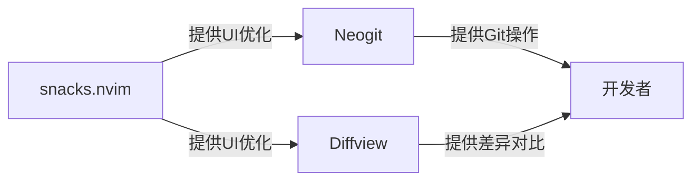

# Git 相关功能增强（Snacks）

<cite>
**本文档引用的文件**  
- [snacks.lua](file://lua/plugins/snacks.lua)
- [essential.lua](file://lua/plugins/essential.lua)
</cite>

## 目录
1. [引言](#引言)
2. [项目结构](#项目结构)
3. [核心组件](#核心组件)
4. [架构概览](#架构概览)
5. [详细组件分析](#详细组件分析)
6. [依赖分析](#依赖分析)
7. [性能考量](#性能考量)
8. [故障排除指南](#故障排除指南)
9. [结论](#结论)

## 引言
本文档旨在详述 `snacks.lua` 文件中为 Neovim 提供的增强功能，特别是其对 Git 工作流的间接支持。尽管 `snacks.nvim` 插件本身不直接提供 Git 功能，但其启用的多个模块通过优化编辑体验和界面交互，间接提升了与 Git 相关的操作效率。结合 Neogit 和 Diffview 等专用 Git 插件的配置，可构建高效、直观的版本控制工作流。

## 项目结构
项目采用模块化 Lua 配置结构，主要分为 `config`、`core` 和 `plugins` 三个目录。`snacks.lua` 位于 `plugins` 目录下，作为功能增强插件之一被加载。其配置与其他 Git 专用插件（如 Neogit 和 Diffview）并存，共同构成完整的开发环境。



**Diagram sources**
- [snacks.lua](file://lua/plugins/snacks.lua#L0-L23)
- [essential.lua](file://lua/plugins/essential.lua#L0-L609)

**Section sources**
- [snacks.lua](file://lua/plugins/snacks.lua#L0-L23)
- [essential.lua](file://lua/plugins/essential.lua#L0-L609)

## 核心组件
`snacks.lua` 的核心是配置 `folke/snacks.nvim` 插件，通过启用一系列“零食级”功能来提升 Neovim 的整体使用体验。这些功能虽不直接操作 Git，但通过改善编辑器的响应性、可视化和导航能力，为 Git 工作流提供了坚实的基础。

**Section sources**
- [snacks.lua](file://lua/plugins/snacks.lua#L0-L23)

## 架构概览
整个 Git 工作流的增强依赖于多个插件的协同。`snacks.nvim` 提供底层的 UI 和交互优化，而 `Neogit` 和 `Diffview` 则提供具体的 Git 操作界面。`snacks` 启用的功能如 `statuscolumn` 和 `scroll` 优化了代码的视觉呈现，使得在 Neogit 的提交界面或 Diffview 的差异对比中能更清晰地识别变更。



**Diagram sources**
- [snacks.lua](file://lua/plugins/snacks.lua#L0-L23)
- [essential.lua](file://lua/plugins/essential.lua#L397-L535)

## 详细组件分析

### Snacks 功能分析
`snacks.lua` 通过启用多个子模块来增强 Neovim。这些功能的实现原理是通过监听编辑器事件和修改 UI 渲染逻辑来实现的。

#### 启用的功能模块
```mermaid
classDiagram
class SnacksConfig {
+bigfile : { enabled : bool }
+dashboard : { enabled : bool }
+explorer : { enabled : bool }
+indent : { enabled : bool }
+input : { enabled : bool }
+picker : { enabled : bool }
+notifier : { enabled : bool }
+quickfile : { enabled : bool }
+scope : { enabled : bool }
+scroll : { enabled : bool }
+statuscolumn : { enabled : bool }
+words : { enabled : bool }
+image : { enabled : bool }
}
```

**Diagram sources**
- [snacks.lua](file://lua/plugins/snacks.lua#L0-L23)

#### Git 工作流中的价值
虽然 `snacks.nvim` 不直接处理 Git 命令，但其功能对 Git 操作有显著的间接提升：
- **`statuscolumn`**: 在行号区域提供更丰富的视觉提示，帮助在审查大量变更时快速定位。
- **`scroll`**: 平滑滚动和优化的滚动条，使在长文件的差异视图中导航更加流畅。
- **`quickfile`**: 快速打开文件，便于在提交前快速跳转到需要修改的文件。
- **`indent`**: 清晰的缩进引导线，有助于在格式化提交消息或审查代码变更时保持结构清晰。

**Section sources**
- [snacks.lua](file://lua/plugins/snacks.lua#L0-L23)

### Neogit 与 Diffview 协同分析
`essential.lua` 中配置的 Neogit 和 Diffview 是 Git 操作的核心。`snacks` 的优化为这些插件提供了更好的运行环境。

#### Git 操作流程


**Diagram sources**
- [essential.lua](file://lua/plugins/essential.lua#L493-L535)
- [essential.lua](file://lua/plugins/essential.lua#L397-L440)

**Section sources**
- [essential.lua](file://lua/plugins/essential.lua#L397-L535)

## 依赖分析
`snacks.nvim` 作为基础增强插件，被 Neogit 和 Diffview 等 Git 专用插件所依赖，以获得更好的用户体验。其与这些插件的集成是松耦合的，通过共享的 UI 优化机制实现。



**Diagram sources**
- [snacks.lua](file://lua/plugins/snacks.lua#L0-L23)
- [essential.lua](file://lua/plugins/essential.lua#L397-L535)

**Section sources**
- [snacks.lua](file://lua/plugins/snacks.lua#L0-L23)
- [essential.lua](file://lua/plugins/essential.lua#L397-L535)

## 性能考量
`snacks.nvim` 的 `bigfile` 模块专门针对大文件进行了优化，这在处理大型 Git 仓库或二进制文件的差异时尤为重要。通过动态调整性能敏感的设置，确保了在审查大型变更时编辑器的响应速度。

## 故障排除指南
若发现 Git 相关界面（如 Neogit 或 Diffview）显示异常或性能下降，可检查 `snacks.lua` 的配置：
- 确认 `scroll` 和 `statuscolumn` 模块已启用。
- 检查是否有与其他插件的冲突，可通过临时禁用 `snacks.nvim` 来验证。

**Section sources**
- [snacks.lua](file://lua/plugins/snacks.lua#L0-L23)

## 结论
`snacks.lua` 文件通过配置 `folke/snacks.nvim` 插件，为 Neovim 提供了一系列底层的 UI 和交互增强。虽然它不直接实现 Git 功能，但其提供的 `statuscolumn`、`scroll`、`indent` 等优化，极大地提升了与 Neogit 和 Diffview 等 Git 插件协同工作的效率和体验。这些“零食级”功能共同构建了一个更加流畅、直观和高效的 Git 操作环境。