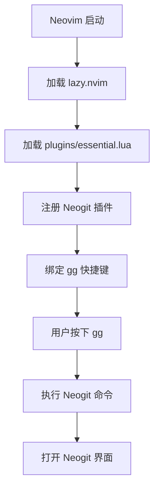
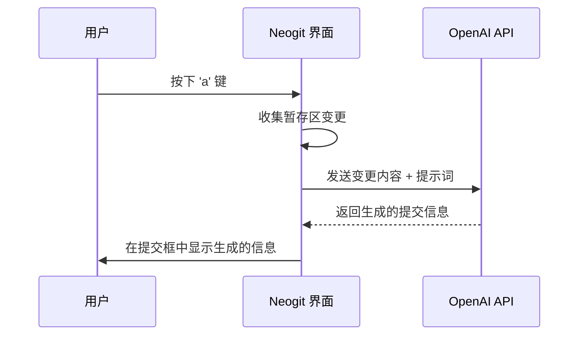

# Neogit 图形化 Git 集成

<cite>
**本文档引用的文件**  
- [essential.lua](file://lua/plugins/essential.lua)
- [keybindings.lua](file://lua/config/keybindings.lua)
- [init.lua](file://init.lua)
</cite>

## 目录
1. [简介](#简介)
2. [Neogit 集成与快捷键配置](#neogit-集成与快捷键配置)
3. [Neogit 界面功能详解](#neogit-界面功能详解)
4. [AI 辅助生成提交信息](#ai-辅助生成提交信息)
5. [实际使用流程示例](#实际使用流程示例)
6. [常见问题排查](#常见问题排查)
7. [结论](#结论)

## 简介
Neogit 是一个基于 Neovim 的图形化 Git 客户端插件，提供直观的界面用于执行常见的 Git 操作，如提交、推送、拉取、分支切换等。通过与 OpenAI 集成，Neogit 支持 AI 自动生成提交信息，提升开发效率。本文档详细说明 Neogit 的集成方式、使用流程、界面功能、AI 提交信息生成机制，并结合配置文件展示自定义行为的方法。

## Neogit 集成与快捷键配置

Neogit 插件通过 `lazy.nvim` 在 `essential.lua` 中声明并配置。其核心启动快捷键为 `<leader>gg`，通过该快捷键可打开 Neogit 界面。

在 `essential.lua` 文件中，Neogit 的配置定义了其依赖项、命令和键位映射。其中，`keys` 字段明确设置了 `<leader>gg` 用于启动 Neogit，`<leader>gc` 用于直接进入提交流程。

**Diagram sources**
- [essential.lua](file://lua/plugins/essential.lua#L492-L535)

**Section sources**
- [essential.lua](file://lua/plugins/essential.lua#L492-L535)
- [init.lua](file://init.lua#L4)

## Neogit 界面功能详解

Neogit 界面主要分为三个区域：暂存区（Staged Changes）、工作区（Unstaged Changes）和提交历史（Recent Commits）。

- **暂存区**：显示已通过 `s` 键暂存的文件变更。用户可使用 `u` 键取消暂存。
- **工作区**：显示未暂存的文件变更。用户可使用 `s` 键将其添加到暂存区，或使用 `x` 键丢弃更改。
- **提交历史**：显示最近的提交记录，便于查看项目演进。

用户可通过以下键位与界面交互：
- `s`: 暂存选中文件
- `u`: 取消暂存选中文件
- `c`: 打开提交编辑器
- `P`: 执行 Git Push
- `pu`: 执行 Git Pull
- `q`: 关闭 Neogit 界面
- `<c-r>`: 刷新界面状态

这些映射在 `essential.lua` 的 `mappings.status` 配置中定义，确保了操作的直观性和高效性。

**Section sources**
- [essential.lua](file://lua/plugins/essential.lua#L531-L568)

## AI 辅助生成提交信息

Neogit 集成了 AI 功能，可通过 OpenAI 自动生成符合规范的提交信息。该功能在 `essential.lua` 中通过 `AI` 配置项启用。

### 集成方式
- `enabled = true`: 启用 AI 功能
- `provider = 'openai'`: 指定使用 OpenAI 作为服务提供商
- `api_key = os.getenv('OPENAI_API_KEY')`: 从环境变量读取 API 密钥，确保安全性
- `language = 'zh-CN'`: 生成中文提交信息
- `style = 'conventional'`: 采用约定式提交（Conventional Commits）风格

### 引发逻辑
当用户在 Neogit 界面中按下 `a` 键时，插件会触发 `AICommitMessage` 动作。此时，Neogit 会收集当前暂存区的变更内容，将其发送至 OpenAI API，并根据返回结果填充提交信息编辑框。

此功能极大简化了编写高质量提交信息的过程，尤其适用于变更内容复杂或需要遵循严格提交规范的场景。

**Diagram sources**
- [essential.lua](file://lua/plugins/essential.lua#L505-L515)

**Section sources**
- [essential.lua](file://lua/plugins/essential.lua#L505-L515)

## 实际使用流程示例

以下是从代码修改到提交推送的完整交互流程：

1. **修改代码**：在任意文件中进行代码编辑。
2. **启动 Neogit**：在普通模式下按下 `<leader>gg`，Neogit 界面将打开。
3. **查看变更**：工作区将显示修改的文件。使用方向键选中目标文件。
4. **暂存变更**：按下 `s` 将选中文件加入暂存区。
5. **生成提交信息**：
   - 按下 `c` 进入提交流程。
   - 或直接在状态界面按下 `a`，由 AI 生成提交信息。
   - 生成后可在提交编辑器中进一步修改。
6. **提交变更**：在提交编辑器中确认信息后，按 `:wq` 保存并退出，完成提交。
7. **推送变更**：在 Neogit 主界面按下 `P`，将本地提交推送到远程仓库。

此流程整合了编辑、暂存、提交、推送等操作，全部在 Neovim 内部完成，无需切换至终端。

**Section sources**
- [essential.lua](file://lua/plugins/essential.lua#L492-L568)

## 常见问题排查

### Neogit 界面无法弹出
- **检查快捷键绑定**：确认 `<leader>gg` 是否被正确映射。可通过 `:ShowLeaderKeymaps` 命令查看所有 Leader 快捷键。
- **检查插件加载**：确保 `essential.lua` 被正确加载。检查 `init.lua` 中是否包含 `require("config.lazy")`。
- **检查依赖**：Neogit 依赖 `plenary.nvim` 和 `telescope.nvim`，确保这些插件已安装。

### 状态未刷新
- **手动刷新**：在 Neogit 界面中按下 `<c-r>` 可强制刷新状态。
- **检查 Git 仓库**：确保当前目录为有效的 Git 仓库（存在 `.git` 目录）。
- **检查文件监控**：若使用 `diffview.nvim`，确保其 `watch_index` 选项已启用。

### AI 提交信息生成失败
- **检查 API 密钥**：确认环境变量 `OPENAI_API_KEY` 已正确设置。
- **检查网络连接**：确保可以访问 OpenAI API。
- **检查插件配置**：确认 `AI.enabled` 和 `commit_message.enabled` 均为 `true`。

**Section sources**
- [essential.lua](file://lua/plugins/essential.lua#L492-L568)
- [keybindings.lua](file://lua/config/keybindings.lua#L270-L281)

## 结论
Neogit 为 Neovim 用户提供了一个强大且直观的 Git 操作界面。通过 `<leader>gg` 快捷键可快速访问，支持完整的 Git 工作流。其与 OpenAI 的深度集成，实现了 AI 辅助生成提交信息的功能，显著提升了开发效率和提交质量。结合 `essential.lua` 中的灵活配置，用户可根据个人偏好自定义行为，打造高效、智能的开发环境。