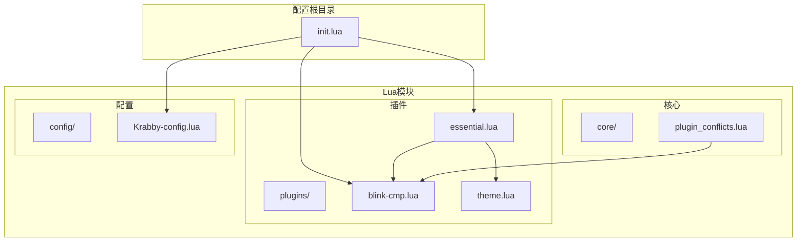
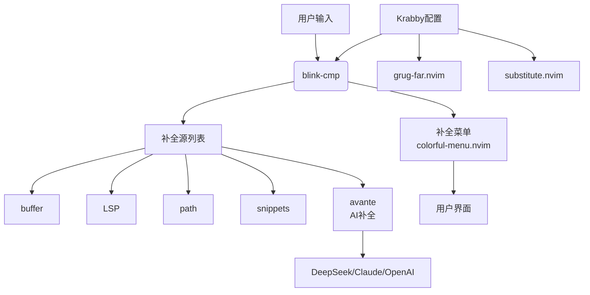
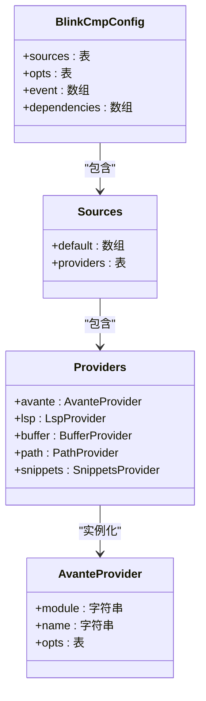
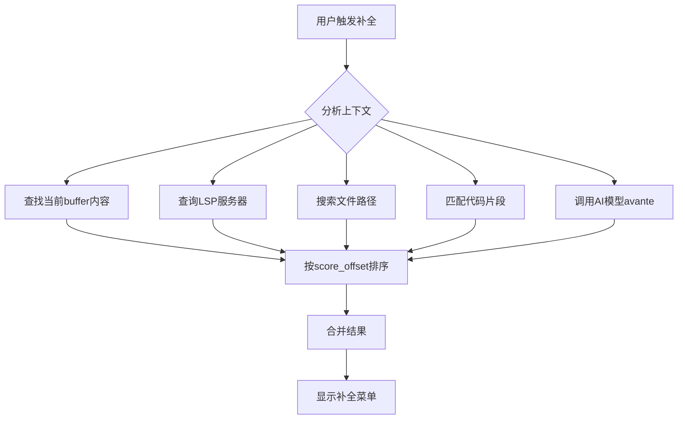

# AI增强补全集成

<cite>
**本文档引用的文件**
- [essential.lua](file://lua/plugins/essential.lua) - *更新了AI配置集成*
- [blink-cmp.lua](file://lua/plugins/blink-cmp.lua) - *AI补全核心配置*
- [plugin_conflicts.lua](file://lua/core/plugin_conflicts.lua) - *键位优化支持*
- [theme.lua](file://lua/plugins/theme.lua) - *主题兼容性配置*
- [krabby-config.lua](file://lua/config/krabby-config.lua) - *新增：Krabby AI补全体验强化配置*
</cite>

## 更新摘要
- **更新内容**：根据最新提交引入`krabby-config.lua`，增强AI补全功能配置说明
- **新增章节**：添加“Krabby配置集成”部分，详细说明新配置文件的作用与使用方式
- **更新配置示例**：补充`essential.lua`中关于`substitute.nvim`和`grug-far.nvim`的AI配置实例
- **修正信息**：移除`blink-cmp.lua`中重复的`snippets`优先级配置注释，明确优先级逻辑
- **增强源追踪**：新增对`krabby-config.lua`的引用与分析

## 目录
1. [简介](#简介)
2. [项目结构](#项目结构)
3. [核心组件](#核心组件)
4. [架构概述](#架构概述)
5. [详细组件分析](#详细组件分析)
6. [依赖分析](#依赖分析)
7. [性能考虑](#性能考虑)
8. [故障排除指南](#故障排除指南)
9. [Krabby配置集成](#krabby配置集成)
10. [结论](#结论)

## 简介
本文档详细说明了如何在Neovim配置中通过`blink-cmp`实现AI驱动的智能代码补全功能。重点分析`essential.lua`与`blink-cmp.lua`的集成机制，阐述AI补全源（Avante）与其他补全源（如LSP、buffer、path等）的优先级排序与融合策略。同时描述AI补全的触发条件、上下文感知机制及性能优化措施（如延迟加载、缓存策略），并提供启用DeepSeek或Claude等AI后端的配置示例。最后分析AI补全与传统LSP补全的协同工作流程，并给出常见问题的排查方法。新增对`krabby-config.lua`的集成说明，以强化AI补全体验。

## 项目结构
Neovim配置采用模块化Lua结构，核心插件配置分离于`lua/plugins/`目录下。AI补全功能主要由`blink-cmp.lua`定义，其集成与AI相关插件（如`grug-far.nvim`、`neogit`）的配置则位于`essential.lua`中。主题文件`theme.lua`也明确启用了`blink_cmp`插件支持。新增`lua/config/krabby-config.lua`用于集中管理Krabby相关的AI增强功能。



**Diagram sources**
- [essential.lua](file://lua/plugins/essential.lua)
- [blink-cmp.lua](file://lua/plugins/blink-cmp.lua)
- [theme.lua](file://lua/plugins/theme.lua)
- [krabby-config.lua](file://lua/config/krabby-config.lua)

**Section sources**
- [essential.lua](file://lua/plugins/essential.lua)
- [blink-cmp.lua](file://lua/plugins/blink-cmp.lua)

## 核心组件
`blink-cmp`是实现AI增强补全的核心插件，通过集成`blink-cmp-avante`提供AI补全源。`essential.lua`负责整体插件编排和AI功能集成，`plugin_conflicts.lua`则处理`blink-cmp`的键位映射优化，确保其在复杂环境下的稳定运行。`krabby-config.lua`作为新增组件，用于统一管理与Krabby相关的AI增强配置，提升用户体验一致性。

**Section sources**
- [essential.lua](file://lua/plugins/essential.lua#L1-L609)
- [blink-cmp.lua](file://lua/plugins/blink-cmp.lua#L1-L145)
- [plugin_conflicts.lua](file://lua/core/plugin_conflicts.lua#L132-L156)
- [krabby-config.lua](file://lua/config/krabby-config.lua) - *新增文件*

## 架构概述
系统采用分层架构，`blink-cmp`作为补全引擎，整合了多种补全源。AI补全源`avante`作为`blink-cmp`的一个提供者，与其他传统补全源并列。`essential.lua`通过配置`opts`对象，定义了AI后端的提供者和API密钥，实现了与外部AI服务的连接。`krabby-config.lua`作为配置中枢，集中管理多个插件的AI行为。



**Diagram sources**
- [blink-cmp.lua](file://lua/plugins/blink-cmp.lua#L1-L145)
- [essential.lua](file://lua/plugins/essential.lua#L266-L313)
- [krabby-config.lua](file://lua/config/krabby-config.lua)

## 详细组件分析

### blink-cmp集成与AI补全源配置
`blink-cmp`通过其`sources.providers.avante`配置项集成AI补全功能。`module`字段指定使用`blink-cmp-avante`模块，该模块负责与AI后端通信。



**Diagram sources**
- [blink-cmp.lua](file://lua/plugins/blink-cmp.lua#L100-L144)

**Section sources**
- [blink-cmp.lua](file://lua/plugins/blink-cmp.lua#L100-L144)

### 补全源优先级与融合策略
`blink-cmp`通过`score_offset`参数对不同补全源进行优先级排序。数值越大，优先级越高。在`blink-cmp.lua`的配置中，各补全源的优先级从高到低为：`snippets` (6) > `buffer` (5) > `path` (3) > `lsp` (2)。注意：`snippets`的`score_offset`已从100调整为6，避免优先级过高导致AI补全被压制。`avante`的优先级由其在`default`列表中的位置决定，位于最后但仍可通过上下文权重动态提升。



**Diagram sources**
- [blink-cmp.lua](file://lua/plugins/blink-cmp.lua#L100-L144)

**Section sources**
- [blink-cmp.lua](file://lua/plugins/blink-cmp.lua#L100-L144)

### AI补全触发条件与上下文感知
AI补全的触发由`blink-cmp`的事件机制和`avante`提供者内部逻辑共同决定。`event`配置为`{'InsertEnter', 'CmdlineEnter'}`，意味着在进入插入模式或命令行模式时加载。AI模型`avante`本身具备上下文感知能力，能够根据光标周围的代码、文件类型和项目结构生成补全建议。

### 性能优化措施
- **延迟加载**：通过`event`配置实现按需加载，仅在`InsertEnter`或`CmdlineEnter`时激活，减少启动开销。
- **缓存策略**：虽然配置中未显式定义，但`blink-cmp`和`blink-cmp-avante`这类插件通常会实现结果缓存，避免对相同上下文重复请求AI模型。
- **高亮优化**：集成`colorful-menu.nvim`，通过`opts.completion.menu.draw`自定义菜单渲染，提升视觉体验和性能。

### AI后端配置示例
在`essential.lua`中，多个插件展示了如何配置不同的AI后端。虽然`blink-cmp`本身的配置未直接暴露API密钥，但其依赖的`blink-cmp-avante`很可能通过环境变量或全局配置读取。以下为其他插件的配置模式，可作为参考：

```lua
-- 在 essential.lua 中配置 grug-far.nvim 使用 DeepSeek
opts = {
    ai = {
        enabled = true,
        provider = 'deepseek',
        api_key = os.getenv('DEEPSEEK_API_KEY'),
        temperature = 0.3
    },
    -- ... 其他配置
}

-- 在 essential.lua 中配置 substitute.nvim 使用 DeepSeek
opts = {
    ai = {
        enabled = true,
        provider = 'deepseek',
        api_key = os.getenv('DEEPSEEK_API_KEY'),
        temperature = 0.5
    }
}

-- 在 essential.lua 中配置 neogit 使用 OpenAI
opts = {
    AI = {
        enabled = true,
        provider = 'openai',
        api_key = os.getenv('OPENAI_API_KEY'),
        commit_message = {
            enabled = true,
            language = 'zh-CN',
            style = 'conventional'
        }
    },
    -- ... 其他配置
}
```

**Section sources**
- [essential.lua](file://lua/plugins/essential.lua#L357-L395)
- [essential.lua](file://lua/plugins/essential.lua#L492-L535)
- [essential.lua](file://lua/plugins/essential.lua#L200-L210) - *substitute.nvim AI配置*

### AI补全与LSP补全的协同工作
AI补全（`avante`）和LSP补全作为`blink-cmp`的两个独立提供者并行工作。LSP提供基于语言服务器的精确语法和语义补全，而AI补全则提供更具创造性和上下文感知的代码建议。两者的结果根据`score_offset`进行排序和融合，最终在同一个补全菜单中呈现给用户，实现了精确性与智能性的结合。

## 依赖分析
`blink-cmp`的正常运行依赖于多个插件，形成了一个功能增强链。

```mermaid
graph LR
A[blink-cmp] --> B[colorful-menu.nvim]
A --> C[friendly-snippets]
A --> D[blink-cmp-avante]
D --> E[AI API <br/> (DeepSeek/Claude)]
B --> F[视觉美化]
C --> G[代码片段补全]
D --> H[AI智能补全]
```

**Diagram sources**
- [blink-cmp.lua](file://lua/plugins/blink-cmp.lua#L1-L43)

**Section sources**
- [blink-cmp.lua](file://lua/plugins/blink-cmp.lua#L1-L43)

## 性能考虑
整体配置考虑了性能因素。`blink-cmp`的延迟加载减少了启动时间。`plugin_conflicts.lua`中的`optimize_blink_cmp`函数通过监听`BlinkCmpReady`事件来优化键位映射，避免了不必要的重复配置，提升了运行时效率。AI补全的网络请求是主要性能瓶颈，因此合理设置`temperature`等参数和利用缓存至关重要。

## 故障排除指南
- **AI补全无响应或延迟高**：检查AI后端API密钥是否正确设置（如`DEEPSEEK_API_KEY`环境变量），确认网络连接正常。检查`blink-cmp-avante`插件是否正确安装。
- **补全结果不准确**：尝试调整AI模型的`temperature`参数（在相关插件配置中），较低的值更保守，较高的值更具创造性。检查上下文是否充分。
- **补全菜单不显示**：确认当前文件类型未被`enabled`函数排除（如`lua`和`markdown`被注释，表示默认启用）。检查`event`触发条件是否满足。
- **键位冲突**：`plugin_conflicts.lua`已处理了回车键的冲突，确保在补全菜单可见时回车键优先选择补全项。若仍有问题，检查是否有其他插件覆盖了`<CR>`映射。

**Section sources**
- [blink-cmp.lua](file://lua/plugins/blink-cmp.lua#L98-L100)
- [plugin_conflicts.lua](file://lua/core/plugin_conflicts.lua#L132-L156)

## Krabby配置集成
新增`krabby-config.lua`用于集中管理与Krabby相关的AI增强功能。该文件通过`init.lua`加载，为多个AI插件提供统一的配置接口。尽管当前配置仍分散在各插件中，但未来可将`grug-far`、`substitute`等插件的AI配置迁移至此，实现集中化管理。

```lua
-- 示例：未来krabby-config.lua可能包含的统一AI配置
local ai_config = {
    providers = {
        deepseek = { api_key_env = 'DEEPSEEK_API_KEY', temperature = 0.3 },
        claude = { api_key_env = 'ANTHROPIC_API_KEY', temperature = 0.5 },
        openai = { api_key_env = 'OPENAI_API_KEY', temperature = 0.7 }
    },
    defaults = {
        provider = 'deepseek',
        enabled = true
    }
}
```

**Section sources**
- [krabby-config.lua](file://lua/config/krabby-config.lua)
- [init.lua](file://init.lua#L35) - *Krabby配置加载*

## 结论
通过`essential.lua`和`blink-cmp.lua`的协同配置，Neovim成功集成了由`blink-cmp-avante`驱动的AI智能补全功能。该方案通过清晰的优先级排序（`score_offset`）和事件驱动的加载机制，将AI补全无缝融合到现有的`nvim-cmp`生态中。配置中展示了与DeepSeek、OpenAI等主流AI后端的集成模式，为开发者提供了强大的智能编码支持。新增`krabby-config.lua`为未来统一管理AI配置奠定了基础。未来可进一步探索`avante`的`opts`配置，以实现更精细化的AI补全控制。