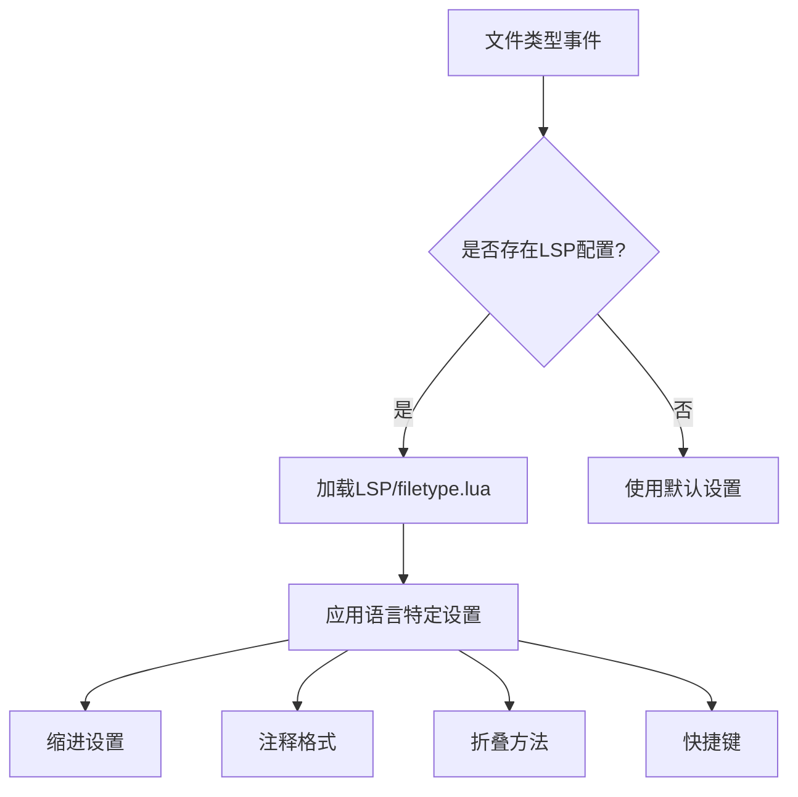
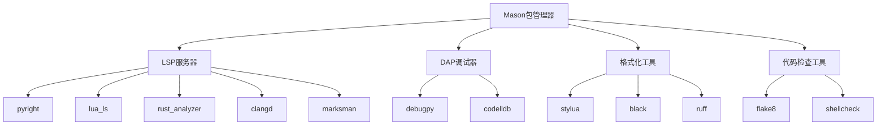
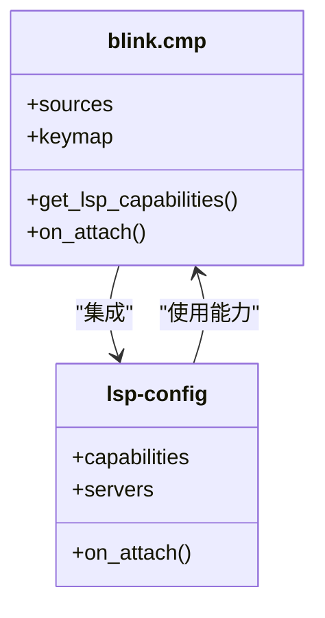
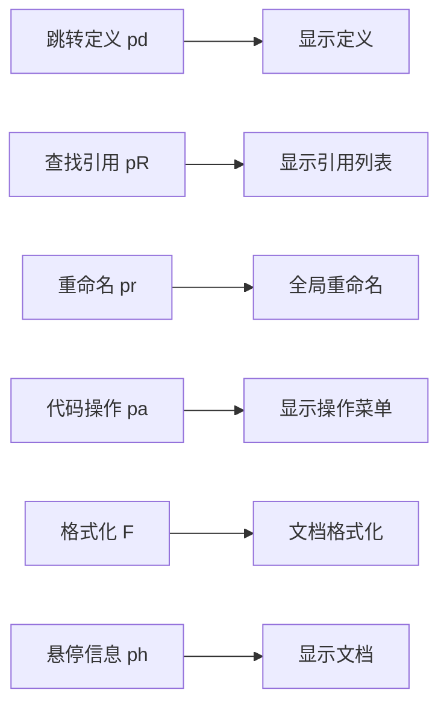
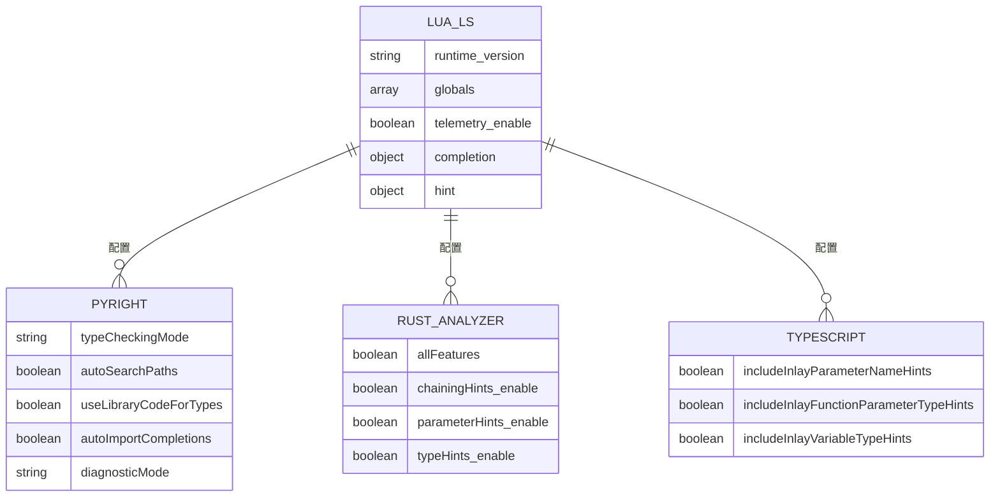
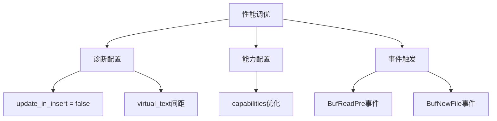
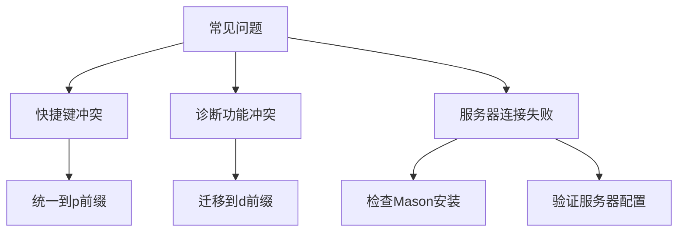

# LSP与语言支持

<cite>
**本文档引用的文件**
- [lsp-config.lua](file://lua/plugins/lsp-config.lua) - *整合了所有LSP服务器配置，包括pyright、lua_ls等*
- [mason.lua](file://lua/plugins/mason.lua) - *Mason包管理器配置，统一管理LSP、DAP、linter和formatter*
- [blink-cmp.lua](file://lua/plugins/blink-cmp.lua) - *AI辅助补全引擎，与LSP深度集成*
- [essential.lua](file://lua/plugins/essential.lua) - *核心插件集合，包含AI辅助功能*
- [keybindings.lua](file://lua/config/keybindings.lua) - *键位配置，解决LSP功能键位冲突*
- [LSP/python.lua](file://LSP/python.lua) - *Python文件类型特定配置*
- [LSP/cpp.lua](file://LSP/cpp.lua) - *C++文件类型特定配置*
- [LSP/css.lua](file://LSP/css.lua) - *CSS文件类型特定配置*
- [LSP/cuda.lua](file://LSP/cuda.lua) - *CUDA文件类型特定配置*
- [LSP/lua.lua](file://LSP/lua.lua) - *Lua文件类型特定配置*
</cite>

## 更新摘要
**变更内容**
- 根据最新代码变更，更新了LSP服务器配置部分，新增了多种语言支持
- 修正了键位冲突问题，将LSP功能组从`<leader>l`迁移至`<leader>p`前缀
- 更新了Mason包管理集成内容，反映最新的工具安装列表
- 新增了文件类型特定配置章节，说明LSP子目录中各语言配置文件的作用
- 修正了AI补全集成部分，准确描述blink-cmp与LSP的集成方式
- 更新了LSP功能使用示例，反映最新的快捷键映射

## 目录
1. [简介](#简介)
2. [LSP服务器配置](#lsp服务器配置)
3. [文件类型特定配置](#文件类型特定配置)
4. [Mason包管理集成](#mason包管理集成)
5. [AI补全与代码操作集成](#ai补全与代码操作集成)
6. [LSP功能使用示例](#lsp功能使用示例)
7. [服务器特定配置](#服务器特定配置)
8. [性能调优建议](#性能调优建议)
9. [常见问题解决方案](#常见问题解决方案)

## 简介
本文档详细说明了Neovim环境中LSP（语言服务器协议）的完整集成方案。文档涵盖lsp-config.lua对多种编程语言的服务器配置、mason.lua对开发工具的自动化管理、essential.lua中AI辅助功能的集成，以及LSP核心功能的使用方法。配置基于Neovim 0.11+和nvim-lspconfig 2024最新标准，采用现代化的vim.lsp.enable() API。通过模块化设计，实现了对Python（pyright）、Lua（lua_ls）、Rust（rust_analyzer）、TypeScript等多种语言的全面支持。

## LSP服务器配置
lsp-config.lua文件为多种编程语言提供了预配置的LSP服务器设置，包括Python（pyright）、Lua（lua_ls）、Rust（rust_analyzer）和TypeScript等。配置采用模块化设计，通过nvim-lspconfig插件实现，支持诊断、内联提示、文档高亮等现代化功能。最新更新整合了多种语言的LSP支持，扩大了语言支持范围。

**Section sources**
- [lsp-config.lua](file://lua/plugins/lsp-config.lua#L0-L589)

## 文件类型特定配置
通过LSP子目录中的独立配置文件，为不同编程语言提供文件类型特定的编辑器设置。系统通过autocmd自动加载对应文件类型的配置，替代了传统的after/ftplugin方法。这种设计实现了配置的模块化和可维护性。

**Diagram sources**
- [autocmds.lua](file://lua/config/autocmds.lua#L108-L148)
- [LSP/lua.lua](file://LSP/lua.lua#L0-L22)
- [LSP/cpp.lua](file://LSP/cpp.lua#L0-L41)

**Section sources**
- [autocmds.lua](file://lua/config/autocmds.lua#L108-L148)
- [LSP/lua.lua](file://LSP/lua.lua#L0-L22)
- [LSP/cpp.lua](file://LSP/cpp.lua#L0-L41)
- [LSP/css.lua](file://LSP/css.lua#L0-L25)
- [LSP/cuda.lua](file://LSP/cuda.lua#L0-L20)
- [LSP/python.lua](file://LSP/python.lua#L0-L30)

## Mason包管理集成
mason.lua配置文件通过mason.nvim插件实现了LSP服务器、DAP调试器、linter和formatter的统一管理。配置包含完整的工具安装列表，确保所有开发工具的版本一致性和可维护性。最新配置优化了安装流程，避免了重复安装冲突。

**Diagram sources**
- [mason.lua](file://lua/plugins/mason.lua#L0-L169)

**Section sources**
- [mason.lua](file://lua/plugins/mason.lua#L0-L169)

## AI补全与代码操作集成
essential.lua和blink-cmp.lua共同实现了AI辅助的代码补全功能。blink-cmp作为主要的补全引擎，与LSP深度集成，提供智能的代码建议和补全体验。配置中通过get_lsp_capabilities()获取blink-cmp的能力，并与LSP客户端能力合并。

**Diagram sources**
- [blink-cmp.lua](file://lua/plugins/blink-cmp.lua#L0-L151)
- [lsp-config.lua](file://lua/plugins/lsp-config.lua#L560-L589)

**Section sources**
- [blink-cmp.lua](file://lua/plugins/blink-cmp.lua#L0-L151)
- [essential.lua](file://lua/plugins/essential.lua#L0-L609)

## LSP功能使用示例
LSP提供了丰富的代码编辑功能，通过直观的快捷键访问。配置中定义了多种LSP操作的快捷方式，方便开发者高效使用。注意：为避免与LazyVim冲突，LSP功能组已从`<leader>l`迁移至`<leader>p`前缀。

**Diagram sources**
- [lsp-config.lua](file://lua/plugins/lsp-config.lua#L495-L516)
- [keybindings.lua](file://lua/config/keybindings.lua#L0-L549)

**Section sources**
- [lsp-config.lua](file://lua/plugins/lsp-config.lua#L495-L516)
- [keybindings.lua](file://lua/config/keybindings.lua#L0-L549)

## 服务器特定配置
不同语言的LSP服务器有特定的配置选项，以优化开发体验。配置文件为每种语言服务器提供了针对性的设置，包括类型检查模式、自动导入、内联提示等。

**Diagram sources**
- [lsp-config.lua](file://lua/plugins/lsp-config.lua#L136-L177)
- [lsp-config.lua](file://lua/plugins/lsp-config.lua#L175-L221)

**Section sources**
- [lsp-config.lua](file://lua/plugins/lsp-config.lua#L136-L221)

## 性能调优建议
LSP配置中包含多项性能优化设置，旨在提升编辑器响应速度和用户体验。诊断配置中的update_in_insert = false设置可减少插入模式下的干扰，提高编辑流畅度。

**Diagram sources**
- [lsp-config.lua](file://lua/plugins/lsp-config.lua#L0-L51)
- [lsp-config.lua](file://lua/plugins/lsp-config.lua#L223-L253)

**Section sources**
- [lsp-config.lua](file://lua/plugins/lsp-config.lua#L0-L51)
- [lsp-config.lua](file://lua/plugins/lsp-config.lua#L223-L253)

## 常见问题解决方案
LSP集成过程中可能遇到连接问题或配置冲突。文档提供了解决常见问题的方案，包括快捷键冲突解决和诊断功能迁移。

**Diagram sources**
- [keybindings.lua](file://lua/config/keybindings.lua#L0-L549)
- [which-key.lua](file://lua/plugins/which-key.lua#L0-L56)

**Section sources**
- [keybindings.lua](file://lua/config/keybindings.lua#L0-L549)
- [which-key.lua](file://lua/plugins/which-key.lua#L0-L56)