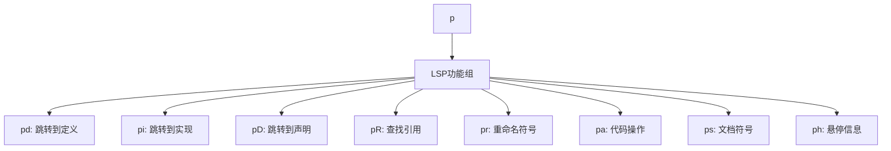
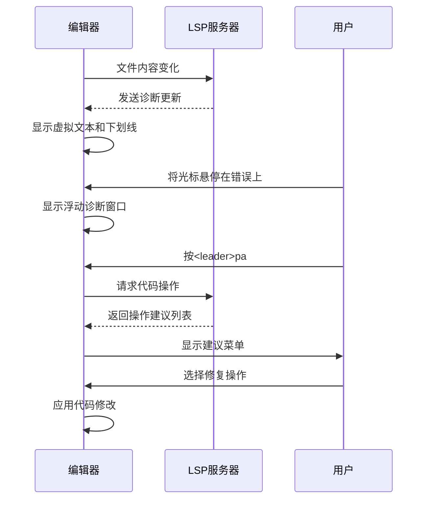

# LSP功能使用指南

<cite>
**本文档引用的文件**  
- [lsp-config.lua](file://lua/plugins/lsp-config.lua) - *LSP服务器核心配置*
- [keybindings.lua](file://lua/config/keybindings.lua) - *LSP快捷键重新映射*
- [which-key.lua](file://lua/plugins/which-key.lua) - *可视化键位导航配置*
</cite>

## 更新摘要
**变更内容**   
- 将LSP功能组从`<leader>l`迁移至`<leader>p`，避免与LazyVim冲突
- 更新所有相关快捷键描述和流程图
- 修正which-key集成说明，反映最新的键位分组策略
- 移除已清理的键位引用，确保文档准确性

## 目录
1. [LSP核心功能概览](#lsp核心功能概览)  
2. [快捷键绑定与which-key组织](#快捷键绑定与which-key组织)  
3. [诊断系统与交互流程](#诊断系统与交互流程)  
4. [多语言实例演示](#多语言实例演示)  
5. [高效使用技巧](#高效使用技巧)  

## LSP核心功能概览

Neovim的LSP（语言服务器协议）系统为开发者提供了强大的代码智能支持。本配置基于Neovim 0.11+和nvim-lspconfig最新标准，集成了诊断、跳转、重命名、代码操作等核心功能。

LSP功能在`lsp-config.lua`中通过`on_attach`函数为每个语言服务器附加统一的行为。所有LSP服务器共享相同的快捷键绑定、诊断配置和增强功能，确保跨语言的一致性体验。

**LSP核心功能包括：**
- **跳转定义**：快速定位符号定义位置
- **查找引用**：显示符号在项目中的所有引用
- **重命名符号**：安全地重命名变量、函数等
- **查看类型定义**：跳转到类型的声明位置
- **代码操作建议**：获取重构、修复等建议
- **内联提示**：显示参数名、类型等上下文信息
- **文档高亮**：悬停时高亮相关符号

**Section sources**  
- [lsp-config.lua](file://lua/plugins/lsp-config.lua#L255-L278)

## 快捷键绑定与which-key组织

本配置通过`keybindings.lua`对LSP相关快捷键进行了系统化组织，解决了传统键位冲突问题，并通过which-key提供直观的命令导航。

### LSP功能快捷键

所有LSP功能被统一组织在`<leader>p`前缀下，形成清晰的命令组（原`<leader>l`已迁移以避免与LazyVim冲突）：



**Diagram sources**  
- [keybindings.lua](file://lua/config/keybindings.lua#L70-L80)

### which-key集成

which-key插件为LSP命令提供了可视化导航界面。通过将所有LSP命令统一到`<leader>p`前缀，避免了与原生vim命令（如`g`系列）和LazyVim默认键位（如`<space>l`）的冲突。

which-key的配置在`which-key.lua`中定义了过滤规则，避免为单字母键创建组，确保界面整洁：

```lua
filter = function(mapping)
  local key = mapping.lhs
  if #key == 1 and key ~= " " then
    return false
  end
  -- 过滤冲突模式
  local conflicting_patterns = {
    "^g$", "^s$", "^gr$", "^gc$"
  }
  for _, pattern in ipairs(conflicting_patterns) do
    if key:match(pattern) then
      return false
    end
  end
  return true
end
```

**Section sources**  
- [keybindings.lua](file://lua/config/keybindings.lua#L94-L143)
- [which-key.lua](file://lua/plugins/which-key.lua#L0-L56)

## 诊断系统与交互流程

LSP诊断系统提供了实时的代码质量反馈，包括错误、警告、提示等信息，帮助开发者及时发现和修复问题。

### 诊断显示配置

诊断信息通过多种方式呈现，确保信息清晰且不干扰编码：

- **虚拟文本**：在代码右侧显示诊断信息，使用"●"作为前缀
- **下划线**：在错误行下方显示波浪线
- **浮动窗口**：悬停时显示详细的诊断信息，采用圆角边框
- **严重性排序**：按错误严重程度排序显示

诊断配置在`lsp-config.lua`中定义：

```lua
diagnostics = {
  underline = true,
  update_in_insert = false,
  virtual_text = {
    spacing = 4,
    source = "if_many",
    prefix = "●",
  },
  severity_sort = true,
  float = {
    focusable = false,
    style = "minimal",
    border = "rounded",
    source = "always",
    max_width = 80,
    max_height = 20,
  },
}
```

### 交互流程

#### 内联诊断显示
当光标位于有诊断问题的代码行时，右侧会显示虚拟文本提示。错误行会有下划线标记，颜色根据严重性区分。

#### 错误提示悬浮窗
将光标悬停在有问题的代码上，或按`K`键，会弹出浮动窗口显示详细的错误信息，包括错误类型、描述和可能的修复建议。

#### 代码修复建议（Code Action）
按`<leader>pa`可触发代码操作建议。系统会分析当前上下文，提供如导入缺失模块、修复语法错误、重构代码等建议。

诊断列表可通过`<leader>dd`打开，集中查看项目中的所有诊断问题。



**Diagram sources**  
- [lsp-config.lua](file://lua/plugins/lsp-config.lua#L50-L98)
- [lsp-config.lua](file://lua/plugins/lsp-config.lua#L223-L253)

**Section sources**  
- [lsp-config.lua](file://lua/plugins/lsp-config.lua#L50-L98)

## 多语言实例演示

LSP配置支持多种编程语言，每种语言都有针对性的优化设置。

### Python函数跳转

Python语言使用`pyright`作为LSP服务器，在`lsp-config.lua`中有专门配置：

```lua
pyright = {
  settings = {
    python = {
      analysis = {
        typeCheckingMode = "basic",
        autoSearchPaths = true,
        useLibraryCodeForTypes = true,
        autoImportCompletions = true,
        diagnosticMode = "workspace",
      },
    },
  },
}
```

**使用流程：**
1. 在Python文件中将光标置于函数调用上
2. 按`<leader>pd`跳转到函数定义
3. 按`<leader>pR`查找该函数的所有引用
4. 按`<leader>pr`重命名函数，所有引用将自动更新

### Rust trait实现查找

Rust语言使用`rust_analyzer`，配置中启用了丰富的内联提示：

```lua
rust_analyzer = {
  settings = {
    ["rust-analyzer"] = {
      cargo = { allFeatures = true },
      inlayHints = {
        chainingHints = { enable = true },
        parameterHints = { enable = true },
        typeHints = { enable = true },
      },
    },
  },
}
```

**使用流程：**
1. 在Rust代码中遇到trait方法调用
2. 按`<leader>pi`跳转到trait实现
3. 按`<leader>pD`查看类型定义
4. 内联提示会显示链式调用的中间类型和参数名

**Section sources**  
- [lsp-config.lua](file://lua/plugins/lsp-config.lua#L136-L177)

## 高效使用技巧

掌握以下技巧可以最大化利用LSP能力，提升开发效率。

### 文档高亮
当光标停留在符号上时，同一文件中相同符号会自动高亮，便于快速识别所有使用位置。这是通过`CursorHold`事件触发的：

```lua
vim.api.nvim_create_autocmd({ "CursorHold", "CursorHoldI" }, {
  group = "lsp_document_highlight",
  buffer = bufnr,
  callback = vim.lsp.buf.document_highlight,
})
```

### 内联提示
内联提示在代码中直接显示类型信息、参数名等，减少查看文档的需要。支持的语言包括：
- **TypeScript**：参数名、变量类型提示
- **Rust**：链式调用提示、参数提示
- **Lua**：函数参数、返回类型提示

### 代码格式化
按`<leader>F`可格式化整个文件。配置中使用异步格式化，避免阻塞编辑器：

```lua
vim.lsp.buf.format({ async = true })
```

### 服务器特定配置
不同语言服务器有专门优化：
- **lua_ls**：识别`vim`全局变量，禁用`missing-fields`警告
- **ts_ls**：启用详细的内联提示
- **jsonls/yamlls**：集成schemastore，提供JSON/YAML模式验证

### 故障排查
如果LSP功能未正常工作：
1. 检查对应语言服务器是否已安装（通过Mason）
2. 确认文件类型正确识别
3. 查看LSP日志（`:LspInfo`）
4. 验证快捷键绑定（`<leader>?p`查看所有LSP快捷键）

**Section sources**  
- [lsp-config.lua](file://lua/plugins/lsp-config.lua#L277-L298)
- [lsp-config.lua](file://lua/plugins/lsp-config.lua#L300-L323)