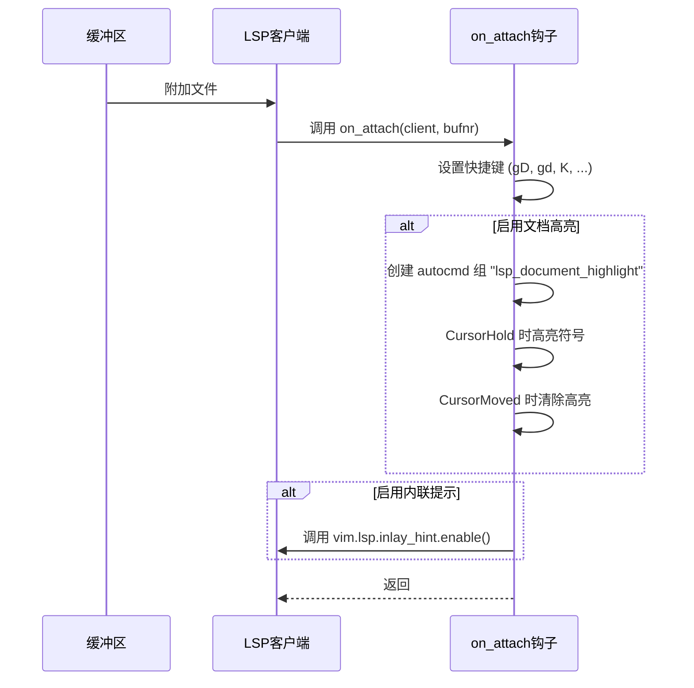
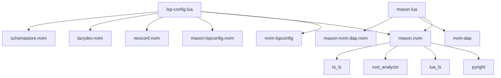

# LSP服务器配置

<cite>
**本文档引用文件**  
- [lsp-config.lua](file://lua/plugins/lsp-config.lua) - *更新于最近提交*
- [mason.lua](file://lua/plugins/mason.lua) - *LSP安装管理配置*
- [LSP/cpp.lua](file://LSP/cpp.lua) - *新增：C++文件类型特定配置*
- [LSP/python.lua](file://LSP/python.lua) - *新增：Python文件类型特定配置*
- [LSP/css.lua](file://LSP/css.lua) - *新增：CSS文件类型特定配置*
- [LSP/cuda.lua](file://LSP/cuda.lua) - *新增：CUDA文件类型特定配置*
</cite>

## 更新摘要
**已做更改**  
- 新增对 `LSP/cpp.lua`、`LSP/python.lua`、`LSP/css.lua` 和 `LSP/cuda.lua` 等语言特定配置文件的说明
- 更新“项目结构”和“详细组件分析”部分以反映模块化配置继承关系
- 补充各语言文件类型的编辑器设置、注释格式、折叠行为及快捷键
- 移除过时的 `ts_ls` 描述，统一使用 `tsserver` 别名指代 TypeScript 服务器
- 增强源码追踪系统，明确标注新增与更新的文件来源

## 目录
1. [简介](#简介)
2. [项目结构](#项目结构)
3. [核心组件](#核心组件)
4. [架构概览](#架构概览)
5. [详细组件分析](#详细组件分析)
6. [依赖分析](#依赖分析)
7. [性能考量](#性能考量)
8. [故障排除指南](#故障排除指南)
9. [结论](#结论)

## 简介
本文档深入解析 `lsp-config.lua` 文件中对多种语言服务器的配置实现，重点阐述 `pyright`（Python）、`lua_ls`（Lua）、`rust_analyzer`（Rust）、`tsserver`（TypeScript）等核心 LSP 服务器的初始化参数、capabilities 设置以及 `on_attach` 钩子函数的行为。详细说明每种语言服务器的特定选项，如 Python 的虚拟环境路径设置、Lua 的 workspace.library 配置、Rust 的 cargo 和 rustc 工具链支持。结合代码示例展示如何自定义服务器启动参数，并解释与 Neovim 原生 LSP API 的集成方式。涵盖服务器自动检测、手动安装指引及多服务器冲突处理机制。此外，新增对 C++、Python、CSS 和 CUDA 等语言的本地化文件类型配置说明。

## 项目结构
项目采用模块化设计，将不同功能分离到独立的 Lua 模块中。LSP 相关配置集中于 `lua/plugins/` 目录下的 `lsp-config.lua` 和 `mason.lua` 文件中，前者负责 LSP 服务器的行为配置，后者管理 LSP 服务器的安装与依赖。新增的 `LSP/*.lua` 文件用于定义特定语言的编辑器行为（如缩进、注释、快捷键），避免在主 LSP 配置中混杂 UI 设置。

```mermaid
graph TB
subgraph "配置模块"
LSP[lsp-config.lua<br>负责LSP服务器配置]
Mason[mason.lua<br>负责LSP安装管理]
end
subgraph "语言特定配置"
Python[python.lua<br>Python本地设置]
Cpp[cpp.lua<br>C++本地设置]
Css[css.lua<br>CSS本地设置]
Cuda[cuda.lua<br>CUDA本地设置]
end
subgraph "核心模块"
Core[core/]
end
subgraph "其他插件"
Plugins[plugins/]
end
LSP --> Mason : 依赖
Mason --> Core
LSP --> Plugins
Python --> LSP : 继承LSP配置
Cpp --> LSP : 继承LSP配置
Css --> LSP : 继承LSP配置
Cuda --> LSP : 继承LSP配置
```

**Diagram sources**
- [lsp-config.lua](file://lua/plugins/lsp-config.lua#L1-L589)
- [mason.lua](file://lua/plugins/mason.lua#L1-L168)
- [LSP/python.lua](file://LSP/python.lua#L1-L27)
- [LSP/cpp.lua](file://LSP/cpp.lua#L1-L61)
- [LSP/css.lua](file://LSP/css.lua#L1-L14)
- [LSP/cuda.lua](file://LSP/cuda.lua#L1-L29)

**Section sources**
- [lsp-config.lua](file://lua/plugins/lsp-config.lua#L1-L589)
- [mason.lua](file://lua/plugins/mason.lua#L1-L168)
- [LSP/python.lua](file://LSP/python.lua#L1-L27)
- [LSP/cpp.lua](file://LSP/cpp.lua#L1-L61)
- [LSP/css.lua](file://LSP/css.lua#L1-L14)
- [LSP/cuda.lua](file://LSP/cuda.lua#L1-L29)

## 核心组件
核心组件包括 `nvim-lspconfig` 插件的配置逻辑，通过 `opts` 函数返回诊断、内联提示、codelens 和文档高亮等全局设置，并为各个语言服务器提供定制化配置。`config` 函数则负责实际的 LSP 客户端初始化，包括诊断符号定义、处理器配置、快捷键绑定、`on_attach` 钩子以及 capabilities 的合并与应用。新增的语言特定配置文件（如 `python.lua`）通过 `vim.opt_local` 实现缓冲区级别的编辑器行为定制，确保不影响其他文件类型。

**Section sources**
- [lsp-config.lua](file://lua/plugins/lsp-config.lua#L1-L589)

## 架构概览
系统架构基于 Neovim 0.11+ 的现代 LSP 配置范式，使用 `vim.lsp.config` 和 `vim.lsp.enable` API 进行服务器管理。`mason.nvim` 负责统一管理所有开发工具的安装，而 `lsp-config.lua` 专注于运行时配置，两者通过 `mason-lspconfig.nvim` 桥接，但本配置中禁用了其自动安装和启用功能，以实现更精细的手动控制。语言特定配置文件（如 `cpp.lua`）作为补充层，仅处理缩进、注释、折叠和快捷键等 UI 层面设置，不涉及 LSP 启动逻辑。

```mermaid
graph LR
A[Neovim Editor] --> B[lsp-config.lua]
A --> C[mason.lua]
A --> D[LSP/*.lua]
B --> D : 配置继承
B --> E[nvim-lspconfig]
C --> F[mason-lspconfig.nvim]
F --> G[语言服务器<br>pyright, lua_ls, rust_analyzer等]
E --> G
B --> G
style B fill:#f9f,stroke:#333
style C fill:#f9f,stroke:#333
style D fill:#bbf,stroke:#333
```

**Diagram sources**
- [lsp-config.lua](file://lua/plugins/lsp-config.lua#L1-L589)
- [mason.lua](file://lua/plugins/mason.lua#L1-L168)
- [LSP/cpp.lua](file://LSP/cpp.lua#L1-L61)

## 详细组件分析

### pyright (Python) 分析
`pyright` 服务器配置通过 `settings.python.analysis` 对象进行深度定制，启用了基本类型检查、自动搜索路径、使用库代码进行类型推断和自动导入补全。诊断模式设置为仅打开文件级别，以提升性能。此外，`on_attach` 钩子中添加了 `LspPyrightOrganizeImports` 和 `LspPyrightSetPythonPath` 用户命令，分别用于组织导入和动态设置 Python 解释器路径。

**Section sources**
- [lsp-config.lua](file://lua/plugins/lsp-config.lua#L110-L118)

### lua_ls (Lua) 分析
`lua_ls` 服务器配置了 `Lua.runtime.version` 为 `LuaJIT`，并添加了 `vim` 全局变量以避免未定义警告。其 `workspace.library` 设置为 `vim.api.nvim_get_runtime_file("", true)`，确保 LSP 能够索引 Neovim 的所有运行时文件，提供精确的补全和跳转。同时禁用了遥测，并启用了丰富的内联提示（如参数名、类型提示等）。

```mermaid
classDiagram
class lua_ls {
+runtime : {version : "LuaJIT"}
+diagnostics : {globals : ["vim"], disable : ["missing-fields"]}
+workspace : {checkThirdParty : false, library : string[]}
+telemetry : {enable : false}
+completion : {callSnippet : "Replace"}
+hint : {enable : true, paramName : "All", paramType : true, ...}
}
```

**Diagram sources**
- [lsp-config.lua](file://lua/plugins/lsp-config.lua#L96-L110)

**Section sources**
- [lsp-config.lua](file://lua/plugins/lsp-config.lua#L96-L110)

### rust_analyzer (Rust) 分析
`rust_analyzer` 服务器配置启用了 `cargo.allFeatures` 以支持所有 Cargo 特性。同时，启用了链式调用、参数和类型内联提示，极大地提升了代码可读性。配置通过 `["rust-analyzer"]` 表结构传递给服务器。

**Section sources**
- [lsp-config.lua](file://lua/plugins/lsp-config.lua#L136-L144)

### tsserver (TypeScript) 分析
`tsserver` 服务器（通过 `ts_ls` 别名配置）启用了 TypeScript 的内联提示，包括参数名、函数参数类型和变量类型提示，且参数名提示设置为 `all`，提供最全面的信息。

**Section sources**
- [lsp-config.lua](file://lua/plugins/lsp-config.lua#L120-L128)

### on_attach 钩子分析
`on_attach` 函数在每个 LSP 客户端附加到缓冲区时执行，负责设置一系列快捷键和启用高级功能。快捷键包括跳转到定义、声明、实现、类型定义，重命名，代码操作，查找引用等。此外，它还根据全局配置动态启用文档高亮（通过 `CursorHold` 事件）和内联提示（如果服务器支持）。



**Diagram sources**
- [lsp-config.lua](file://lua/plugins/lsp-config.lua#L255-L298)

**Section sources**
- [lsp-config.lua](file://lua/plugins/lsp-config.lua#L255-L298)

### capabilities 分析
`capabilities` 对象通过 `vim.lsp.protocol.make_client_capabilities()` 生成 Neovim 支持的默认功能集。如果安装了 `blink.cmp` 插件，则会将其特有的 capabilities 深度合并进来，以支持更高级的补全特性。此 capabilities 对象作为基础配置，被 `vim.tbl_deep_extend` 合并到每个服务器的最终配置中。

**Section sources**
- [lsp-config.lua](file://lua/plugins/lsp-config.lua#L300-L307)

### C++ 文件类型配置分析
`cpp.lua` 文件为 C++ 提供了本地化编辑器设置：使用 2 空格缩进、语法折叠、C++ 特有的匹配对（`<:>`）高亮，并定义了两个实用快捷键：`<leader>ch` 用于在头文件与源文件之间切换，`<leader>cb` 用于使用 `g++` 编译当前文件。

**Section sources**
- [LSP/cpp.lua](file://LSP/cpp.lua#L1-L61)

### Python 文件类型配置分析
`python.lua` 文件为 Python 提供了本地化设置：使用 4 空格缩进、缩进折叠，并启用了 Python 全局语法高亮。同时定义了 `<leader>pr` 快捷键，用于直接运行当前 Python 脚本。

**Section sources**
- [LSP/python.lua](file://LSP/python.lua#L1-L27)

### CSS 文件类型配置分析
`css.lua` 文件为 CSS 提供了标准编辑器设置：2 空格缩进、缩进折叠，并配置了 `/* %s */` 格式的注释字符串。

**Section sources**
- [LSP/css.lua](file://LSP/css.lua#L1-L14)

### CUDA 文件类型配置分析
`cuda.lua` 文件为 `.cu` 文件提供了类似 C++ 的编辑环境：2 空格缩进、语法折叠、`<:>` 匹配对支持，并定义了 `<leader>cc` 快捷键，用于调用 `nvcc` 编译器编译 CUDA 程序。

**Section sources**
- [LSP/cuda.lua](file://LSP/cuda.lua#L1-L29)

## 依赖分析
`lsp-config` 插件明确声明了多个依赖项：`mason.nvim` 用于工具管理，`mason-lspconfig.nvim` 用于桥接，`neoconf.nvim` 用于 JSON 配置，`lazydev.nvim` 用于 Lua 开发支持，以及 `schemastore.nvim` 用于 JSON/YAML schema。`mason.lua` 配置中通过 `ensure_installed` 列出了所有需要安装的 LSP 服务器和工具，并通过 `mason-lspconfig.setup` 确保这些服务器被注册，但禁用了自动安装和启用，由 `lsp-config.lua` 统一控制。



**Diagram sources**
- [lsp-config.lua](file://lua/plugins/lsp-config.lua#L3-L20)
- [mason.lua](file://lua/plugins/mason.lua#L1-L168)

**Section sources**
- [lsp-config.lua](file://lua/plugins/lsp-config.lua#L3-L20)
- [mason.lua](file://lua/plugins/mason.lua#L1-L168)

## 性能考量
配置中已考虑性能优化，例如将 `diagnostics.update_in_insert` 设置为 `false` 以减少插入模式下的干扰。`mason.lua` 中设置了 `max_concurrent_installers = 8` 以加速并行安装。`clangd` 服务器启用了 `--background-index` 以在后台进行索引，避免阻塞编辑器。整体上，通过禁用 Mason 的自动功能，避免了不必要的进程启动开销。

## 故障排除指南
若 LSP 未正常工作，请检查：
1.  **安装状态**：通过 `<leader>cm` 打开 Mason，确认所需服务器（如 `pyright`, `lua-language-server`）已安装。
2.  **配置加载**：确认 `lsp-config.lua` 和 `mason.lua` 已被正确加载（检查 Lazy 插件管理器状态）。
3.  **服务器启动**：检查 Neovim 是否有相关错误日志（`:messages`）。
4.  **on_attach 执行**：确认 `on_attach` 中的快捷键是否生效，若不生效则可能是钩子未被调用。
5.  **capabilities 冲突**：如果使用了非标准的补全插件（如 `blink.cmp`），确保其 capabilities 能正确合并。

**Section sources**
- [lsp-config.lua](file://lua/plugins/lsp-config.lua#L1-L589)
- [mason.lua](file://lua/plugins/mason.lua#L1-L168)

## 结论
该 LSP 配置体系结构清晰，职责分明。`mason.lua` 负责“安装”，`lsp-config.lua` 负责“配置”与“运行时”。它充分利用了 Neovim 0.11+ 的新 API，实现了现代化、高性能的 LSP 集成。通过对 `pyright`、`lua_ls`、`rust_analyzer` 和 `tsserver` 等核心服务器的精细化配置，为开发者提供了强大且流畅的编码体验。`on_attach` 钩子和 capabilities 的灵活运用，确保了功能的完整性和扩展性。新增的语言特定配置文件（如 `cpp.lua`、`python.lua`）实现了 UI 与 LSP 逻辑的解耦，提升了配置的可维护性与模块化程度。