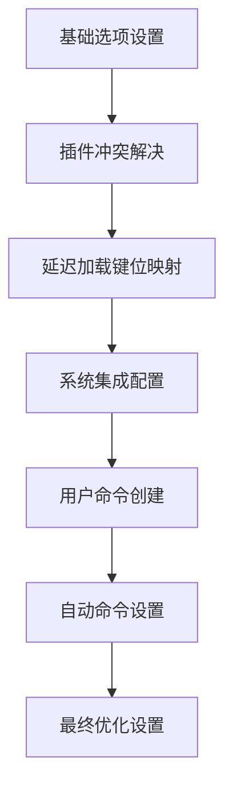
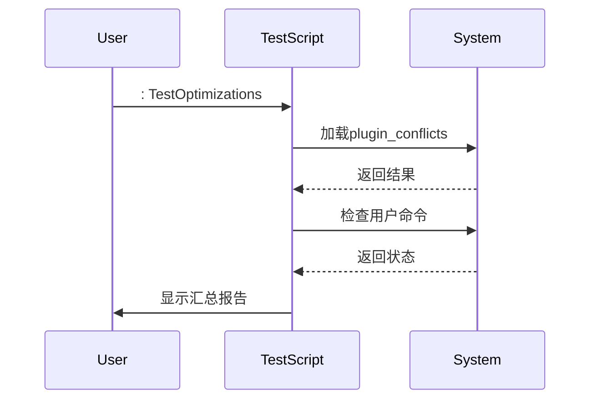

# LSP问题排查与优化

<cite>
**本文档引用文件**  
- [lsp-config.lua](file://lua/plugins/lsp-config.lua)
- [mason.lua](file://lua/plugins/mason.lua)
- [init_optimized.lua](file://lua/core/init_optimized.lua)
- [test_optimizations.lua](file://test_optimizations.lua)
</cite>

## 目录
1. [LSP常见问题与解决方案](#lsp常见问题与解决方案)  
2. [环境状态检查](#环境状态检查)  
3. [性能优化措施分析](#性能优化措施分析)  
4. [日志调试与网络配置](#日志调试与网络配置)  
5. [低性能设备降级策略](#低性能设备降级策略)  
6. [性能基准评估方法](#性能基准评估方法)

## LSP常见问题与解决方案

### 服务器启动失败
LSP服务器启动失败通常由以下原因导致：
- 未通过Mason正确安装对应语言服务器
- 网络问题导致服务器二进制文件下载不完整
- 服务器依赖的运行时环境缺失（如Node.js、Python等）

**解决方案**：
1. 使用`:Mason`命令检查服务器安装状态
2. 确保网络连接正常，必要时配置代理
3. 验证相关语言运行时是否已正确安装并加入系统PATH

### 连接超时
连接超时多发生在大型项目或资源受限环境中，可能原因包括：
- 项目文件过多导致初始化扫描耗时过长
- 磁盘I/O性能瓶颈
- 服务器进程资源限制过严

**解决方案**：
- 优化项目根目录识别策略
- 增加服务器启动超时阈值
- 排除不必要的文件/目录参与索引

### 补全无响应
补全功能无响应的常见原因：
- LSP客户端与服务器通信中断
- 服务器处理请求队列积压
- `on_attach`钩子中存在阻塞操作

**解决方案**：
- 检查`on_attach`函数执行效率
- 确保`capabilities`正确传递
- 验证`blink.cmp`等补全插件集成状态

### 诊断信息延迟
诊断信息显示延迟通常与以下因素相关：
- 大文件处理策略不当
- 诊断更新频率设置不合理
- 插件冲突导致事件循环阻塞

**解决方案**：
- 调整`updatetime`和`timeoutlen`参数
- 启用按需诊断更新（`update_in_insert = false`）
- 使用`:CheckKeymapConflicts`排查键位冲突

**Section sources**
- [lsp-config.lua](file://lua/plugins/lsp-config.lua#L255-L278)
- [init_optimized.lua](file://lua/core/init_optimized.lua#L67-L98)

## 环境状态检查

### 使用:checkhealth lsp-config
`:checkhealth lsp-config`命令可全面检测LSP配置健康状况，检查项包括：
- nvim-lspconfig插件加载状态
- 各语言服务器可执行文件路径可达性
- 必需依赖组件（如schemastore.nvim）加载情况
- 客户端与服务器通信通道状态

### 使用:Mason检查包管理器状态
`:Mason`命令提供直观的包管理界面，可执行以下操作：
- 查看已安装/待安装的语言服务器列表
- 检查过期包并进行批量更新
- 查看安装日志定位具体错误
- 管理调试适配器和格式化工具

**关键配置**：
- `ensure_installed`：声明需预装的工具链
- `max_concurrent_installers`：控制并行安装数量
- `automatic_installation = false`：禁用自动安装，由用户显式控制

**Section sources**
- [mason.lua](file://lua/plugins/mason.lua#L27-L51)
- [lsp-config.lua](file://lua/plugins/lsp-config.lua#L175-L221)

## 性能优化措施分析

### 异步初始化策略
`init_optimized.lua`采用分阶段延迟加载策略：



**Diagram sources**
- [init_optimized.lua](file://lua/core/init_optimized.lua#L9-L235)

### 资源限制优化
通过以下方式降低系统资源消耗：
- 设置`updatetime = 250`减少事件触发频率
- 配置`timeoutlen = 300`优化多键组合响应
- 大文件自动禁用相对行号显示
- 插入模式下临时关闭相对行号

### 剪贴板性能优化
针对不同平台采用最优剪贴板方案：
- WSL环境使用`clip.exe`原生集成
- Windows原生环境使用PowerShell命令
- 其他系统使用标准`unnamedplus`机制

**Section sources**
- [init_optimized.lua](file://lua/core/init_optimized.lua#L67-L143)

## 日志调试与网络配置

### LSP日志级别设置
可通过以下方式配置日志输出：
- 在`mason.lua`中设置`log_level = vim.log.levels.INFO`
- 使用`vim.lsp.set_log_level("debug")`动态调整
- 查看`$NVIM_DATA_DIR/mason/logs`下的详细日志

### 网络代理配置建议
对于需要网络访问的场景，建议配置：

```lua
-- 在mason.lua中取消注释并修改
http_proxy = "http://proxy.example.com:8080",
https_proxy = "http://proxy.example.com:8080",
no_proxy = "localhost,127.0.0.1"
```

**注意事项**：
- 代理设置需符合企业网络安全策略
- 某些语言服务器可能需要额外的CA证书配置
- 建议使用短连接超时避免长时间等待

**Section sources**
- [mason.lua](file://lua/plugins/mason.lua#L76-L107)

## 低性能设备降级策略

### 功能选择性禁用
在低配设备上可考虑：
- 禁用内联提示（inlay hints）
- 关闭文档高亮（document highlight）
- 减少诊断信息显示密度
- 禁用非必要的codelens功能

### 资源密集型功能延迟加载
采用`vim.defer_fn`实现关键功能延迟初始化：
- 键位映射延迟200ms加载
- 最终优化设置延迟500ms执行
- Mason包安装延迟1秒启动

### 大文件处理优化
对大于一定阈值的文件自动启用轻量模式：
- 禁用语法高亮
- 关闭LSP诊断
- 使用简单模式而非智能补全

**Section sources**
- [init_optimized.lua](file://lua/core/init_optimized.lua#L145-L235)

## 性能基准评估方法

### 测试框架概述
`test_optimizations.lua`提供了完整的自动化测试套件：



**Diagram sources**
- [test_optimizations.lua](file://test_optimizations.lua#L124-L170)

### 核心测试项
测试用例覆盖以下关键维度：
- **模块加载**：验证`init_optimized`等核心模块可正常require
- **用户命令**：检查`ReloadConfig`、`HealthCheck`等自定义命令可用性
- **键位映射**：确认`<C-s>`保存、`<C-z>`撤销等关键映射生效
- **基础选项**：验证`updatetime`、`ignorecase`等选项正确设置
- **插件状态**：确保`lazy.nvim`、`blink.cmp`等关键插件加载成功

### 测试执行方式
提供两种测试模式：
- **完整测试**：`:TestOptimizations`运行所有测试用例
- **快速检查**：`:QuickCheck`仅验证核心功能状态

测试结果以清晰的统计格式输出，包含通过/失败计数及详细错误信息。

**Section sources**
- [test_optimizations.lua](file://test_optimizations.lua#L37-L223)