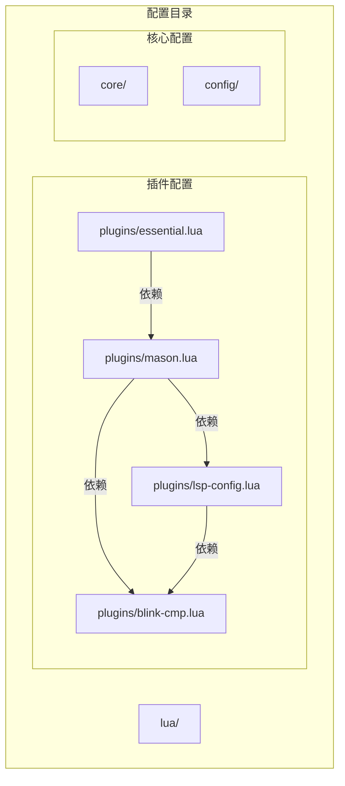
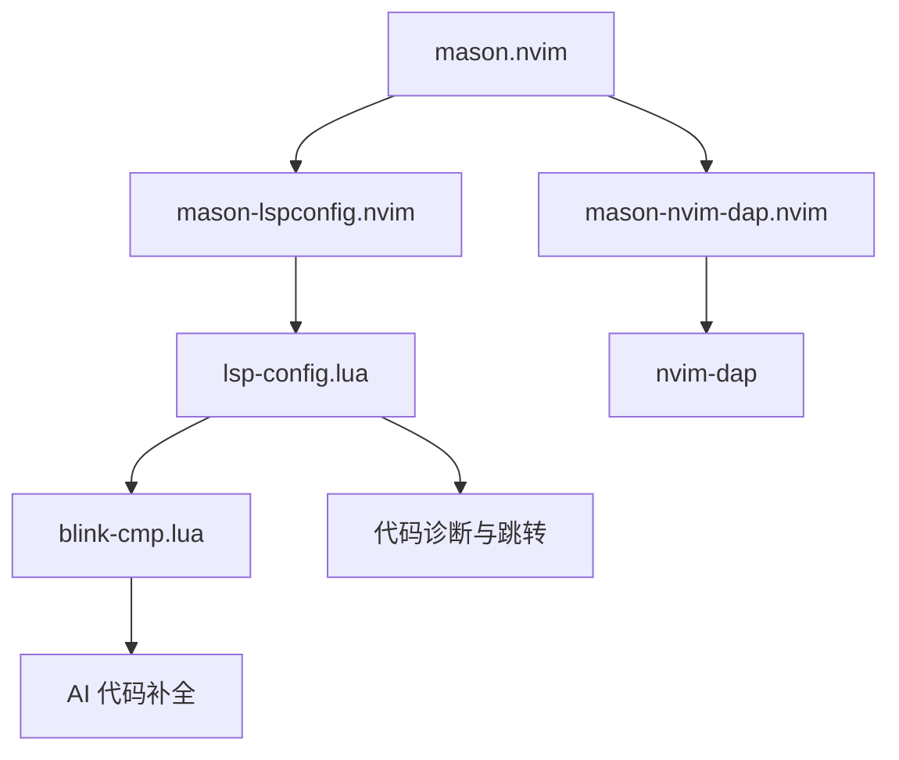
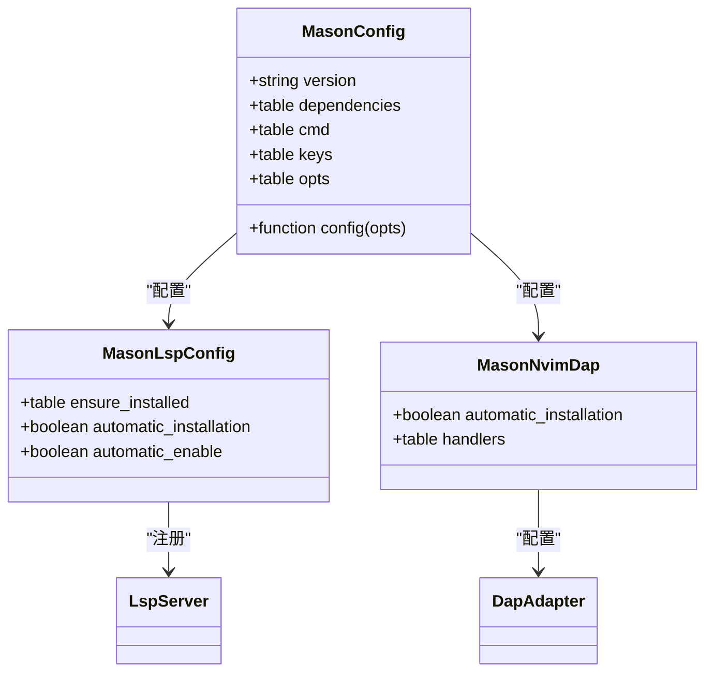
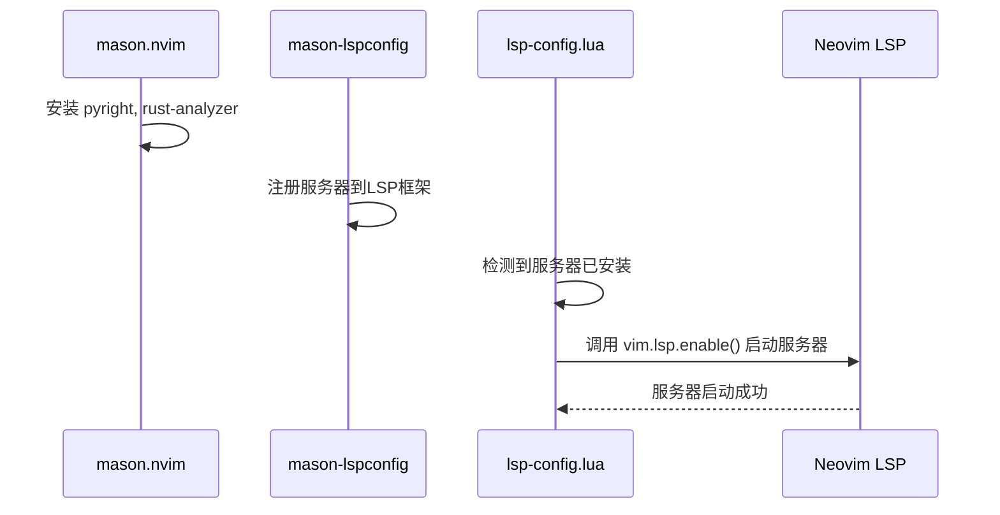
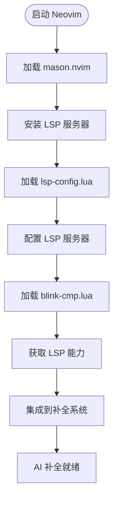
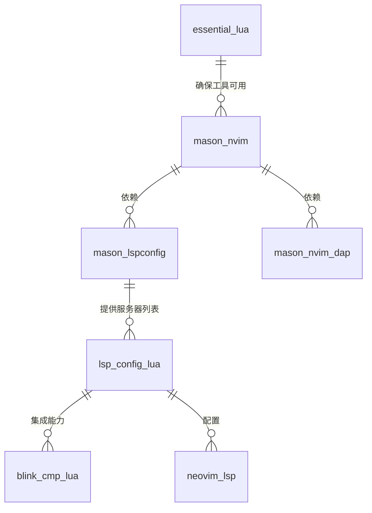

# 语言服务器管理

<cite>
**本文档引用的文件**   
- [mason.lua](file://lua/plugins/mason.lua)
- [lsp-config.lua](file://lua/plugins/lsp-config.lua)
- [blink-cmp.lua](file://lua/plugins/blink-cmp.lua)
- [essential.lua](file://lua/plugins/essential.lua)
</cite>

## 目录
1. [简介](#简介)
2. [项目结构](#项目结构)
3. [核心组件](#核心组件)
4. [架构概述](#架构概述)
5. [详细组件分析](#详细组件分析)
6. [依赖分析](#依赖分析)
7. [性能考虑](#性能考虑)
8. [故障排除指南](#故障排除指南)
9. [结论](#结论)

## 简介
本文档全面阐述了 `mason.nvim` 如何统一管理语言服务器协议（LSP）服务器、调试适配器（DAP）、linter 和 formatter 的生命周期。重点说明配置中指定的自动安装语言服务器列表（如 pyright、lua_ls、rust_analyzer）及其依赖项，解释 `mason-lspconfig.nvim` 桥接机制如何实现 LSP 服务器的自动注册与启动，并描述 `essential.lua` 中如何结合 `mason` 确保 AI 补全插件 `blink-cmp` 所需工具链的可用性。

## 项目结构
Neovim 配置项目采用模块化设计，将不同功能的插件和配置分离到独立的 Lua 文件中。核心配置位于 `lua/plugins/` 目录下，其中 `mason.lua` 负责管理所有开发工具的生命周期，`lsp-config.lua` 负责 LSP 服务器的配置与启动，`blink-cmp.lua` 提供 AI 增强的代码补全功能。

**Diagram sources**
- [mason.lua](file://lua/plugins/mason.lua)
- [lsp-config.lua](file://lua/plugins/lsp-config.lua)
- [blink-cmp.lua](file://lua/plugins/blink-cmp.lua)
- [essential.lua](file://lua/plugins/essential.lua)

**Section sources**
- [mason.lua](file://lua/plugins/mason.lua)
- [lsp-config.lua](file://lua/plugins/lsp-config.lua)

## 核心组件
`mason.nvim` 是整个开发工具链的核心管理器，它通过一个统一的界面来安装、更新和管理所有语言服务器、调试器、格式化工具和 linter。其核心功能包括定义 `ensure_installed` 列表来声明所需工具，并通过 `mason-lspconfig.nvim` 和 `mason-nvim-dap.nvim` 这两个桥接插件与 Neovim 的 LSP 和 DAP 系统集成。

**Section sources**
- [mason.lua](file://lua/plugins/mason.lua#L27-L51)
- [mason.lua](file://lua/plugins/mason.lua#L105-L130)

## 架构概述
系统架构采用分层设计，`mason.nvim` 位于最底层，负责工具的物理安装和版本管理。其上是桥接层，`mason-lspconfig.nvim` 负责将已安装的 LSP 服务器注册到 Neovim 的 LSP 框架中，而 `mason-nvim-dap.nvim` 则负责调试适配器的配置。最上层是应用层，`lsp-config.lua` 和 `blink-cmp.lua` 等插件利用这些已注册的服务提供具体的开发功能。

**Diagram sources**
- [mason.lua](file://lua/plugins/mason.lua)
- [lsp-config.lua](file://lua/plugins/lsp-config.lua)
- [blink-cmp.lua](file://lua/plugins/blink-cmp.lua)

## 详细组件分析

### Mason 核心配置分析
`mason.lua` 文件定义了所有需要自动安装的开发工具。`ensure_installed` 列表详细列出了 LSP 服务器（如 `pyright`, `rust-analyzer`）、格式化工具（如 `stylua`, `prettier`）、DAP 调试器（如 `debugpy`, `codelldb`）和 linter（如 `flake8`, `shellcheck`）。通过 `dependencies` 字段，它声明了与 `mason-lspconfig.nvim` 和 `mason-nvim-dap.nvim` 的依赖关系，确保这些桥接插件在 `mason` 之后加载。

**Diagram sources**
- [mason.lua](file://lua/plugins/mason.lua#L0-L168)

**Section sources**
- [mason.lua](file://lua/plugins/mason.lua#L0-L168)

### LSP 服务器注册与启动分析
`mason-lspconfig.nvim` 作为桥接插件，其作用是将 `mason` 安装的二进制文件与 Neovim 的 LSP 框架连接起来。在 `mason.lua` 的 `config` 函数中，通过 `require("mason-lspconfig").setup()` 进行配置。值得注意的是，`automatic_installation` 和 `automatic_enable` 均被设置为 `false`，这意味着 LSP 服务器的安装由 `mason` 统一管理，而服务器的启动则完全交由 `lsp-config.lua` 插件手动控制，实现了配置的解耦和精细化管理。

**Diagram sources**
- [mason.lua](file://lua/plugins/mason.lua#L105-L130)
- [lsp-config.lua](file://lua/plugins/lsp-config.lua#L300-L323)

**Section sources**
- [mason.lua](file://lua/plugins/mason.lua#L105-L130)
- [lsp-config.lua](file://lua/plugins/lsp-config.lua#L300-L323)

### AI 补全工具链集成分析
`essential.lua` 文件通过依赖 `mason` 确保了 `blink-cmp` 插件所需工具链的可用性。虽然 `essential.lua` 本身不直接管理工具安装，但它所依赖的 `mason` 配置中包含了 `pyright`、`lua-language-server` 等关键 LSP 服务器。`blink-cmp.lua` 插件在启动时，会通过 `require("blink.cmp").get_lsp_capabilities()` 获取 LSP 能力，并在 `lsp-config.lua` 的 `on_attach` 回调中被集成到 LSP 客户端的能力中，从而为 AI 补全提供上下文感知能力。

**Diagram sources**
- [mason.lua](file://lua/plugins/mason.lua)
- [lsp-config.lua](file://lua/plugins/lsp-config.lua#L300-L323)
- [blink-cmp.lua](file://lua/plugins/blink-cmp.lua)
- [essential.lua](file://lua/plugins/essential.lua)

**Section sources**
- [mason.lua](file://lua/plugins/mason.lua)
- [lsp-config.lua](file://lua/plugins/lsp-config.lua#L300-L323)
- [blink-cmp.lua](file://lua/plugins/blink-cmp.lua)
- [essential.lua](file://lua/plugins/essential.lua)

## 依赖分析
整个系统依赖关系清晰。`mason.nvim` 是基础依赖，它直接依赖 `mason-lspconfig.nvim` 和 `mason-nvim-dap.nvim` 来实现与 LSP 和 DAP 的集成。`lsp-config.lua` 依赖 `mason-lspconfig.nvim` 来发现已安装的服务器，并依赖 `blink-cmp` 来增强补全能力。`essential.lua` 作为一个功能集合，其依赖的各个插件（如 `neogit`, `diffview.nvim`）又可能间接依赖 `mason` 安装的工具。

**Diagram sources**
- [mason.lua](file://lua/plugins/mason.lua)
- [lsp-config.lua](file://lua/plugins/lsp-config.lua)
- [blink-cmp.lua](file://lua/plugins/blink-cmp.lua)
- [essential.lua](file://lua/plugins/essential.lua)

**Section sources**
- [mason.lua](file://lua/plugins/mason.lua)
- [lsp-config.lua](file://lua/plugins/lsp-config.lua)

## 性能考虑
`mason.lua` 配置中通过 `max_concurrent_installers = 8` 设置了并行安装的最大数量，这可以显著加快首次安装大量工具的速度。同时，通过将 `automatic_installation` 设置为 `false`，避免了在每次打开文件时都检查并尝试安装 LSP 服务器，从而减少了启动时的开销和潜在的网络延迟。`vim.defer_fn` 的使用也确保了安装逻辑在 Neovim 初始化完成后的安全时机执行，避免了初始化冲突。

## 故障排除指南
当遇到 LSP 服务器未启动的问题时，首先应检查 `:Mason` 命令，确认目标服务器（如 `pyright`）是否已成功安装。如果未安装，可使用 `:MasonInstall pyright` 手动安装。若已安装但未启动，需检查 `lsp-config.lua` 中是否正确配置了该服务器。对于 `blink-cmp` 无法提供补全的情况，应确认 `lsp-config.lua` 是否在 `on_attach` 回调中正确集成了 `blink.cmp` 的 capabilities。

**Section sources**
- [mason.lua](file://lua/plugins/mason.lua#L76-L107)
- [lsp-config.lua](file://lua/plugins/lsp-config.lua#L255-L278)

## 结论
`mason.nvim` 通过其强大的包管理能力，为 Neovim 提供了一个统一、可靠的开发工具生命周期管理方案。通过与 `mason-lspconfig.nvim` 等桥接插件的配合，它实现了 LSP 服务器的自动化安装与注册。尽管启动由 `lsp-config.lua` 手动控制，但 `mason` 确保了所有工具的可用性，为 `blink-cmp` 等高级插件提供了坚实的工具链基础。这种分层解耦的设计模式，既保证了自动化便利性，又保留了手动配置的灵活性和控制力。