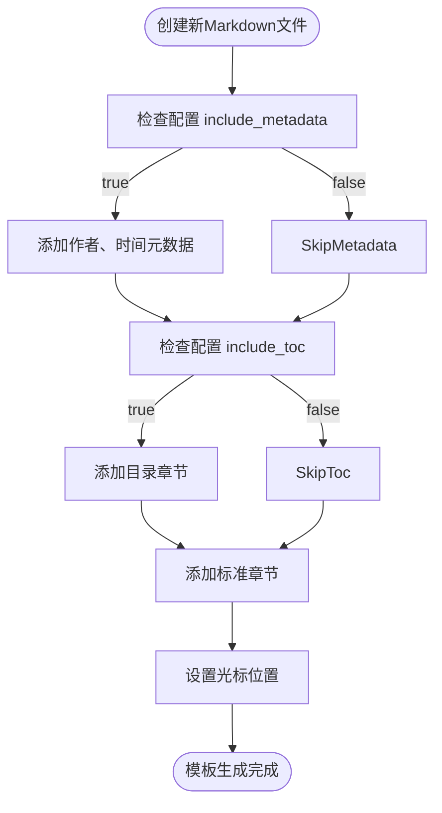

# Markdown渲染增强

<cite>
**本文档引用的文件**
- [essential.lua](file://lua/plugins/essential.lua)
- [templates.lua](file://lua/core/templates.lua)
- [quicker.lua](file://lua/plugins/quicker.lua)
</cite>

## 目录
1. [简介](#简介)
2. [项目结构](#项目结构)
3. [核心组件](#核心组件)
4. [架构概述](#架构概述)
5. [详细组件分析](#详细组件分析)
6. [依赖分析](#依赖分析)
7. [性能考虑](#性能考虑)
8. [故障排除指南](#故障排除指南)
9. [结论](#结论)

## 简介
本文档详细记录了Neovim配置中对Markdown预览体验的优化措施。通过集成`render-markdown.nvim`插件，实现了代码块高亮、数学公式渲染、表格对齐美化等功能。文档还描述了与`nvim-treesitter`、`plenary.nvim`等依赖的协同工作机制，并提供了自定义渲染样式的途径。此外，文档举例说明了如何在编辑时实时查看格式化效果，并解决了链接无法点击、图片不显示等常见问题，最后给出了提升技术文档编写效率的最佳实践建议。

## 项目结构
项目采用模块化结构，将不同功能的插件和配置分离到不同的目录中。核心配置位于`lua/core`目录，插件配置位于`lua/plugins`目录，而模板系统则统一管理在`lua/core/templates.lua`中。


**Diagram sources**
- [templates.lua](file://lua/core/templates.lua)
- [essential.lua](file://lua/plugins/essential.lua)
- [quicker.lua](file://lua/plugins/quicker.lua)

**Section sources**
- [templates.lua](file://lua/core/templates.lua)
- [essential.lua](file://lua/plugins/essential.lua)

## 核心组件
核心组件包括Markdown渲染引擎、语法高亮系统和模板生成器。`render-markdown.nvim`插件负责富文本渲染，`nvim-treesitter`提供语法解析支持，而`templates.lua`则管理Markdown文件的模板生成。

**Section sources**
- [essential.lua](file://lua/plugins/essential.lua#L0-L44)
- [quicker.lua](file://lua/plugins/quicker.lua#L34-L73)
- [templates.lua](file://lua/core/templates.lua#L320-L357)

## 架构概述
系统架构采用插件化设计，通过LazyVim的插件管理系统按需加载各个功能模块。Markdown渲染功能由`render-markdown.nvim`插件实现，该插件依赖于`nvim-treesitter`进行语法解析，并利用`plenary.nvim`提供的实用工具。


**Diagram sources**
- [essential.lua](file://lua/plugins/essential.lua#L0-L44)
- [quicker.lua](file://lua/plugins/quicker.lua#L34-L73)

## 详细组件分析

### Markdown渲染组件分析
`render-markdown.nvim`插件通过配置选项实现了丰富的Markdown渲染功能，包括代码块高亮、数学公式渲染、图片显示等。

#### 配置选项分析


**Diagram sources**
- [essential.lua](file://lua/plugins/essential.lua#L0-L44)

#### 渲染流程分析


**Diagram sources**
- [essential.lua](file://lua/plugins/essential.lua#L0-L44)
- [quicker.lua](file://lua/plugins/quicker.lua#L34-L73)

### 模板生成组件分析
模板系统为新创建的Markdown文件提供标准化的结构，包括元数据、目录和章节划分。

#### 模板结构分析


**Diagram sources**
- [templates.lua](file://lua/core/templates.lua#L320-L357)

**Section sources**
- [templates.lua](file://lua/core/templates.lua#L320-L357)

## 依赖分析
系统依赖关系清晰，主要依赖`nvim-treesitter`进行语法解析，`plenary.nvim`提供异步操作支持，以及`mini.icons`提供图标支持。

```mermaid
dependencyDiagram
render-markdown.nvim --> nvim-treesitter : 语法解析
render-markdown.nvim --> plenary.nvim : 异步操作
render-markdown.nvim --> mini.icons : 图标支持
nvim-treesitter --> markdown : 支持解析
nvim-treesitter --> markdown_inline : 支持内联解析
```

**Diagram sources**
- [essential.lua](file://lua/plugins/essential.lua#L0-L44)
- [quicker.lua](file://lua/plugins/quicker.lua#L34-L73)

**Section sources**
- [essential.lua](file://lua/plugins/essential.lua#L0-L44)
- [quicker.lua](file://lua/plugins/quicker.lua#L34-L73)

## 性能考虑
系统在性能方面做了多项优化，包括按需加载插件、异步渲染和缓存机制。`render-markdown.nvim`插件仅在打开Markdown文件时加载，避免了不必要的资源消耗。

## 故障排除指南
本节提供常见问题的解决方案，帮助用户快速解决Markdown渲染相关的问题。

**Section sources**
- [essential.lua](file://lua/plugins/essential.lua#L0-L44)
- [templates.lua](file://lua/core/templates.lua#L320-L357)

## 结论
通过集成`render-markdown.nvim`插件并合理配置，系统实现了高质量的Markdown预览体验。与`nvim-treesitter`等插件的协同工作确保了语法解析的准确性，而模板系统则提高了文档创建的效率。建议用户根据实际需求调整配置，以获得最佳的编辑体验。