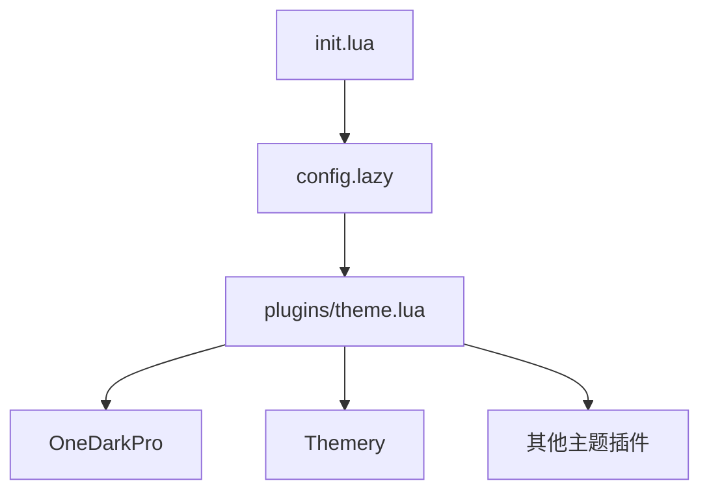
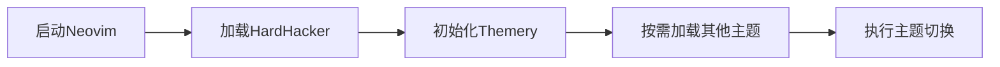
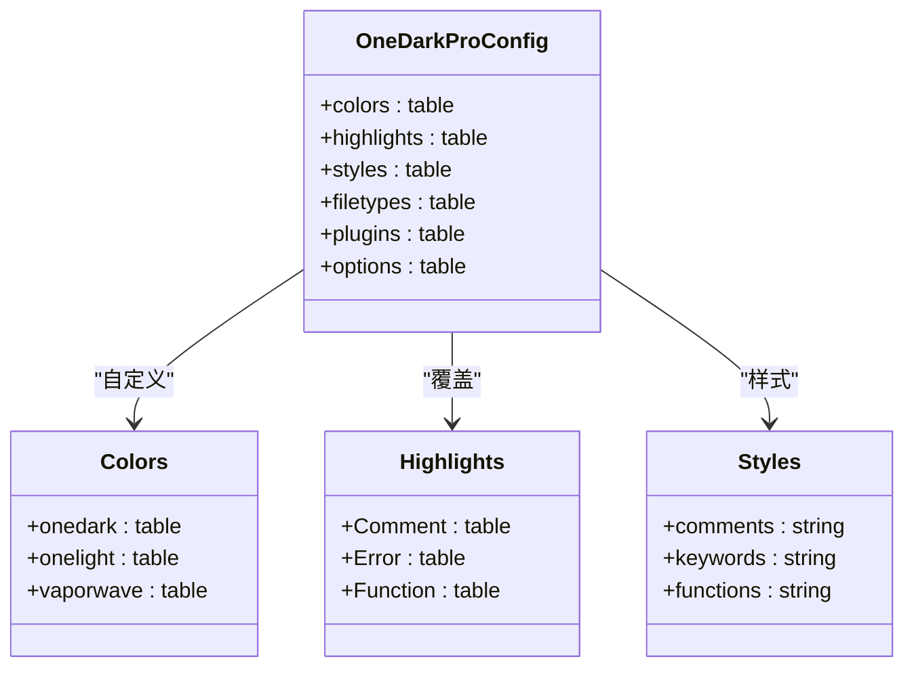
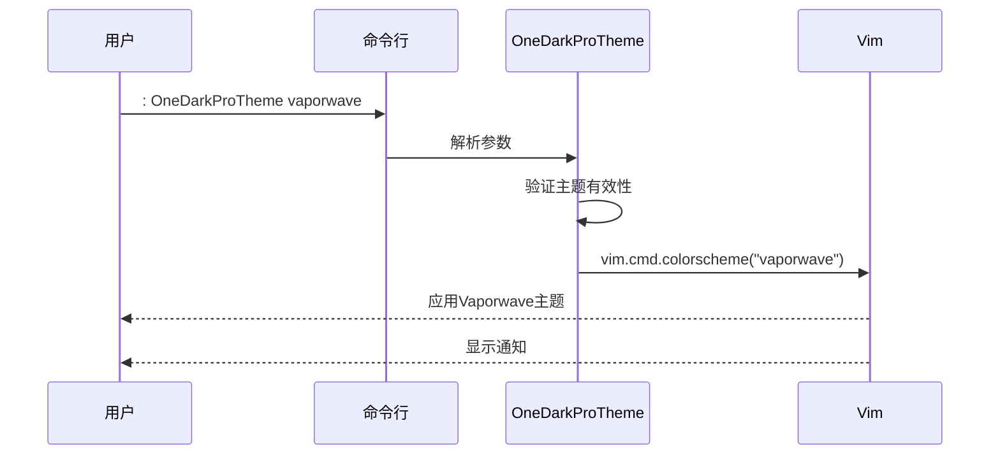
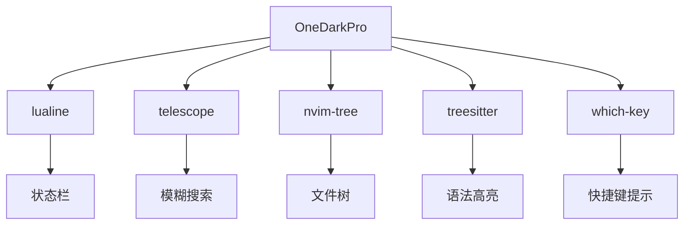

# 主题配置

<cite>
**本文档中引用的文件**  
- [theme.lua](file://lua/plugins/theme.lua)
- [core/theme.lua](file://lua/core/theme.lua)
- [init.lua](file://init.lua)
</cite>

## 目录
1. [项目结构](#项目结构)  
2. [OneDarkPro主题配置](#onedarkpro主题配置)  
3. [主题加载机制](#主题加载机制)  
4. [配色方案与语法高亮](#配色方案与语法高亮)  
5. [主题切换命令实现](#主题切换命令实现)  
6. [自定义主题扩展](#自定义主题扩展)  
7. [插件视觉兼容性](#插件视觉兼容性)  
8. [常见问题与解决方案](#常见问题与解决方案)

## 项目结构

项目采用模块化Lua配置结构，主题相关配置主要分布在`lua/plugins/theme.lua`和`lua/core/theme.lua`中。`init.lua`作为入口文件加载核心配置。



**Diagram sources**  
- [init.lua](file://init.lua#L1-L50)
- [theme.lua](file://lua/plugins/theme.lua#L0-L677)

**Section sources**  
- [init.lua](file://init.lua#L1-L50)
- [lua/plugins/theme.lua](file://lua/plugins/theme.lua#L0-L677)

## OneDarkPro主题配置

OneDarkPro通过`olimorris/onedarkpro.nvim`插件实现，支持多种变体主题，包括onedark、onelight、vaporwave等。配置中通过`setup()`函数定义颜色、高亮、代码样式、文件类型支持及插件集成。

**Section sources**  
- [theme.lua](file://lua/plugins/theme.lua#L393-L576)

## 主题加载机制

主题通过Lazy插件管理器按优先级加载。HardHacker主题作为默认主题，`lazy = false`且`priority = 1001`确保最先加载。其他主题设置`lazy = true`延迟加载，仅在调用时初始化。

Themery主题管理器负责统一管理所有主题切换逻辑，通过`themery.setup()`注册支持的主题列表，并提供图形化选择器。



**Diagram sources**  
- [theme.lua](file://lua/plugins/theme.lua#L162-L169)
- [theme.lua](file://lua/plugins/theme.lua#L578-L628)

**Section sources**  
- [theme.lua](file://lua/plugins/theme.lua#L162-L169)
- [theme.lua](file://lua/plugins/theme.lua#L578-L628)

## 配色方案与语法高亮

OneDarkPro允许通过`colors`和`highlights`字段自定义颜色和高亮组。`styles`配置项定义代码元素的显示样式，如注释斜体、关键字加粗等。`filetypes`启用对多种语言的语法高亮支持。



**Diagram sources**  
- [theme.lua](file://lua/plugins/theme.lua#L393-L500)

**Section sources**  
- [theme.lua](file://lua/plugins/theme.lua#L393-L500)

## 主题切换命令实现

通过`vim.api.nvim_create_user_command`定义`OneDarkProTheme`命令，支持参数化切换主题。命令验证输入的有效性，并调用`vim.cmd.colorscheme`应用主题，同时提供自动补全功能。

Themery通过快捷键`<leader>Tt`打开主题选择器，或使用`<leader>To`、`<leader>Tw`等快捷键直接切换到OneDark或Vaporwave主题。



**Diagram sources**  
- [theme.lua](file://lua/plugins/theme.lua#L538-L576)
- [theme.lua](file://lua/plugins/theme.lua#L656-L677)

**Section sources**  
- [theme.lua](file://lua/plugins/theme.lua#L538-L576)
- [theme.lua](file://lua/plugins/theme.lua#L656-L677)

## 自定义主题扩展

可通过修改`colors`和`highlights`表来自定义OneDarkPro主题外观。例如，修改注释颜色或关键字样式。新增主题需在Themery的`themes`列表中注册，并确保插件已安装。

```lua
-- 示例：自定义OneDarkPro注释颜色
highlights = {
  Comment = { fg = "${gray}", italic = true },
}
```

**Section sources**  
- [theme.lua](file://lua/plugins/theme.lua#L405-L420)

## 插件视觉兼容性

OneDarkPro通过`plugins`配置项集成多种插件，确保视觉一致性。已支持lualine、telescope、nvim-tree等主流插件。`integrations`选项在Catppuccin等主题中也启用telescope兼容。



**Diagram sources**  
- [theme.lua](file://lua/plugins/theme.lua#L501-L541)
- [theme.lua](file://lua/plugins/theme.lua#L105-L160)

**Section sources**  
- [theme.lua](file://lua/plugins/theme.lua#L501-L541)
- [theme.lua](file://lua/plugins/theme.lua#L105-L160)

## 常见问题与解决方案

### 终端色彩不正确
确保`terminal_colors = true`在各主题配置中启用。如GitHub主题已显式设置。

### 背景透明失效
检查`transparency`选项是否设为`false`。如需透明，应设为`true`，但当前配置中多为`false`。

### 主题切换失败
确认主题名称拼写正确，且插件已正确安装。使用`<leader>Tt`通过Themery选择器切换更可靠。

**Section sources**  
- [theme.lua](file://lua/plugins/theme.lua#L501-L541)
- [theme.lua](file://lua/plugins/theme.lua#L61-L103)
- [theme.lua](file://lua/plugins/theme.lua#L105-L160)