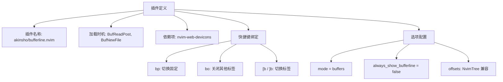

# 标签页美化

<cite>
**本文档引用的文件**
- [bufferline.lua](file://lua/plugins/bufferline.lua#L1-L76)
</cite>

## 目录
1. [简介](#简介)
2. [核心配置解析](#核心配置解析)
3. [标签页样式与视觉增强](#标签页样式与视觉增强)
4. [缓冲区排序与隐藏策略](#缓冲区排序与隐藏策略)
5. [文件图标集成（nvim-web-devicons）](#文件图标集成（nvim-web-devicons）)
6. [常用自定义选项示例](#常用自定义选项示例)
7. [常见问题及解决方案](#常见问题及解决方案)
8. [个性化调整建议](#个性化调整建议)

## 简介
`bufferline.nvim` 是 Neovim 中用于增强标签页栏视觉体验的重要插件，提供多缓冲区的直观管理界面。本文深入解析 `bufferline.lua` 配置文件中对标签页栏的视觉增强实现，涵盖标签样式、排序逻辑、非活动缓冲区处理、图标集成等核心功能，并提供实用的自定义配置建议与问题排查方案。

## 核心配置解析
当前配置采用 Lazy 插件管理器语法，定义了 `bufferline.nvim` 插件的核心行为，包括触发事件、依赖关系、快捷键绑定及选项设置。



**Diagram sources**
- [bufferline.lua](file://lua/plugins/bufferline.lua#L3-L43)

**Section sources**
- [bufferline.lua](file://lua/plugins/bufferline.lua#L1-L76)

## 标签页样式与视觉增强
通过 `opts.options` 配置项实现标签页的视觉控制：

- **模式设置**：`mode = "buffers"` 表示以缓冲区模式显示标签页，区别于 tabpages 模式。
- **标签栏显示策略**：`always_show_bufferline = false` 表示仅在存在多个缓冲区时显示标签栏，减少界面干扰。
- **侧边栏偏移**：通过 `offsets` 配置与 NvimTree 文件浏览器的集成，在标签栏左侧预留空间并显示“文件浏览器”文字，提升整体布局协调性。
- **高亮与对齐**：`highlight = "Directory"` 使用 Neovim 内置高亮组着色，`text_align = "left"` 确保文本左对齐，符合用户阅读习惯。

该配置实现了简洁、现代且与文件浏览器协同工作的标签栏视觉效果。

**Section sources**
- [bufferline.lua](file://lua/plugins/bufferline.lua#L20-L26)

## 缓冲区排序与隐藏策略
当前配置未显式定义 `sort_by` 或 `custom_sort` 字段，因此使用插件默认的排序逻辑（通常基于最近使用顺序）。非活动缓冲区的处理策略如下：

- **自动隐藏机制**：当 `always_show_bufferline = false` 且仅有一个缓冲区打开时，标签栏将自动隐藏，最大化编辑空间。
- **手动关闭功能**：通过 `<leader>bo`、`<leader>br`、`<leader>bl` 等快捷键可灵活关闭其他、右侧或左侧的缓冲区，实现快速清理。
- **固定功能**：`<leader>bp` 可将当前缓冲区设为“固定”状态，防止被 `BufferLineGroupClose ungrouped` 等命令意外关闭。

这些策略共同实现了高效、灵活的缓冲区管理。

**Section sources**
- [bufferline.lua](file://lua/plugins/bufferline.lua#L24-L25)
- [bufferline.lua](file://lua/plugins/bufferline.lua#L13-L18)

## 文件图标集成（nvim-web-devicons）
插件通过 `dependencies` 字段声明对 `nvim-tree/nvim-web-devicons` 的依赖，实现文件图标的显示：

```lua
dependencies = {
  {
    "nvim-tree/nvim-web-devicons",
    lazy = true,
  }
}
```

此配置确保：
1. `nvim-web-devicons` 插件在需要时自动加载（lazy loading）。
2. `bufferline.nvim` 能够调用 `nvim-web-devicons` 提供的 API，根据文件扩展名或名称获取并显示对应的图标。
3. 图标与标签文本一同渲染，提升视觉辨识度和用户体验。

集成过程无需额外配置，插件会自动检测并启用图标支持。

**Section sources**
- [bufferline.lua](file://lua/plugins/bufferline.lua#L6-L10)

## 常用自定义选项示例
以下为基于当前配置可扩展的常用自定义选项示例：

- **修改标签宽度**：通过 `diagnostics_indicator` 或自定义 `component` 控制最小宽度，或使用 `max_name_length` 限制长度。
- **启用/禁用动画效果**：添加 `indicator` 配置控制切换动画，例如 `indicator = { style = "none" }` 可关闭指示器动画。
- **调整标签间距**：使用 `padding` 选项设置标签间的空白，如 `padding = 1` 增加内边距。
- **自定义高亮组**：通过 `highlights` 字段覆盖默认颜色方案，与主题保持一致。
- **启用关闭按钮**：添加 `close_icon` 配置项以显示关闭图标，例如 `close_icon = "✖"`。

这些选项可添加至 `opts.options` 中以进一步个性化标签栏。

**Section sources**
- [bufferline.lua](file://lua/plugins/bufferline.lua#L20-L26)

## 常见问题及解决方案
### 标签重叠
**问题**：标签过多时文字被截断或重叠。
**方案**：
1. 启用 `show_buffer_close_icons = true` 并合理设置 `max_name_length`。
2. 使用 `truncate_names = true` 自动截断长文件名。
3. 调整 `max_prefix_length` 和 `max_suffix_length` 优化截断策略。

### 图标错位
**问题**：文件图标与文本未对齐。
**方案**：
1. 确认 `nvim-web-devicons` 已正确安装且字体支持（如 Nerd Fonts）。
2. 检查终端或 GUI 字体设置，确保等宽。
3. 在 `highlights` 中调整 `buffer_selected` 的 `padding` 或使用 `component_separators` 微调布局。

### 标签栏不显示
**问题**：即使打开多个文件，标签栏仍不出现。
**方案**：
1. 检查 `always_show_bufferline` 是否为 `true`。
2. 确认 `event` 触发器（`BufReadPost`, `BufNewFile`）是否正常触发。
3. 检查是否有其他插件（如 `lualine.nvim`）的配置冲突。

**Section sources**
- [bufferline.lua](file://lua/plugins/bufferline.lua#L3-L76)

## 个性化调整建议
为获得最佳体验，建议根据个人偏好进行以下调整：
1. **结合主题**：在 `opts.options.highlights` 中定义与当前配色方案匹配的高亮组。
2. **优化快捷键**：根据使用习惯调整 `<leader>` 绑定，或添加鼠标点击支持。
3. **性能考量**：对于超大文件，可结合 `autocmds.lua` 中的大文件优化策略，避免标签栏渲染影响性能。
4. **扩展功能**：探索 `gitsigns.nvim` 集成，显示缓冲区的 Git 状态（已配置但未在 bufferline 中启用）。

通过精细化配置，`bufferline.nvim` 可成为高效、美观的 Neovim 工作流核心组件。

**Section sources**
- [bufferline.lua](file://lua/plugins/bufferline.lua#L1-L76)
- [autocmds.lua](file://lua/config/autocmds.lua#L184-L219)