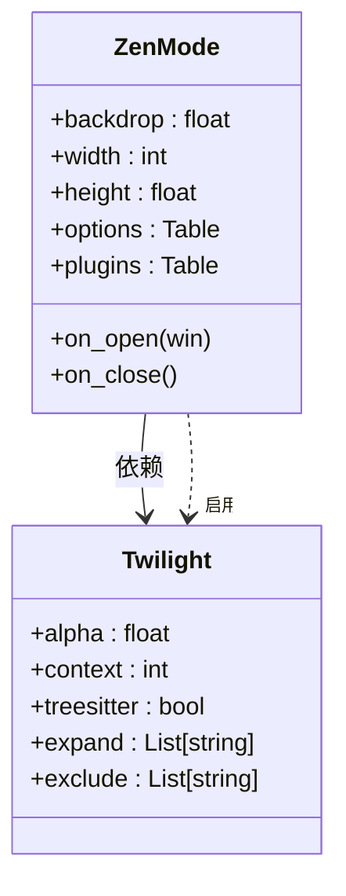

# 沉浸式写作模式

<cite>
**本文档引用文件**  
- [essential.lua](file://lua/plugins/essential.lua)
- [keymaps.lua](file://lua/config/keymaps.lua)
- [keybindings.lua](file://lua/config/keybindings.lua)
</cite>

## 目录
1. [简介](#简介)
2. [核心配置与功能实现](#核心配置与功能实现)
3. [Zen Mode 与 Twilight 协同机制](#zen-mode-与-twilight-协同机制)
4. [触发命令与状态切换逻辑](#触发命令与状态切换逻辑)
5. [个性化设置指导](#个性化设置指导)
6. [实际应用场景分析](#实际应用场景分析)
7. [常见问题与布局修复](#常见问题与布局修复)

## 简介
本系统通过集成 `Zen Mode` 和 `Twilight` 插件，构建了一套完整的沉浸式写作体验方案。该模式旨在最大限度减少视觉干扰，提升用户在 Markdown 写作、代码阅读等场景下的专注力。通过核心配置自动隐藏状态栏、边栏、行号等界面元素，并结合语法感知的文本淡化技术，实现“当前焦点突出、其余内容弱化”的视觉效果。

## 核心配置与功能实现

### Zen Mode 配置
Zen Mode 通过配置项控制 Neovim 界面元素的显示行为，其核心配置位于 `essential.lua` 文件中。主要设置包括：

- **窗口尺寸**：固定宽度为 120 列，高度为 1（即全屏高度）
- **背景透明度**：设置为 0.95，轻微模糊背景以增强聚焦感
- **界面元素隐藏**：
  - 关闭行号（`number = false`）
  - 关闭相对行号（`relativenumber = false`）
  - 隐藏光标线（`cursorline = false`）
  - 隐藏折叠栏（`foldcolumn = '0'`）
  - 隐藏标志列（`signcolumn = 'no'`）

这些配置共同作用，使编辑器进入极简状态，仅保留核心文本内容。

### Twilight 插件配置
Twilight 作为 Zen Mode 的依赖插件，负责实现非当前段落的文本淡化功能。其配置要点如下：

- **淡化透明度**：`alpha = 0.25`，即非焦点区域文本透明度为 25%
- **上下文保留行数**：`context = 10`，确保当前段落前后各保留 10 行可见
- **语法树支持**：启用 `treesitter = true`，实现基于语法结构的精准段落识别
- **扩展高亮节点**：对函数、方法、条件语句等代码块进行整体高亮处理
- **文件类型排除**：默认无排除，适用于 Markdown、代码等多种文件类型



**Diagram sources**
- [essential.lua](file://lua/plugins/essential.lua#L40-L92)

**Section sources**
- [essential.lua](file://lua/plugins/essential.lua#L40-L92)

## Zen Mode 与 Twilight 协同机制

### 协同工作流程
当用户激活 Zen Mode 时，系统自动触发 Twilight 插件，二者协同完成沉浸式环境的构建：

1. **Zen Mode 启动**：执行 `ZenMode` 命令，调整窗口布局与界面选项
2. **Twilight 自动启用**：根据 `plugins.twilight.enabled = true` 配置，自动调用 `twilight.enable()`
3. **语法分析**：利用 Treesitter 解析当前文件的语法结构，识别段落边界
4. **视觉渲染**：
   - 当前光标所在段落保持正常显示
   - 前后 `context` 行数范围内的文本适度可见
   - 超出上下文范围的文本按 `alpha` 透明度进行淡化
5. **动态更新**：光标移动时，实时重新计算焦点区域并刷新渲染效果

### 插件集成方式
在 `essential.lua` 中通过 `dependencies` 字段声明依赖关系，确保 Twilight 在 Zen Mode 加载前已就绪：

```lua
{
    'folke/zen-mode.nvim',
    cmd = 'ZenMode',
    dependencies = 'folke/twilight.nvim',
    opts = { ... }
}
```

此配置保证了插件加载顺序的正确性，避免因依赖缺失导致功能异常。

**Section sources**
- [essential.lua](file://lua/plugins/essential.lua#L40-L92)

## 触发命令与状态切换逻辑

### 命令绑定机制
尽管当前代码中未显式定义 `<leader>zz` 快捷键，但 `ZenMode` 插件默认注册了 `:ZenMode` 命令。用户可通过以下方式手动启用：

- 执行命令 `:ZenMode` 开启/关闭模式
- 或在配置中添加快捷键绑定（建议位置：`keymaps.lua`）

若需自定义快捷键，可在 `keymaps.lua` 中加入：

```lua
keymap.set("n", "<leader>zz", "<cmd>ZenMode<cr>", { desc = "切换沉浸式写作模式" })
```

### 状态切换行为
Zen Mode 采用开关式设计，具有明确的状态切换逻辑：

- **开启时**：
  - 调整窗口至指定尺寸
  - 应用 `window.options` 中的各项界面设置
  - 调用 `on_open(win)` 回调（当前为空实现）
  - 自动启用 Twilight 插件
- **关闭时**：
  - 恢复原始窗口布局
  - 还原被修改的界面选项
  - 调用 `on_close()` 回调（当前为空实现）
  - 停用 Twilight 效果

该模式支持平滑过渡，不会影响文件内容或光标位置。

**Section sources**
- [essential.lua](file://lua/plugins/essential.lua#L40-L92)
- [keymaps.lua](file://lua/config/keymaps.lua#L0-L220)

## 个性化设置指导

### 调整淡化强度
可通过修改 `twilight.opts.dimming.alpha` 值来控制非焦点文本的透明度：

- 数值越小（如 `0.1`），淡化越明显，专注度越高
- 数值越大（如 `0.4`），背景信息保留越多，适合需要参考上下文的场景

示例配置：
```lua
opts = {
    dimming = {
        alpha = 0.3  -- 提高淡化强度
    }
}
```

### 排除特定语法元素
利用 `expand` 和 `exclude` 选项可精细控制哪些语法节点应被整体视为一个段落：

- **扩展高亮**：将 `function`, `method`, `if_statement` 等加入 `expand` 列表，确保整个代码块不被分割淡化
- **排除文件类型**：在 `exclude` 中添加不需要该效果的文件类型，如 `{ 'dashboard', 'NvimTree' }`

### 结合自动滚动功能
可结合 `keymaps.lua` 中已配置的居中滚动功能，提升阅读体验：

- `<C-d>`：向下滚动半页并居中
- `<C-u>`：向上滚动半页并居中

此组合可实现“逐段阅读”效果，每滚动一次即进入新的焦点区域，Twilight 自动更新淡化范围。

**Section sources**
- [essential.lua](file://lua/plugins/essential.lua#L40-L92)

## 实际应用场景分析

### Markdown 写作场景
在撰写长篇 Markdown 文档时，该模式优势显著：

- **标题结构清晰**：结合 `render-markdown.nvim` 插件，标题字号自动放大，层级分明
- **段落聚焦**：当前编辑段落明亮突出，前后文适度可见，便于保持上下文连贯性
- **列表友好**：项目符号与缩进保留，结构不丢失

### 代码阅读场景
用于浏览复杂代码文件时：

- **函数级聚焦**：光标位于某函数内时，整个函数体保持高亮，其他函数自动淡化
- **减少干扰**：隐藏行号、git sign 等信息，避免视觉碎片分散注意力
- **逻辑块识别**：条件语句、循环块等被整体处理，增强代码块的完整性感知

### 多语言支持
得益于 Treesitter 支持，该模式适用于多种语言：

- **编程语言**：Lua, Python, JavaScript 等均可准确识别语法块
- **标记语言**：Markdown, HTML, LaTeX 等段落结构清晰
- **配置文件**：YAML, JSON 等也能按逻辑块进行分组显示

**Section sources**
- [essential.lua](file://lua/plugins/essential.lua#L40-L92)

## 常见问题与布局修复

### 布局错乱问题
部分终端或 GUI 客户端可能出现窗口尺寸异常，原因及解决方案如下：

- **问题**：`width = 120` 在小屏幕上溢出
- **解决**：改为百分比模式，如 `width = 0.8`，适配不同分辨率

- **问题**：Kitty 终端字体未正确放大
- **解决**：确认 `kitty.enabled = true` 且字体调整生效，必要时重启终端

### 插件冲突处理
与其他插件可能存在功能重叠：

- **与 `gitsigns` 冲突**：已通过 `gitsigns.enabled = false` 显式禁用，防止侧边栏重新显示
- **与 `ruler`/`showcmd` 冲突**：通过 `options` 设置确保这些状态信息被隐藏

### 性能优化建议
- **大型文件**：对于超长文件，可适当减小 `context` 值（如设为 `5`）以提升渲染效率
- **禁用动画**：如有卡顿，可在 `twilight` 配置中关闭渐变动画（若支持）

**Section sources**
- [essential.lua](file://lua/plugins/essential.lua#L40-L92)