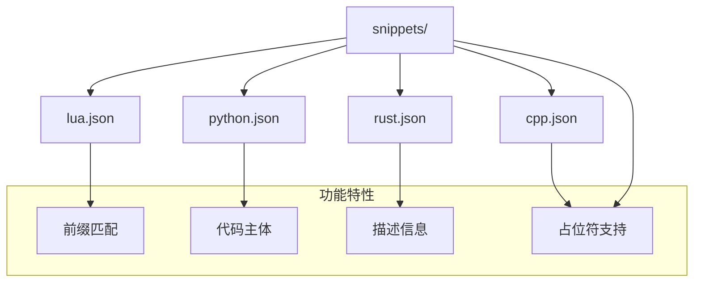
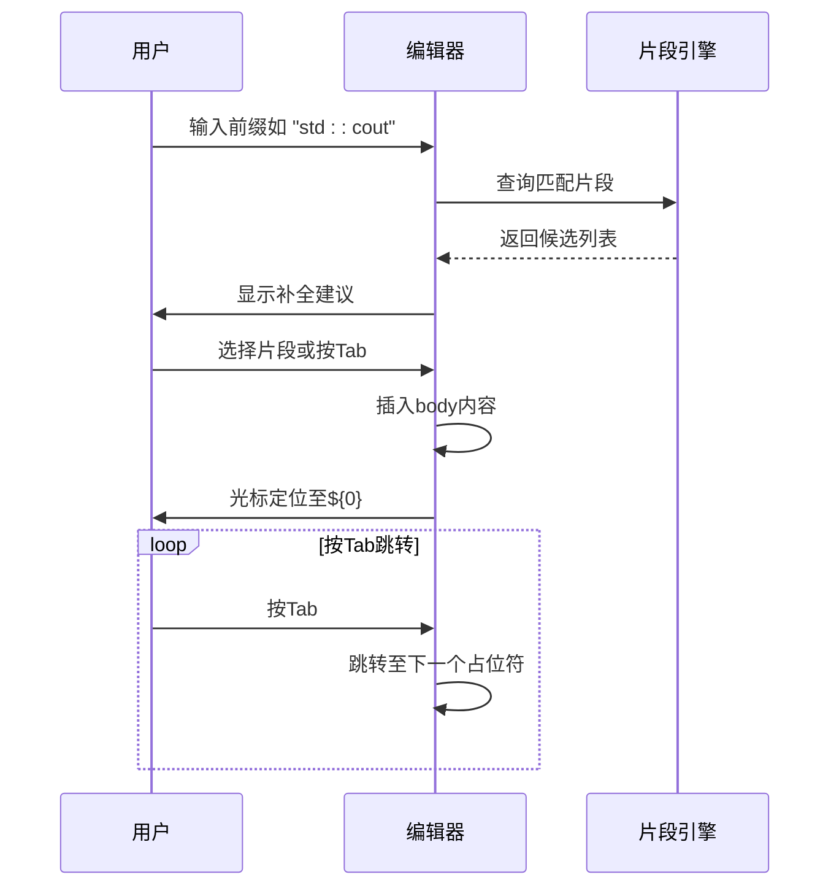

# 代码片段系统

<cite>
**本文档中引用的文件**   
- [lua.json](file://snippets/lua.json) - *在最近的提交中更新*
- [python.json](file://snippets/python.json) - *在最近的提交中更新*
- [cpp.json](file://snippets/cpp.json) - *在最近的提交中新增*
- [rust.json](file://snippets/rust.json)
- [all.lua](file://snippets/all.lua)
- [html.lua](file://snippets/html.lua)
- [dockerfile.lua](file://snippets/dockerfile.lua)
</cite>

## 更新摘要
**已做更改**   
- 更新了“片段文件组织方式”和“片段定义格式详解”部分，以反映新增的 C++ 片段支持
- 扩展了“添加新语言或修改现有片段”部分，补充了 LuaSnip 高级语法示例
- 新增了对 `.lua` 格式片段文件的支持说明
- 增强了源码追踪系统，添加了新文件引用

## 目录
1. [简介](#简介)
2. [代码片段系统结构](#代码片段系统结构)
3. [片段文件组织方式](#片段文件组织方式)
4. [片段定义格式详解](#片段定义格式详解)
5. [触发与使用代码片段](#触发与使用代码片段)
6. [占位符与变量的动态插入](#占位符与变量的动态插入)
7. [添加新语言或修改现有片段](#添加新语言或修改现有片段)
8. [结论](#结论)

## 简介
本文档全面介绍 Neovim 配置中的代码片段（snippets）系统，涵盖其结构、使用方法及自定义方式。通过分析 `snippets/` 目录下的 JSON 和 Lua 文件，说明如何为不同编程语言配置代码片段，并指导用户如何高效利用前缀、占位符和变量实现快速代码补全。

## 代码片段系统结构

该代码片段系统基于 Neovim 的 snippet 引擎（如 LuaSnip 或其他兼容工具），通过 JSON 和 Lua 文件定义可复用的代码模板。系统位于 `.config/nvim/snippets/` 目录下，每个支持的语言拥有独立的 `.json` 或 `.lua` 文件，便于维护和扩展。

系统整体结构清晰，遵循语言隔离原则，确保各语言片段互不干扰，同时便于按需加载。



**Diagram sources**
- [lua.json](file://snippets/lua.json)
- [python.json](file://snippets/python.json)
- [cpp.json](file://snippets/cpp.json)
- [rust.json](file://snippets/rust.json)

**Section sources**
- [lua.json](file://snippets/lua.json)
- [python.json](file://snippets/python.json)
- [cpp.json](file://snippets/cpp.json)
- [rust.json](file://snippets/rust.json)

## 片段文件组织方式

`snippets/` 目录下的每个 JSON 或 Lua 文件对应一种编程语言：

- `lua.json`：定义 Lua 语言的代码片段
- `python.json`：定义 Python 语言的代码片段
- `cpp.json`：定义 C++ 语言的代码片段（新增）
- `rust.json`：定义 Rust 语言的代码片段
- `html.lua`：使用 LuaSnip DSL 定义 HTML 片段（高级功能）
- `dockerfile.lua`：使用 LuaSnip DSL 定义 Dockerfile 片段

每个文件以键值对形式存储多个代码片段，键名为片段名称（如 `"main"`），值为包含 `prefix`、`body` 和 `description` 的对象。此外，`.lua` 文件支持更复杂的逻辑和动态生成能力。

**Section sources**
- [lua.json](file://snippets/lua.json)
- [python.json](file://snippets/python.json)
- [cpp.json](file://snippets/cpp.json)
- [html.lua](file://snippets/html.lua)
- [dockerfile.lua](file://snippets/dockerfile.lua)

## 片段定义格式详解

每个代码片段由三个核心字段构成：`prefix`（前缀）、`body`（主体）和 `description`（描述）。

### 字段说明

| 字段名 | 说明 |
|-------|------|
| **prefix** | 触发该片段的关键词。用户在编辑器中输入此前缀后，可通过补全提示选择并插入对应代码块。 |
| **body** | 实际插入的代码内容，支持多行字符串数组。可包含占位符 `${n}` 实现光标定位与跳转。 |
| **description** | 对该片段功能的简要描述，显示在补全菜单中，帮助用户理解用途。 |

### 示例解析

以 `cpp.json` 中的 `std::cout` 片段为例：
```json
"std::cout": {
  "prefix": "std::cout",
  "body": ["std::cout << ${0} << '\\n';"]
}
```
- 输入 `std::cout` 后按补全键可触发；
- 插入后光标位于 `${0}` 处，即输出流插入点；
- 该片段简化了 C++ 标准输出语句的编写。

类似地，`python.json` 中的 `Read Yaml` 片段用于快速生成 YAML 文件读取代码结构。

**Section sources**
- [cpp.json](file://snippets/cpp.json#L1-L20)
- [python.json](file://snippets/python.json#L1-L93)
- [lua.json](file://snippets/lua.json#L1-L6)

## 触发与使用代码片段

使用代码片段的步骤如下：

1. 在支持 snippet 补全的编辑器（如 Neovim 搭配 LuaSnip）中打开对应语言文件；
2. 输入某个片段的 `prefix`（如 `std::cout`）；
3. 补全引擎会显示匹配的片段建议；
4. 选择目标片段或直接按 `Tab` 键确认插入；
5. 插入后，光标将定位在第一个占位符 `${1}` 位置，继续按 `Tab` 可依次跳转至后续占位符。

例如，在 C++ 文件中输入 `std::cout` 并按 `Tab`，将自动展开为完整的输出语句并等待输入内容。



**Diagram sources**
- [cpp.json](file://snippets/cpp.json#L5-L10)
- [python.json](file://snippets/python.json#L5-L10)

## 占位符与变量的动态插入

片段支持动态内容插入，主要通过以下机制实现：

### 占位符（Placeholders）

格式为 `${n}`，其中 `n` 为正整数，表示跳转顺序：
- `${1}`：第一个跳转点（通常为初始光标位置）
- `${2}`：第二个跳转点
- ...
- `${0}`：最终跳转位置（通常为结束点）

例如，在 `python.json` 的 `Read Yaml` 片段中：
```json
"body": [
  "with open(${1:yamlfile}, 'r') as f:",
  "\t${2:content} = yaml.safe_load(f)",
  "\t${0}"
]
```
插入后光标位于文件名占位符处，依次按 `Tab` 可跳转到变量名和末尾。

### 变量扩展（Variables）

部分 snippet 引擎支持内置变量（如 `$TM_FILENAME`、`$CURRENT_YEAR` 等），可在 `body` 中使用，实现时间戳、文件名等动态插入。当前配置中未显式使用此类变量，但系统具备扩展能力。

**Section sources**
- [python.json](file://snippets/python.json#L10-L15)
- [cpp.json](file://snippets/cpp.json#L15-L20)

## 添加新语言或修改现有片段

### 添加新语言片段

1. 在 `snippets/` 目录下创建新的 JSON 文件，命名格式为 `<language>.json`（如 `javascript.json`）；
2. 按照标准格式定义片段对象；
3. 重启 Neovim 或重新加载 snippet 配置以生效。

示例：
```json
{
  "log": {
    "prefix": "log",
    "body": ["console.log(${1});"],
    "description": "控制台日志语句"
  }
}
```

对于更复杂的需求，可使用 LuaSnip 的 Lua DSL 创建 `.lua` 文件，例如 `html.lua` 中的 `html5` 模板。

### 修改现有片段

1. 打开对应语言的 `.json` 或 `.lua` 文件（如 `python.json`）；
2. 编辑或新增键值对；
3. 保存文件后更改立即生效（取决于插件热重载能力）。

建议在修改前备份原文件，避免语法错误导致加载失败。

**Section sources**
- [lua.json](file://snippets/lua.json)
- [python.json](file://snippets/python.json)
- [cpp.json](file://snippets/cpp.json)
- [html.lua](file://snippets/html.lua)

## 结论

本代码片段系统通过结构化的 JSON 和 Lua 文件实现了对 Lua、Python、C++ 和 Rust 等语言的高效代码补全支持。其设计简洁、易于扩展，结合前缀触发、占位符跳转和描述提示，显著提升了编码效率。用户可根据个人习惯自由添加新语言片段或定制现有模板，充分发挥 Neovim 的可配置优势。