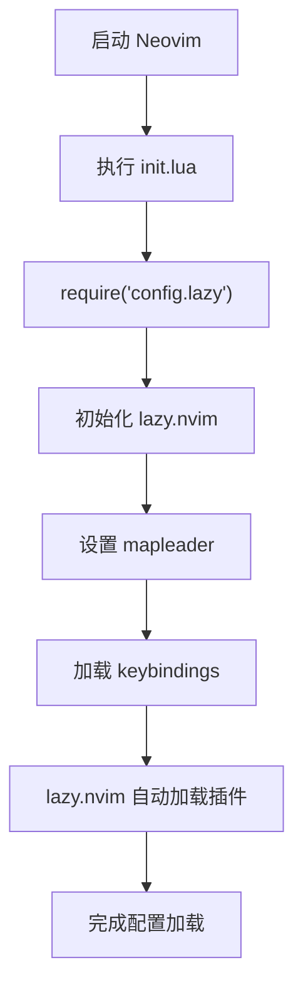
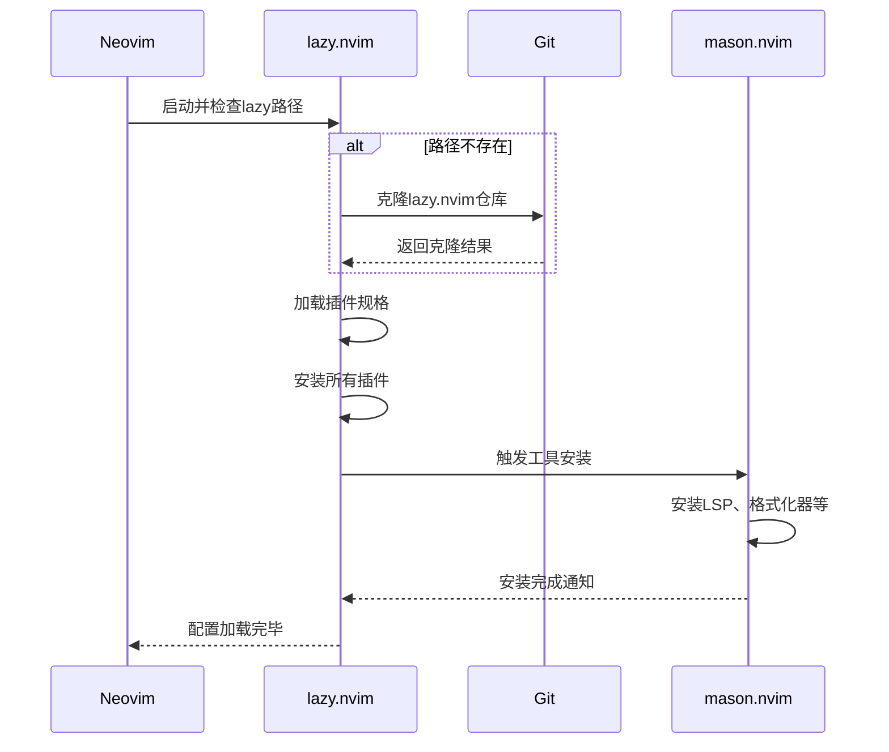

# 快速入门指南

<cite>
**本文档中引用的文件**  
- [init.lua](file://init.lua)
- [lazy.lua](file://lua/config/lazy.lua)
- [lazyvim.json](file://lazyvim.json)
- [options.lua](file://lua/config/options.lua)
- [keymaps.lua](file://lua/config/keymaps.lua)
- [lsp-config.lua](file://lua/plugins/lsp-config.lua)
- [mason.lua](file://lua/plugins/mason.lua)
- [quicker.lua](file://lua/plugins/quicker.lua)
- [essential.lua](file://lua/plugins/essential.lua)
</cite>

## 目录
1. [简介](#简介)
2. [系统前提条件](#系统前提条件)
3. [备份旧配置](#备份旧配置)
4. [配置文件放置路径](#配置文件放置路径)
5. [配置加载流程](#配置加载流程)
6. [插件自动安装机制](#插件自动安装机制)
7. [lazyvim.json的作用](#lazyvimjson的作用)
8. [常见问题排查](#常见问题排查)
9. [总结](#总结)

## 简介
本指南旨在帮助新手用户快速部署和运行此Neovim配置。通过逐步说明，您将了解如何满足系统要求、备份现有配置、正确放置文件，并理解插件管理机制。整个过程设计为在5分钟内完成，确保您可以立即开始使用功能丰富的编辑环境。

## 系统前提条件
要成功运行此Neovim配置，必须满足以下条件：
- Neovim版本至少为0.9或更高版本（推荐使用最新稳定版）
- 已安装Git用于克隆配置仓库
- Lua运行时环境已集成到Neovim中（现代Neovim发行版默认包含）

此配置依赖于`lazy.nvim`作为插件管理器，它会在首次启动时自动处理所有依赖项的安装。无需手动安装额外的Lua解释器。

**Section sources**
- [init.lua](file://init.lua#L1-L50)
- [lazy.lua](file://lua/config/lazy.lua#L1-L60)

## 备份旧配置
在部署新配置之前，强烈建议备份现有的Neovim设置以防止数据丢失。执行以下命令进行备份：

```bash
mv ~/.config/nvim ~/.config/nvim.bak
```

该操作将当前的Neovim配置目录重命名为`nvim.bak`，保留原始设置的同时为新配置腾出空间。如果需要恢复旧配置，只需将目录名改回`nvim`即可。

**Section sources**
- [init.lua](file://init.lua#L1-L3)

## 配置文件放置路径
此Neovim配置应放置在标准配置目录下，具体路径为：

```
~/.config/nvim/
```

在此目录中，核心文件结构如下：
- `init.lua`：主入口文件，启动时加载
- `lua/config/lazy.lua`：插件管理配置
- `lazyvim.json`：LazyVim兼容性元数据

确保所有文件都位于正确的子目录中，特别是`lua/`目录下的模块化Lua脚本。

**Section sources**
- [init.lua](file://init.lua#L1-L50)
- [lazy.lua](file://lua/config/lazy.lua#L1-L60)

## 配置加载流程
配置的加载由`init.lua`驱动，其执行顺序如下：

1. 首先执行`require("config.lazy")`，初始化`lazy.nvim`
2. 设置全局映射前缀（`mapleader`）为空格键
3. 加载自定义键位绑定`require("config.keybindings")`
4. 后续由`lazy.nvim`自动加载其他组件

`init.lua`通过调用`config.lazy`模块来启动插件管理系统，后者负责按需加载所有插件和配置。



**Diagram sources**
- [init.lua](file://init.lua#L1-L50)
- [lazy.lua](file://lua/config/lazy.lua#L1-L60)

**Section sources**
- [init.lua](file://init.lua#L1-L50)
- [lazy.lua](file://lua/config/lazy.lua#L1-L60)

## 插件自动安装机制
插件管理由`lazy.nvim`实现，其自动安装流程如下：

当Neovim首次启动时，`lazy.lua`会检查`~/.local/share/nvim/lazy/lazy.nvim`是否存在。若不存在，则从GitHub克隆稳定分支。随后，根据`spec`字段中定义的插件列表自动下载并安装所有依赖。

关键代码位于`lua/config/lazy.lua`，其中`{ "LazyVim/LazyVim", import = "lazyvim.plugins" }`导入基础插件集，而`{ import = "plugins" }`引入用户自定义插件。

此外，`mason.nvim`被用来统一管理LSP服务器、DAP调试器、格式化工具等开发工具的安装。这些工具在`lua/plugins/mason.lua`中声明并通过Mason自动安装。



**Diagram sources**
- [lazy.lua](file://lua/config/lazy.lua#L1-L60)
- [mason.lua](file://lua/plugins/mason.lua#L1-L169)

**Section sources**
- [lazy.lua](file://lua/config/lazy.lua#L1-L60)
- [mason.lua](file://lua/plugins/mason.lua#L1-L169)

## lazyvim.json的作用
`lazyvim.json`文件存储了与LazyVim框架相关的元数据信息，主要包括：
- `extras`：启用的额外功能模块
- `install_version` 和 `version`：安装版本标识
- `news`：更新日志记录

此文件影响配置的行为，特别是当与其他LazyVim兼容的主题或插件交互时。它确保插件加载顺序和兼容性检查符合预期。虽然不是必需的，但保留该文件有助于维持与LazyVim生态系统的同步。

**Section sources**
- [lazyvim.json](file://lazyvim.json#L1-L10)

## 常见问题排查
以下是用户可能遇到的问题及其解决方案：

### 插件未安装
**现象**：启动时提示找不到插件或功能缺失。  
**解决方法**：确保网络连接正常，首次启动需较长时间下载插件。可手动执行`:Lazy sync`强制同步。

### 键位失效
**现象**：自定义快捷键无响应。  
**解决方法**：检查`lua/config/keymaps.lua`是否被正确加载。确认`init.lua`中是否有`require("config.keybindings")`调用。

### LSP服务器无法启动
**现象**：语言服务未激活，补全或诊断不工作。  
**解决方法**：检查`mason.nvim`是否已安装对应LSP服务器。运行`:Mason`查看安装状态，并确保`lua/plugins/lsp-config.lua`正确配置。

### 配置加载错误
**现象**：启动报错Lua语法或模块找不到。  
**解决方法**：验证文件路径是否正确，尤其是`lua/`目录结构。使用`:checkhealth`检查环境健康状况。

**Section sources**
- [init.lua](file://init.lua#L1-L50)
- [lazy.lua](file://lua/config/lazy.lua#L1-L60)
- [keymaps.lua](file://lua/config/keymaps.lua#L1-L221)
- [lsp-config.lua](file://lua/plugins/lsp-config.lua#L1-L324)
- [mason.lua](file://lua/plugins/mason.lua#L1-L169)

## 总结
本指南详细介绍了如何部署和运行此Neovim配置。从系统要求到文件放置，再到插件自动安装和问题排查，每一步都经过精心设计以确保新手用户能够顺利上手。通过理解`init.lua`和`lazy.lua`的协作机制，以及`lazyvim.json`的作用，用户可以更好地掌握配置的运作原理。遵循上述步骤，您将在5分钟内拥有一个功能完备的现代化Neovim开发环境。