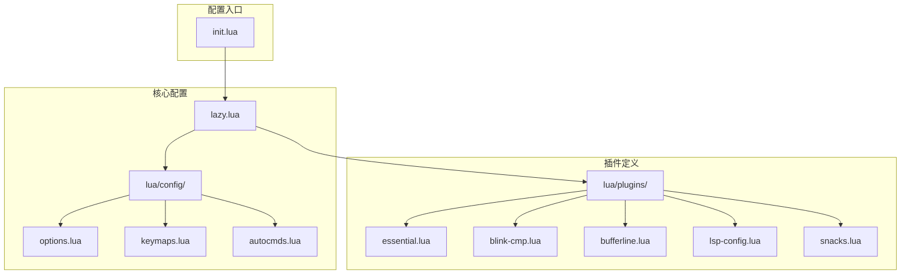
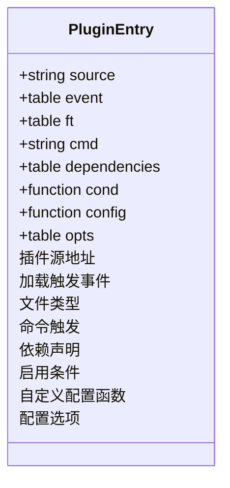
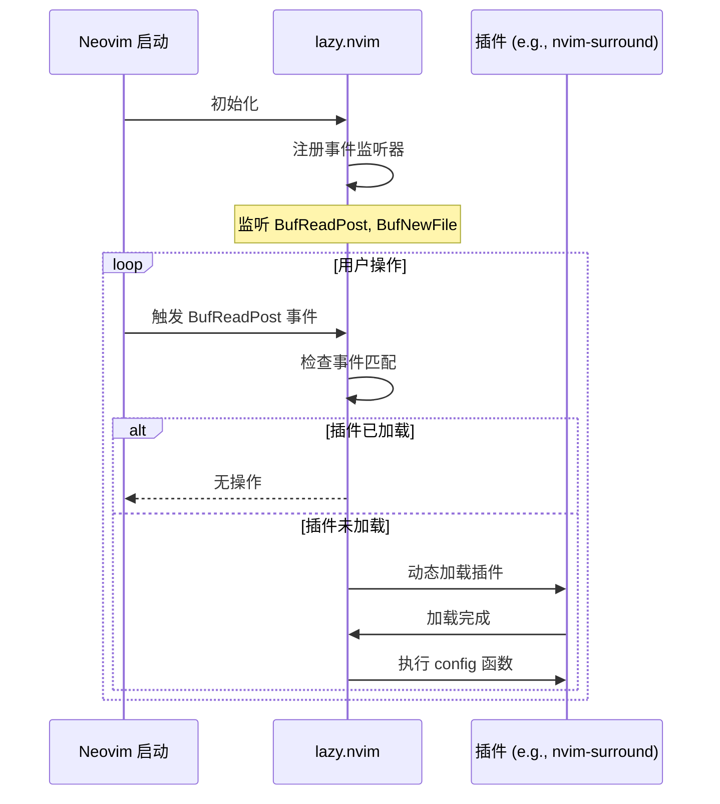
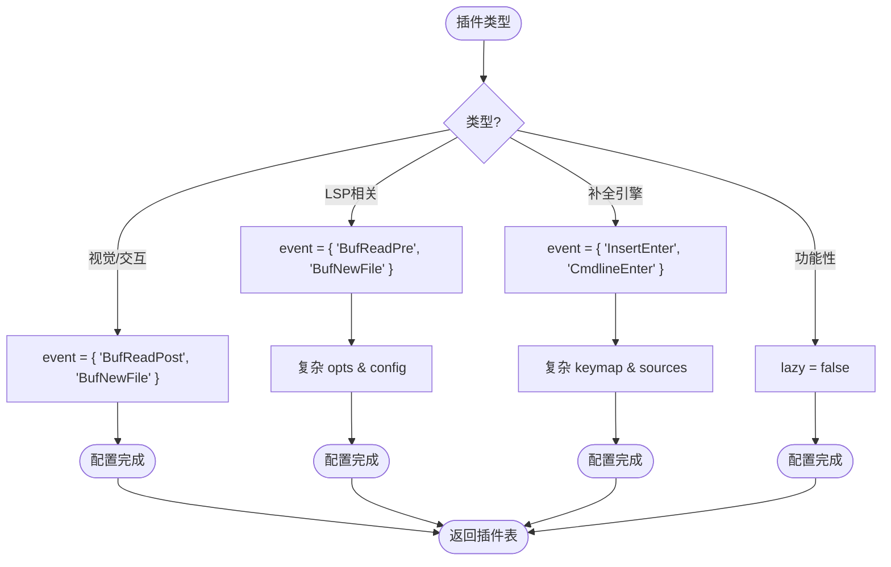

# lazy.nvim 配置详解

<cite>
**本文档中引用的文件**   
- [lazy.lua](file://lua/config/lazy.lua)
- [essential.lua](file://lua/plugins/essential.lua)
- [blink-cmp.lua](file://lua/plugins/blink-cmp.lua)
- [bufferline.lua](file://lua/plugins/bufferline.lua)
- [lsp-config.lua](file://lua/plugins/lsp-config.lua)
- [snacks.lua](file://lua/plugins/snacks.lua)
</cite>

## 目录
1. [项目结构](#项目结构)
2. [核心组件](#核心组件)
3. [插件条目声明结构](#插件条目声明结构)
4. [延迟加载机制](#延迟加载机制)
5. [常用插件配置模式](#常用插件配置模式)
6. [新插件配置编写规范](#新插件配置编写规范)
7. [插件加载顺序与依赖解析](#插件加载顺序与依赖解析)

## 项目结构

Neovim 配置采用模块化设计，核心配置文件位于 `lua/config/` 目录下，插件配置分散在 `lua/plugins/` 目录的多个文件中，通过 `lazy.lua` 统一管理。

**Diagram sources**
- [lazy.lua](file://lua/config/lazy.lua)
- [essential.lua](file://lua/plugins/essential.lua)

**Section sources**
- [lazy.lua](file://lua/config/lazy.lua)
- [essential.lua](file://lua/plugins/essential.lua)

## 核心组件

`lazy.nvim` 是本配置的核心插件管理器，负责所有插件的安装、更新、加载和依赖管理。其配置在 `lua/config/lazy.lua` 中完成，通过 `require("lazy").setup()` 函数进行初始化。

**Section sources**
- [lazy.lua](file://lua/config/lazy.lua#L23-L59)

## 插件条目声明结构

每个插件条目是一个 Lua 表，包含以下关键字段：

- **插件源地址**：字符串形式，如 `"kylechui/nvim-surround"`，指向 GitHub 仓库。
- **加载触发事件 (event)**：定义插件何时被加载，如 `event = { "BufReadPost", "BufNewFile" }`。
- **文件类型 (ft)**：当打开特定文件类型时加载，如 `ft = { 'markdown', 'md' }`。
- **命令触发 (cmd)**：当执行特定命令时加载，如 `cmd = 'ZenMode'`。
- **依赖声明 (dependencies)**：声明该插件所依赖的其他插件，如 `dependencies = {'nvim-treesitter/nvim-treesitter'}`。
- **启用条件 (cond)**：一个函数，返回布尔值决定是否加载插件，如 `enabled = function() return not vim.tbl_contains({"lua"}, vim.bo.filetype) end`。
- **自定义配置函数 (config)**：一个函数，在插件加载后执行，用于设置插件选项。

**Diagram sources**
- [essential.lua](file://lua/plugins/essential.lua#L1-L610)
- [blink-cmp.lua](file://lua/plugins/blink-cmp.lua#L1-L146)

**Section sources**
- [essential.lua](file://lua/plugins/essential.lua#L1-L610)
- [blink-cmp.lua](file://lua/plugins/blink-cmp.lua#L1-L146)

## 延迟加载机制

延迟加载是优化 Neovim 启动性能的关键。`lazy.nvim` 通过 `event` 和 `ft` 字段实现。

- **event**：监听 Neovim 内部事件。例如，`event = { "BufReadPost", "BufNewFile" }` 表示只有在读取或创建新缓冲区时才加载插件，避免了在启动时立即加载。
- **ft**：基于文件类型触发。当打开 `.md` 文件时，`ft = { 'markdown', 'md' }` 的插件才会被加载。

这种机制确保了插件仅在需要时才被激活，显著减少了启动时间和内存占用。

**Diagram sources**
- [lazy.lua](file://lua/config/lazy.lua#L23-L59)
- [bufferline.lua](file://lua/plugins/bufferline.lua#L1-L77)

**Section sources**
- [lazy.lua](file://lua/config/lazy.lua#L23-L59)
- [bufferline.lua](file://lua/plugins/bufferline.lua#L1-L77)

## 常用插件配置模式

### 1. 视觉/交互类插件 (如 bufferline.nvim)
此类插件通常在编辑文件时需要，因此使用 `event = { "BufReadPost", "BufNewFile" }` 进行延迟加载，并通过 `keys` 字段定义快捷键。

### 2. LSP 相关插件 (如 nvim-lspconfig)
LSP 插件对性能要求高，通常在 `BufReadPre` 事件时加载，以确保在文件读取前完成语言服务器的配置。同时，它们往往有复杂的 `opts` 和 `config` 函数来设置诊断、悬浮提示等功能。

### 3. 补全引擎插件 (如 blink.cmp)
补全插件需要在插入模式 (`InsertEnter`) 或命令行模式 (`CmdlineEnter`) 时激活，因此 `event` 设置为 `{ 'InsertEnter', 'CmdlineEnter' }`。其 `opts` 结构复杂，包含 `completion`, `keymap`, `sources` 等子配置。

### 4. 功能性插件 (如 snacks.nvim)
此类插件提供基础功能增强，通常设置 `lazy = false` 以确保在启动时立即加载，保证功能的即时可用性。

**Diagram sources**
- [bufferline.lua](file://lua/plugins/bufferline.lua#L1-L77)
- [lsp-config.lua](file://lua/plugins/lsp-config.lua#L1-L324)
- [blink-cmp.lua](file://lua/plugins/blink-cmp.lua#L1-L146)
- [snacks.lua](file://lua/plugins/snacks.lua#L1-L24)

**Section sources**
- [bufferline.lua](file://lua/plugins/bufferline.lua#L1-L77)
- [lsp-config.lua](file://lua/plugins/lsp-config.lua#L1-L324)
- [blink-cmp.lua](file://lua/plugins/blink-cmp.lua#L1-L146)
- [snacks.lua](file://lua/plugins/snacks.lua#L1-L24)

## 新插件配置编写规范

为新插件编写配置时，应遵循以下规范：

1.  **选择合适的文件**：将新插件添加到功能相关的 `lua/plugins/*.lua` 文件中，如 UI 相关的放入 `essential.lua`，LSP 相关的放入 `lsp-config.lua`。
2.  **定义延迟加载**：除非是核心功能插件，否则必须使用 `event` 或 `ft` 实现延迟加载。
3.  **声明依赖**：如果插件依赖其他插件，必须在 `dependencies` 字段中明确列出。
4.  **编写配置函数**：在 `config` 字段中编写 Lua 函数来调用 `require("plugin_name").setup()` 并传入配置选项。
5.  **使用 opts**：优先使用 `opts` 字段来声明配置，这与 `lazy.nvim` 的最佳实践相符。
6.  **条件启用**：对于可能冲突的插件（如在 VS Code 中），使用 `enabled` 函数进行条件判断。

**Section sources**
- [essential.lua](file://lua/plugins/essential.lua#L1-L610)
- [lsp-config.lua](file://lua/plugins/lsp-config.lua#L1-L324)

## 插件加载顺序与依赖解析

`lazy.nvim` 会自动解析 `dependencies` 字段，确保依赖项在被依赖项之前加载。加载顺序还受 `priority` 字段影响，数值越大优先级越高（如 `snacks.nvim` 设置 `priority = 1000`）。

`spec` 数组中的顺序也会影响加载。`{ "LazyVim/LazyVim", import = "lazyvim.plugins" }` 会先导入 LazyVim 的默认插件，然后 `{ import = "plugins" }` 导入用户自定义插件，允许用户覆盖默认配置。

这种机制保证了插件间的依赖关系得到正确处理，避免了因加载顺序不当导致的错误。

**Section sources**
- [lazy.lua](file://lua/config/lazy.lua#L23-L59)
- [snacks.lua](file://lua/plugins/snacks.lua#L1-L24)