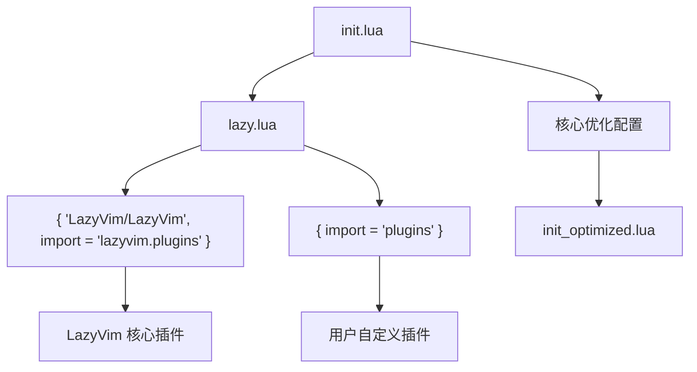
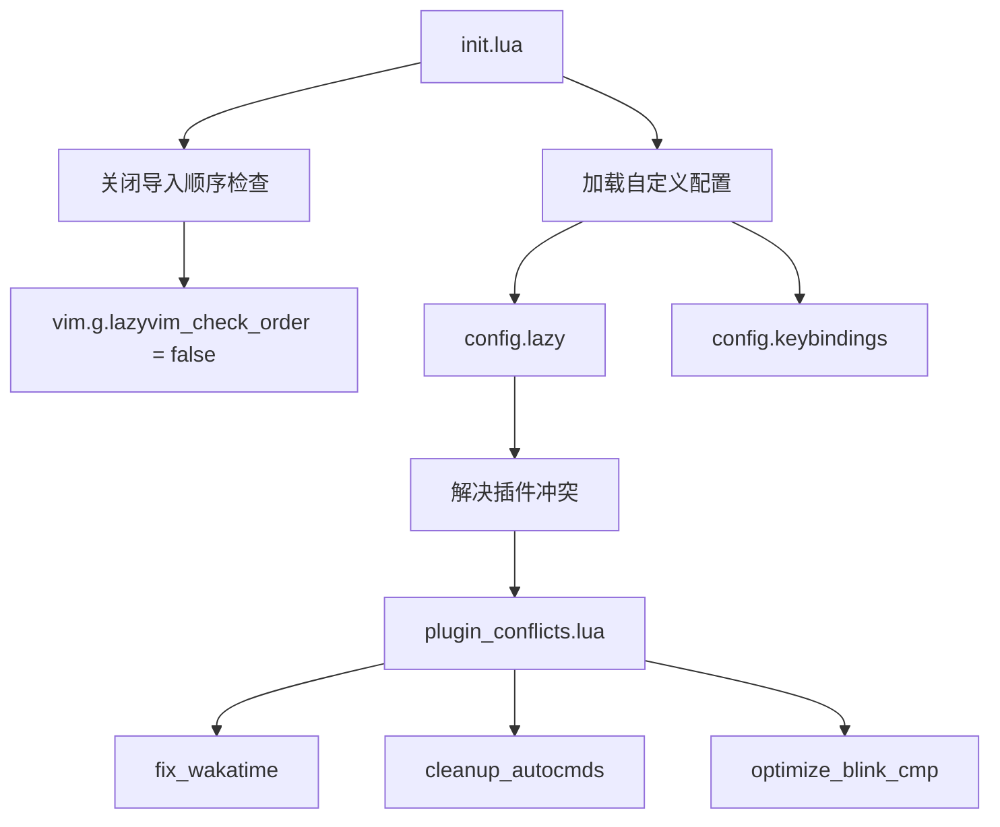

# 与 LazyVim 的集成与兼容

<cite>
**本文档引用的文件**  
- [lazyvim.json](file://lazyvim.json)
- [init.lua](file://init.lua)
- [lua/config/lazy.lua](file://lua/config/lazy.lua)
- [lua/plugins/essential.lua](file://lua/plugins/essential.lua)
- [lua/core/init_optimized.lua](file://lua/core/init_optimized.lua)
</cite>

## 目录
1. [简介](#简介)
2. [项目结构](#项目结构)
3. [lazyvim.json 的作用与配置机制](#lazyvimjson-的作用与配置机制)
4. [LazyVim 集成架构分析](#lazyvim-集成架构分析)
5. [插件继承与自定义策略](#插件继承与自定义策略)
6. [配置兼容性与冲突管理](#配置兼容性与冲突管理)
7. [最佳实践指导](#最佳实践指导)
8. [结论](#结论)

## 简介
本文档详细解释 `lazyvim.json` 文件在 Neovim 配置项目中的核心作用，重点阐述其如何定义与上游 LazyVim 的基础集成配置。通过分析项目结构和关键配置文件，说明该文件在插件继承、主题配置和键位映射中的角色，指导用户如何安全地扩展或覆盖默认功能，并避免更新时的配置冲突。

## 项目结构
本项目采用模块化 Lua 配置结构，遵循 LazyVim 推荐的组织方式：

```
.
├── lua
│   ├── config
│   │   ├── autocmds.lua
│   │   ├── keybindings.lua
│   │   ├── keymaps.lua
│   │   ├── lazy.lua
│   │   └── options.lua
│   ├── core
│   │   ├── init_optimized.lua
│   │   ├── plugin_conflicts.lua
│   │   ├── templates.lua
│   │   └── theme.lua
│   └── plugins
│       ├── blink-cmp.lua
│       ├── bufferline.lua
│       ├── essential.lua
│       ├── extra.lua
│       ├── kd.lua
│       ├── lsp-config.lua
│       ├── mason.lua
│       ├── quicker.lua
│       ├── recommend.lua
│       ├── snacks.lua
│       ├── theme.lua
│       └── which-key.lua
├── snippets
│   ├── lua.json
│   ├── python.json
│   └── rust.json
├── init.lua
├── lazyvim.json
└── test_optimizations.lua
```

**Diagram sources**  
- [lazyvim.json](file://lazyvim.json)
- [init.lua](file://init.lua)

**Section sources**  
- [lazyvim.json](file://lazyvim.json)
- [init.lua](file://init.lua)

## lazyvim.json 的作用与配置机制

`lazyvim.json` 是项目与上游 LazyVim 框架集成的核心配置文件，其主要作用是声明项目所基于的 LazyVim 版本和扩展配置。该文件不直接定义功能，而是作为版本管理和集成锚点。

当前配置内容如下：
```json
{
  "extras": [],
  "install_version": 8,
  "news": {
    "NEWS.md": "11866"
  },
  "version": 8
}
```

此配置表明：
- **版本锁定**：项目基于 LazyVim 的第 8 版本构建
- **无额外扩展**：未启用 LazyVim 提供的额外功能包（extras）
- **更新追踪**：记录了 NEWS.md 的版本哈希，便于更新时对比变更

该文件由 Lazy.nvim 在初始化时读取，用于确保插件安装和配置加载的一致性。

**Section sources**  
- [lazyvim.json](file://lazyvim.json)

## LazyVim 集成架构分析

项目通过 `init.lua` 和 `lua/config/lazy.lua` 实现与 LazyVim 的深度集成，形成分层配置体系。



**Diagram sources**  
- [init.lua](file://init.lua)
- [lua/config/lazy.lua](file://lua/config/lazy.lua)
- [lua/core/init_optimized.lua](file://lua/core/init_optimized.lua)

**Section sources**  
- [init.lua](file://init.lua)
- [lua/config/lazy.lua](file://lua/config/lazy.lua)

## 插件继承与自定义策略

项目通过 `lazy.lua` 中的 `import` 机制实现插件继承与扩展：

```lua
require("lazy").setup({
  spec = {
    { "LazyVim/LazyVim", import = "lazyvim.plugins" },
    { import = "plugins" },
  }
})
```

这种设计实现了：
1. **基础继承**：自动加载 LazyVim 定义的所有默认插件
2. **安全扩展**：在 `lua/plugins/` 目录下添加自定义插件，不会影响上游配置
3. **优先级控制**：自定义插件在 LazyVim 插件之后加载，可安全覆盖配置

例如，`essential.lua` 中定义的插件集（如 `nvim-surround`、`zen-mode.nvim`）作为补充功能无缝集成。

**Section sources**  
- [lua/config/lazy.lua](file://lua/config/lazy.lua)
- [lua/plugins/essential.lua](file://lua/plugins/essential.lua)

## 配置兼容性与冲突管理

为确保与 LazyVim 生态的兼容性，项目采用多层冲突管理策略：



关键措施包括：
- **禁用顺序检查**：通过 `vim.g.lazyvim_check_order = false` 避免加载顺序冲突
- **延迟加载**：使用 `vim.defer_fn` 确保插件冲突解决在正确时机执行
- **显式覆盖**：在 `init_optimized.lua` 中重新定义关键选项，确保最终配置一致性

**Diagram sources**  
- [init.lua](file://init.lua)
- [lua/core/init_optimized.lua](file://lua/core/init_optimized.lua)

**Section sources**  
- [init.lua](file://init.lua)
- [lua/core/init_optimized.lua](file://lua/core/init_optimized.lua)

## 最佳实践指导

### 版本管理
- **定期更新**：通过 `:Lazy sync` 同步上游变更
- **变更审查**：对比 `NEWS.md` 哈希变化，评估更新影响
- **备份配置**：更新前备份 `lazyvim.json` 和关键配置文件

### 自定义原则
- **优先继承**：尽量使用 LazyVim 提供的插件和配置
- **按需覆盖**：仅在必要时通过自定义插件覆盖默认行为
- **模块化组织**：将自定义功能按类别分文件存放于 `lua/plugins/`

### 安全覆盖策略
当需要修改 LazyVim 默认行为时，推荐以下方法：

```lua
-- 方法1：通过 opts 覆盖配置
{
  "LazyVim/LazyVim",
  import = "lazyvim.plugins",
  opts = {
    -- 覆盖特定插件配置
    defaults = { lazy = true },
  }
}

-- 方法2：在后续加载中重新定义
vim.api.nvim_create_autocmd("User", {
  pattern = "VeryLazy",
  callback = function()
    -- 在所有插件加载后执行覆盖
    require("config.keymaps")
  end,
})
```

### 避免直接复制
除非需要完全控制插件行为，否则应避免直接复制 LazyVim 的默认插件配置，以减少维护负担和冲突风险。

**Section sources**  
- [lazyvim.json](file://lazyvim.json)
- [lua/config/lazy.lua](file://lua/config/lazy.lua)
- [lua/core/init_optimized.lua](file://lua/core/init_optimized.lua)

## 结论
`lazyvim.json` 作为项目与 LazyVim 框架的集成锚点，通过版本声明和扩展管理确保了配置的稳定性和可维护性。项目采用分层架构，实现了对上游配置的安全继承和灵活扩展。通过合理的冲突管理和最佳实践，用户可以在享受 LazyVim 强大功能的同时，安全地进行个性化定制，确保配置的长期兼容性和可维护性。