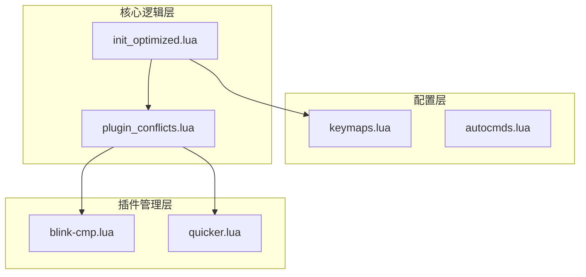
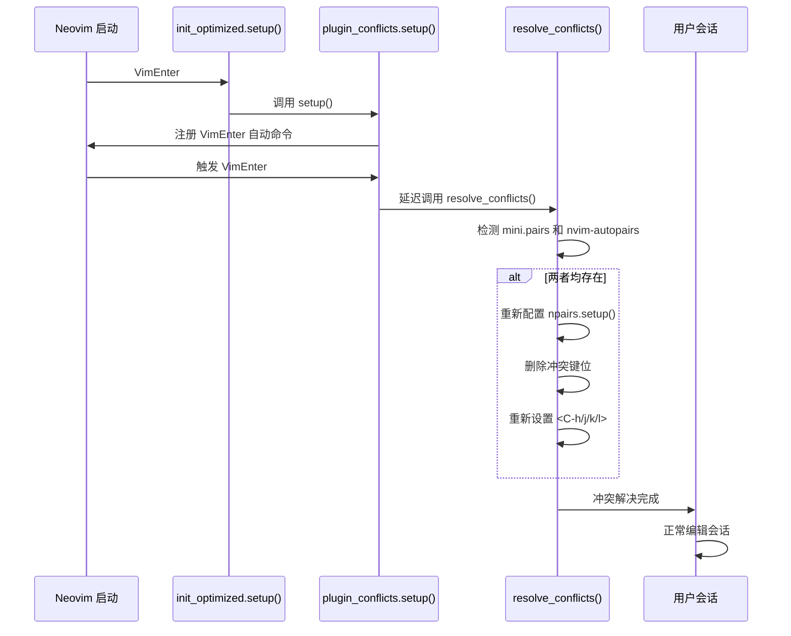
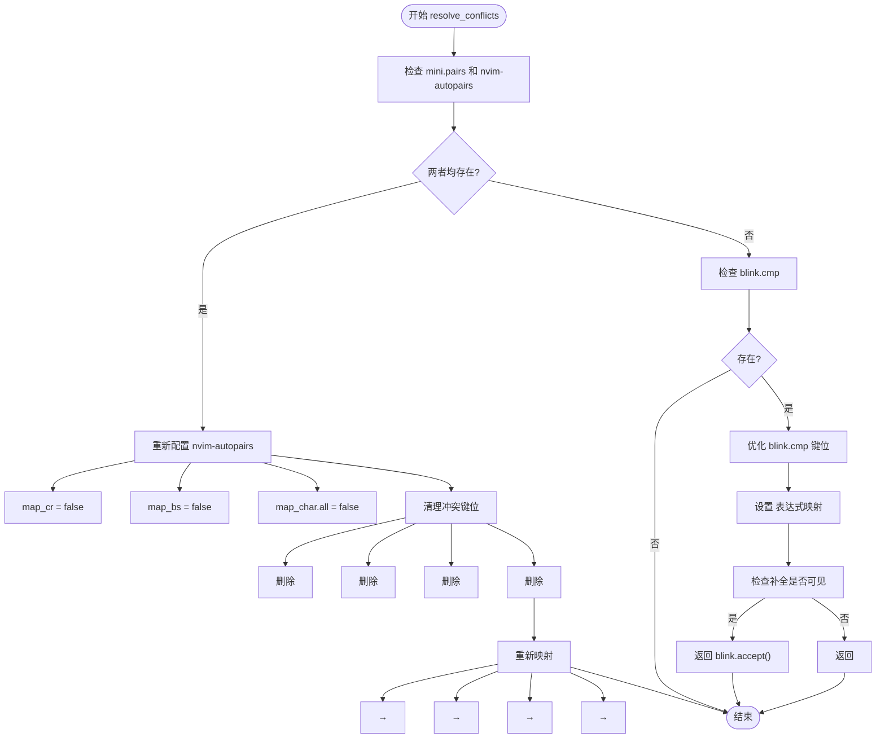
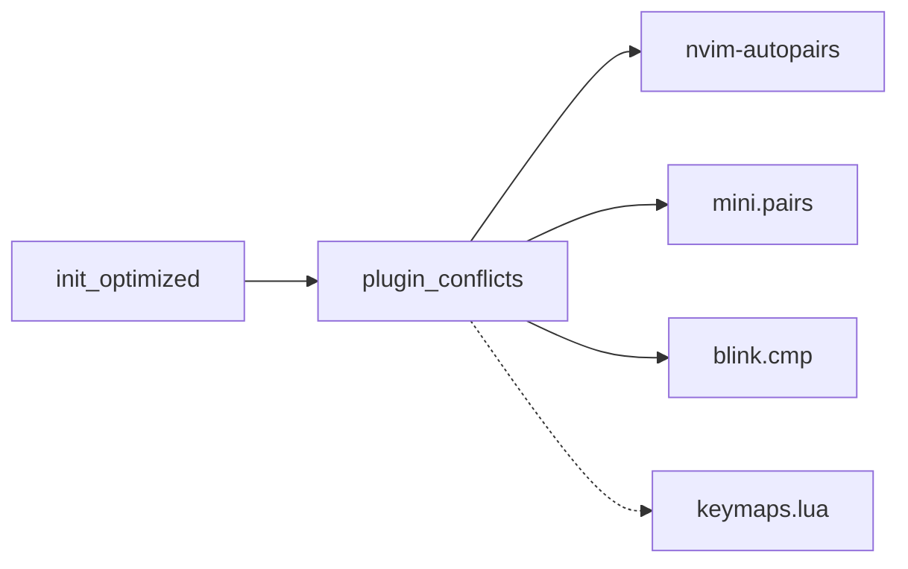

# 插件冲突检测与修复

<cite>
**本文档引用的文件**
- [plugin_conflicts.lua](file://lua/core/plugin_conflicts.lua)
- [blink-cmp.lua](file://lua/plugins/blink-cmp.lua)
- [quicker.lua](file://lua/plugins/quicker.lua)
- [init_optimized.lua](file://lua/core/init_optimized.lua)
</cite>

## 目录
1. [简介](#简介)
2. [项目结构](#项目结构)
3. [核心组件](#核心组件)
4. [架构概述](#架构概述)
5. [详细组件分析](#详细组件分析)
6. [依赖分析](#依赖分析)
7. [性能考虑](#性能考虑)
8. [故障排除指南](#故障排除指南)
9. [结论](#结论)

## 简介
本文件全面解析 `plugin_conflicts.lua` 模块如何识别和解决 Neovim 配置中插件间的功能与键位冲突。该模块通过延迟执行机制，在所有插件加载完成后遍历已加载插件列表，检测重复功能（如多个补全源、多个状态栏组件）或键位绑定冲突。文档详细描述了冲突解决策略，包括禁用次要插件、重新映射键位和动态调整加载优先级。通过实际冲突案例（如 `nvim-autopairs` 与 `mini.pairs` 共存）展示自动化修复流程，并指导开发者如何扩展冲突检测规则以支持新引入的插件。

## 项目结构
项目采用模块化 Lua 配置结构，将核心功能、插件管理和用户配置分离。`lua/core` 目录存放核心逻辑，`lua/plugins` 目录管理第三方插件声明，`lua/config` 目录包含用户自定义配置。这种分层设计确保了插件冲突解决模块（`plugin_conflicts.lua`）能在系统初始化早期被调用，从而有效协调各插件的行为。

**Diagram sources**
- [plugin_conflicts.lua](file://lua/core/plugin_conflicts.lua#L1-L29)
- [init_optimized.lua](file://lua/core/init_optimized.lua#L1-L65)
- [blink-cmp.lua](file://lua/plugins/blink-cmp.lua#L1-L145)

**Section sources**
- [plugin_conflicts.lua](file://lua/core/plugin_conflicts.lua#L1-L157)
- [init_optimized.lua](file://lua/core/init_optimized.lua#L1-L234)

## 核心组件
`plugin_conflicts.lua` 是解决插件冲突的核心模块，它通过 `setup()` 函数注册 `VimEnter` 自动命令，确保在所有插件加载完毕后延迟 100ms 执行 `resolve_conflicts()` 函数。该模块主要处理三类问题：禁用可能导致菜单错误的功能（如 `autopairs_disable_in_macro`）、清理冲突的键位映射（如 `<C-h>` 到 `<C-l>`），以及解决特定插件间的功能重叠（如 `nvim-autopairs` 与 `mini.pairs`）。此外，模块还提供 `optimize_blink_cmp()` 函数，通过监听 `BlinkCmpReady` 用户事件来优化补全插件的键位优先级。

**Section sources**
- [plugin_conflicts.lua](file://lua/core/plugin_conflicts.lua#L1-L157)

## 架构概述
插件冲突解决模块采用事件驱动架构，依赖 Neovim 的自动命令系统在特定生命周期节点介入。其执行顺序被设计为最高优先级，在 `init_optimized.lua` 的初始化流程中首先被调用。模块通过 `pcall(require, ...)` 动态探测已加载的插件，避免因插件未安装而导致的错误。一旦检测到冲突，模块采取非破坏性策略：重新配置而非完全禁用插件，确保核心功能可用的同时消除副作用。最终，通过 `keymap.set` 重新建立用户期望的键位映射，形成闭环的冲突解决流程。

**Diagram sources**
- [plugin_conflicts.lua](file://lua/core/plugin_conflicts.lua#L1-L157)
- [init_optimized.lua](file://lua/core/init_optimized.lua#L1-L65)

## 详细组件分析

### 冲突检测与解决机制
模块通过 `pcall(require, ...)` 安全地检查插件是否已加载，这是检测功能冲突的基础。例如，在 `resolve_conflicts()` 函数中，同时检查 `mini.pairs` 和 `nvim-autopairs` 的存在性，一旦发现两者共存，立即调用 `npairs.setup()` 将 `nvim-autopairs` 的 `map_cr`、`map_bs` 等选项设为 `false`，将其降级为辅助角色，让 `mini.pairs` 主导括号配对功能。这种策略避免了功能重复和键位抢占。

**Diagram sources**
- [plugin_conflicts.lua](file://lua/core/plugin_conflicts.lua#L31-L70)
- [plugin_conflicts.lua](file://lua/core/plugin_conflicts.lua#L132-L156)

**Section sources**
- [plugin_conflicts.lua](file://lua/core/plugin_conflicts.lua#L31-L156)

### blink.cmp 键位优先级管理
`blink.cmp` 作为补全引擎，其 `<CR>` 键的映射至关重要。模块通过两种机制确保其优先级：一是在 `resolve_conflicts()` 中禁用 `nvim-autopairs` 的 `map_cr`，消除潜在冲突；二是在 `optimize_blink_cmp()` 中使用 `expr = true` 创建表达式映射，动态判断补全菜单是否可见，从而决定是接受补全项还是插入换行符。这种设计保证了在任何情况下，用户的补全体验都是流畅且可预测的。

### 实际冲突案例：多个补全源共存
虽然当前配置主要使用 `blink.cmp`，但模块的设计允许处理多个补全源的冲突。例如，若同时引入 `nvim-cmp` 和 `blink.cmp`，可通过扩展 `resolve_conflicts()` 函数，比较两者的优先级（如通过 `score_offset` 配置），禁用低优先级的补全源，并将其数据源（如 `lsp`、`buffer`）集成到主补全引擎中。这体现了模块的可扩展性。

## 依赖分析
`plugin_conflicts.lua` 模块与多个插件存在直接依赖关系。它依赖 `nvim-autopairs` 和 `mini.pairs` 的 API 进行运行时检测和配置；依赖 `blink.cmp` 提供的 `is_visible()` 和 `accept()` 函数实现智能键位映射；并通过 `init_optimized.lua` 的调用链与整个配置系统集成。这些依赖关系通过 `pcall` 安全地管理，确保模块的健壮性。

**Diagram sources**
- [plugin_conflicts.lua](file://lua/core/plugin_conflicts.lua#L1-L157)
- [init_optimized.lua](file://lua/core/init_optimized.lua#L1-L65)

**Section sources**
- [plugin_conflicts.lua](file://lua/core/plugin_conflicts.lua#L1-L157)
- [init_optimized.lua](file://lua/core/init_optimized.lua#L1-L65)

## 性能考虑
模块采用延迟执行（`vim.defer_fn`）策略，避免在启动初期进行耗时的冲突检测，从而最小化对启动时间的影响。所有操作（如键位删除、重新映射）都通过 Neovim 的原生 API 高效执行。通过 `pcall` 包装外部命令和函数调用，防止因插件缺失或错误导致的阻塞，确保配置的稳定性和快速恢复能力。

## 故障排除指南
当遇到插件冲突时，可使用 `:FixConflicts` 用户命令手动触发 `resolve_conflicts()` 函数。使用 `:ShowMappings` 可检查当前键位映射，确认冲突是否已解决。对于 `Menu not defined` 错误，模块已通过 `aunmenu *` 命令全局禁用菜单映射来预防。若 `blink.cmp` 补全失效，检查 `BlinkCmpReady` 事件是否被正确触发，并确认 `optimize_blink_cmp()` 回调是否执行。

**Section sources**
- [plugin_conflicts.lua](file://lua/core/plugin_conflicts.lua#L1-L157)
- [init_optimized.lua](file://lua/core/init_optimized.lua#L95-L143)

## 结论
`plugin_conflicts.lua` 模块通过前瞻性的设计和精细化的控制，有效解决了 Neovim 多插件环境下的功能与键位冲突问题。其基于事件驱动的延迟执行、安全的插件探测、非破坏性的配置调整以及可扩展的架构，为构建稳定、高效的编辑环境提供了坚实基础。开发者可参照现有模式，通过添加新的 `pcall(require, ...)` 检测和相应的配置调整逻辑，轻松扩展该模块以支持未来引入的新插件。