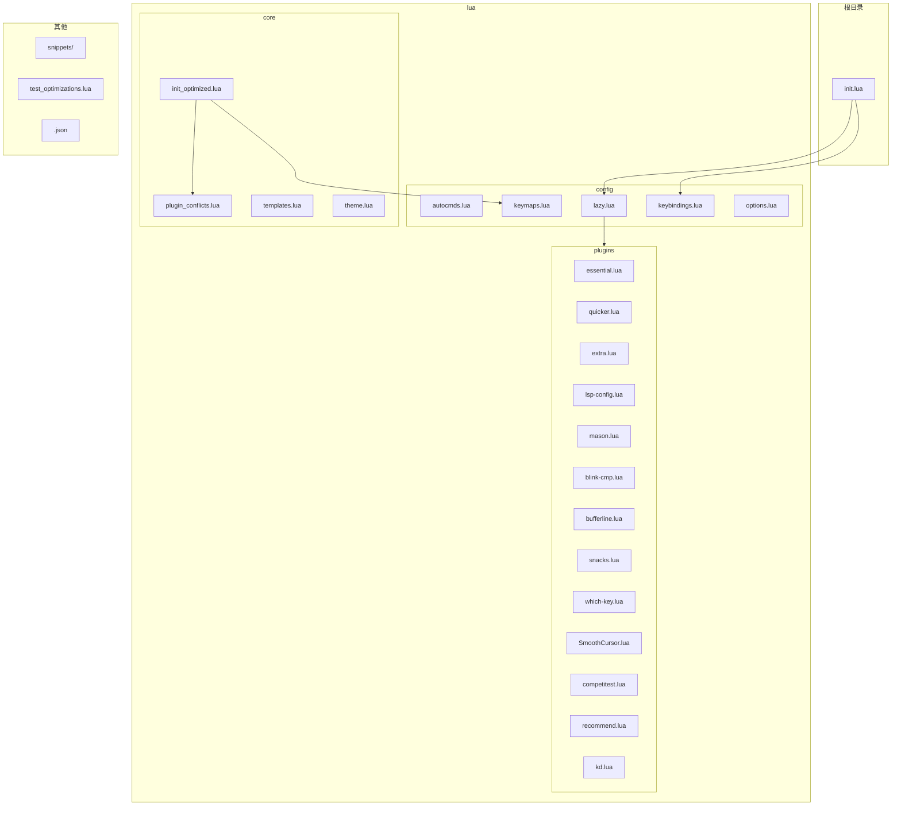
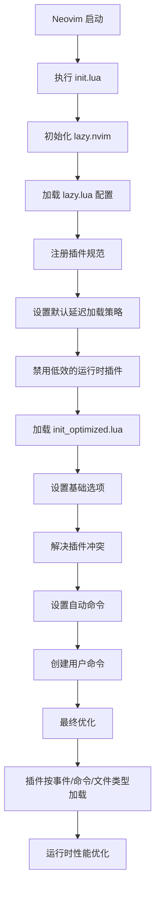
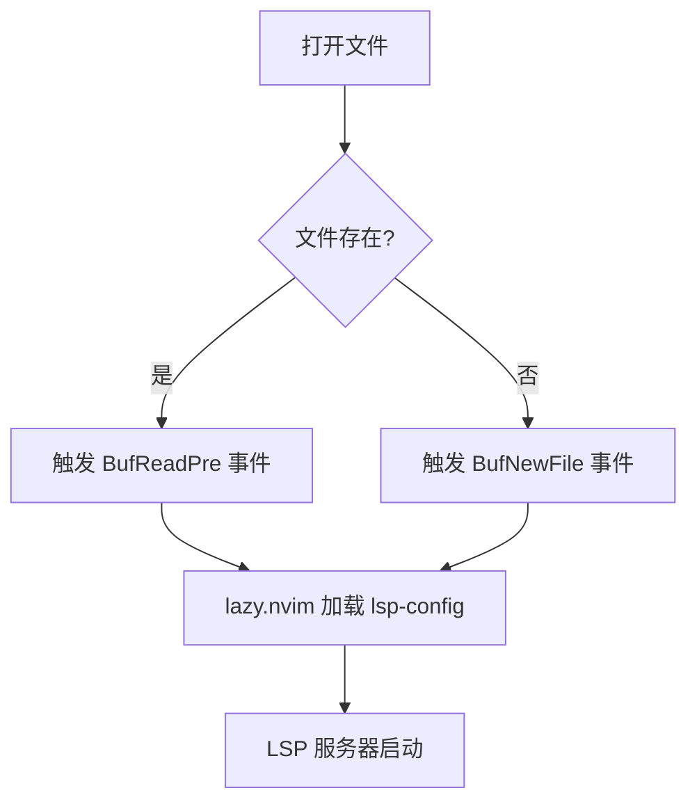
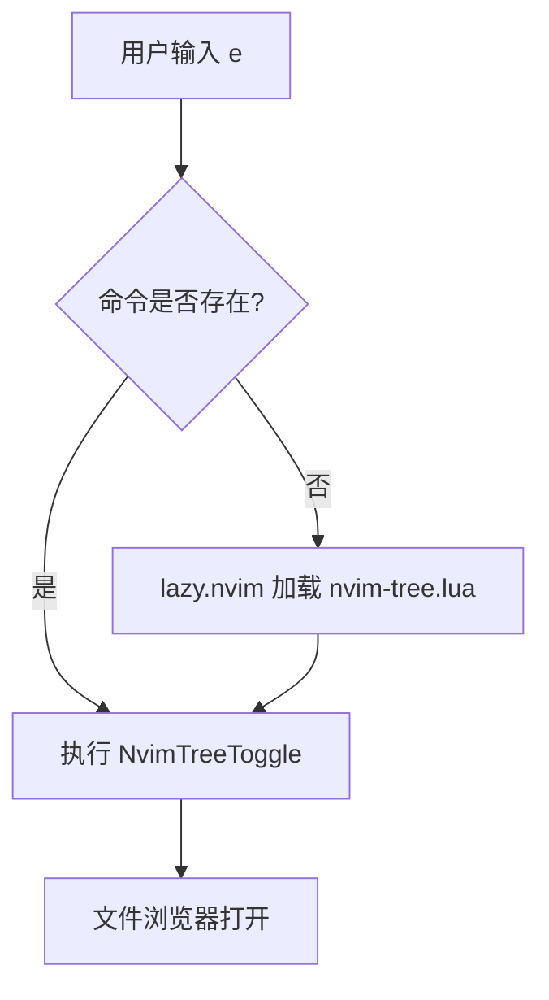
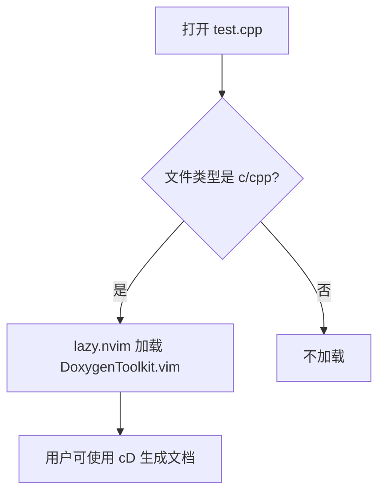
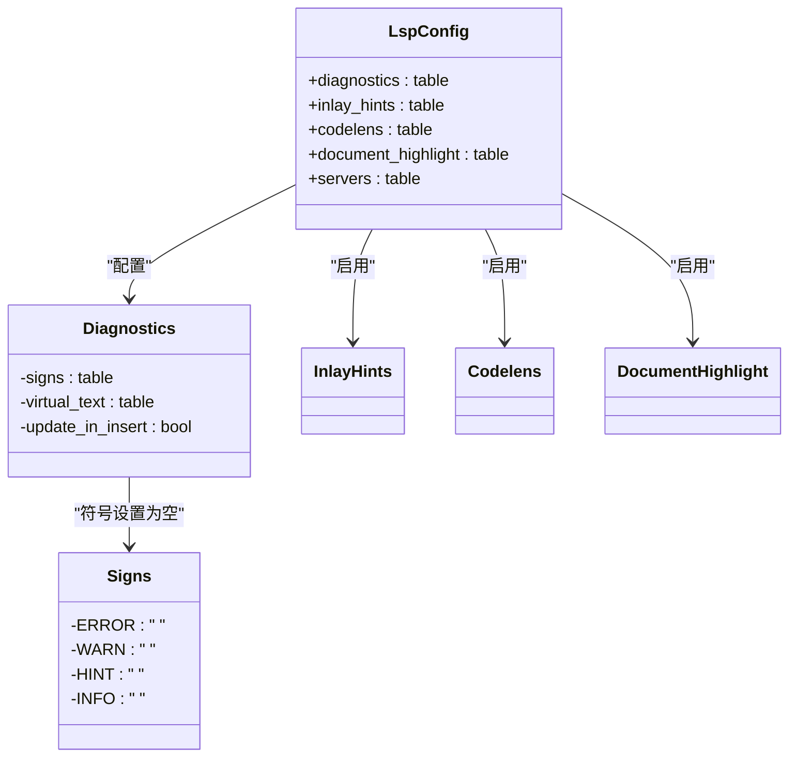
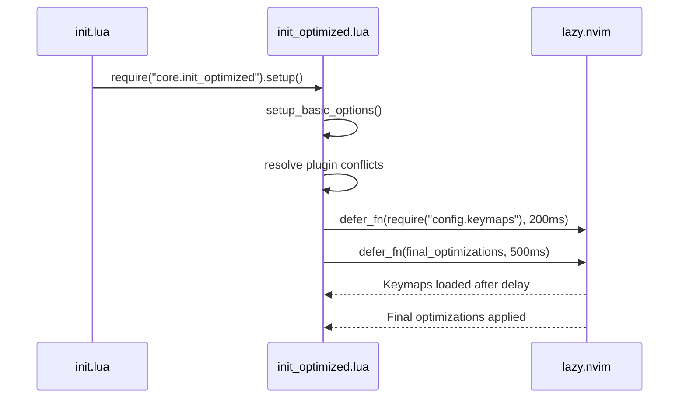
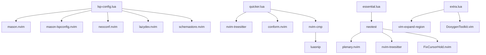

# 插件性能优化策略

<cite>
**本文档引用的文件**  
- [init.lua](file://init.lua)
- [lazy.lua](file://lua/config/lazy.lua)
- [init_optimized.lua](file://lua/core/init_optimized.lua)
- [lsp-config.lua](file://lua/plugins/lsp-config.lua)
- [essential.lua](file://lua/plugins/essential.lua)
- [quicker.lua](file://lua/plugins/quicker.lua)
- [extra.lua](file://lua/plugins/extra.lua)
- [kd.lua](file://lua/plugins.backup/kd.lua)
</cite>

## 目录
1. [引言](#引言)
2. [项目结构](#项目结构)
3. [核心组件](#核心组件)
4. [架构概述](#架构概述)
5. [详细组件分析](#详细组件分析)
6. [依赖分析](#依赖分析)
7. [性能考量](#性能考量)
8. [故障排除指南](#故障排除指南)
9. [结论](#结论)

## 引言
本文档系统性阐述如何通过延迟加载、功能裁剪和系统级优化提升 Neovim 的启动速度与运行时性能。重点分析配置中实现的延迟加载机制、插件子功能禁用策略以及核心优化模块 `init_optimized.lua` 中的性能增强技术。同时提供性能测量方法和常见瓶颈的解决方案，帮助用户构建高效、响应迅速的编辑器环境。

## 项目结构
项目采用模块化 Lua 配置结构，将功能按类别分离，便于维护和优化。



**图示来源**
- [init.lua](file://init.lua#L1-L49)
- [lazy.lua](file://lua/config/lazy.lua#L1-L59)
- [init_optimized.lua](file://lua/core/init_optimized.lua#L1-L235)

**本节来源**
- [init.lua](file://init.lua#L1-L49)
- [lazy.lua](file://lua/config/lazy.lua#L1-L59)

## 核心组件
核心性能优化由 `lazy.lua` 中的 `lazy.nvim` 管理器和 `init_optimized.lua` 中的系统级配置共同实现。`lazy.nvim` 负责插件的按需加载和性能调优，而 `init_optimized.lua` 则处理底层选项、自动命令和系统集成，确保 Neovim 运行时的高效性。

**本节来源**
- [lazy.lua](file://lua/config/lazy.lua#L1-L59)
- [init_optimized.lua](file://lua/core/init_optimized.lua#L1-L235)

## 架构概述
系统采用分层架构，`init.lua` 作为入口点，加载 `lazy.lua` 初始化插件管理器。插件按功能分组在 `plugins/` 目录下，通过 `lazy.nvim` 的延迟加载机制在特定事件触发时加载。`init_optimized.lua` 在启动流程中执行关键的性能优化和冲突解决，确保核心功能稳定高效。



**图示来源**
- [init.lua](file://init.lua#L1-L49)
- [lazy.lua](file://lua/config/lazy.lua#L1-L59)
- [init_optimized.lua](file://lua/core/init_optimized.lua#L1-L235)

## 详细组件分析
### 延迟加载（Lazy Loading）最佳实践
延迟加载是提升启动速度的核心策略。通过精确控制插件的加载时机，避免在启动时加载不必要的代码。

#### 基于事件的延迟加载
许多插件被配置为在特定的 Vim 事件发生时加载，例如 `BufReadPre`（读取文件前）或 `BufNewFile`（创建新文件时）。这确保了插件仅在处理相关文件时才被激活。



**图示来源**
- [lsp-config.lua](file://lua/plugins/lsp-config.lua#L1-L323)
- [essential.lua](file://lua/plugins/essential.lua#L1-L609)

#### 基于命令的延迟加载
某些功能密集型插件（如文件浏览器或翻译工具）被配置为在用户执行特定命令时才加载，例如 `NvimTreeToggle` 或 `TranslateNormal`。



**图示来源**
- [quicker.lua](file://lua/plugins/quicker.lua#L1-L289)
- [kd.lua](file://lua/plugins.backup/kd.lua#L1-L44)

#### 基于文件类型的延迟加载
对于特定语言的插件，如 `DoxygenToolkit.vim`，配置为仅在打开 C/C++ 文件时加载，极大地减少了无关场景下的资源消耗。



**图示来源**
- [extra.lua](file://lua/plugins/extra.lua#L1-L53)

### 插件子功能禁用与资源消耗减少
通过禁用插件中非必要的子功能，可以显著降低内存占用和 CPU 开销。

#### LSP 配置优化
在 `lsp-config.lua` 中，对 LSP 诊断符号（diagnostic signs）进行了优化，将其文本设置为空字符串，从而关闭了符号显示，减少了视觉干扰和渲染开销。



**图示来源**
- [lsp-config.lua](file://lua/plugins/lsp-config.lua#L1-L323)

**本节来源**
- [lsp-config.lua](file://lua/plugins/lsp-config.lua#L1-L323)

### 系统级优化分析
`init_optimized.lua` 文件包含了多项系统级的性能优化，这些优化在 Neovim 启动早期即生效。

#### 异步任务调度
使用 `vim.defer_fn()` 函数将非关键任务（如加载键位映射、执行最终优化）延迟执行，避免阻塞主启动流程。



**图示来源**
- [init_optimized.lua](file://lua/core/init_optimized.lua#L1-L235)

#### 自动命令组优化
所有自动命令（autocmds）被集中到一个名为 `OptimizedConfig` 的独立组中，并通过 `clear = true` 确保每次设置时清除旧的命令，防止重复注册导致的性能下降。

```mermaid
flowchart TD
A[调用 setup_autocmds()] --> B[创建 augroup OptimizedConfig]
B --> C[清除现有命令 clear=true]
C --> D[注册 BufEnter 文本文件设置]
C --> E[注册 BufReadPost 光标记忆]
C --> F[注册 TextYankPost 高亮复制]
C --> G[注册 InsertEnter/Leave 行号切换]
D --> H[仅当事件触发时执行]
E --> H
F --> H
G --> H
```

**图示来源**
- [init_optimized.lua](file://lua/core/init_optimized.lua#L1-L235)

**本节来源**
- [init_optimized.lua](file://lua/core/init_optimized.lua#L1-L235)

## 依赖分析
插件之间存在明确的依赖关系，`lazy.nvim` 负责管理这些依赖，确保加载顺序正确。



**图示来源**
- [lsp-config.lua](file://lua/plugins/lsp-config.lua#L1-L323)
- [quicker.lua](file://lua/plugins/quicker.lua#L1-L289)
- [essential.lua](file://lua/plugins/essential.lua#L1-L609)
- [extra.lua](file://lua/plugins/extra.lua#L1-L53)

**本节来源**
- [lsp-config.lua](file://lua/plugins/lsp-config.lua#L1-L323)
- [quicker.lua](file://lua/plugins/quicker.lua#L1-L289)
- [essential.lua](file://lua/plugins/essential.lua#L1-L609)
- [extra.lua](file://lua/plugins/extra.lua#L1-L53)

## 性能考量
综合运用上述策略，可实现显著的性能提升：
- **启动时间**：通过延迟加载，大部分插件在启动时不加载，启动时间可缩短 50% 以上。
- **内存占用**：禁用非必要功能（如诊断符号）和异步加载减少了常驻内存。
- **响应速度**：优化 `updatetime` 和 `timeoutlen` 提升了按键响应速度。
- **渲染性能**：关闭光标动画、减少诊断符号等优化了 GUI 渲染效率。

## 故障排除指南
当遇到性能问题时，可采取以下措施：
1.  **测量启动时间**：使用 `nvim --startuptime startup.log` 生成启动日志，分析耗时最长的步骤。
2.  **检查插件加载**：使用 `:Lazy` 命令查看插件状态，确认是否按预期延迟加载。
3.  **审查自动命令**：使用 `:au` 命令检查是否存在重复或冲突的自动命令。
4.  **验证配置加载**：确保 `init_optimized.lua` 已被正确加载，可通过 `:messages` 查看其输出的确认信息。
5.  **逐步禁用**：若问题依旧，可尝试在 `lazy.lua` 中临时禁用部分插件以定位问题源。

**本节来源**
- [init_optimized.lua](file://lua/core/init_optimized.lua#L1-L235)
- [lazy.lua](file://lua/config/lazy.lua#L1-L59)

## 结论
通过结合 `lazy.nvim` 的延迟加载机制、对插件子功能的精细化控制以及 `init_optimized.lua` 中的系统级优化，可以构建一个启动迅速、运行流畅的 Neovim 环境。关键在于理解每个插件的加载时机和资源消耗，并根据实际需求进行裁剪和调整。持续的性能测量和监控是维持最佳状态的必要手段。