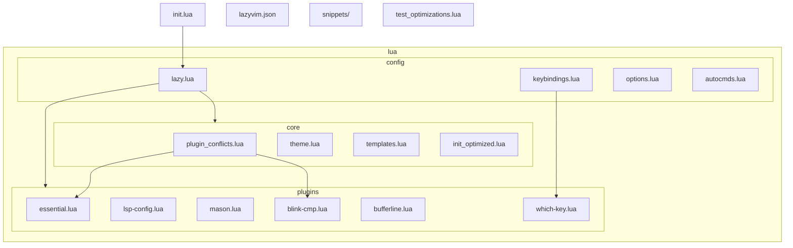
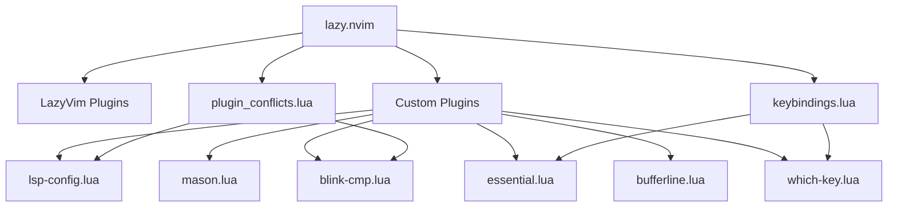
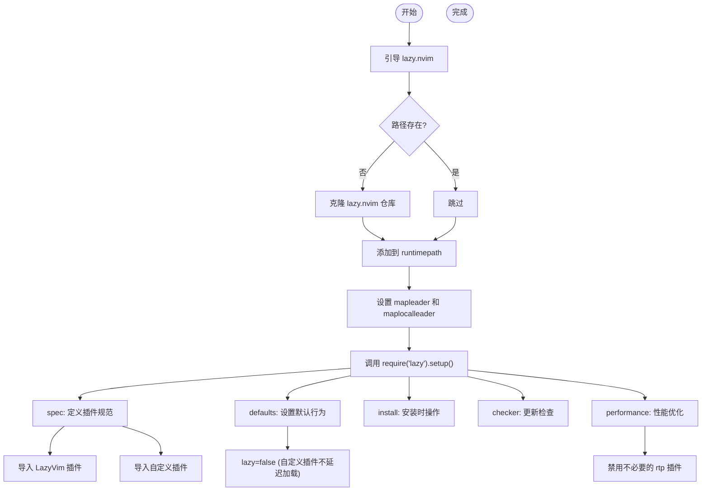
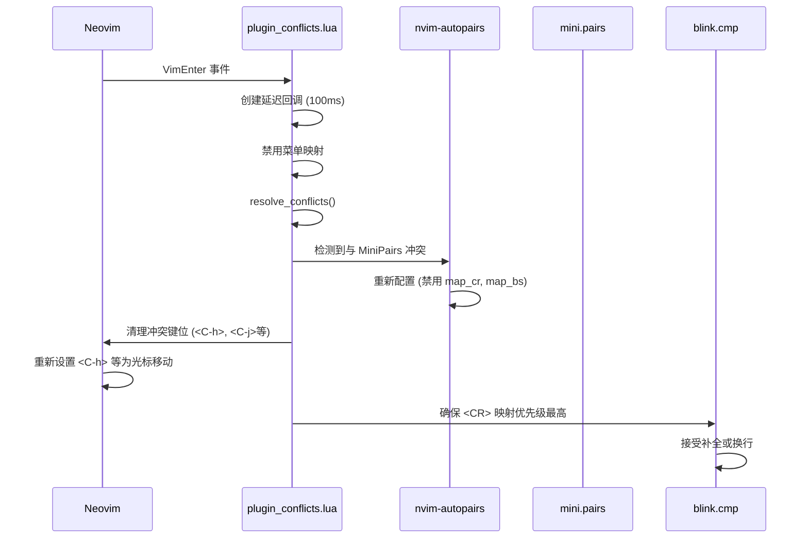
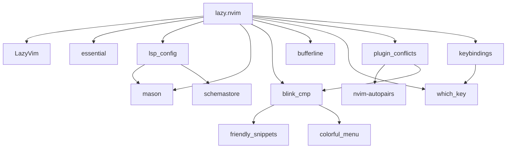

# 插件管理与优化

<cite>
**本文档引用的文件**
- [lazy.lua](file://lua/config/lazy.lua)
- [lazyvim.json](file://lazyvim.json)
- [plugin_conflicts.lua](file://lua/core/plugin_conflicts.lua)
- [essential.lua](file://lua/plugins/essential.lua)
- [lsp-config.lua](file://lua/plugins/lsp-config.lua)
- [mason.lua](file://lua/plugins/mason.lua)
- [which-key.lua](file://lua/plugins/which-key.lua)
- [keybindings.lua](file://lua/config/keybindings.lua)
- [blink-cmp.lua](file://lua/plugins/blink-cmp.lua)
- [bufferline.lua](file://lua/plugins/bufferline.lua)
</cite>

## 目录
1. [简介](#简介)
2. [项目结构](#项目结构)
3. [核心组件](#核心组件)
4. [架构概览](#架构概览)
5. [详细组件分析](#详细组件分析)
6. [依赖分析](#依赖分析)
7. [性能考虑](#性能考虑)
8. [故障排除指南](#故障排除指南)
9. [结论](#结论)

## 简介
本文档深入解析基于 `lazy.nvim` 的 Neovim 插件管理体系，涵盖插件声明格式、加载条件、依赖关系、冲突解决机制及性能优化策略。重点说明如何通过 `lazy.lua` 配置插件，利用 `lazyvim.json` 与 LazyVim 保持兼容，并通过 `plugin_conflicts.lua` 解决运行时功能与键位冲突。同时提供插件管理的最佳实践，包括安全添加/移除插件和启动性能优化技巧。

## 项目结构
项目采用模块化 Lua 配置结构，将插件配置、核心功能与用户配置分离，便于维护和扩展。

**图示来源**
- [lazy.lua](file://lua/config/lazy.lua)
- [essential.lua](file://lua/plugins/essential.lua)
- [plugin_conflicts.lua](file://lua/core/plugin_conflicts.lua)

**本节来源**
- [lazy.lua](file://lua/config/lazy.lua)
- [project_structure](file://.)

## 核心组件
系统核心由 `lazy.nvim` 驱动，通过 `lazy.lua` 初始化插件管理器，加载 `LazyVim` 基础配置，并导入自定义插件。`plugin_conflicts.lua` 负责解决插件间的运行时冲突，确保系统稳定。`keybindings.lua` 统一管理键位映射，避免冲突。各插件模块（如 `lsp-config.lua`、`mason.lua`）提供特定功能的集中配置。

**本节来源**
- [lazy.lua](file://lua/config/lazy.lua#L1-L59)
- [plugin_conflicts.lua](file://lua/core/plugin_conflicts.lua#L1-L157)
- [keybindings.lua](file://lua/config/keybindings.lua#L1-L281)

## 架构概览
系统采用分层架构，`lazy.nvim` 作为插件管理核心，协调所有插件的加载与初始化。上层为功能插件（LSP、补全、UI增强等），底层为冲突解决与键位管理模块。配置通过模块化 Lua 文件组织，实现关注点分离。

**图示来源**
- [lazy.lua](file://lua/config/lazy.lua#L1-L59)
- [plugin_conflicts.lua](file://lua/core/plugin_conflicts.lua#L1-L157)
- [keybindings.lua](file://lua/config/keybindings.lua#L1-L281)

## 详细组件分析

### lazy.lua 配置分析
`lazy.lua` 是插件系统的入口，负责引导 `lazy.nvim` 并配置其行为。

**图示来源**
- [lazy.lua](file://lua/config/lazy.lua#L1-L59)

**本节来源**
- [lazy.lua](file://lua/config/lazy.lua#L1-L59)

### 插件声明格式与加载条件
插件在 `lua/plugins/` 目录下的 Lua 文件中以表（table）的形式声明。每个插件条目包含仓库地址、版本、加载事件、依赖和配置。

- **加载条件 (event)**: 使用 `event` 字段指定插件加载时机，如 `"BufReadPost"`（读取文件后）、`"InsertEnter"`（进入插入模式）或 `"VeryLazy"`（非常延迟加载）。
- **文件类型 (ft)**: 使用 `ft` 字段指定插件仅在特定文件类型下加载。
- **命令 (cmd)**: 使用 `cmd` 字段指定插件在执行特定命令时加载。

例如，`blink-cmp.lua` 使用 `event = { 'InsertEnter', 'CmdlineEnter' }` 实现智能延迟加载，仅在需要补全功能时激活。

**本节来源**
- [essential.lua](file://lua/plugins/essential.lua#L1-L610)
- [lsp-config.lua](file://lua/plugins/lsp-config.lua#L1-L324)
- [blink-cmp.lua](file://lua/plugins/blink-cmp.lua#L1-L146)

### 依赖关系与自定义配置
插件通过 `dependencies` 字段声明其依赖，确保加载顺序正确。`opts` 字段用于传递配置选项，`config` 字段用于执行复杂的 Lua 配置代码。

例如，`lsp-config.lua` 依赖 `mason.nvim` 和 `mason-lspconfig.nvim`，并在 `opts` 中定义了详细的 LSP 服务器配置，如 `lua_ls` 和 `pyright` 的设置。

**本节来源**
- [lsp-config.lua](file://lua/plugins/lsp-config.lua#L1-L324)
- [mason.lua](file://lua/plugins/mason.lua#L1-L169)
- [blink-cmp.lua](file://lua/plugins/blink-cmp.lua#L1-L146)

### lazyvim.json 兼容性
`lazyvim.json` 文件记录了与 LazyVim 的兼容性信息，如安装版本和额外功能。通过在 `lazy.lua` 中导入 `LazyVim/LazyVim` 并使用 `import = "lazyvim.plugins"`，系统继承了 LazyVim 的稳定配置，同时允许通过自定义插件进行覆盖和扩展，实现无缝兼容。

**本节来源**
- [lazyvim.json](file://lazyvim.json#L1-L10)
- [lazy.lua](file://lua/config/lazy.lua#L25-L30)

### plugin_conflicts.lua 冲突解决机制
`plugin_conflicts.lua` 是解决插件冲突的核心模块，通过 `setup()` 函数在启动时注册自动命令和延迟回调来解决冲突。

**图示来源**
- [plugin_conflicts.lua](file://lua/core/plugin_conflicts.lua#L1-L157)

**本节来源**
- [plugin_conflicts.lua](file://lua/core/plugin_conflicts.lua#L1-L157)
- [keybindings.lua](file://lua/config/keybindings.lua#L1-L281)

### 插件性能优化技巧
系统通过多种策略优化性能，减少启动时间。

- **延迟加载**: 大部分插件通过 `event` 或 `cmd` 字段实现延迟加载，仅在需要时激活。
- **禁用不必要功能**: 在 `lazy.lua` 的 `performance.rtp.disabled_plugins` 中禁用 `gzip`, `matchit` 等内置插件。
- **减少启动项**: 将自定义插件的 `defaults.lazy` 设为 `false`，但通过精细的 `event` 配置实现实际的延迟效果。
- **并行安装**: `mason.lua` 中设置 `max_concurrent_installers = 8` 以加速工具安装。

**本节来源**
- [lazy.lua](file://lua/config/lazy.lua#L50-L58)
- [mason.lua](file://lua/plugins/mason.lua#L1-L169)
- [essential.lua](file://lua/plugins/essential.lua#L1-L610)

### 安全添加/移除插件指南
添加新插件时，应在 `lua/plugins/` 下创建新文件或在现有文件中添加条目，确保正确设置 `event` 和 `dependencies`。移除插件时，直接删除其配置条目即可。`lazy.nvim` 会自动处理依赖关系。建议通过 `:Lazy` 命令管理插件状态，避免手动操作。

**本节来源**
- [lazy.lua](file://lua/config/lazy.lua#L25-L30)
- [essential.lua](file://lua/plugins/essential.lua#L1-L610)

## 依赖分析
系统依赖关系清晰，`lazy.nvim` 是核心依赖。功能插件间存在明确的依赖链，如 `lsp-config.lua` 依赖 `mason.nvim` 来管理 LSP 服务器。`plugin_conflicts.lua` 作为协调层，依赖多个功能插件（如 `nvim-autopairs`, `blink.cmp`）来解决它们之间的冲突。

**图示来源**
- [lazy.lua](file://lua/config/lazy.lua#L1-L59)
- [lsp-config.lua](file://lua/plugins/lsp-config.lua#L1-L324)
- [mason.lua](file://lua/plugins/mason.lua#L1-L169)
- [blink-cmp.lua](file://lua/plugins/blink-cmp.lua#L1-L146)

**本节来源**
- [lazy.lua](file://lua/config/lazy.lua#L1-L59)
- [lsp-config.lua](file://lua/plugins/lsp-config.lua#L1-L324)
- [mason.lua](file://lua/plugins/mason.lua#L1-L169)

## 性能考虑
系统性能优化贯穿始终。通过 `lazy.nvim` 的延迟加载机制，结合 `event` 和 `cmd` 的精确控制，绝大多数插件不会在启动时加载。`mason.nvim` 统一管理外部工具，避免重复安装。`plugin_conflicts.lua` 的延迟执行确保了冲突解决不会阻塞启动流程。整体设计目标是实现快速启动和按需激活。

## 故障排除指南
常见问题包括插件冲突、键位失效和启动错误。

- **插件冲突**: 检查 `plugin_conflicts.lua` 是否已处理。使用 `:checkhealth` 检查插件状态。
- **键位失效**: 使用 `:map` 命令检查键位映射，使用 `:ShowLeaderKeymaps` 查看 Leader 键绑定，使用 `:CheckKeymapConflicts` 检测冲突。
- **启动错误**: 检查 `lazy.nvim` 是否正确引导，确认插件仓库地址无误。查看 `:messages` 获取错误信息。

**本节来源**
- [plugin_conflicts.lua](file://lua/core/plugin_conflicts.lua#L1-L157)
- [keybindings.lua](file://lua/config/keybindings.lua#L1-L281)

## 结论
该 Neovim 配置通过 `lazy.nvim` 实现了高效、模块化和可维护的插件管理。通过精心设计的加载策略、冲突解决机制和性能优化，系统在功能丰富的同时保持了快速响应。`lazyvim.json` 确保了与社区标准的兼容性，而模块化的 Lua 配置则提供了极大的灵活性，是现代 Neovim 配置的优秀实践。