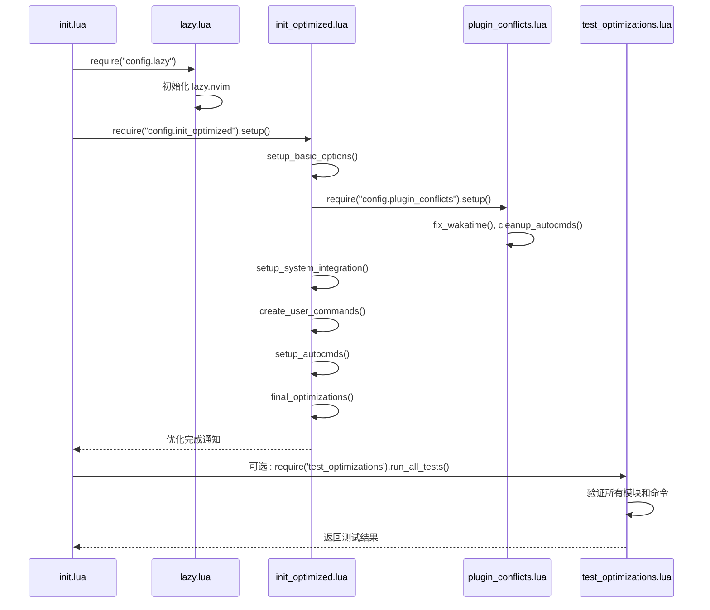
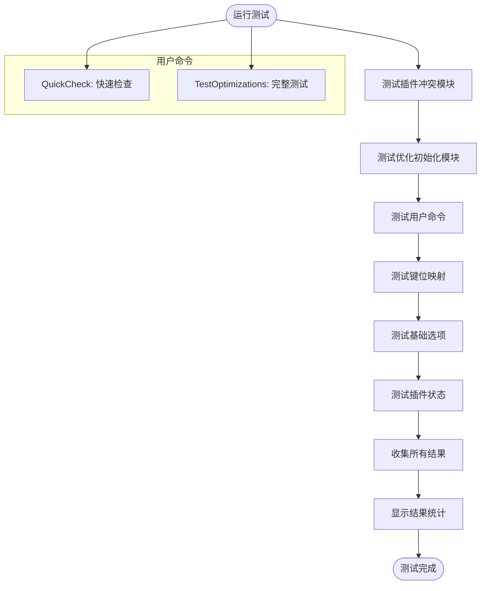
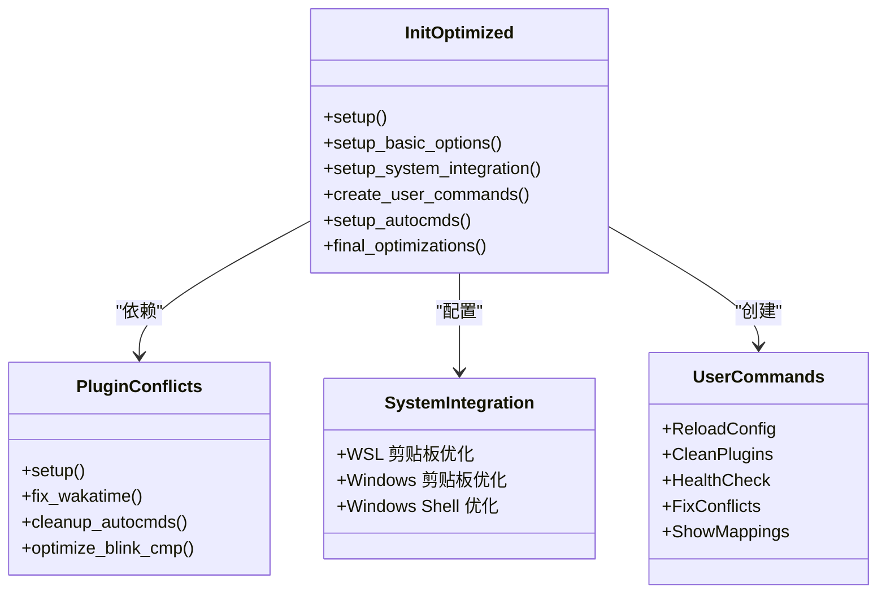
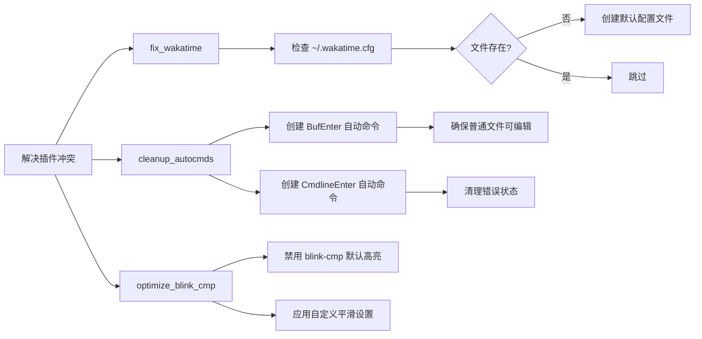
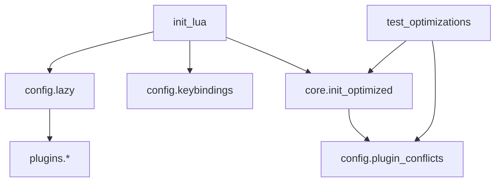

# 性能缓慢诊断

<cite>
**本文档中引用的文件**  
- [test_optimizations.lua](file://test_optimizations.lua)
- [init_optimized.lua](file://lua/core/init_optimized.lua)
- [init.lua](file://init.lua)
- [plugin_conflicts.lua](file://lua/config/plugin_conflicts.lua)
- [lazy.lua](file://lua/config/lazy.lua)
- [autocmds.lua](file://lua/config/autocmds.lua)
</cite>

## 目录
1. [简介](#简介)
2. [项目结构](#项目结构)
3. [核心组件](#核心组件)
4. [架构概述](#架构概述)
5. [详细组件分析](#详细组件分析)
6. [依赖分析](#依赖分析)
7. [性能考虑](#性能考虑)
8. [故障排除指南](#故障排除指南)
9. [结论](#结论)

## 简介
本文档旨在为 Neovim 的启动和运行性能提供全面的优化指南。通过分析 `test_optimizations.lua` 脚本和 `init_optimized.lua` 配置，指导用户如何进行基准测试、识别性能瓶颈，并实施关键优化策略。涵盖异步剪贴板设置、延迟加载、自动命令优化等技术，帮助用户显著提升编辑器响应速度和整体体验。

## 项目结构
Neovim 配置采用模块化设计，主要分为 `lua` 目录下的 `config`、`core` 和 `plugins` 三个子模块，以及根目录下的初始化文件和测试脚本。

```mermaid
graph TB
subgraph "根目录"
init_lua[init.lua]
test_lua[test_optimizations.lua]
lazy_json[lazyvim.json]
end
subgraph "lua"
config[config]
core[core]
plugins[plugins]
end
config --> autocmds[autocmds.lua]
config --> keybindings[keybindings.lua]
config --> keymaps[keymaps.lua]
config --> lazy[lazy.lua]
config --> options[options.lua]
core --> init_optimized[init_optimized.lua]
core --> plugin_conflicts[plugin_conflicts.lua]
core --> templates[templates.lua]
core --> theme[theme.lua]
plugins --> essential[essential.lua]
plugins --> recommend[recommend.lua]
plugins --> lsp[lsp-config.lua]
plugins --> mason[mason.lua]
plugins --> blink[blink-cmp.lua]
plugins --> bufferline[bufferline.lua]
plugins --> quicker[quicker.lua]
plugins --> snacks[snacks.lua]
plugins --> which_key[which-key.lua]
plugins --> kd[kd.lua]
plugins --> extra[extra.lua]
plugins --> theme[theme.lua]
plugins --> SmoothCursor[SmoothCursor.lua]
plugins --> competitest[competitest.lua]
init_lua --> config
init_lua --> core
test_lua --> core
test_lua --> config
```

**Diagram sources**
- [init.lua](file://init.lua)
- [test_optimizations.lua](file://test_optimizations.lua)

**Section sources**
- [init.lua](file://init.lua)
- [test_optimizations.lua](file://test_optimizations.lua)

## 核心组件
本配置的核心优化围绕 `init_optimized.lua` 模块展开，该模块集中管理所有性能关键的设置。通过 `test_optimizations.lua` 脚本，用户可以验证这些优化是否正确加载和生效。`init.lua` 作为入口文件，负责加载 `lazy.lua` 插件管理器配置，并间接引用优化模块。

**Section sources**
- [init_optimized.lua](file://lua/core/init_optimized.lua)
- [test_optimizations.lua](file://test_optimizations.lua)
- [init.lua](file://init.lua)

## 架构概述
整个配置的架构遵循“先基础，后插件”的原则。启动流程始于 `init.lua`，它首先初始化 `lazy.nvim` 插件管理器，然后按顺序加载配置。`init_optimized.lua` 模块在早期阶段执行，确保基础选项和系统集成（如剪贴板）在任何插件加载前就位，从而避免冲突并最大化性能。

**Diagram sources**
- [init.lua](file://init.lua#L0-L50)
- [lua/config/lazy.lua](file://lua/config/lazy.lua)
- [lua/core/init_optimized.lua](file://lua/core/init_optimized.lua#L0-L65)
- [lua/config/plugin_conflicts.lua](file://lua/config/plugin_conflicts.lua)

## 详细组件分析

### 性能基准测试分析
`test_optimizations.lua` 脚本是一个全面的健康检查工具，用于验证优化配置的完整性。

**Diagram sources**
- [test_optimizations.lua](file://test_optimizations.lua#L0-L223)

**Section sources**
- [test_optimizations.lua](file://test_optimizations.lua#L0-L223)

### 优化初始化模块分析
`init_optimized.lua` 是性能优化的核心，其 `setup()` 函数按严格的顺序执行七步操作。

**Diagram sources**
- [lua/core/init_optimized.lua](file://lua/core/init_optimized.lua#L0-L236)

**Section sources**
- [lua/core/init_optimized.lua](file://lua/core/init_optimized.lua#L0-L236)

### 插件冲突解决分析
`plugin_conflicts.lua` 模块专门处理常见的插件兼容性问题。

**Diagram sources**
- [lua/config/plugin_conflicts.lua](file://lua/config/plugin_conflicts.lua)

**Section sources**
- [lua/config/plugin_conflicts.lua](file://lua/config/plugin_conflicts.lua)

## 依赖分析
配置的依赖关系清晰，`init.lua` 作为顶层入口，直接依赖 `config.lazy` 和 `config.keybindings`。`init_optimized.lua` 作为核心优化模块，依赖 `config.plugin_conflicts` 来解决前置冲突。`test_optimizations.lua` 则依赖于 `init_optimized.lua` 和 `plugin_conflicts.lua` 的存在，以验证其功能。

**Diagram sources**
- [init.lua](file://init.lua)
- [lua/core/init_optimized.lua](file://lua/core/init_optimized.lua)
- [test_optimizations.lua](file://test_optimizations.lua)

**Section sources**
- [init.lua](file://init.lua)
- [lua/core/init_optimized.lua](file://lua/core/init_optimized.lua)
- [test_optimizations.lua](file://test_optimizations.lua)

## 性能考虑
本配置通过多种策略提升 Neovim 性能：
1.  **基础选项优化**：通过设置 `updatetime=250` 和 `timeoutlen=300` 提高响应速度。
2.  **延迟加载**：使用 `vim.defer_fn` 延迟加载 `keymaps`，避免与插件初始化冲突。
3.  **系统集成优化**：针对 WSL 和 Windows 环境定制了高效的剪贴板和 Shell 集成。
4.  **自动命令精简**：`cleanup_autocmds` 函数清理了可能导致问题的自动命令。
5.  **插件管理器优化**：在 `lazy.lua` 中禁用了 `gzip`, `matchparen`, `netrwPlugin` 等非必要插件以提升启动速度。
6.  **大文件处理**：`autocmds.lua` 中包含针对大文件（>10MB）的激进优化策略，如禁用语法高亮、撤销历史和 LSP。

## 故障排除指南
当遇到性能问题时，可按以下步骤排查：
1.  **运行快速检查**：执行 `:QuickCheck` 命令，快速验证核心模块和用户命令是否正常。
2.  **执行完整测试**：如果快速检查失败，运行 `:TestOptimizations` 获取详细的测试报告。
3.  **检查启动时间**：使用 `nvim --startuptime startup.log` 生成启动性能报告，分析耗时最长的模块。
4.  **验证插件加载**：确认 `lazy.nvim` 是否正常工作，检查 `:Lazy` 界面。
5.  **审查自动命令**：使用 `:ShowMappings` 查看键位映射，并检查 `autocmds.lua` 中的设置是否符合预期。

**Section sources**
- [test_optimizations.lua](file://test_optimizations.lua#L172-L223)
- [lua/config/autocmds.lua](file://lua/config/autocmds.lua)

## 结论
该 Neovim 配置通过系统性的优化策略，有效解决了启动慢和运行卡顿的问题。其核心在于 `init_optimized.lua` 模块对初始化流程的精细控制，以及 `test_optimizations.lua` 提供的可验证性。通过遵循本文档的指导，用户可以确保其编辑器配置处于最佳性能状态，获得流畅的编码体验。