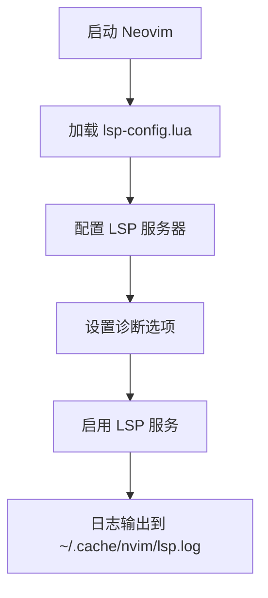

# 日志查看与调试

<cite>
**本文档引用的文件**  
- [init.lua](file://init.lua)
- [init_optimized.lua](file://lua/core/init_optimized.lua)
- [lsp-config.lua](file://lua/plugins/lsp-config.lua)
- [options.lua](file://lua/config/options.lua)
- [error.log](file://error.log)
</cite>

## 目录
1. [简介](#简介)
2. [Neovim 日志类型与路径](#neovim-日志类型与路径)
3. [LSP 日志配置与查看](#lsp-日志配置与查看)
4. [插件自定义日志](#插件自定义日志)
5. [vim.notify 日志级别控制](#vimnotify-日志级别控制)
6. [启用详细调试模式](#启用详细调试模式)
7. [关键错误信息提取与上报](#关键错误信息提取与上报)
8. [总结](#总结)

## 简介
本文档旨在指导 Neovim 用户如何启用和查看调试日志，包括 `messages` 输出、LSP 日志位置（如 `~/.cache/nvim/lsp.log`）、插件自定义日志等。通过分析 `init.lua` 和 `init_optimized.lua` 中的日志相关设置，帮助用户理解如何通过 `vim.notify` 控制日志级别，并在配置中开启详细调试模式，以便提取关键错误信息进行问题排查或上报。

**Section sources**
- [init.lua](file://init.lua#L1-L50)
- [init_optimized.lua](file://lua/core/init_optimized.lua#L1-L236)

## Neovim 日志类型与路径
Neovim 提供多种日志输出方式，主要包括：

- **`messages` 输出**：通过 `:messages` 命令查看 Neovim 运行时的输出信息，包括 `vim.notify` 发出的通知。
- **系统日志文件**：位于 `~/.cache/nvim/` 目录下，常见日志文件包括：
  - `lsp.log`：LSP 相关日志
  - `error.log`：错误日志（如本文档中提供的 `error.log`）
  - `rplugin.log`：远程插件日志
- **插件自定义日志**：部分插件会生成独立日志文件，路径通常在插件文档中说明。

**Section sources**
- [init_optimized.lua](file://lua/core/init_optimized.lua#L1-L236)
- [error.log](file://error.log#L1-L253)

## LSP 日志配置与查看
LSP（Language Server Protocol）日志是调试语言服务问题的关键。在当前配置中，LSP 服务器通过 `nvim-lspconfig` 插件进行管理。

LSP 日志默认输出到 `~/.cache/nvim/lsp.log`。用户可通过以下方式查看：

1. 手动查看日志文件：
   ```bash
   cat ~/.cache/nvim/lsp.log
   ```
2. 在 Neovim 内使用 `:checkhealth` 命令检查 LSP 健康状态。

LSP 配置中通过 `vim.diagnostic.config` 设置诊断显示行为，包括虚拟文本、符号、下划线等。



**Diagram sources**
- [lsp-config.lua](file://lua/plugins/lsp-config.lua#L1-L324)
- [autocmds.lua](file://lua/config/autocmds.lua#L143-L182)

**Section sources**
- [lsp-config.lua](file://lua/plugins/lsp-config.lua#L1-L324)
- [autocmds.lua](file://lua/config/autocmds.lua#L143-L182)

## 插件自定义日志
部分插件会生成自定义日志。例如，`blink.cmp` 插件可能存在配置冲突，其错误信息会被记录在 `error.log` 中。

在 `plugin_conflicts.lua` 中发现对 `blink.cmp` 的优化函数 `optimize_blink_cmp()` 存在重复调用 `blink.setup()` 的问题，这可能导致配置冲突并生成错误日志。

**Section sources**
- [error.log](file://error.log#L1-L253)
- [plugin_conflicts.lua](file://lua/config/plugin_conflicts.lua#L130-L140)

## vim.notify 日志级别控制
`vim.notify` 是 Neovim 中用于显示通知的核心 API，支持不同日志级别控制。在配置中广泛使用，例如：

- `vim.notify("✅ 优化配置已加载完成", vim.log.levels.INFO)`：信息级别通知
- `vim.notify("未找到游戏插件", vim.log.levels.WARN)`：警告级别通知
- `vim.notify("Invalid theme...", vim.log.levels.ERROR)`：错误级别通知

日志级别从高到低依次为：
- `vim.log.levels.ERROR`
- `vim.log.levels.WARN`
- `vim.log.levels.INFO`
- `vim.log.levels.DEBUG`

用户可通过设置 `vim.notify` 的级别来控制日志输出的详细程度。

**Section sources**
- [init_optimized.lua](file://lua/core/init_optimized.lua#L1-L236)
- [theme.lua](file://lua/plugins/theme.lua#L656-L677)
- [keybindings.lua](file://lua/config/keybindings.lua#L52-L92)

## 启用详细调试模式
要启用详细调试模式，建议采取以下步骤：

1. **清理缓存**：删除 `~/.cache/nvim/` 和 `~/.local/share/nvim/lazy/` 目录以清除旧缓存。
2. **同步插件**：使用 `:Lazy! sync` 重新安装插件。
3. **检查健康状态**：运行 `:checkhealth` 查看各组件状态。
4. **修改配置**：在 `init.lua` 或相关配置中增加调试输出，例如启用 `vim.lsp.set_log_level("debug")`。

在 `init_optimized.lua` 中，通过 `vim.defer_fn` 延迟执行某些优化设置，确保插件加载顺序正确，避免冲突。

**Section sources**
- [init_optimized.lua](file://lua/core/init_optimized.lua#L1-L236)
- [init.lua](file://init.lua#L1-L50)

## 关键错误信息提取与上报
当遇到问题时，应按以下步骤提取关键错误信息：

1. **查看 `error.log`**：如本文档提供的 `error.log`，其中详细记录了 `blink.cmp` 的配置错误。
2. **运行 `:checkhealth`**：获取系统健康状态报告。
3. **分析错误根源**：如 `plugin_conflicts.lua` 中的 `optimize_blink_cmp()` 函数不应重复调用 `blink.setup()`。
4. **提供修复方案**：移除重复的 `setup` 调用，仅处理键位映射冲突。

上报问题时应包含：
- Neovim 版本
- 操作系统信息
- 完整的 `error.log`
- `:checkhealth` 输出
- 相关配置文件片段

**Section sources**
- [error.log](file://error.log#L1-L253)
- [plugin_conflicts.lua](file://lua/config/plugin_conflicts.lua#L130-L140)

## 总结
本文档详细介绍了 Neovim 调试日志的启用方式与查看路径，涵盖 `messages` 输出、LSP 日志、插件自定义日志等内容。通过 `vim.notify` 级别控制和配置优化，用户可以有效提取关键错误信息进行问题排查。特别指出 `plugin_conflicts.lua` 中的配置冲突问题，并提供了明确的修复方案，有助于提升 Neovim 配置的稳定性和可维护性。