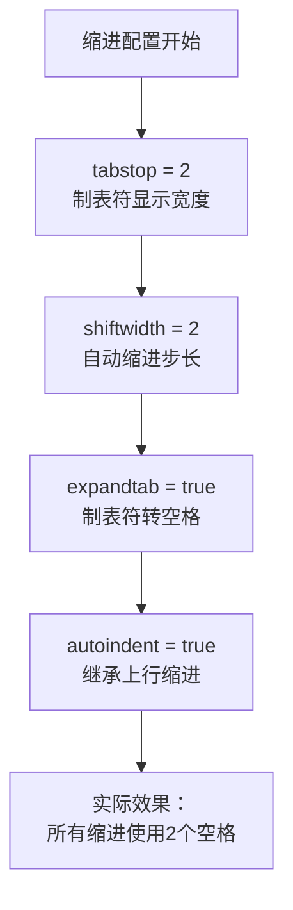
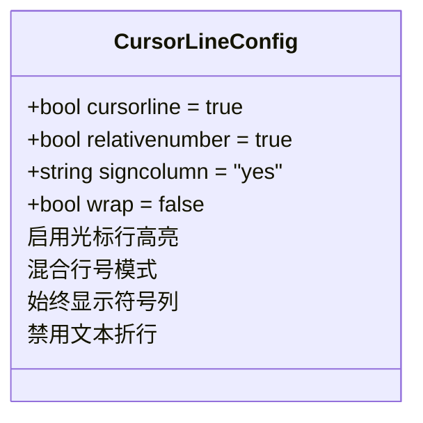
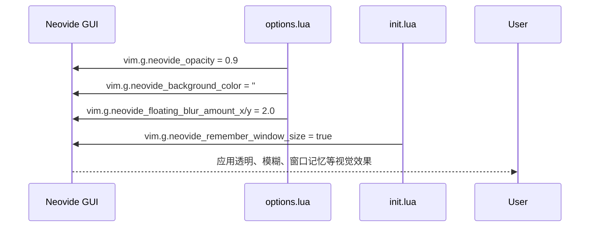
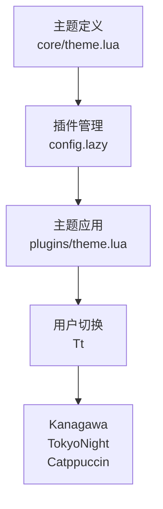
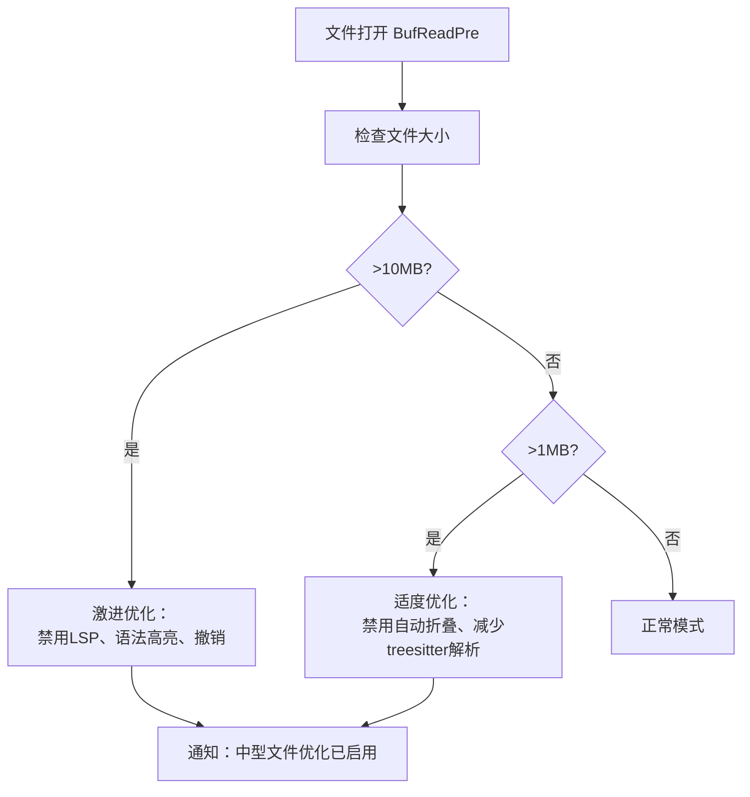

# UI与编辑选项管理

<cite>
**本文档引用的文件**
- [options.lua](file://lua/config/options.lua)
- [autocmds.lua](file://lua/config/autocmds.lua)
- [init.lua](file://init.lua)
- [theme.lua](file://lua/core/theme.lua)
- [plugins/theme.lua](file://lua/plugins/theme.lua)
</cite>

## 目录
1. [简介](#简介)
2. [核心选项配置分析](#核心选项配置分析)
3. [缩进与排版行为](#缩进与排版行为)
4. [用户界面与视觉呈现](#用户界面与视觉呈现)
5. [Neovide GUI环境专项配置](#neovide-gui环境专项配置)
6. [主题与颜色方案集成](#主题与颜色方案集成)
7. [性能优化与体验调优](#性能优化与体验调优)
8. [常见误配置与修复策略](#常见误配置与修复策略)
9. [按文件类型动态覆盖选项](#按文件类型动态覆盖选项)
10. [配置最佳实践总结](#配置最佳实践总结)

## 简介
本文档系统性地分析Neovim配置中`options.lua`文件内所有`vim.opt`配置项的作用域、取值范围及其对编辑行为和用户界面的实际影响。结合`theme.lua`中的主题初始化逻辑，深入探讨编辑器选项如何与视觉呈现（如颜色方案、透明度、字体渲染）协同工作。文档提供在终端与Neovide GUI环境下不同的选项调优策略，列举常见误配置导致的问题（如缩进混乱、性能下降）及其修复方法，并指导高级用户如何按文件类型动态覆盖全局选项。

## 核心选项配置分析

`options.lua`文件定义了Neovim的核心行为与外观设置，通过`vim.opt`接口配置全局选项。这些选项覆盖了从缩进规则、界面显示到系统集成的各个方面。配置遵循LazyVim框架的扩展模式，在保留默认行为的基础上进行个性化增强。

**Section sources**
- [options.lua](file://lua/config/options.lua#L1-L263)

## 缩进与排版行为

### 缩进配置
以下选项共同定义了代码缩进行为：



**Diagram sources**
- [options.lua](file://lua/config/options.lua#L15-L18)

- **`tabstop`**: 定义一个制表符（Tab）在屏幕上占据的空格数，设为2确保视觉宽度统一。
- **`shiftwidth`**: 控制自动缩进（如`>>`命令）的缩进量，与`tabstop`保持一致避免错位。
- **`expandtab`**: 启用后，插入的制表符将被转换为空格，保证跨平台一致性。
- **`autoindent`**: 启用后，新行将继承前一行的缩进结构。

### 协同工作方式
当四个选项协同工作时，确保无论通过手动输入Tab、使用`>>`命令还是自动补全触发的缩进，最终都表现为2个空格的统一格式。这种配置特别适用于Python、JavaScript等对缩进敏感的语言。

### 常见问题：缩进混乱
若`tabstop`与`shiftwidth`不一致，或`expandtab`未启用，可能导致：
- 混合使用空格与制表符
- 不同编辑器中显示错位
- Git提交中出现不必要的空白变更

**修复方法**：确保四个缩进相关选项统一配置，并在团队中通过`.editorconfig`文件标准化。

**Section sources**
- [options.lua](file://lua/config/options.lua#L15-L18)
- [autocmds.lua](file://lua/config/autocmds.lua#L135-L140)

## 用户界面与视觉呈现

### 行号与光标行
- **`relativenumber`**: 虽未在`options.lua`中显式设置，但LazyVim默认启用混合行号模式（当前行显示绝对行号，其他行显示相对行号），极大提升`k`/`j`移动和`{count}j`跳转效率。
- **`cursorline`**: 设为`true`高亮当前光标所在行，便于在长文件中定位。在大文件中可通过自动命令动态关闭以提升性能。



**Diagram sources**
- [options.lua](file://lua/config/options.lua#L21-L22)
- [options.lua](file://lua/config/options.lua#L25-L26)
- [options.lua](file://lua/config/options.lua#L30-L31)

### 外观关键选项
- **`signcolumn`**: 设为`"yes"`确保Git变更标记、断点、诊断符号等始终显示，避免内容跳动。
- **`wrap`**: 设为`false`禁止文本自动折行，保持代码原始结构，适合编程场景。
- **`termguicolors`**: 启用真彩色支持，确保主题颜色精确显示。

**Section sources**
- [options.lua](file://lua/config/options.lua#L21-L31)

## Neovide GUI环境专项配置

Neovide作为Neovim的GUI前端，支持丰富的视觉特效配置，这些配置通过`vim.g`全局变量设置：



**Diagram sources**
- [options.lua](file://lua/config/options.lua#L7-L13)
- [init.lua](file://init.lua#L39-L49)

### 关键GUI选项说明
- **`neovide_opacity`**: 主窗口透明度，设为0.9实现轻微透明效果。
- **`neovide_background_color`**: 背景颜色，与主题配色协调。
- **`neovide_floating_blur_amount`**: 浮动窗口模糊程度，增强层次感。
- **`neovide_cursor_animation_length`**: 光标移动动画时长，提升视觉流畅度。
- **`neovide_remember_window_size`**: 记住窗口大小，提升用户体验。

**Section sources**
- [options.lua](file://lua/config/options.lua#L7-L13)
- [init.lua](file://init.lua#L39-L49)

## 主题与颜色方案集成

### 主题定义与加载
主题通过`lua/core/theme.lua`文件声明：



**Diagram sources**
- [theme.lua](file://lua/core/theme.lua#L1-L6)
- [plugins/theme.lua](file://lua/plugins/theme.lua#L578-L658)

- **核心声明**: `core/theme.lua`通过`return{ "rebelot/kanagawa.nvim", name = "kanagawa", priority = 1000 }`声明默认主题。
- **插件配置**: `plugins/theme.lua`中通过`themery.nvim`管理多个主题，包括`kanagawa`、`tokyonight`、`catppuccin`等。
- **用户切换**: 提供`<leader>Tt`快捷键打开主题选择器，以及`<leader>Th`、`<leader>Tk`等快捷键快速切换特定主题。

### 主题与选项的交互
视觉选项与主题协同工作：
- `termguicolors = true`是真彩色主题生效的前提。
- `neovide_background_color`需与主题背景色协调，避免视觉冲突。
- `pumblend = 10`设置弹出菜单（如补全菜单）的透明度，与整体透明风格统一。

**Section sources**
- [theme.lua](file://lua/core/theme.lua#L1-L6)
- [plugins/theme.lua](file://lua/plugins/theme.lua#L578-L658)
- [options.lua](file://lua/config/options.lua#L8-L13)

## 性能优化与体验调优

### 关键性能选项
- **`updatetime`**: 设为100毫秒，控制文件自动保存、插件响应等后台操作的频率。值越小响应越快，但CPU占用越高。
- **`timeoutlen`**: 键序列超时时间（300ms），影响`<leader>`键等复合键的响应速度。
- **`ttimeoutlen`**: 特殊键（如方向键）序列超时时间（10ms），防止输入延迟。

### 大文件性能优化
通过`autocmds.lua`中的自动命令实现分级优化：



**Diagram sources**
- [autocmds.lua](file://lua/config/autocmds.lua#L184-L219)

**Section sources**
- [options.lua](file://lua/config/options.lua#L40-L44)
- [autocmds.lua](file://lua/config/autocmds.lua#L184-L219)

## 常见误配置与修复策略

### 常见问题列表
| 问题现象 | 可能原因 | 修复方法 |
|--------|--------|--------|
| 缩进混乱，空格与制表符混用 | `expandtab`未启用或`tabstop`/`shiftwidth`不一致 | 统一设置`tabstop=2`, `shiftwidth=2`, `expandtab=true` |
| 大文件卡顿 | 语法高亮、LSP、自动缩进持续运行 | 使用自动命令在大文件中禁用相关功能 |
| 主题颜色显示异常 | `termguicolors`未启用 | 设置`opt.termguicolors = true` |
| Neovide透明度无效 | `neovide_opacity`设置位置错误 | 确保在`if vim.g.neovide then`块内设置 |
| 剪贴板无法与系统交互 | `clipboard`未包含`unnamedplus` | 添加`opt.clipboard:append("unnamedplus")` |

**Section sources**
- [options.lua](file://lua/config/options.lua#L15-L18)
- [options.lua](file://lua/config/options.lua#L24-L25)
- [options.lua](file://lua/config/options.lua#L7-L13)
- [autocmds.lua](file://lua/config/autocmds.lua#L184-L219)

## 按文件类型动态覆盖选项

通过`autocmd FileType`实现文件类型特定配置：

```lua
-- 示例：在autocmds.lua中为Lua文件设置特定缩进
autocmd("FileType", {
    pattern = "lua",
    callback = function()
        vim.opt_local.expandtab = true
        vim.opt_local.tabstop = 2
        vim.opt_local.shiftwidth = 2
    end
})
```

### 动态覆盖策略
- **使用`opt_local`**: 在自动命令中使用`vim.opt_local`而非`vim.opt`，确保配置仅作用于当前缓冲区。
- **常见覆盖场景**:
  - 文本/Markdown文件：启用`wrap`和`spell`。
  - 终端缓冲区：禁用行号、折行。
  - 大文件：动态关闭`cursorline`、`syntax`等。

**Section sources**
- [autocmds.lua](file://lua/config/autocmds.lua#L135-L140)

## 配置最佳实践总结

1. **一致性优先**: 确保`tabstop`、`shiftwidth`、`expandtab`、`autoindent`协同配置，避免缩进混乱。
2. **性能感知**: 对大文件使用自动命令动态关闭非必要功能，平衡功能与性能。
3. **GUI专项优化**: 在Neovide中充分利用透明、动画等特性，提升用户体验。
4. **主题协调**: 确保`termguicolors`、`pumblend`等选项与所选主题风格一致。
5. **局部覆盖**: 使用`FileType`自动命令为不同文件类型提供最佳编辑体验。
6. **避免冲突**: 注释掉与LazyVim默认配置重复的选项，保持配置简洁。

通过遵循上述最佳实践，可构建一个既美观又高效、既稳定又灵活的Neovim编辑环境。