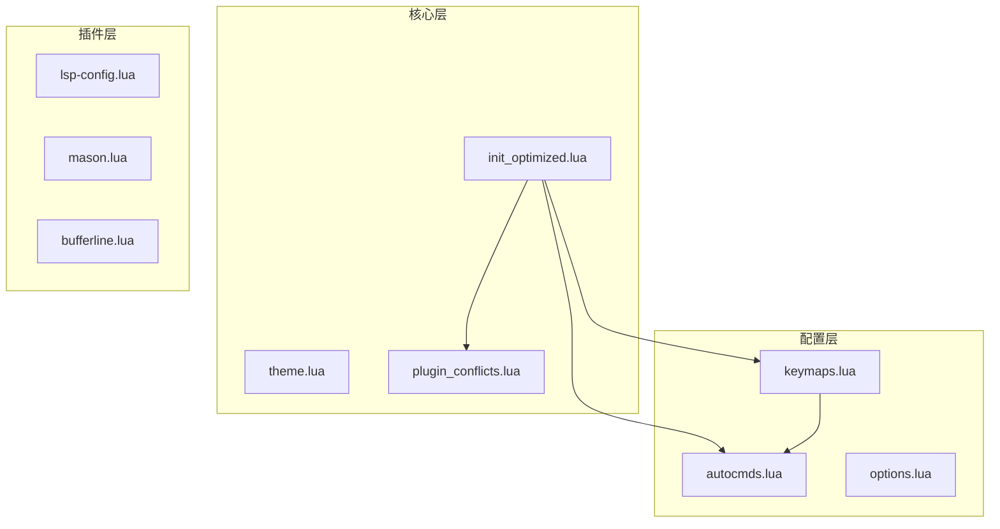
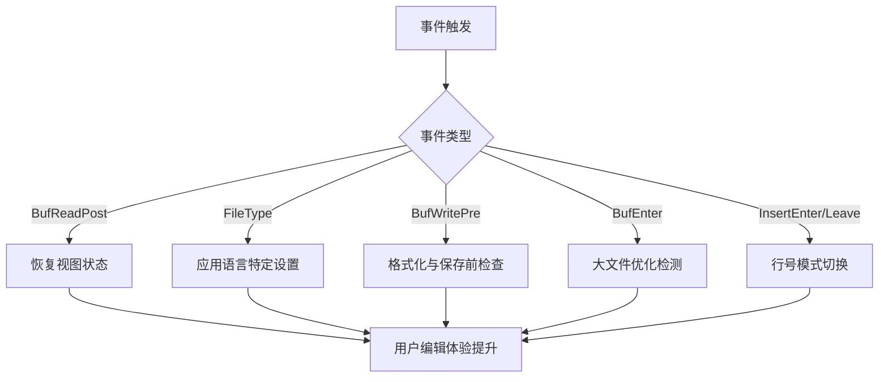
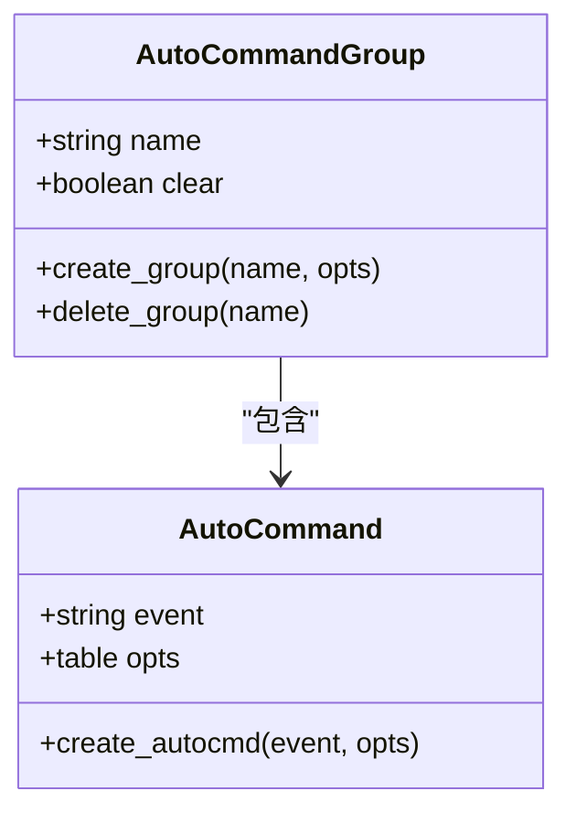
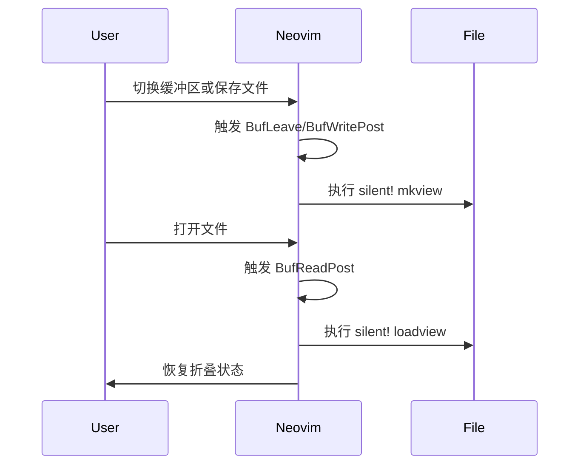
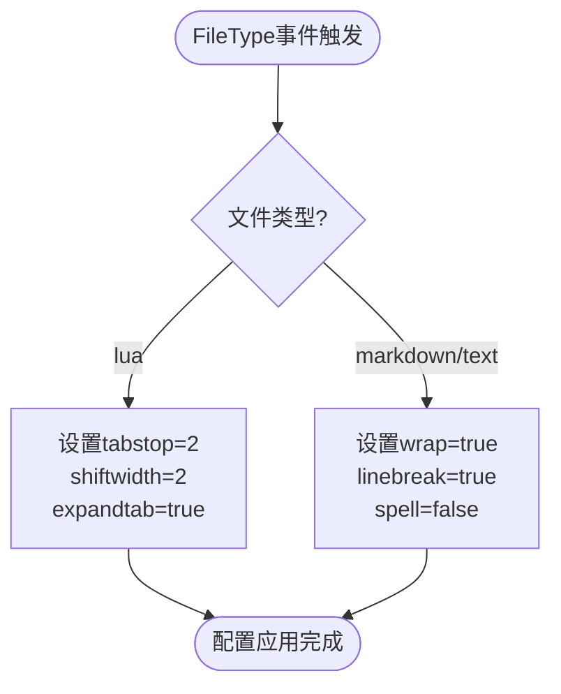
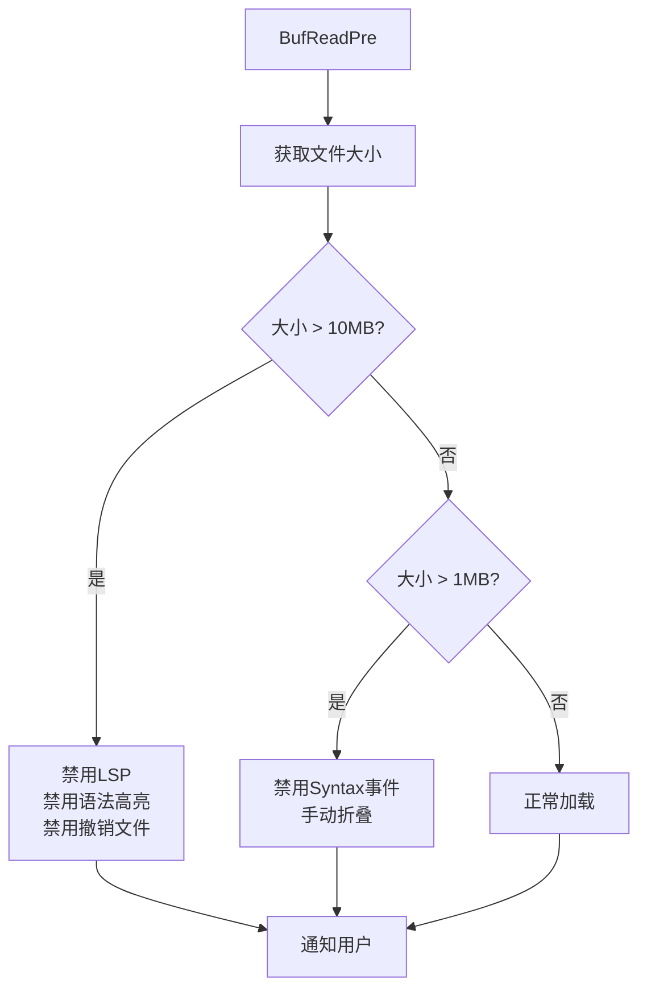
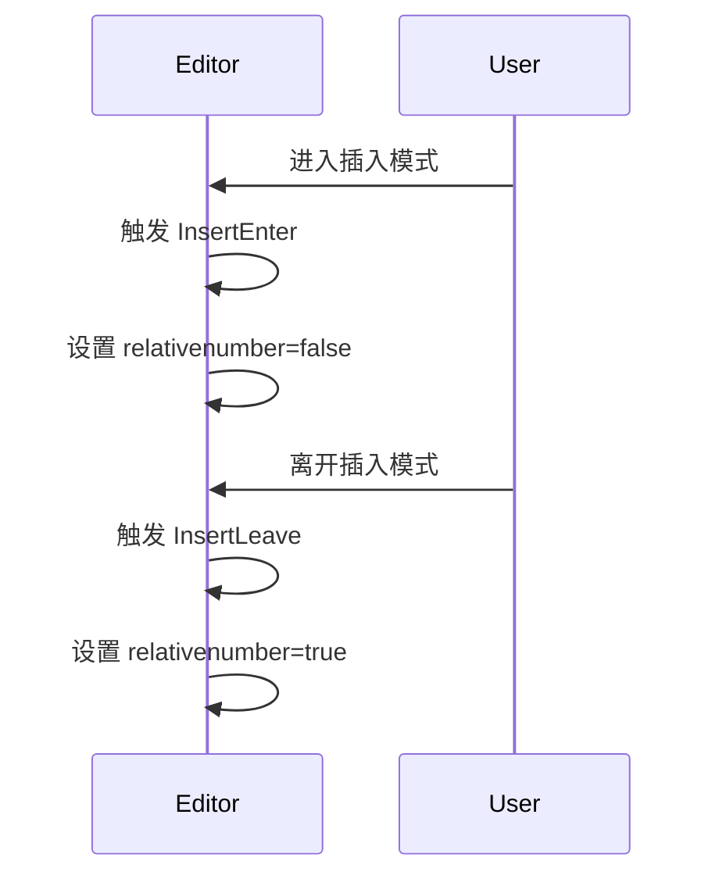

# 事件驱动与自动命令系统

<cite>
**本文档引用的文件**
- [autocmds.lua](file://lua/config/autocmds.lua)
- [init_optimized.lua](file://lua/core/init_optimized.lua)
- [keymaps.lua](file://lua/config/keymaps.lua)
</cite>

## 目录
1. [简介](#简介)
2. [项目结构](#项目结构)
3. [核心组件](#核心组件)
4. [架构概述](#架构概述)
5. [详细组件分析](#详细组件分析)
6. [依赖分析](#依赖分析)
7. [性能考虑](#性能考虑)
8. [故障排除指南](#故障排除指南)
9. [结论](#结论)

## 简介
本文档深入剖析 Neovim 配置中的事件驱动架构，重点分析 `autocmds.lua` 文件中定义的自动命令机制。通过结合 `init_optimized.lua` 中的自动命令组管理策略，详细解释如何利用 Neovim 原生的 autocmd 系统实现智能化的编辑环境响应。涵盖关键事件如 `BufWritePre`、`FileType`、`BufEnter/BufLeave` 的监听与回调逻辑，并阐述如何通过分组和性能优化防止内存泄漏。

## 项目结构
Neovim 配置采用模块化设计，主要分为 `lua/config`、`lua/core` 和 `lua/plugins` 三个目录。`autocmds.lua` 位于配置层，负责定义用户级自动命令；`init_optimized.lua` 位于核心层，负责整体优化流程的初始化和自动命令组管理。



**图示来源**
- [autocmds.lua](file://lua/config/autocmds.lua)
- [init_optimized.lua](file://lua/core/init_optimized.lua)
- [keymaps.lua](file://lua/config/keymaps.lua)

**本节来源**
- [autocmds.lua](file://lua/config/autocmds.lua#L1-L20)
- [init_optimized.lua](file://lua/core/init_optimized.lua#L1-L20)

## 核心组件
`autocmds.lua` 定义了多个事件驱动的自动命令，包括折叠状态记忆、文件类型特定配置、大文件优化等。`init_optimized.lua` 通过 `setup_autocmds()` 函数集中管理优化相关的自动命令，确保配置的一致性和性能。

**本节来源**
- [autocmds.lua](file://lua/config/autocmds.lua#L25-L100)
- [init_optimized.lua](file://lua/core/init_optimized.lua#L145-L190)

## 架构概述
系统采用分层事件处理架构，将自动命令按功能分组管理。主配置通过 `augroup` 创建独立的命名空间，避免冲突并支持按组清理。事件监听覆盖文件生命周期的各个阶段，从打开、编辑到保存、关闭，形成完整的响应闭环。



**图示来源**
- [autocmds.lua](file://lua/config/autocmds.lua#L66-L106)
- [init_optimized.lua](file://lua/core/init_optimized.lua#L145-L190)

## 详细组件分析

### 自动命令组管理机制
通过 `nvim_create_augroup` 创建命名组并设置 `clear = true`，确保每次加载配置时清除旧的自动命令，防止重复注册导致的性能下降和内存泄漏。



**图示来源**
- [autocmds.lua](file://lua/config/autocmds.lua#L15-L20)
- [init_optimized.lua](file://lua/core/init_optimized.lua#L147-L147)

### 折叠状态记忆与恢复
在 `BufLeave` 和 `BufWritePost` 事件中保存视图状态，在 `BufReadPost` 事件中恢复，实现跨会话的折叠状态持久化。



**图示来源**
- [autocmds.lua](file://lua/config/autocmds.lua#L66-L85)

### 文件类型特定配置
监听 `FileType` 事件，在检测到特定文件类型（如 Lua、Markdown）时自动应用相应的编辑选项。



**图示来源**
- [autocmds.lua](file://lua/config/autocmds.lua#L112-L135)

### 大文件性能优化
创建独立的 `LargeFileOptimizations` 组，根据文件大小动态调整编辑器行为，对超过10MB的文件禁用LSP、语法高亮等资源密集型功能。



**图示来源**
- [autocmds.lua](file://lua/config/autocmds.lua#L170-L220)

### 插入模式行号切换
在 `InsertEnter` 和 `InsertLeave` 事件中切换相对行号的显示，提升不同编辑模式下的视觉体验。



**图示来源**
- [init_optimized.lua](file://lua/core/init_optimized.lua#L185-L190)
- [keymaps.lua](file://lua/config/keymaps.lua#L195-L205)

**本节来源**
- [autocmds.lua](file://lua/config/autocmds.lua#L1-L220)
- [init_optimized.lua](file://lua/core/init_optimized.lua#L145-L190)

## 依赖分析
自动命令系统依赖于 Neovim 的事件驱动架构，通过 `vim.api.nvim_create_autocmd` 和 `nvim_create_augroup` API 实现。`init_optimized.lua` 作为主控制器，在启动流程中调用 `setup_autocmds()` 初始化所有优化相关的自动命令。

```mermaid
graph TD
A[init_optimized.lua] --> B[setup_autocmds()]
A --> C[plugin_conflicts.lua]
C --> D[清理冲突的自动命令]
B --> E[OptimizedConfig组]
F[autocmds.lua] --> G[MyAutoCmds组]
G --> H[折叠状态管理]
G --> I[文件类型配置]
G --> J[大文件优化]
```

**图示来源**
- [init_optimized.lua](file://lua/core/init_optimized.lua#L14-L190)
- [autocmds.lua](file://lua/config/autocmds.lua)

**本节来源**
- [init_optimized.lua](file://lua/core/init_optimized.lua#L14-L235)
- [autocmds.lua](file://lua/config/autocmds.lua#L1-L220)

## 性能考虑
通过自动命令分组和 `clear = true` 选项防止内存泄漏。大文件优化策略根据文件大小分级处理，避免对大型文件进行不必要的语法分析和LSP交互。使用 `eventignore` 减少事件触发频率，提升编辑器响应速度。

## 故障排除指南
- **自动命令未生效**：检查组名是否正确，确认事件名称拼写
- **性能下降**：检查是否有重复注册的自动命令，使用 `:au` 命令查看所有注册的自动命令
- **大文件优化未触发**：确认文件路径可读，检查文件大小计算逻辑
- **折叠状态未保存**：确保文件有实际路径，检查 `mkview` 和 `loadview` 权限

**本节来源**
- [autocmds.lua](file://lua/config/autocmds.lua#L66-L85)
- [init_optimized.lua](file://lua/core/init_optimized.lua#L145-L190)

## 结论
Neovim 的自动命令系统提供了强大的事件驱动能力，通过合理的分组管理和性能优化策略，可以构建高效、智能的编辑环境。`autocmds.lua` 和 `init_optimized.lua` 的协同工作展示了如何将功能性和性能优化有机结合，为开发者提供了可扩展的配置框架。