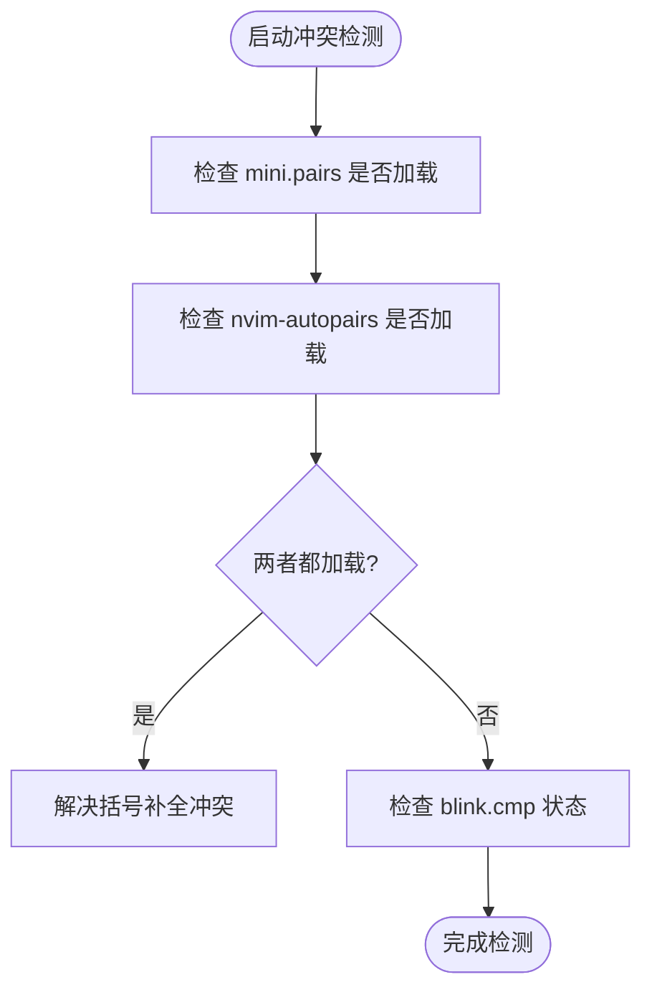
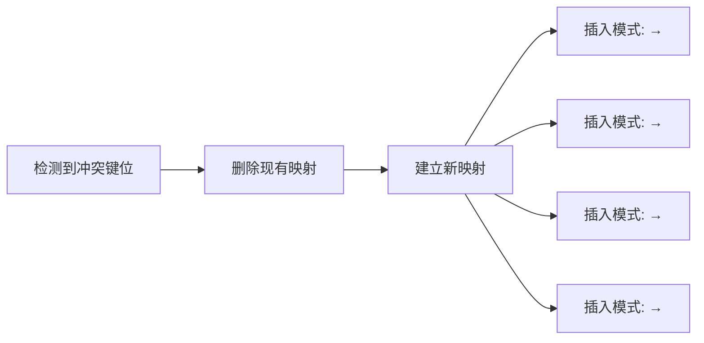
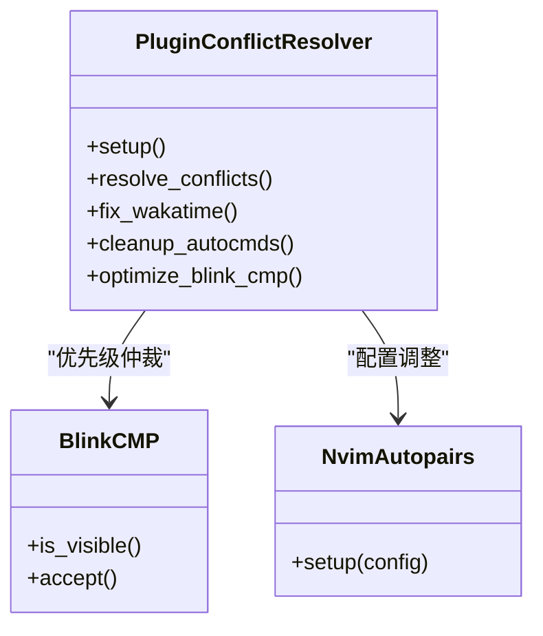
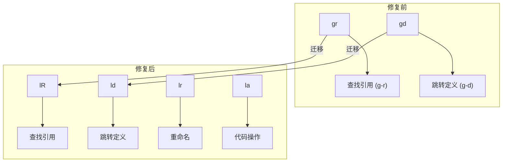
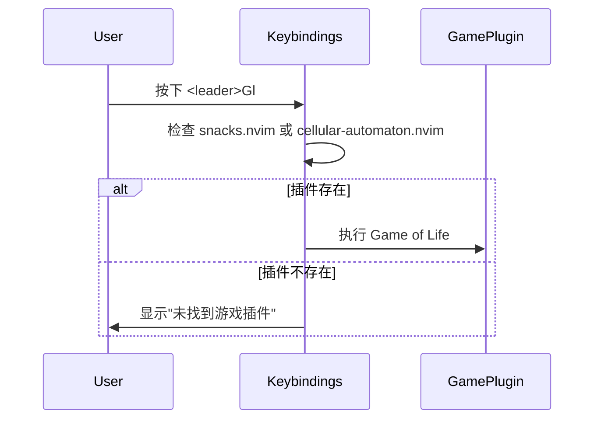
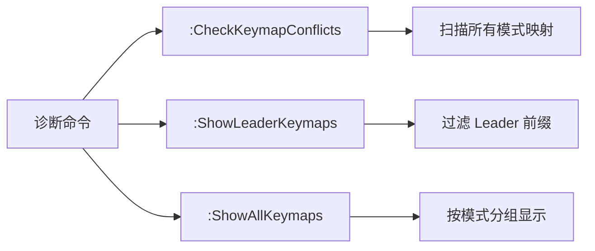
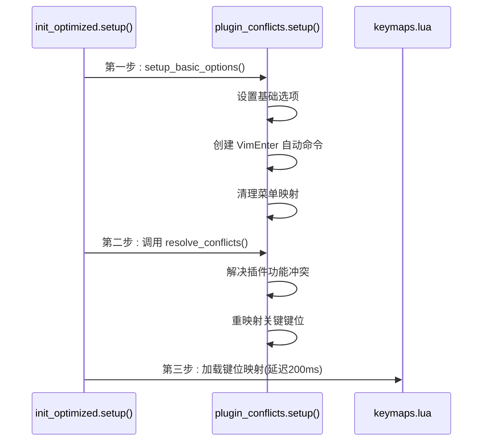
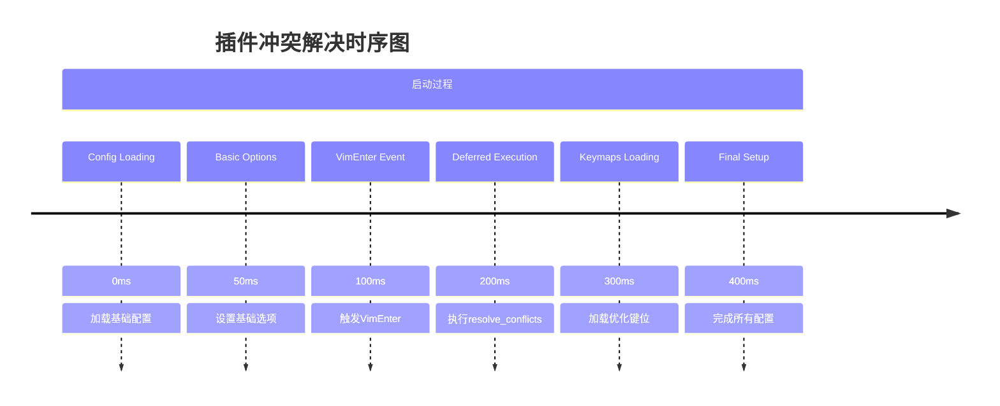
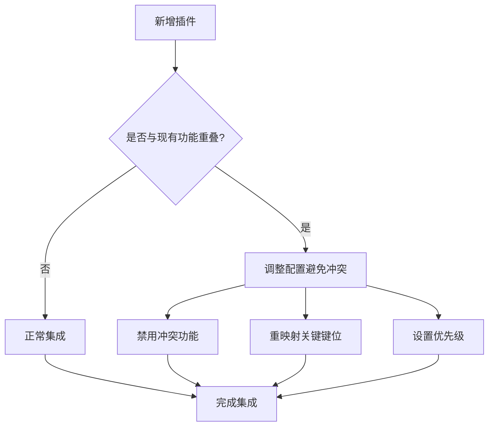

# 插件冲突检测与解决

<cite>
**本文档引用的文件**   
- [plugin_conflicts.lua](file://lua/core/plugin_conflicts.lua)
- [keybindings.lua](file://lua/config/keybindings.lua)
- [init_optimized.lua](file://lua/core/init_optimized.lua)
- [test_optimizations.lua](file://test_optimizations.lua)
</cite>

## 目录
1. [引言](#引言)
2. [核心设计原理](#核心设计原理)
3. [冲突识别机制](#冲突识别机制)
4. [冲突解决策略](#冲突解决策略)
5. [键位修复实例分析](#键位修复实例分析)
6. [调试与诊断方法](#调试与诊断方法)
7. [模块集成与执行流程](#模块集成与执行流程)
8. [最佳实践与维护建议](#最佳实践与维护建议)

## 引言
该文档全面阐述 `plugin_conflicts.lua` 模块的设计原理与实现机制，说明其如何动态解决 Neovim 配置中多个插件之间的功能冲突。重点分析该模块在维护大型插件生态稳定性中的关键作用，涵盖键位映射、命令定义和自动命令的冲突检测与仲裁策略。

## 核心设计原理

`plugin_conflicts.lua` 模块采用"延迟执行、优先级仲裁、动态重映射"的核心设计原则，确保在所有插件加载完成后进行冲突解决，避免因加载顺序导致的配置覆盖问题。

模块通过 `VimEnter` 自动命令延迟 100ms 执行冲突解决逻辑，确保插件系统完全初始化。设计上优先处理高优先级插件（如 `blink.cmp`）的功能需求，同时禁用或重配置可能产生冲突的次要功能。

**Section sources**
- [plugin_conflicts.lua](file://lua/core/plugin_conflicts.lua#L1-L29)

## 冲突识别机制

### 插件功能冲突检测
模块通过 `pcall(require, "plugin_name")` 检测多个功能重叠插件的同时存在。例如，当 `mini.pairs` 和 `nvim-autopairs` 同时加载时，系统会识别出括号自动补全功能的冲突。



**Diagram sources**
- [plugin_conflicts.lua](file://lua/core/plugin_conflicts.lua#L31-L70)

### 键位映射冲突扫描
模块维护一个潜在冲突键位列表，包括 `<C-h>`、`<C-j>`、`<C-k>`、`<C-l>` 等常用组合键。通过遍历这些键位并使用 `vim.keymap.del` 清理可能存在的冲突映射。

系统还通过 `vim.api.nvim_get_keymap()` 获取当前所有模式下的键位映射，构建键位索引表，识别同一键位在不同模式下的多重定义。

**Section sources**
- [plugin_conflicts.lua](file://lua/core/plugin_conflicts.lua#L68-L70)

## 冲突解决策略

### 自动重映射机制
对于已识别的冲突键位，模块执行自动重映射：



**Diagram sources**
- [plugin_conflicts.lua](file://lua/core/plugin_conflicts.lua#L71-L74)

### 优先级仲裁策略
模块采用明确的优先级仲裁规则，确保关键插件功能不受影响：

1. **补全插件优先**: 为 `blink.cmp` 保留 `<CR>` 映射控制权
2. **导航功能优先**: 确保 `<C-h/j/k/l>` 在插入模式下的光标移动功能
3. **菜单系统稳定**: 禁用可能导致 "Menu not defined" 错误的菜单映射



**Diagram sources**
- [plugin_conflicts.lua](file://lua/core/plugin_conflicts.lua#L85-L90)

### 用户提示机制
当检测到配置问题时，模块通过 `vim.notify` 向用户发送提示信息。例如，在 `fix_wakatime()` 函数中，若未找到 WakaTime 配置文件，系统会创建默认配置并通知用户设置 API 密钥。

## 键位修复实例分析

### LSP 功能键位统一
在 `keybindings.lua` 中，原分散在 `g` 前缀下的 LSP 功能被统一迁移到 `<leader>l` 前缀，解决与原生 Vim 命令的冲突：



**Diagram sources**
- [keybindings.lua](file://lua/config/keybindings.lua#L10-L20)

### 游戏功能键位迁移
为解决 `<leader>gol` 与其它功能的冲突，游戏功能被迁移到 `<leader>G` 前缀：



**Diagram sources**
- [keybindings.lua](file://lua/config/keybindings.lua#L52-L65)

## 调试与诊断方法

### 冲突检测命令
系统提供 `:FixConflicts` 用户命令，手动触发冲突解决流程：

```mermaid
flowchart TD
A[:FixConflicts] --> B[调用 plugin_conflicts.resolve_conflicts()]
B --> C[解决 autopairs 冲突]
C --> D[清理冲突键位]
D --> E[重设光标移动键]
E --> F[优化 blink.cmp 映射]
F --> G[显示"插件冲突已修复"]
```

**Diagram sources**
- [init_optimized.lua](file://lua/core/init_optimized.lua#L129-L130)

### 内置诊断工具
模块集成多种诊断命令，帮助开发者分析键位状态：

- `:CheckKeymapConflicts` - 检查所有模式下的键位冲突
- `:ShowLeaderKeymaps` - 显示所有 Leader 前缀键位
- `:ShowAllKeymaps` - 显示指定模式的所有键位映射



**Section sources**
- [keybindings.lua](file://lua/config/keybindings.lua#L239-L279)

## 模块集成与执行流程

### 初始化流程
`plugin_conflicts` 模块在 `init_optimized.lua` 的 `setup()` 函数中被优先调用，确保在其他配置加载前解决潜在冲突。



**Diagram sources**
- [init_optimized.lua](file://lua/core/init_optimized.lua#L1-L65)

### 执行时序
模块利用 Neovim 的事件系统确保正确的执行顺序：



**Section sources**
- [plugin_conflicts.lua](file://lua/core/plugin_conflicts.lua#L15-L29)

## 最佳实践与维护建议

### 新增插件时的冲突预防
1. **命名空间隔离**: 使用唯一前缀避免命令和映射冲突
2. **功能检测**: 在配置中检查同类插件是否已存在
3. **延迟配置**: 使用 `VimEnter` 或 `User` 事件延迟关键配置
4. **菜单清理**: 禁用不必要的菜单项防止 "Menu not defined" 错误

### 维护大型插件生态
- **统一管理**: 集中管理所有 Leader 前缀的键位定义
- **定期检查**: 使用 `:CheckKeymapConflicts` 定期扫描冲突
- **文档记录**: 记录所有自定义键位及其用途
- **测试验证**: 使用 `test_optimizations.lua` 验证配置完整性



**Section sources**
- [test_optimizations.lua](file://test_optimizations.lua#L0-L35)