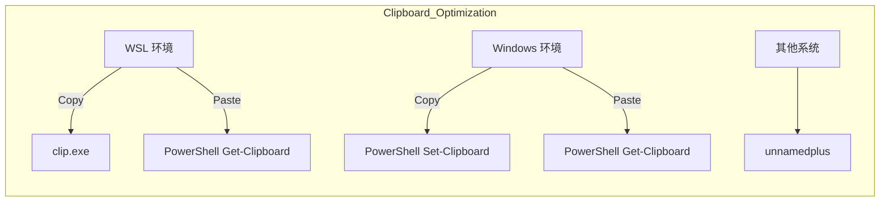
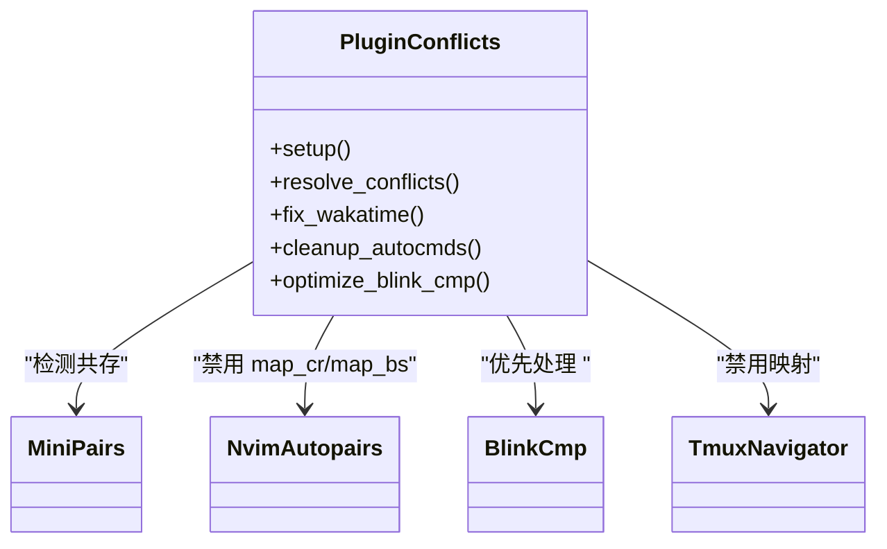
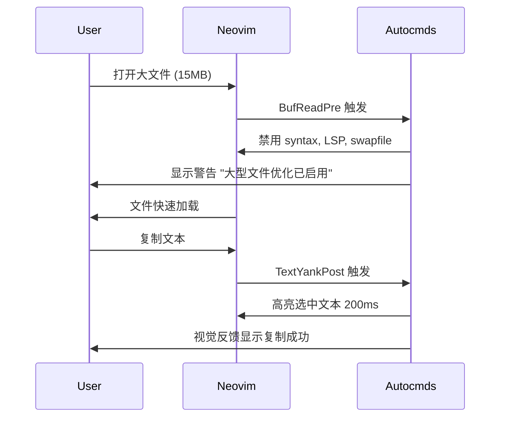
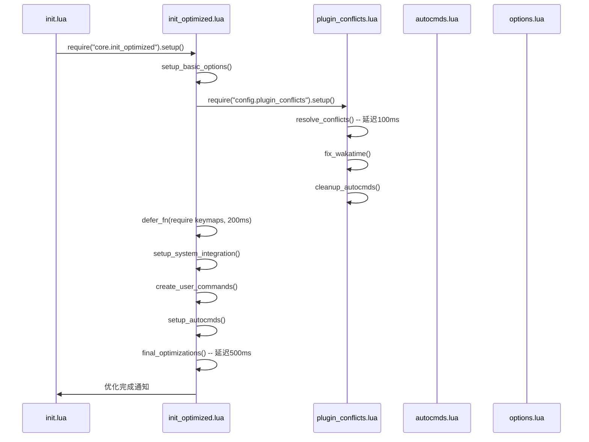

# 核心架构解析

<cite>
**本文档引用的文件**  
- [init.lua](file://init.lua)
- [lua/core/init_optimized.lua](file://lua/core/init_optimized.lua)
- [lua/core/plugin_conflicts.lua](file://lua/core/plugin_conflicts.lua)
- [lua/config/autocmds.lua](file://lua/config/autocmds.lua)
- [lua/config/options.lua](file://lua/config/options.lua)
</cite>

## 目录
1. [项目结构](#项目结构)  
2. [核心模块协同机制](#核心模块协同机制)  
3. [系统级优化策略](#系统级优化策略)  
4. [插件冲突检测与修复](#插件冲突检测与修复)  
5. [事件驱动机制分析](#事件驱动机制分析)  
6. [编辑行为配置影响](#编辑行为配置影响)  
7. [架构图示建议](#架构图示建议)  

## 项目结构

Neovim 配置项目采用模块化分层设计，核心功能集中于 `lua/` 目录下，分为 `config`（用户配置）、`core`（核心优化）和 `plugins`（插件管理）三个子模块。`init.lua` 作为启动入口，按顺序加载核心配置与插件，确保系统初始化流程可控。`snippets` 目录存放代码片段，支持多语言快速开发。

**Section sources**  
- [init.lua](file://init.lua#L1-L50)

## 核心模块协同机制

`lua/core/` 目录下的核心模块通过 `init_optimized.lua` 统一调度，形成有序的初始化流程。`plugin_conflicts.lua` 在早期阶段解决插件间键位与功能冲突，确保后续配置不会被覆盖。`init_optimized.lua` 按优先级依次执行基础选项设置、系统集成、自动命令注册等步骤，通过 `vim.defer_fn` 延迟加载键位映射，避免与插件初始化竞争。整个流程确保 Neovim 启动时各模块按依赖顺序正确加载，提升系统稳定性。

```mermaid
flowchart TD
A[init.lua] --> B[init_optimized.setup()]
B --> C[setup_basic_options]
B --> D[plugin_conflicts.setup()]
D --> E[resolve_conflicts]
D --> F[fix_wakatime]
D --> G[cleanup_autocmds]
B --> H[setup_system_integration]
B --> I[create_user_commands]
B --> J[setup_autocmds]
B --> K[final_optimizations]
```

**Diagram sources**  
- [lua/core/init_optimized.lua](file://lua/core/init_optimized.lua#L1-L236)
- [init.lua](file://init.lua#L1-L50)

**Section sources**  
- [lua/core/init_optimized.lua](file://lua/core/init_optimized.lua#L1-L236)
- [lua/core/plugin_conflicts.lua](file://lua/core/plugin_conflicts.lua#L1-L158)

## 系统级优化策略

`init_optimized.lua` 中的 `setup_system_integration()` 函数针对不同操作系统提供剪贴板与 shell 的优化配置。在 WSL 环境下，通过 `clip.exe` 和 PowerShell 命令实现 UTF-8 安全的剪贴板读写；在原生 Windows 环境中，使用 PowerShell 的 `Set-Clipboard` 和 `Get-Clipboard` 命令确保稳定性；其他系统则使用默认的 `unnamedplus` 选项。同时，Windows 下将 shell 设置为 PowerShell，并配置执行策略与命令标志，提升命令执行兼容性。



**Diagram sources**  
- [lua/core/init_optimized.lua](file://lua/core/init_optimized.lua#L100-L145)

**Section sources**  
- [lua/core/init_optimized.lua](file://lua/core/init_optimized.lua#L100-L145)

## 插件冲突检测与修复

`plugin_conflicts.lua` 提供了系统化的插件冲突解决方案。`resolve_conflicts()` 函数检测 `mini.pairs` 与 `nvim-autopairs` 的共存情况，禁用 `nvim-autopairs` 的回车与退格映射，避免与补全插件 `blink.cmp` 冲突。同时，清除 `<C-h>` 至 `<C-l>` 的插入模式映射，并重新绑定为方向键，解决与 Tmux 导航插件的冲突。此外，通过 `optimize_blink_cmp()` 在 `BlinkCmpReady` 事件中动态设置 `<CR>` 映射，确保补全优先级最高。



**Diagram sources**  
- [lua/core/plugin_conflicts.lua](file://lua/core/plugin_conflicts.lua#L1-L158)

**Section sources**  
- [lua/core/plugin_conflicts.lua](file://lua/core/plugin_conflicts.lua#L1-L158)

## 事件驱动机制分析

`autocmds.lua` 定义了多个事件驱动的自动命令，显著提升用户体验。`BufReadPost` 事件恢复文件折叠状态，保持用户编辑上下文；`TextYankPost` 事件高亮复制的文本，提供视觉反馈；`BufEnter` 事件为文本文件启用自动折行与单词断行，优化阅读体验。此外，`BufReadPre` 事件根据文件大小动态应用性能优化策略：1MB 以上文件禁用语法高亮与 LSP，10MB 以上文件进一步禁用撤销历史与交换文件，确保大文件流畅编辑。



**Diagram sources**  
- [lua/config/autocmds.lua](file://lua/config/autocmds.lua#L1-L221)

**Section sources**  
- [lua/config/autocmds.lua](file://lua/config/autocmds.lua#L1-L221)

## 编辑行为配置影响

`options.lua` 中的 `vim.opt` 配置直接影响编辑行为。`tabstop=2` 和 `shiftwidth=2` 确保缩进一致性，`expandtab=true` 使用空格代替制表符，提升代码可读性。`updatetime=100` 减少 CursorHold 事件延迟，提升插件响应速度。`clipboard:append("unnamedplus")` 启用系统剪贴板集成，实现跨应用复制粘贴。`signcolumn="yes"` 始终显示符号列，确保 LSP 诊断图标不偏移。这些配置共同构建了高效、一致的编辑环境。

**Section sources**  
- [lua/config/options.lua](file://lua/config/options.lua#L1-L264)

## 架构图示建议

为清晰展示从 `init.lua` 启动到核心模块初始化的数据流与控制流，建议使用以下 Mermaid 序列图。该图展示了模块间的调用顺序、延迟执行机制与事件驱动流程，帮助开发者理解系统启动时的执行路径与依赖关系。



**Diagram sources**  
- [init.lua](file://init.lua#L1-L50)
- [lua/core/init_optimized.lua](file://lua/core/init_optimized.lua#L1-L236)
- [lua/core/plugin_conflicts.lua](file://lua/core/plugin_conflicts.lua#L1-L158)
- [lua/config/autocmds.lua](file://lua/config/autocmds.lua#L1-L221)