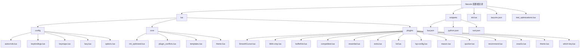
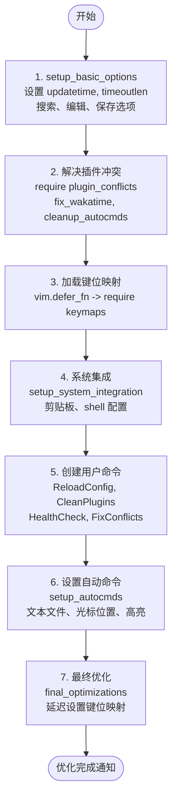
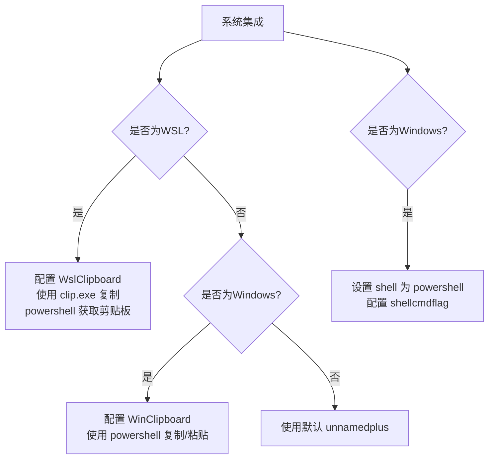
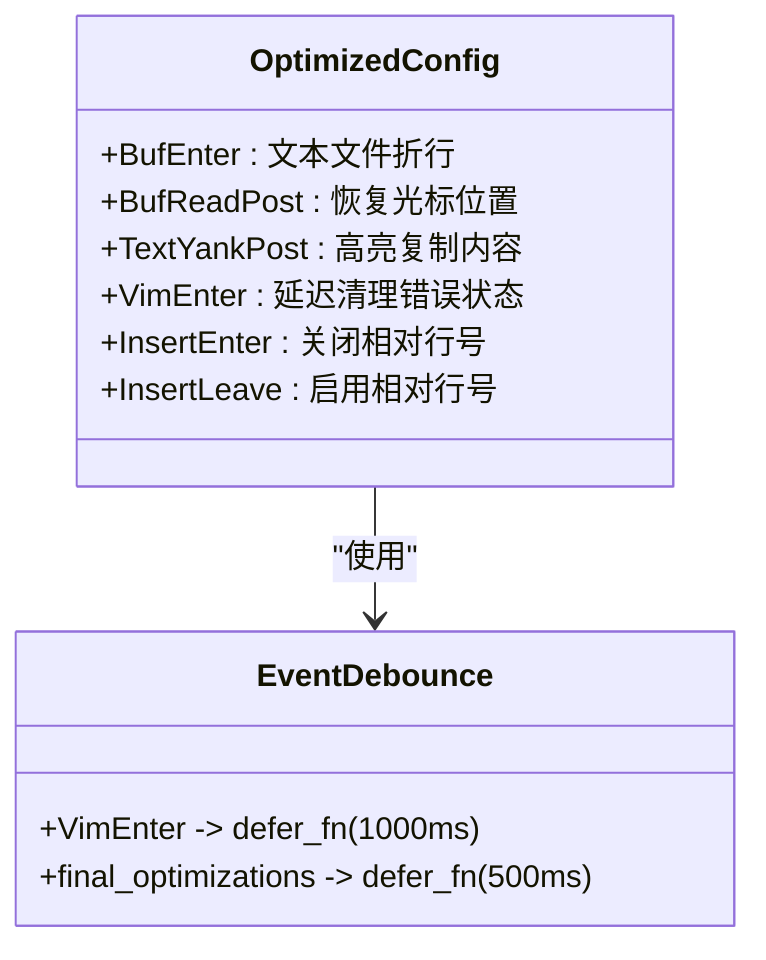
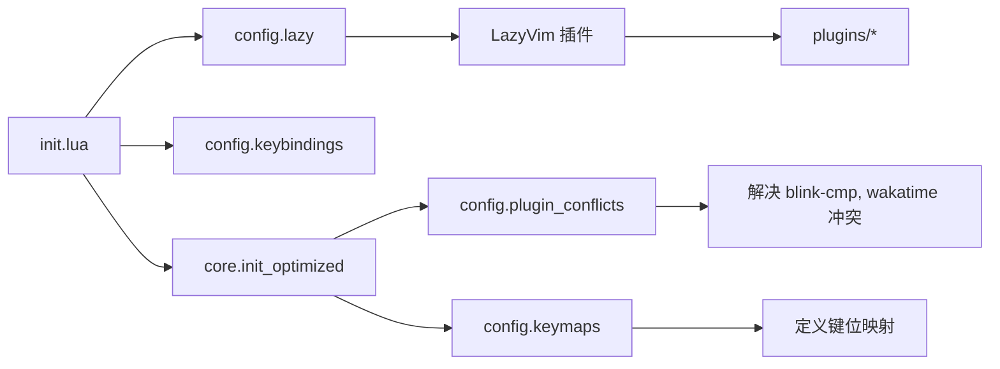

# 系统级优化策略

<cite>
**本文档引用的文件**  
- [init_optimized.lua](file://lua/core/init_optimized.lua)
- [options.lua](file://lua/config/options.lua)
- [init.lua](file://init.lua)
- [autocmds.lua](file://lua/config/autocmds.lua)
- [plugin_conflicts.lua](file://lua/core/plugin_conflicts.lua)
- [test_optimizations.lua](file://test_optimizations.lua)
</cite>

## 目录
1. [简介](#简介)
2. [项目结构](#项目结构)
3. [核心组件](#核心组件)
4. [架构概览](#架构概览)
5. [详细组件分析](#详细组件分析)
6. [依赖分析](#依赖分析)
7. [性能考量](#性能考量)
8. [故障排除指南](#故障排除指南)
9. [结论](#结论)

## 简介
本文档深入解析 `init_optimized.lua` 模块中实现的系统级性能优化机制，重点阐述其对 Neovim 启动速度、响应性能和跨平台兼容性的提升。通过分析该模块如何配置剪贴板与系统集成、shell 执行环境、默认 UI 选项（如行号、缩进、光标样式）以及关键的自动命令组（autocmd groups）以避免重复触发，全面揭示其优化策略。结合 `options.lua` 中的 `vim.opt` 配置项，解释诸如 `'hidden'`、`'swapfile'`、`'backup'` 等选项对编辑会话持久化的影响。文档还提供实际代码片段示例，展示如何通过异步任务调度和事件去抖优化用户体验，并为开发者绘制初始化流程图，标明从 `init.lua` 加载到核心优化完成的关键阶段，指出可安全自定义的扩展点。

## 项目结构



**Diagram sources**
- [init.lua](file://init.lua#L1-L50)
- [init_optimized.lua](file://lua/core/init_optimized.lua#L1-L235)

**Section sources**
- [init.lua](file://init.lua#L1-L50)
- [init_optimized.lua](file://lua/core/init_optimized.lua#L1-L235)

## 核心组件

`init_optimized.lua` 是整个配置系统的核心优化引擎，通过 `M.setup()` 函数按严格顺序执行七步优化流程。该模块首先设置基础选项以避免后续冲突，然后优先解决插件间的兼容性问题，接着配置系统集成、创建用户命令、设置自动命令，最后进行最终优化。这种分阶段、有序的初始化策略确保了配置的稳定性和高性能。`options.lua` 文件则集中管理了所有 `vim.opt` 配置项，为编辑器提供了统一的外观和行为基础。

**Section sources**
- [init_optimized.lua](file://lua/core/init_optimized.lua#L1-L235)
- [options.lua](file://lua/config/options.lua#L1-L263)

## 架构概览

```mermaid
graph TD
A[Neovim 启动] --> B[加载 init.lua]
B --> C[require config.lazy]
C --> D[LazyVim 插件管理]
D --> E[加载核心模块]
E --> F[require core.init_optimized]
F --> G[执行 M.setup()]
G --> H[setup_basic_options]
G --> I[解决插件冲突]
G --> J[加载键位映射]
G --> K[系统集成]
G --> L[创建用户命令]
G --> M[设置自动命令]
G --> N[最终优化]
N --> O[优化完成通知]
```

**Diagram sources**
- [init.lua](file://init.lua#L1-L50)
- [init_optimized.lua](file://lua/core/init_optimized.lua#L1-L235)

## 详细组件分析

### 初始化流程分析

`init_optimized.lua` 的 `M.setup()` 函数定义了清晰的初始化流程，确保了配置的正确加载顺序和性能优化。

#### 初始化流程图


**Diagram sources**
- [init_optimized.lua](file://lua/core/init_optimized.lua#L1-L235)

**Section sources**
- [init_optimized.lua](file://lua/core/init_optimized.lua#L1-L235)

### 系统集成与跨平台兼容性

该模块通过条件判断实现了对不同操作系统的精细化配置，显著提升了跨平台兼容性。

#### 剪贴板与Shell配置


**Diagram sources**
- [init_optimized.lua](file://lua/core/init_optimized.lua#L67-L105)

**Section sources**
- [init_optimized.lua](file://lua/core/init_optimized.lua#L67-L105)

### 自动命令组与事件去抖

`init_optimized.lua` 通过创建名为 `OptimizedConfig` 的自动命令组，有效地组织和管理了各种事件处理器，避免了重复触发。

#### 自动命令组分析


**Diagram sources**
- [init_optimized.lua](file://lua/core/init_optimized.lua#L145-L190)

**Section sources**
- [init_optimized.lua](file://lua/core/init_optimized.lua#L145-L190)
- [autocmds.lua](file://lua/config/autocmds.lua#L1-L32)

### UI选项与编辑会话持久化

`options.lua` 和 `init_optimized.lua` 共同定义了编辑器的UI行为和会话管理策略。

#### 核心选项配置表
| 选项 | 文件 | 值 | 说明 |
| :--- | :--- | :--- | :--- |
| `updatetime` | init_optimized.lua | 250 | 提高响应速度，减少延迟 |
| `timeoutlen` | init_optimized.lua | 300 | 键位映射超时时间 |
| `autowrite` | init_optimized.lua | true | 自动保存修改的文件 |
| `autowriteall` | init_optimized.lua | true | 保存所有修改的文件 |
| `clipboard` | options.lua | unnamedplus | 启用系统剪贴板 |
| `expandtab` | options.lua | true | Tab转换为空格 |
| `shiftwidth` | options.lua | 2 | 缩进宽度为2个空格 |
| `swapfile` | autocmds.lua | false | 大文件禁用交换文件 |
| `bufhidden` | autocmds.lua | unload | 大文件不常用时卸载 |

**Section sources**
- [options.lua](file://lua/config/options.lua#L1-L263)
- [init_optimized.lua](file://lua/core/init_optimized.lua#L1-L235)
- [autocmds.lua](file://lua/config/autocmds.lua#L188)

## 依赖分析



**Diagram sources**
- [init.lua](file://init.lua#L1-L50)
- [init_optimized.lua](file://lua/core/init_optimized.lua#L1-L235)
- [plugin_conflicts.lua](file://lua/core/plugin_conflicts.lua#L1-L130)

**Section sources**
- [init.lua](file://init.lua#L1-L50)
- [init_optimized.lua](file://lua/core/init_optimized.lua#L1-L235)
- [plugin_conflicts.lua](file://lua/core/plugin_conflicts.lua#L1-L130)

## 性能考量

`init_optimized.lua` 通过多种技术手段优化了 Neovim 的性能。首先，它使用 `vim.defer_fn` 进行异步任务调度，将非关键操作（如加载键位映射和最终优化）延迟执行，避免阻塞主初始化流程。其次，通过 `vim.defer_fn` 实现事件去抖，例如在 `VimEnter` 事件后延迟1秒清理错误状态，防止在启动过程中频繁触发。此外，模块通过 `pcall` 安全地执行可能出错的操作，确保配置的健壮性。`options.lua` 中的 `updatetime` 和 `timeoutlen` 优化也直接提升了编辑器的响应速度。

**Section sources**
- [init_optimized.lua](file://lua/core/init_optimized.lua#L1-L235)
- [options.lua](file://lua/config/options.lua#L1-L263)

## 故障排除指南

当遇到配置问题时，可以使用 `init_optimized.lua` 中定义的用户命令进行诊断。

#### 诊断命令表
| 命令 | 说明 | 来源 |
| :--- | :--- | :--- |
| `:ReloadConfig` | 重新加载配置文件 | init_optimized.lua |
| `:CleanPlugins` | 清理未使用的插件 | init_optimized.lua |
| `:HealthCheck` | 运行 Neovim 健康检查 | init_optimized.lua |
| `:FixConflicts` | 修复已知的插件冲突 | init_optimized.lua |
| `:ShowMappings` | 显示所有键位映射 | init_optimized.lua |
| `:QuickCheck` | 快速检查优化配置状态 | test_optimizations.lua |

**Section sources**
- [init_optimized.lua](file://lua/core/init_optimized.lua#L110-L143)
- [test_optimizations.lua](file://test_optimizations.lua#L172-L223)

## 结论
`init_optimized.lua` 模块通过一个结构化、分阶段的初始化流程，实现了对 Neovim 的系统级性能优化。其核心优势在于：通过优先解决插件冲突确保了稳定性；利用 `vim.defer_fn` 实现异步调度和事件去抖，提升了响应性能；通过精细化的跨平台配置增强了兼容性；并利用自动命令组和用户命令提供了强大的可维护性和可诊断性。开发者可以在 `init.lua` 中安全地引用此模块，并通过提供的用户命令进行管理和调试，从而获得一个快速、稳定且高度可定制的编辑环境。