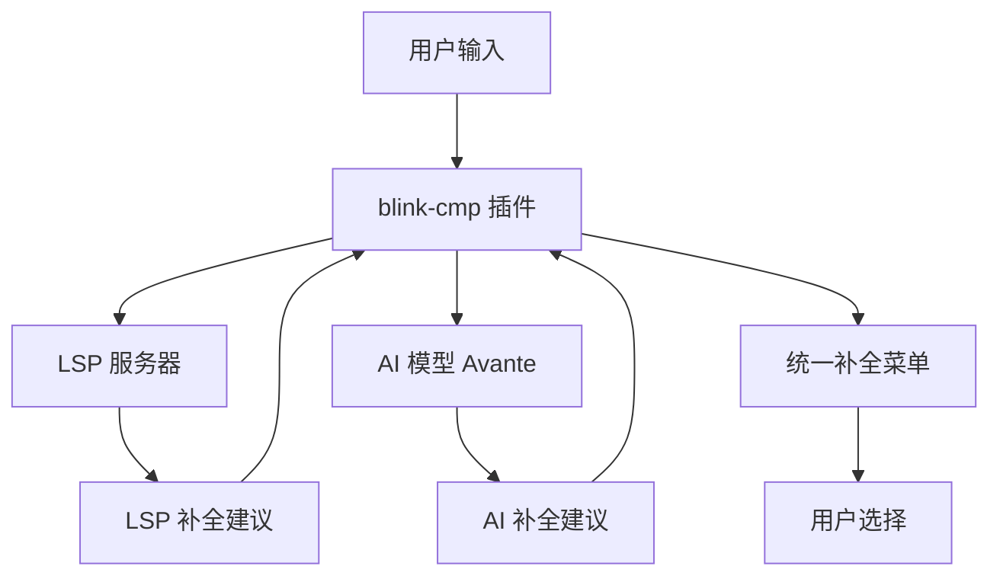
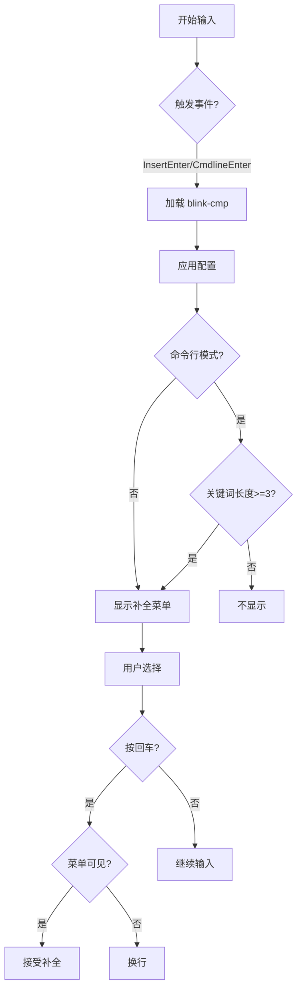

# AI增强补全体验

<cite>
**本文档引用的文件**
- [blink-cmp.lua](file://lua/plugins/blink-cmp.lua)
- [plugin_conflicts.lua](file://lua/core/plugin_conflicts.lua)
- [lsp-config.lua](file://lua/plugins/lsp-config.lua)
</cite>

## 目录
1. [简介](#简介)
2. [核心功能与架构](#核心功能与架构)
3. [AI与LSP补全整合机制](#ai与lsp补全整合机制)
4. [补全优先级与排序策略](#补全优先级与排序策略)
5. [延迟加载与性能优化](#延迟加载与性能优化)
6. [多语言支持与实际应用](#多语言支持与实际应用)
7. [性能调优建议](#性能调优建议)
8. [隐私与安全配置](#隐私与安全配置)
9. [结论](#结论)

## 简介
`blink-cmp` 是一个Neovim插件，提供AI驱动的代码补全功能，通过整合本地语言服务器协议（LSP）补全与AI模型建议，实现更智能、上下文感知的补全体验。该插件在插入模式和命令行模式下触发，支持多种补全源，包括缓冲区、LSP、路径、代码片段和AI模型（Avante），并具备高度可定制的外观和行为配置。

## 核心功能与架构
`blink-cmp` 插件通过定义多个补全源（sources）和提供程序（providers）来实现多功能补全。其核心架构包括补全菜单、签名帮助、键位映射和外观配置。插件依赖于 `colorful-menu.nvim` 实现美观的菜单显示，并通过 `blink-cmp-avante` 集成AI补全功能。补全在 `InsertEnter` 和 `CmdlineEnter` 事件时触发，确保在用户开始输入时即时响应。

**Section sources**
- [blink-cmp.lua](file://lua/plugins/blink-cmp.lua#L1-L20)

## AI与LSP补全整合机制
`blink-cmp` 通过将AI模型（Avante）作为补全提供程序之一，与LSP补全并行工作。当用户输入代码时，插件同时从LSP服务器获取基于语法和语义的补全建议，并从AI模型获取基于上下文和模式的智能建议。这些建议在同一个补全列表中展示，用户无需切换来源即可获得全面的补全选项。

AI补全由 `blink-cmp-avante` 模块提供，该模块作为插件的依赖项被加载。LSP补全能力通过在LSP客户端功能中合并 `blink.cmp` 的能力来启用，确保LSP服务器能够正确响应补全请求。

**Diagram sources**
- [blink-cmp.lua](file://lua/plugins/blink-cmp.lua#L100-L144)
- [lsp-config.lua](file://lua/plugins/lsp-config.lua#L300-L323)

**Section sources**
- [blink-cmp.lua](file://lua/plugins/blink-cmp.lua#L100-L144)
- [lsp-config.lua](file://lua/plugins/lsp-config.lua#L300-L323)

## 补全优先级与排序策略
`blink-cmp` 使用 `score_offset` 参数来控制不同补全源的优先级。数字越大，优先级越高。在默认配置中，各补全源的优先级如下：
- buffer: 5
- path: 3
- lsp: 2
- snippets: 1

值得注意的是，在配置的后续部分，`snippets` 的 `score_offset` 被重新设置为100，使其成为最高优先级的补全源。这种动态优先级调整允许用户根据上下文需求优化补全体验。

补全列表不预选第一个项目，用户选择后自动插入文本。菜单外观通过 `colorful-menu.nvim` 进行定制，仅显示图标和标签，确保界面简洁。

**Section sources**
- [blink-cmp.lua](file://lua/plugins/blink-cmp.lua#L100-L144)

## 延迟加载与性能优化
`blink-cmp` 通过事件驱动的方式实现延迟加载，仅在 `InsertEnter` 和 `CmdlineEnter` 时加载，避免了启动时的性能开销。对于命令行补全，插件配置了最小关键词长度（3个字符），以减少不必要的补全请求。

插件还通过 `plugin_conflicts.lua` 中的 `optimize_blink_cmp` 函数进行性能优化。该函数在 `BlinkCmpReady` 事件触发时，设置回车键的键位映射，确保在补全菜单可见时优先处理补全接受操作，否则执行默认的换行操作，从而提高响应效率。

**Diagram sources**
- [blink-cmp.lua](file://lua/plugins/blink-cmp.lua#L10-L20)
- [plugin_conflicts.lua](file://lua/core/plugin_conflicts.lua#L132-L156)

**Section sources**
- [blink-cmp.lua](file://lua/plugins/blink-cmp.lua#L10-L20)
- [plugin_conflicts.lua](file://lua/core/plugin_conflicts.lua#L132-L156)

## 多语言支持与实际应用
`blink-cmp` 通过LSP支持多种编程语言。在 `lsp-config.lua` 中，配置了Python（pyright）、TypeScript（ts_ls）、Rust（rust_analyzer）、C++（clangd）等多种语言服务器，确保在不同语言文件中都能提供高质量的LSP补全。

对于Python函数生成，AI补全可以基于函数名和上下文生成完整的函数签名和文档字符串。对于Lua模块导入，补全列表会优先显示当前缓冲区中已使用的模块和变量（buffer源），同时提供路径补全（path源）和代码片段（snippets源），极大提高编码效率。

尽管配置中禁用了某些文件类型（如lua、markdown）的补全，但通过 `enabled` 函数的灵活配置，可以根据需要轻松启用或禁用特定语言的补全功能。

**Section sources**
- [lsp-config.lua](file://lua/plugins/lsp-config.lua#L96-L177)
- [blink-cmp.lua](file://lua/plugins/blink-cmp.lua#L72-L98)

## 性能调优建议
1. **缓存策略**: 确保 `blink-cmp-avante` 的AI模型结果被适当缓存，避免对相同上下文重复请求。
2. **网络请求控制**: 配置AI模型请求的超时和重试机制，防止网络延迟影响编辑体验。
3. **按需加载**: 保持 `event` 配置为 `InsertEnter` 和 `CmdlineEnter`，避免不必要的后台加载。
4. **大文件优化**: 对于大型文件，考虑在 `autocmds.lua` 中禁用LSP和补全功能，以提升性能。
5. **依赖管理**: 使用 `lazy.nvim` 确保插件按需加载，减少启动时间。

## 隐私与安全配置
1. **AI模型本地化**: 尽可能使用本地运行的AI模型（如 `blink-cmp-avante`），避免代码上传到第三方服务器。
2. **数据最小化**: 配置AI补全仅发送必要的上下文信息，不发送整个文件内容。
3. **网络隔离**: 在防火墙或安全策略中限制 `blink-cmp` 相关插件的网络访问，仅允许必要的通信。
4. **配置审查**: 定期审查 `blink-cmp` 及其依赖项的配置，确保没有意外的数据共享设置。

## 结论
`blink-cmp` 插件通过创新地整合AI模型与传统LSP补全，为Neovim用户提供了一个强大、智能的代码补全解决方案。其灵活的优先级排序、高效的延迟加载机制和广泛的多语言支持，使其成为现代开发环境中的重要工具。通过合理的性能调优和隐私安全配置，用户可以在享受AI增强补全的同时，确保开发环境的高效与安全。