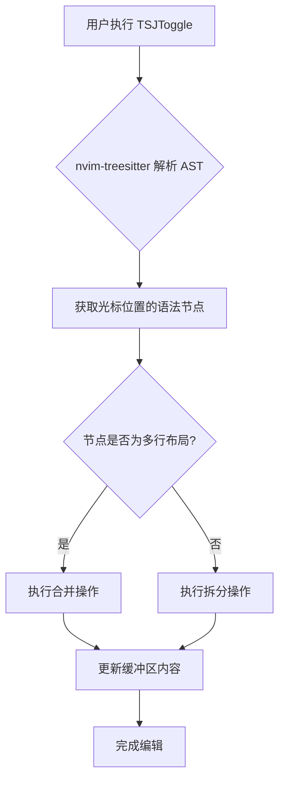
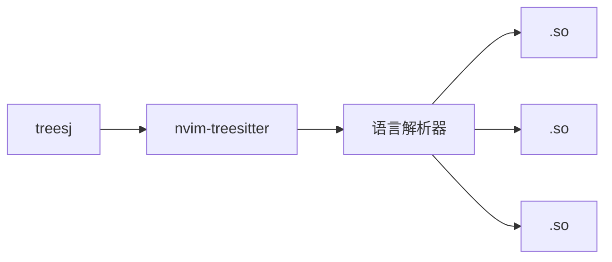

# 语法树级代码拆分与合并

<cite>
**本文档引用文件**  
- [essential.lua](file://lua/plugins/essential.lua)
</cite>

## 目录
1. [简介](#简介)
2. [项目结构](#项目结构)
3. [核心组件](#核心组件)
4. [架构概览](#架构概览)
5. [详细组件分析](#详细组件分析)
6. [依赖分析](#依赖分析)
7. [性能考量](#性能考量)
8. [故障排除指南](#故障排除指南)
9. [结论](#结论)
10. [附录](#附录)（如有需要）

## 简介
`treesj` 是一个基于 `nvim-treesitter` 的 Neovim 插件，提供语法树驱动的代码编辑能力。它通过解析代码的抽象语法树（AST），实现智能的语句拆分（split）与合并（join）操作，支持包括 Python、Lua、Rust、JavaScript、TypeScript 和 JSON 在内的多种编程语言。相比传统的基于正则表达式的文本处理方式，`treesj` 能够理解代码结构，避免破坏语法完整性，从而在重构和格式化中展现出显著优势。

## 项目结构
当前 Neovim 配置项目采用模块化组织方式，主要分为 `lua/config`、`lua/core` 和 `lua/plugins` 三个核心目录。`treesj` 插件配置位于 `lua/plugins/essential.lua` 文件中，作为编辑效率类插件的一部分进行加载和配置。

**Section sources**  
- [essential.lua](file://lua/plugins/essential.lua#L176)

## 核心组件
`treesj` 插件的核心功能建立在 `nvim-treesitter` 提供的语法解析能力之上。其主要行为由 `TSJToggle` 命令驱动，该命令根据当前光标位置的语法节点状态，自动决定执行拆分或合并操作。插件支持高度自定义，用户可通过配置文件为不同语言的不同语法结构（如函数参数、列表、对象字面量等）定义拆分与合并规则。

**Section sources**  
- [essential.lua](file://lua/plugins/essential.lua#L176-L217)

## 架构概览
`treesj` 的工作流程依赖于 `nvim-treesitter` 对代码文件的语法解析。当用户触发 `TSJToggle` 命令时，插件首先查询当前光标所在位置的 AST 节点。根据节点类型（如 `table`、`array`、`object` 等）和当前布局（单行或换行），插件决定是将多行结构合并为单行，还是将单行结构拆分为多行。整个过程是语法感知的，确保操作后代码依然符合语言规范。



**Diagram sources**  
- [essential.lua](file://lua/plugins/essential.lua#L176-L217)

## 详细组件分析

### treesj 功能分析
`treesj` 插件通过配置 `opts.langs` 字段，为不同语言的特定语法结构启用拆分与合并功能。例如，在 Lua 中，`table` 和 `array` 结构均被配置为 `both = true`，表示同时支持拆分和合并。此外，还启用了 `recursive = true`，允许对嵌套结构进行递归处理。

#### 配置参数说明
```lua
opts = {
    use_default_keymaps = false,        -- 禁用默认快捷键
    max_join_length = 120,              -- 合并后最大行长度
    cursor_behavior = 'hold',           -- 光标行为：保持、起始、结束
    notify = true,                      -- 操作时显示通知
    langs = { ... }                     -- 语言特定配置
}
```

上述配置确保了操作的安全性和用户体验。例如，`max_join_length` 防止合并后的行过长，`cursor_behavior` 控制光标在操作后的位置。

**Section sources**  
- [essential.lua](file://lua/plugins/essential.lua#L180-L217)

### 支持的语言与结构
`treesj` 在当前配置中支持以下语言及其结构：
- **Lua**: 表（table）、数组（array）
- **JavaScript/TypeScript**: 对象（object）、数组（array）、参数列表（argument_list）、语句块（statement_block）
- **JSON**: 对象、数组

这些结构在代码重构中极为常见，如函数调用参数的格式化、对象属性的排列等。

```mermaid
erDiagram
LANGUAGE ||--o{ STRUCTURE : supports
LANGUAGE {
string name
}
STRUCTURE {
string type
boolean split_enabled
boolean join_enabled
}
LANGUAGE }|--|{ STRUCTURE
```

**Diagram sources**  
- [essential.lua](file://lua/plugins/essential.lua#L190-L217)

## 依赖分析
`treesj` 插件明确声明了对 `nvim-treesitter/nvim-treesitter` 的依赖。这是其实现语法树驱动编辑能力的基础。没有 `nvim-treesitter` 提供的解析器和 AST 查询功能，`treesj` 无法获取代码的结构化信息，也就无法实现智能的拆分与合并。



**Diagram sources**  
- [essential.lua](file://lua/plugins/essential.lua#L177)

**Section sources**  
- [essential.lua](file://lua/plugins/essential.lua#L177)

## 性能考量
由于 `treesj` 依赖于实时的 AST 查询，其性能与 `nvim-treesitter` 的解析效率直接相关。对于大型文件，首次解析可能略有延迟，但后续操作通常非常迅速。配置中的 `max_join_length` 和递归选项也影响性能，深度嵌套结构的递归处理可能增加计算开销。

## 故障排除指南
若 `treesj` 功能未正常工作，请检查以下几点：
1. 确认 `nvim-treesitter` 已正确安装并为当前文件类型加载了解析器。
2. 检查快捷键 `<leader>j` 是否被正确映射。
3. 确认当前光标位于支持的语法结构内。
4. 查看 Neovim 是否有相关错误通知（`notify = true` 会显示提示）。

**Section sources**  
- [essential.lua](file://lua/plugins/essential.lua#L176-L217)

## 结论
`treesj` 插件通过利用 `nvim-treesitter` 的语法解析能力，实现了远超传统正则表达式方法的智能代码编辑功能。其基于语法树的拆分与合并操作，确保了代码重构的安全性和准确性。通过灵活的配置，用户可以针对不同语言和结构定制行为，极大提升了代码格式化和重构的效率。对于追求高效、精准代码编辑的开发者而言，`treesj` 是一个不可或缺的工具。

## 附录
### 核心命令
- `:TSJToggle`: 切换当前语法节点的拆分/合并状态。
- `:TSJSplit`: 强制拆分当前节点。
- `:TSJJoin`: 强制合并当前节点。

### 配置选项
| 选项 | 类型 | 默认值 | 说明 |
|------|------|--------|------|
| `use_default_keymaps` | boolean | true | 是否使用默认快捷键 |
| `max_join_length` | number | 120 | 合并后最大行长度 |
| `cursor_behavior` | string | "hold" | 操作后光标位置 |
| `notify` | boolean | true | 是否显示操作通知 |