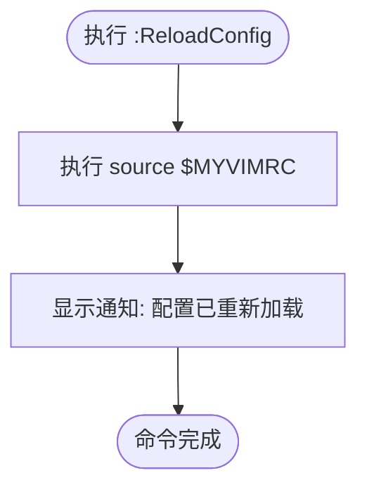
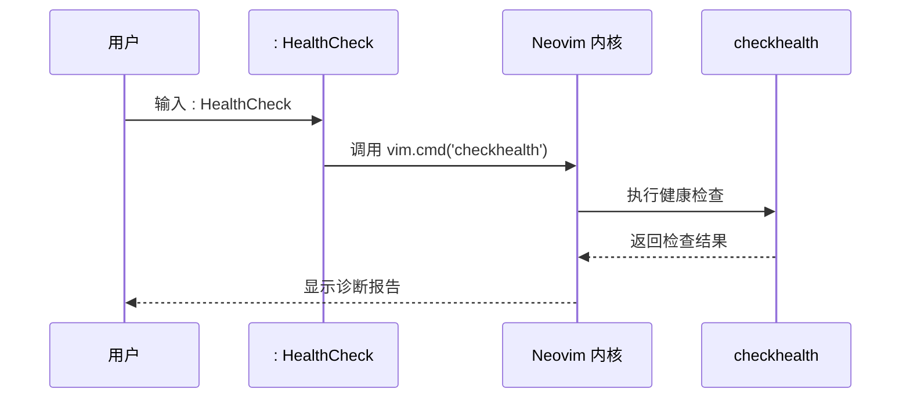
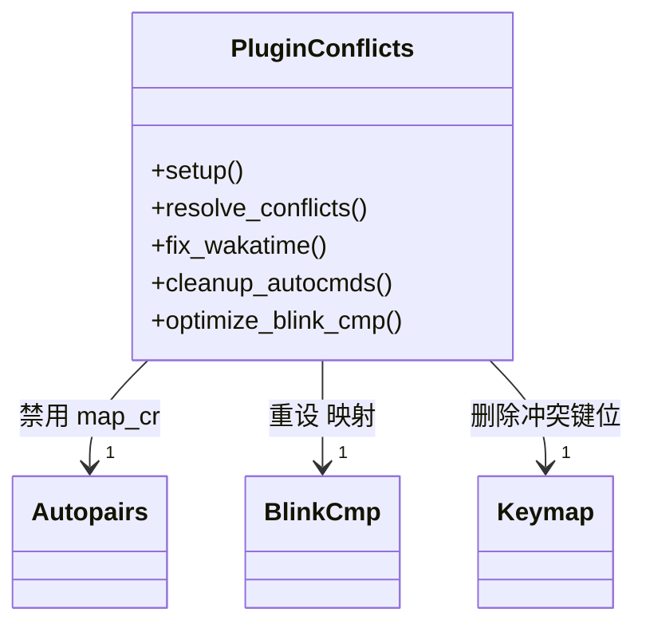
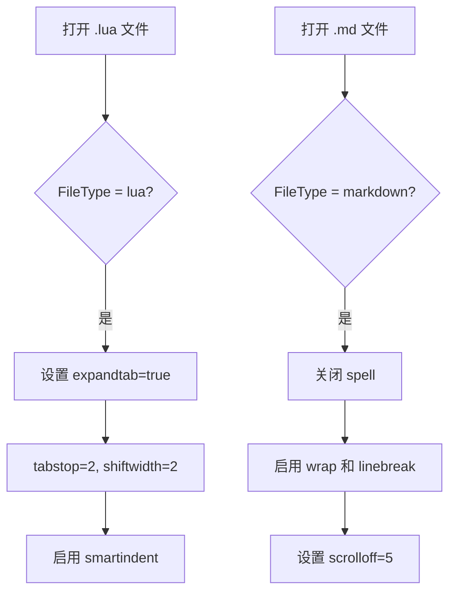
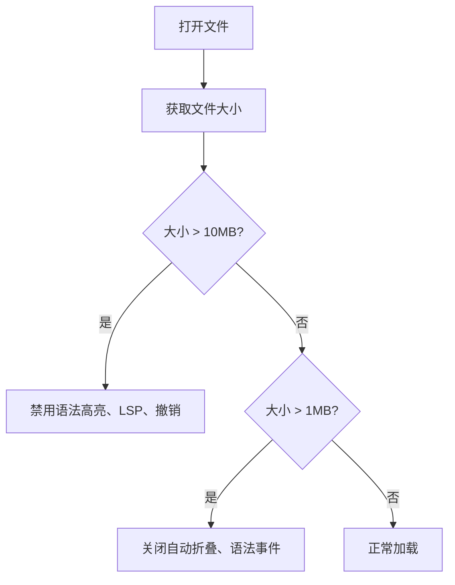

# 自定义命令与自动化

<cite>
**本文档引用的文件**  
- [init.lua](file://init.lua)
- [lua/core/init_optimized.lua](file://lua/core/init_optimized.lua)
- [lua/core/plugin_conflicts.lua](file://lua/core/plugin_conflicts.lua)
- [lua/config/autocmds.lua](file://lua/config/autocmds.lua)
- [lua/config/lazy.lua](file://lua/config/lazy.lua)
</cite>

## 目录
1. [简介](#简介)
2. [自定义用户命令](#自定义用户命令)
3. [自动化行为分析](#自动化行为分析)
4. [用户操作指南](#用户操作指南)
5. [结论](#结论)

## 简介
本文档详细说明了在 Neovim 配置中通过 `vim.api.nvim_create_user_command` 注册的自定义命令及其功能，包括 `:ReloadConfig`、`:HealthCheck` 和 `:FixConflicts`。同时解析了 `autocmds.lua` 中定义的关键自动化行为，如保存时自动格式化、文件类型检测后自动启用插件以及启动时执行优化脚本等。最后提供用户如何查询和扩展自定义命令的指导。

**Section sources**
- [init.lua](file://init.lua#L1-L50)
- [lua/core/init_optimized.lua](file://lua/core/init_optimized.lua#L1-L235)

## 自定义用户命令

### ReloadConfig 命令
`:ReloadConfig` 命令用于重新加载当前 Neovim 的 Lua 配置文件。该命令通过执行 `source $MYVIMRC` 实现配置热重载，避免重启编辑器即可应用更改。执行后会显示通知提示“配置已重新加载”。



**Diagram sources**
- [lua/core/init_optimized.lua](file://lua/core/init_optimized.lua#L95-L98)

**Section sources**
- [lua/core/init_optimized.lua](file://lua/core/init_optimized.lua#L95-L98)

### HealthCheck 命令
`:HealthCheck` 命令调用内置的 `checkhealth` 功能，诊断系统环境、插件依赖及 LSP 配置状态。此命令帮助用户快速识别潜在问题，例如缺少语言服务器或 Python 包未安装。



**Diagram sources**
- [lua/core/init_optimized.lua](file://lua/core/init_optimized.lua#L107-L110)

**Section sources**
- [lua/core/init_optimized.lua](file://lua/core/init_optimized.lua#L107-L110)

### FixConflicts 命令
`:FixConflicts` 命令用于解决插件之间的功能与键位映射冲突。它通过调用 `require("config.plugin_conflicts").resolve_conflicts()` 来处理多个补全插件（如 `nvim-autopairs` 与 `mini.pairs`）之间的映射冲突，并确保 `blink.cmp` 的回车键行为优先级最高。



**Diagram sources**
- [lua/core/plugin_conflicts.lua](file://lua/core/plugin_conflicts.lua#L45-L85)
- [lua/core/init_optimized.lua](file://lua/core/init_optimized.lua#L111-L114)

**Section sources**
- [lua/core/init_optimized.lua](file://lua/core/init_optimized.lua#L111-L114)
- [lua/core/plugin_conflicts.lua](file://lua/core/plugin_conflicts.lua#L1-L157)

## 自动化行为分析

### 保存时自动格式化（format-on-save）
尽管 `autocmds.lua` 中注释掉了手动的 `BufWritePre` 格式化逻辑，但实际由 LazyVim 与 `conform.nvim` 统一管理。系统会在保存支持的语言文件（如 Lua、Python、Go 等）前自动调用 LSP 或 treesitter 进行代码格式化，确保代码风格一致。

**Section sources**
- [lua/config/autocmds.lua](file://lua/config/autocmds.lua#L30-L50)

### 文件类型检测后自动启用相应插件
当检测到特定文件类型时，Neovim 会自动应用对应的缩进与编辑设置。例如：
- **Lua 文件**：使用 2 空格缩进，启用智能缩进。
- **Markdown/文本文件**：启用自动折行、禁用拼写检查。

这些行为通过 `FileType` 自动命令实现，提升不同文件类型的编辑体验。



**Diagram sources**
- [lua/config/autocmds.lua](file://lua/config/autocmds.lua#L105-L125)

**Section sources**
- [lua/config/autocmds.lua](file://lua/config/autocmds.lua#L105-L125)

### 启动时执行优化脚本
在 Neovim 启动过程中，`init_optimized.lua` 被调用以执行一系列性能与用户体验优化。流程如下：

```mermaid
flowchart LR
A[启动 Neovim] --> B[加载 init.lua]
B --> C[require('config.lazy')]
C --> D[require('core/init_optimized').setup()]
D --> E[设置基础选项]
D --> F[解决插件冲突]
D --> G[加载键位映射]
D --> H[创建用户命令]
D --> I[设置自动命令]
D --> J[最终优化]
J --> K[显示完成通知]
```

关键步骤包括延迟加载键位映射（避免冲突）、设置剪贴板兼容性、创建自定义命令和自动清除错误状态。

**Diagram sources**
- [init.lua](file://init.lua#L4-L10)
- [lua/core/init_optimized.lua](file://lua/core/init_optimized.lua#L1-L235)

**Section sources**
- [init.lua](file://init.lua#L4-L10)
- [lua/core/init_optimized.lua](file://lua/core/init_optimized.lua#L1-L235)

### 大文件性能优化
对于大文件（>1MB），系统自动启用性能优化策略：
- **1MB~10MB**：关闭语法事件监听，限制 TreeSitter 解析大小。
- **>10MB**：禁用语法高亮、撤销历史、交换文件，并停止 LSP 服务。

该机制显著提升大文件打开速度与响应性能。



**Diagram sources**
- [lua/config/autocmds.lua](file://lua/config/autocmds.lua#L170-L220)

**Section sources**
- [lua/config/autocmds.lua](file://lua/config/autocmds.lua#L170-L220)

## 用户操作指南

### 查询所有自定义命令
用户可在 Neovim 命令模式下输入 `:command` 查看所有已注册的用户命令。输出将列出命令名称、参数需求及描述信息，便于发现可用功能。

**Section sources**
- [lua/core/init_optimized.lua](file://lua/core/init_optimized.lua#L95-L118)

### 扩展新命令
要添加新的自定义命令，可在 `lua/core/init_optimized.lua` 的 `create_user_commands` 函数中使用 `vim.api.nvim_create_user_command` 注册。示例如下：

```lua
vim.api.nvim_create_user_command('MyCommand', function()
    print('Hello from custom command!')
end, { desc = '我的自定义命令' })
```

建议将新命令集中管理，并通过模块化方式组织逻辑。

**Section sources**
- [lua/core/init_optimized.lua](file://lua/core/init_optimized.lua#L95-L118)

## 结论
本文档全面解析了当前 Neovim 配置中的自定义命令与自动化行为。通过 `ReloadConfig`、`HealthCheck` 和 `FixConflicts` 等命令，用户可高效维护配置状态；而 `autocmds.lua` 中的自动化规则则提升了编辑效率与系统稳定性。用户可通过标准命令接口查询和扩展功能，实现高度个性化的开发环境。