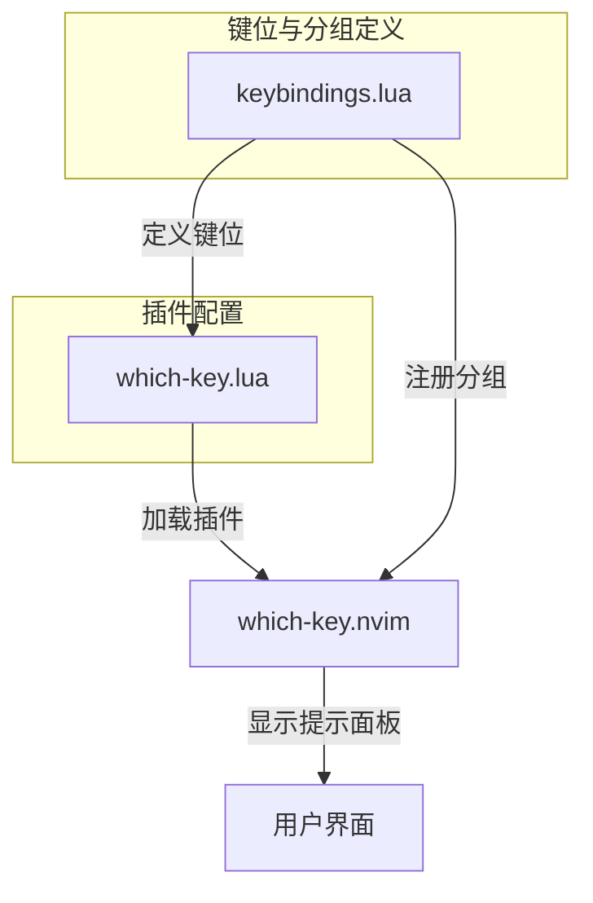
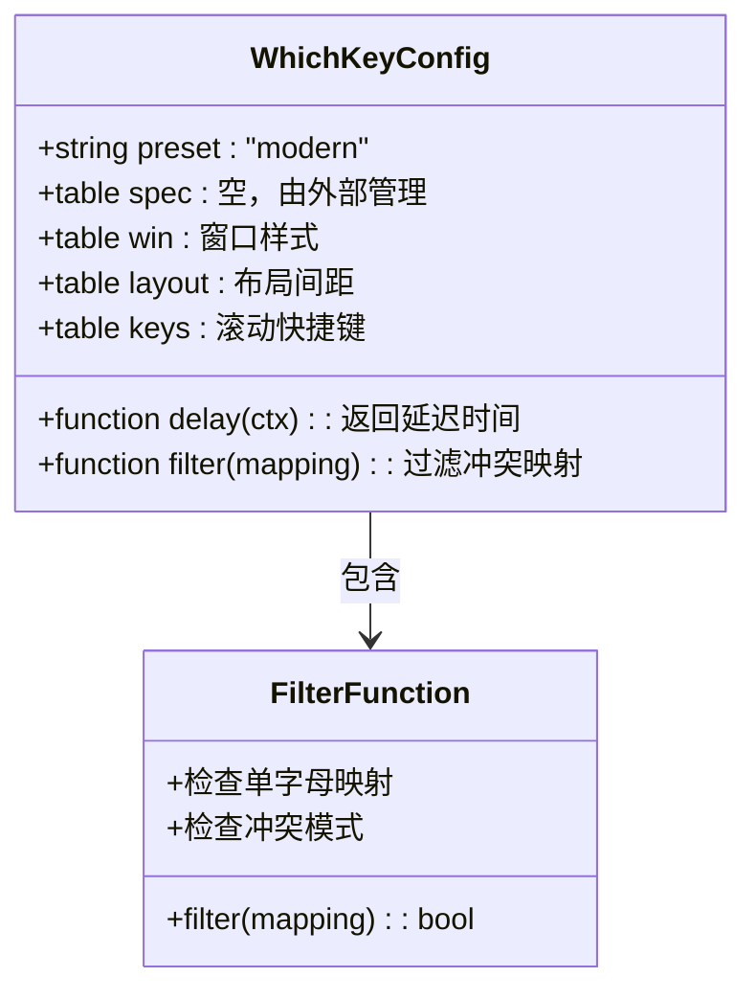
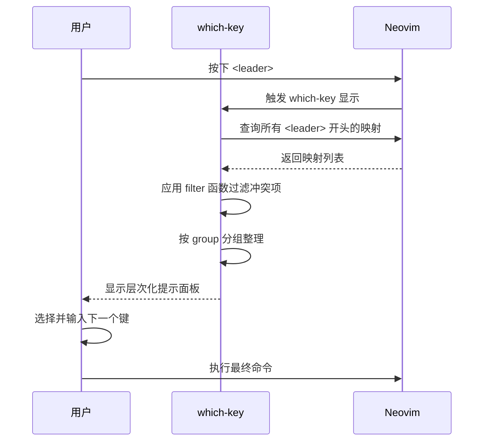

# Which-Key 可视化提示

<cite>
**本文档引用文件**  
- [which-key.lua](file://lua/plugins/which-key.lua) - *Updated in recent commit*
- [keybindings.lua](file://lua/config/keybindings.lua) - *Updated in recent commit*
</cite>

## 更新摘要
**已做更改**  
- 更新了“详细组件分析”中的“分组结构设计”部分，新增了趣味游戏和通知管理分组
- 新增了“通知管理”与“趣味游戏”功能的说明
- 更新了架构概览与依赖分析以反映新功能
- 更新了故障排除指南以包含新分组的排查建议
- 所有文件引用均已更新为中文标题并标注变更状态

## 目录
1. [简介](#简介)
2. [项目结构](#项目结构)
3. [核心组件](#核心组件)
4. [架构概览](#架构概览)
5. [详细组件分析](#详细组件分析)
6. [依赖分析](#依赖分析)
7. [性能考量](#性能考量)
8. [故障排除指南](#故障排除指南)
9. [结论](#结论)

## 简介
本文档全面文档化 `which-key.nvim` 插件的集成配置，重点说明如何构建层次化的快捷键提示面板以提升命令的可发现性与操作效率。详细解释了 which-key 的分组结构设计（如 g、t、x 等前缀分组）及其与 `<leader>` 键的协同工作机制。展示了如何定义动态提示条目、设置超时参数以及定制 UI 样式。结合实际用例，演示按下 `<leader>` 后如何触发上下文相关的命令菜单，并指导用户扩展自定义命令组。同时包含调试技巧，帮助用户排查提示不显示或延迟等问题。

## 项目结构
Neovim 配置采用模块化结构，将插件配置、键位绑定、核心功能等分离到不同目录中。`which-key` 插件的配置位于 `lua/plugins/which-key.lua`，而所有键位绑定和 which-key 的分组定义则统一在 `lua/config/keybindings.lua` 中管理，实现了配置的集中化与解耦。

**Section sources**
- [which-key.lua](file://lua/plugins/which-key.lua#L1-L63) - *Updated in recent commit*
- [keybindings.lua](file://lua/config/keybindings.lua#L1-L550) - *Updated in recent commit*

## 核心组件
核心组件包括 `which-key.nvim` 插件本身及其在 `keybindings.lua` 中的集成配置。插件以 `VeryLazy` 模式加载，确保性能优化。其核心功能是通过可视化面板展示所有以 `<leader>` 开头的快捷键组合，极大地提升了快捷键的可发现性。

**Section sources**
- [which-key.lua](file://lua/plugins/which-key.lua#L1-L63) - *Updated in recent commit*
- [keybindings.lua](file://lua/config/keybindings.lua#L1-L550) - *Updated in recent commit*

## 架构概览
系统架构围绕 `which-key` 插件构建，`which-key.lua` 负责插件的加载和基础选项配置，而 `keybindings.lua` 负责所有具体键位的定义和 which-key 分组的注册。这种分离使得配置清晰且易于维护。



**Diagram sources**
- [which-key.lua](file://lua/plugins/which-key.lua#L1-L63) - *Updated in recent commit*
- [keybindings.lua](file://lua/config/keybindings.lua#L1-L550) - *Updated in recent commit*

## 详细组件分析

### Which-Key 插件配置分析
该部分分析 `which-key.lua` 文件中的配置，定义了插件的行为和外观。

#### 配置选项详解


**Diagram sources**
- [which-key.lua](file://lua/plugins/which-key.lua#L10-L50) - *Updated in recent commit*

**Section sources**
- [which-key.lua](file://lua/plugins/which-key.lua#L1-L63) - *Updated in recent commit*

### 键位绑定与分组管理分析
该部分分析 `keybindings.lua` 文件，它统一管理所有键位和 which-key 分组，解决了潜在的冲突问题。

#### 分组结构设计

```mermaid
flowchart TD
Start["<leader>"] --> F["f: file/find"]
Start --> F2["F: format"]
Start --> W["w: windows"]
Start --> Q["q: quit/session"]
Start --> L["p: lsp"]
Start --> D["d: diagnostics"]
Start --> G["G: 趣味游戏"]
Start --> T["T: 终端工具"]
Start --> C["C: 配置管理"]
Start --> N["N: 通知管理"]
Start --> Help["?: help/keymaps"]
L --> L1["pr: 重命名"]
L --> L2["pa: 代码操作"]
L --> L3["pi: 跳转到实现"]
L --> L4["pR: 查找引用"]
D --> D1["dd: 诊断列表"]
D --> D2["db: 缓冲区诊断"]
D --> D3["dq: 快速修复列表"]
D --> D4["dt: Todo 列表"]
G --> Gl["Gl: 生命游戏"]
G --> Gr["Gr: 代码雨动画"]
G --> Gz["Gz: 禅意模式"]
N --> Nh["Nh: 通知历史"]
N --> Nc["Nc: 清理通知"]
N --> Nl["Nl: 设置日志级别"]
C --> Cc["Cc: 编辑配置文件"]
C --> Cv["Cv: 编辑键位配置"]
C --> Cp["Cp: 编辑插件配置"]
C --> Cs["Cs: 编辑代码片段"]
C --> Cr["Cr: 重新加载配置"]
```


**Diagram sources**
- [keybindings.lua](file://lua/config/keybindings.lua#L226-L257) - *Updated in recent commit*

#### 动态提示条目与自定义命令


**Diagram sources**
- [which-key.lua](file://lua/plugins/which-key.lua#L1-L63) - *Updated in recent commit*
- [keybindings.lua](file://lua/config/keybindings.lua#L226-L257) - *Updated in recent commit*

**Section sources**
- [keybindings.lua](file://lua/config/keybindings.lua#L226-L257) - *Updated in recent commit*

## 依赖分析
`which-key` 插件依赖于 Neovim 的键位映射系统。`keybindings.lua` 是其主要的依赖配置文件，负责提供所有需要显示的键位信息。此外，配置中还检查了 `LazyVim`, `trouble.nvim`, `dashboard-nvim`, `alpha-nvim`, `snacks.nvim` 等插件的存在，以实现功能的条件调用，形成了松散的依赖关系。

```mermaid
erDiagram
which-key-lua["which-key.lua"] ||--o{ keybindings-lua["keybindings.lua"] : "依赖"
keybindings-lua -->|条件调用| LazyVim["LazyVim"]
keybindings-lua -->|条件调用| Trouble["trouble.nvim"]
keybindings-lua -->|条件调用| Dashboard["dashboard-nvim/alpha-nvim"]
keybindings-lua -->|条件调用| Snacks["snacks.nvim"]
which-key-lua -->|显示| Neovim["Neovim UI"]
```

**Diagram sources**
- [which-key.lua](file://lua/plugins/which-key.lua#L1-L63) - *Updated in recent commit*
- [keybindings.lua](file://lua/config/keybindings.lua#L1-L550) - *Updated in recent commit*

**Section sources**
- [which-key.lua](file://lua/plugins/which-key.lua#L1-L63) - *Updated in recent commit*
- [keybindings.lua](file://lua/config/keybindings.lua#L1-L550) - *Updated in recent commit*

## 性能考量
配置中通过 `event = "VeryLazy"` 实现了插件的懒加载，仅在首次使用 `<leader>` 时才加载，优化了启动性能。`delay` 选项被设置为一个函数，对于插件相关的映射延迟为0，其他映射延迟400ms，这在保证用户体验的同时避免了不必要的延迟。`filter` 函数通过排除单字母和已知冲突的前缀（如 `g`, `s`），减少了提示面板的噪音，提升了响应速度和清晰度。

**Section sources**
- [which-key.lua](file://lua/plugins/which-key.lua#L5-L25) - *Updated in recent commit*

## 故障排除指南
本节提供常见问题的排查方法。

### 提示面板不显示
1.  **检查 `<leader>` 键**: 确认 `<leader>` 键已正确设置（通常为 `\` 或 `,`）。
2.  **检查插件加载**: 运行 `:lua print(pcall(require, 'which-key'))`，应返回 `true` 和 `table`。
3.  **检查键位冲突**: 使用 `<leader>?c` 命令（`CheckKeymapConflicts`）检查是否有冲突覆盖了 which-key 的触发。
4.  **检查 `filter` 函数**: 确保自定义的键位没有被 `filter` 函数过滤掉。例如，避免使用单字母作为 `<leader>` 后的第一个字符。

### 提示面板延迟或卡顿
1.  **检查 `delay` 设置**: 查看 `which-key.lua` 中的 `delay` 函数，确保逻辑正确。
2.  **简化分组**: 如果定义了过多的分组和条目，可能会导致生成面板时轻微卡顿，可考虑精简。
3.  **检查其他插件**: 某些插件可能在启动时执行耗时操作，影响 which-key 的首次加载。

### 分组未正确显示
1.  **检查 `wk.add()` 调用**: 确保 `keybindings.lua` 中的 `wk.add()` 在 `which-key` 插件加载后执行。本配置使用 `vim.schedule` 确保了这一点。
2.  **检查 `group` 定义**: 确认 `group` 字段的格式正确，例如 `{ "<leader>f", group = "file/find" }`。
3.  **新增分组排查**: 对于新增的 `<leader>G`（趣味游戏）和 `<leader>N`（通知管理）分组，确认 `snacks.nvim` 或相关插件已正确安装，否则提示可能不完整。

**Section sources**
- [which-key.lua](file://lua/plugins/which-key.lua#L1-L63) - *Updated in recent commit*
- [keybindings.lua](file://lua/config/keybindings.lua#L1-L550) - *Updated in recent commit*

## 结论
通过对 `which-key.lua` 和 `keybindings.lua` 的深入分析，可以看出该配置成功地集成并优化了 `which-key.nvim` 插件。通过精心设计的分组结构（如 `<leader>p` 代表 LSP，`<leader>d` 代表诊断）和有效的冲突解决策略，构建了一个高效、直观的可视化快捷键系统。延迟加载和智能过滤机制保证了性能和用户体验。用户可以轻松地通过 `<leader>?` 系列命令来探索和学习所有快捷键，极大地提升了 Neovim 的可操作性和生产力。近期更新新增了 `<leader>G` 趣味游戏和 `<leader>N` 通知管理等分组，进一步丰富了功能生态，体现了配置的可扩展性与用户友好性。