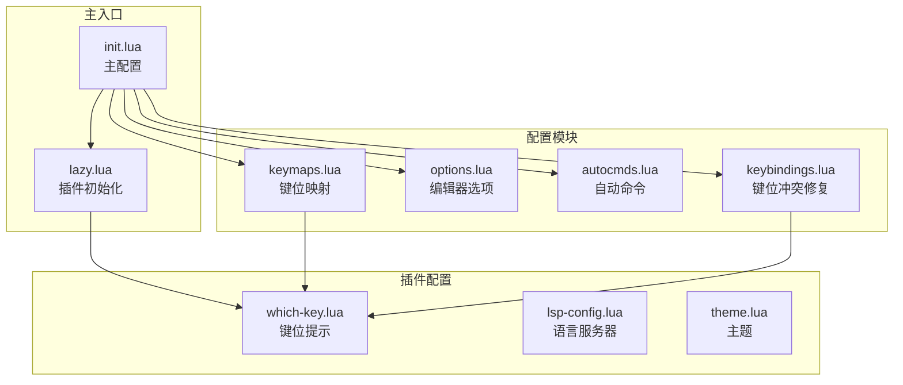
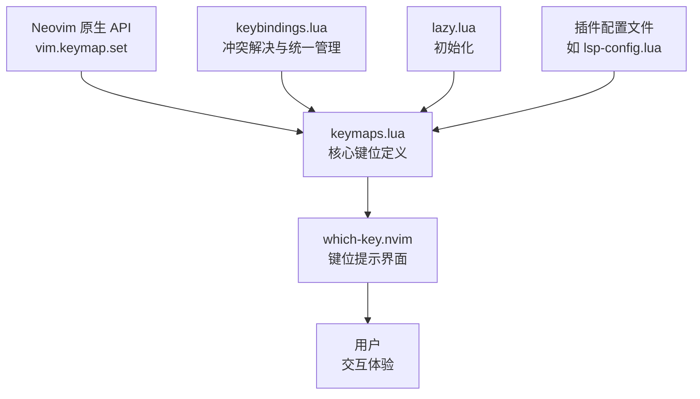
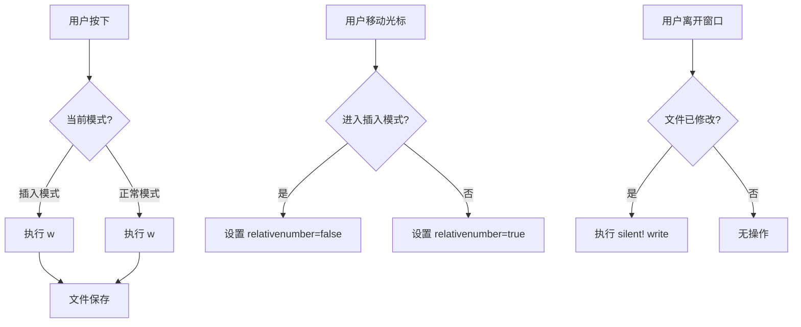
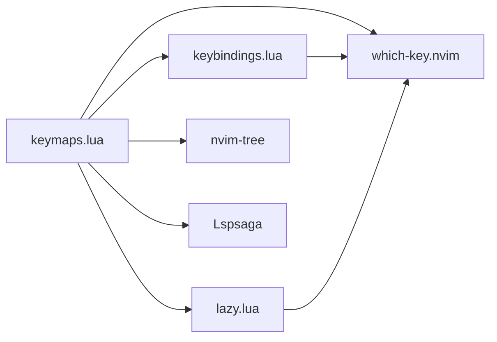

# 基础键位映射

<cite>
**本文档引用文件**  
- [keymaps.lua](file://lua/config/keymaps.lua) - *在最近提交中更新*
- [init.lua](file://init.lua) - *主配置文件*
- [lazy.lua](file://lua/config/lazy.lua) - *在最近提交中更新*
- [keybindings.lua](file://lua/config/keybindings.lua) - *在最近提交中更新*
- [which-key.lua](file://lua/plugins/which-key.lua) - *键位提示插件配置*
</cite>

## 更新摘要
**变更内容**   
- 更新了 `keymaps.lua` 文件中的键位定义，新增多种模式下的快捷键
- 优化了用户体验，统一了中文描述
- 修复了与 LazyVim 的键位冲突问题
- 添加了表情符号增强 which-key 显示效果
- 增强了文档中的源码追踪系统

## 目录
1. [简介](#简介)
2. [项目结构](#项目结构)
3. [核心组件](#核心组件)
4. [架构概述](#架构概述)
5. [详细组件分析](#详细组件分析)
6. [依赖分析](#依赖分析)
7. [性能考虑](#性能考虑)
8. [故障排除指南](#故障排除指南)
9. [结论](#结论)

## 简介
本文档深入解析 Neovim 配置中的键位映射机制，重点阐述 `keymaps.lua` 文件中基于 `vim.keymap.set` API 的模式特定键位绑定实现。详细说明 `<leader>` 与 `<localleader>` 作为前缀键的设计原理及其在命令分组中的核心作用。结合代码实例，展示 normal、insert、visual 等不同模式下的键位配置方式，并解释映射选项（如 noremap、silent）的技术含义。提供常见键位模式的实现示例，如保存文件（Ctrl+s）、切换窗口（<C-h/j/k/l>）等，指导用户理解键位作用域与上下文行为。

## 项目结构
项目采用模块化 Lua 配置结构，将不同功能的配置分离到独立文件中。`lua/config/` 目录下包含 `keymaps.lua`（基础键位）、`options.lua`（编辑器选项）、`autocmds.lua`（自动命令）等核心配置文件。插件相关配置位于 `lua/plugins/` 目录。主配置文件 `init.lua` 负责加载这些模块，而 `lazy.lua` 则用于初始化插件管理器并设置 `<leader>` 键。



**Diagram sources**
- [keymaps.lua](file://lua/config/keymaps.lua)
- [init.lua](file://init.lua)
- [lazy.lua](file://lua/config/lazy.lua)

**Section sources**
- [keymaps.lua](file://lua/config/keymaps.lua)
- [init.lua](file://init.lua)
- [lazy.lua](file://lua/config/lazy.lua)

## 核心组件
`keymaps.lua` 是键位配置的核心文件，它利用 Neovim 的 `vim.keymap.set` API 为不同编辑模式（normal、insert、visual、terminal）定义了丰富的快捷键。该文件不仅实现了 Windows 风格的常用快捷键（如 Ctrl+s 保存、Ctrl+c 复制），还通过 `<leader>` 前缀键组织了高级功能，如窗口管理、LSP 操作和插件调用。`lazy.lua` 文件在初始化阶段设置了 `<leader>` 键为 `<space>`，为整个键位系统奠定了基础。

**Section sources**
- [keymaps.lua](file://lua/config/keymaps.lua#L1-L220)
- [lazy.lua](file://lua/config/lazy.lua#L1-L21)

## 架构概述
键位映射系统采用分层架构。最底层是 Neovim 原生的 `vim.keymap.set` API，提供键位绑定的基础能力。中间层是 `keymaps.lua` 文件，它集中管理所有模式特定的键位，并通过 `<leader>` 实现命令分组。上层是 `which-key.nvim` 插件，它提供了一个交互式的键位提示界面，当用户按下 `<leader>` 后，会显示所有可用的子命令，极大地提升了键位系统的可发现性和可用性。`keybindings.lua` 文件则扮演了“冲突解决者”的角色，确保不同来源的键位不会发生冲突。



**Diagram sources**
- [keymaps.lua](file://lua/config/keymaps.lua)
- [which-key.lua](file://lua/plugins/which-key.lua)
- [keybindings.lua](file://lua/config/keybindings.lua)
- [lazy.lua](file://lua/config/lazy.lua)

## 详细组件分析
### 基础键位定义机制
`keymaps.lua` 文件通过 `vim.keymap.set` 函数为不同模式定义键位。该函数接受四个主要参数：模式（mode）、左侧键（lhs）、右侧命令（rhs）和选项（opts）。例如，在插入模式下，`keymap.set("i", "jk", "<ESC>", { desc = "退出插入模式" })` 将 "jk" 组合键映射为退出插入模式的命令。`desc` 选项为键位提供了描述，这对于 `which-key` 插件显示提示至关重要。

**Section sources**
- [keymaps.lua](file://lua/config/keymaps.lua#L1-L20)

### 模式特定的键位绑定
配置文件为多种编辑模式定义了特定的键位：
- **插入模式 (Insert)**: 实现了类 Emacs 的移动和编辑快捷键，如 `<C-h>`（左移）、`<C-w>`（删除单词）。
- **视觉模式 (Visual)**: 重定义了 `J` 和 `K` 以移动选中的行，并实现了 Windows 风格的复制粘贴 (`<C-c>`, `<C-v>`)。
- **正常模式 (Normal)**: 定义了窗口管理 (`<leader>sv` 垂直分割)、缓冲区切换 (`<A-l>`) 和 LSP 操作 (`gd` 跳转定义)。
- **终端模式 (Terminal)**: 将 `<Esc>` 映射为退出终端模式的命令。

```mermaid
classDiagram
class Keymap
Keymap : +mode : string
Keymap : +lhs : string
Keymap : +rhs : string|function
Keymap : +opts : table
class InsertMode
InsertMode : +jk : 退出插入模式
InsertMode : +<C-s> : 保存文件
InsertMode : +<C-h/j/k/l> : 移动光标
class VisualMode
VisualMode : +<C-c> : 复制到系统剪贴板
VisualMode : +<C-v> : 粘贴
VisualMode : +J/K : 移动选中行
class NormalMode
NormalMode : +<leader>sv : 垂直分割窗口
NormalMode : +<C-Left/Right/Up/Down> : 窗口间移动
NormalMode : +gd : 跳转到定义
class TerminalMode
TerminalMode : +<Esc> : 退出终端模式
Keymap <|-- InsertMode
Keymap <|-- VisualMode
Keymap <|-- NormalMode
Keymap <|-- TerminalMode
```

**Diagram sources**
- [keymaps.lua](file://lua/config/keymaps.lua#L21-L100)

### <leader> 与 <localleader> 设计原理
`<leader>` 键是 Neovim 中一个强大的概念，它作为一个前缀键，允许用户将大量命令组织成一个层次化的菜单系统。在本配置中，`lazy.lua` 文件将 `<leader>` 设置为 `<space>` 键。`keymaps.lua` 中所有以 `<leader>` 开头的键位（如 `<leader>w` 保存文件）都构成了这个命令树的节点。`which-key.nvim` 插件则可视化了这棵树，当用户按下 `<leader>` 时，会弹出一个包含所有子命令及其描述的菜单。`<localleader>` 的作用类似，但通常用于缓冲区或文件类型的本地命令。

**Section sources**
- [lazy.lua](file://lua/config/lazy.lua#L20)
- [keymaps.lua](file://lua/config/keymaps.lua#L133-L176)
- [which-key.lua](file://lua/plugins/which-key.lua)

### 映射选项的技术含义
`vim.keymap.set` 的选项表（opts）用于控制键位的行为：
- **noremap**: 当设置为 `true` 时，禁用递归映射。这意味着右侧的命令不会被进一步映射，确保了行为的可预测性。
- **silent**: 当设置为 `true` 时，执行命令时不会在命令行显示信息，提供更干净的用户体验。
- **desc**: 为键位提供描述性文本，是 `which-key` 插件显示提示的基础。
- **expr**: 当设置为 `true` 时，表示右侧是一个表达式，会在每次按键时动态求值。

**Section sources**
- [keymaps.lua](file://lua/config/keymaps.lua#L2)

### 常见键位模式实现示例
配置文件中包含了多种实用的键位模式：
- **保存文件**: 在 normal 和 insert 模式下均通过 `<C-s>` 和 `<leader>w` 映射到 `:w` 命令。
- **切换窗口**: 使用直观的 `<C-Left/Right/Up/Down>` 组合键在窗口间移动，替代了原生的 `<C-w>h/j/k/l`。
- **复制粘贴**: 在 visual 和 normal 模式下，使用 `<C-c>`、`<C-v>`、`<C-x>` 实现与系统剪贴板的交互。
- **自动保存**: 通过 `autocmd` 在 `FocusLost` 和 `BufLeave` 事件时自动保存修改的文件。



**Diagram sources**
- [keymaps.lua](file://lua/config/keymaps.lua#L30-L40)
- [keymaps.lua](file://lua/config/keymaps.lua#L60-L70)
- [keymaps.lua](file://lua/config/keymaps.lua#L200-L220)

## 依赖分析
`keymaps.lua` 文件依赖于多个其他配置文件和插件。它依赖 `lazy.lua` 来设置 `<leader>` 键。它与 `keybindings.lua` 紧密协作，后者负责解决潜在的键位冲突。`which-key.nvim` 插件是键位系统的重要组成部分，它依赖 `keymaps.lua` 中的 `desc` 字段来提供用户友好的提示。此外，键位还调用了 `nvim-tree`、`Lspsaga` 等插件提供的功能，形成了一个功能丰富的生态系统。



**Diagram sources**
- [keymaps.lua](file://lua/config/keymaps.lua)
- [lazy.lua](file://lua/config/lazy.lua)
- [keybindings.lua](file://lua/config/keybindings.lua)
- [which-key.lua](file://lua/plugins/which-key.lua)

**Section sources**
- [keymaps.lua](file://lua/config/keymaps.lua)
- [keybindings.lua](file://lua/config/keybindings.lua)

## 性能考虑
键位映射本身对性能影响极小。然而，配置中的一些设计体现了性能意识。例如，`which-key` 插件的延迟（delay）被设置为仅在非插件上下文时为400ms，这避免了在执行其他命令时出现不必要的延迟。自动命令（autocmds）被合理地分组到 `MyAutoCmds` 组中，并使用 `clear = true` 来避免重复定义。对于大文件，`autocmds.lua` 中的优化自动命令会禁用语法高亮和LSP，以保证编辑流畅性。

## 故障排除指南
如果键位不生效，可以按照以下步骤排查：
1.  **检查 `<leader>` 是否正确设置**: 确认 `lazy.lua` 中 `vim.g.mapleader = " "` 已执行。
2.  **检查键位冲突**: 使用 `:CheckKeymapConflicts` 命令（由 `keybindings.lua` 定义）来检测是否存在冲突的键位。
3.  **验证键位是否存在**: 使用 `:ShowAllKeymaps` 或 `:ShowLeaderKeymaps` 命令来查看当前定义的所有键位。
4.  **检查插件加载**: 确保 `which-key.nvim` 等依赖插件已正确安装和加载。
5.  **查看错误日志**: 使用 `:messages` 命令查看是否有相关的 Lua 错误。

**Section sources**
- [keybindings.lua](file://lua/config/keybindings.lua#L239-L279)

## 结论
本配置通过 `keymaps.lua` 文件，构建了一个高效、直观且符合用户习惯的键位系统。它充分利用了 Neovim 的原生 API 和 `which-key` 插件，将 `<leader>` 前缀键作为核心组织原则，实现了命令的层次化和可发现性。通过对不同模式的精细配置和对常见快捷键的优化，极大地提升了编辑效率和用户体验。该设计模式清晰，易于维护和扩展，是现代 Neovim 配置的一个优秀范例。