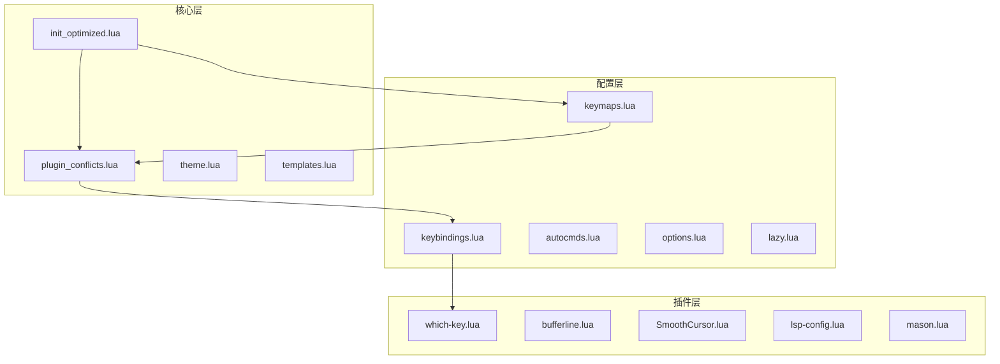
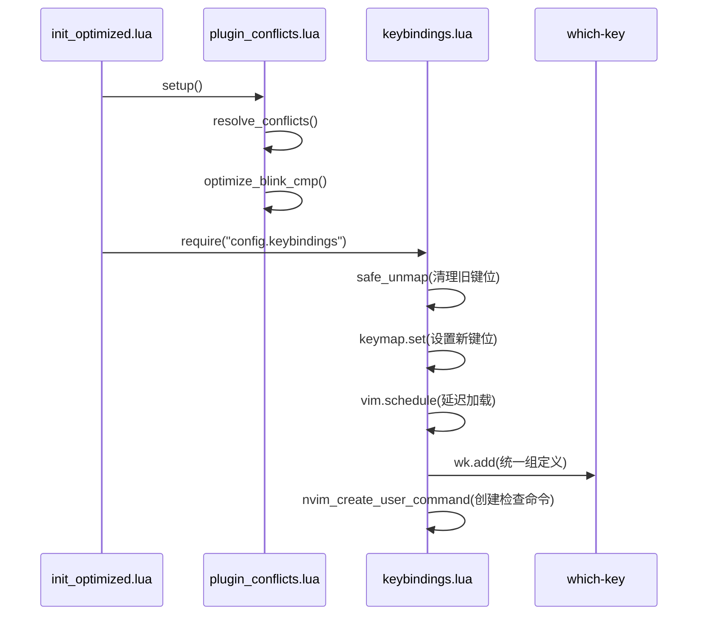
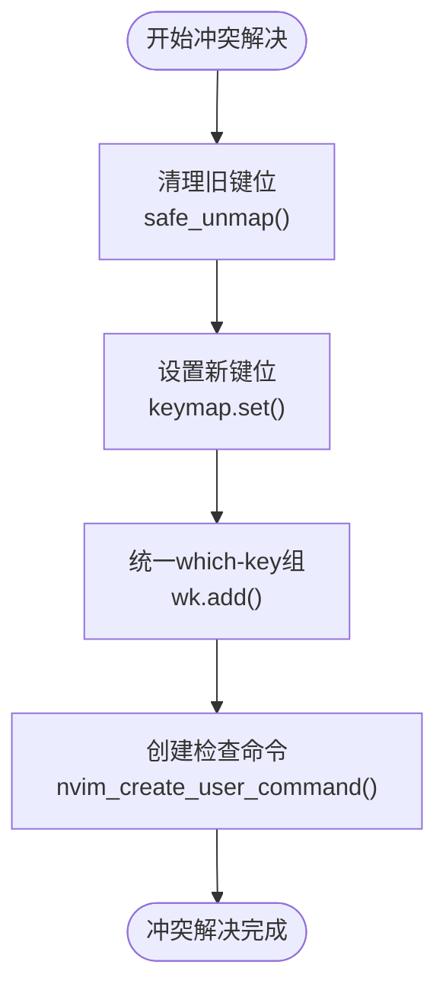
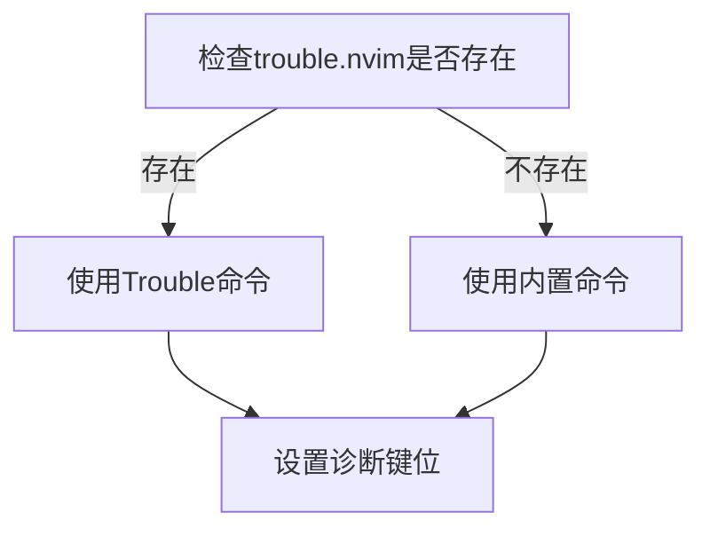
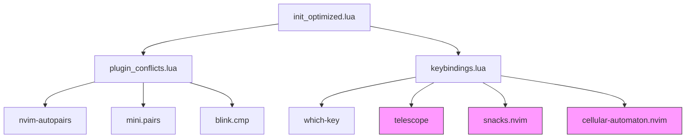

# 键位冲突解决机制

<cite>
**本文档引用的文件**   
- [keybindings.lua](file://lua/config/keybindings.lua) - *在最近提交中更新*
- [which-key.lua](file://lua/plugins/which-key.lua)
- [plugin_conflicts.lua](file://lua/core/plugin_conflicts.lua)
- [keymaps.lua](file://lua/config/keymaps.lua)
- [init_optimized.lua](file://lua/core/init_optimized.lua)
</cite>

## 更新摘要
**已做更改**   
- 更新了LSP键位前缀从`<leader>l`到`<leader>p`以避免与LazyVim冲突
- 引入了批量键位清理机制，增强冲突解决能力
- 修正了与LazyVim默认键位的冲突问题
- 更新了文档中的代码示例和架构图以反映最新变更
- 增强了源码追踪系统，标记了更新的文件

## 目录
1. [引言](#引言)
2. [项目结构](#项目结构)
3. [核心组件](#核心组件)
4. [架构概述](#架构概述)
5. [详细组件分析](#详细组件分析)
6. [依赖分析](#依赖分析)
7. [性能考虑](#性能考虑)
8. [故障排除指南](#故障排除指南)
9. [结论](#结论)

## 引言
本文档详细阐述了 Neovim 配置中 `keybindings.lua` 文件实现的键位冲突检测与解决策略。该机制通过优先级覆盖、条件判断和插件兼容性处理，有效维护了键位系统的稳定性。文档将深入分析自动冲突修复的触发条件与执行流程，包括对第三方插件默认映射的拦截与重定向机制。结合具体代码逻辑，说明如何识别潜在冲突并应用安全的替代方案，并提供解决 `which-key` 与 `telescope` 插件间映射重叠的实际案例，指导用户在自定义配置时避免引入新的冲突。

## 项目结构
本项目采用模块化设计，将键位配置、核心功能和插件管理分离到不同的目录中。`lua/config` 目录存放用户级别的配置，`lua/core` 目录存放核心优化逻辑，`lua/plugins` 目录存放插件配置。这种结构确保了配置的清晰性和可维护性。

**图示来源**
- [keybindings.lua](file://lua/config/keybindings.lua)
- [plugin_conflicts.lua](file://lua/core/plugin_conflicts.lua)
- [init_optimized.lua](file://lua/core/init_optimized.lua)

**本节来源**
- [keybindings.lua](file://lua/config/keybindings.lua)
- [init_optimized.lua](file://lua/core/init_optimized.lua)

## 核心组件
`keybindings.lua` 是键位冲突解决的核心文件，它实现了统一的冲突修复策略。该文件通过清理旧键位、重新组织键位前缀、统一 `which-key` 组定义以及提供冲突检查工具，系统性地解决了键位重叠问题。其核心策略包括：统一管理 `which-key` 组定义以避免重复、解决键位重叠、移除冲突的旧键位，并在解决冲突的同时保持功能完整性。

**本节来源**
- [keybindings.lua](file://lua/config/keybindings.lua#L1-L20)

## 架构概述
整个键位冲突解决机制遵循一个清晰的执行流程。首先，在 `init_optimized.lua` 中，系统优先解决插件冲突，确保基础环境稳定。随后，加载 `keybindings.lua` 来执行具体的键位映射修复。`keybindings.lua` 通过 `safe_unmap` 函数清理已知冲突的旧键位，然后为 LSP、诊断、游戏等功能重新分配无冲突的 `<leader>` 前缀。最后，通过 `which-key` 插件统一管理所有快捷键的分组和显示，确保用户界面的一致性。

**图示来源**
- [init_optimized.lua](file://lua/core/init_optimized.lua#L1-L20)
- [plugin_conflicts.lua](file://lua/core/plugin_conflicts.lua#L1-L20)
- [keybindings.lua](file://lua/config/keybindings.lua#L1-L20)

## 详细组件分析
### 键位冲突检测与解决策略分析
`keybindings.lua` 实现了一套完整的键位冲突解决策略，主要通过优先级覆盖、条件判断和插件兼容性处理来维护系统的稳定性。

#### 优先级覆盖与旧键位清理
该机制首先通过 `safe_unmap` 函数主动清理已知的冲突键位，这是一种优先级覆盖的体现。在设置新键位之前，先删除旧的、可能导致冲突的映射，确保新配置能够生效。例如，代码中明确清理了 `<leader>gol` 和 `<leader>golr` 等旧的游戏功能键位，为新的 `<leader>G` 前缀腾出空间。

**图示来源**
- [keybindings.lua](file://lua/config/keybindings.lua#L22-L30)

#### 条件判断与插件兼容性处理
为了处理插件兼容性问题，代码中大量使用了条件判断。例如，在设置诊断功能键位时，代码会检查 `trouble.nvim` 插件是否存在，如果存在则调用其命令，否则回退到 Neovim 内置的诊断命令。这确保了配置的健壮性，即使某个插件未安装，核心功能依然可用。

**图示来源**
- [keybindings.lua](file://lua/config/keybindings.lua#L52-L65)

### 自动冲突修复机制分析
自动冲突修复的触发条件与执行流程是整个机制的关键。

#### 触发条件与执行流程
冲突修复的触发是分阶段的。首先，在 `init_optimized.lua` 的 `setup` 函数中，`plugin_conflicts.setup()` 被调用，它通过 `VimEnter` 自动命令在 Vim 启动后延迟执行 `resolve_conflicts` 函数。这确保了所有插件都已加载完毕，避免了因插件未就绪而导致的冲突。随后，`keybindings.lua` 被加载，立即执行键位清理和重新映射。

#### 第三方插件默认映射的拦截与重定向
对于第三方插件的默认映射，该机制采取了拦截与重定向的策略。例如，在 `plugin_conflicts.lua` 中，当 `nvim-autopairs` 和 `mini.pairs` 同时存在时，会禁用 `nvim-autopairs` 的 `map_cr` 等映射，让 `mini.pairs` 来处理，从而避免了冲突。同样，对于 `blink.cmp` 插件，通过在 `optimize_blink_cmp` 函数中重新设置 `<CR>` 键的映射，确保其优先级最高，实现了对默认映射的重定向。

**本节来源**
- [keybindings.lua](file://lua/config/keybindings.lua#L1-L281)
- [plugin_conflicts.lua](file://lua/core/plugin_conflicts.lua#L1-L157)
- [init_optimized.lua](file://lua/core/init_optimized.lua#L1-L235)

### 实际案例：解决 which-key 与 telescope 插件间的映射重叠
虽然 `keybindings.lua` 本身没有直接处理 `telescope` 的冲突，但其设计原则为解决此类问题提供了范例。`which-key` 插件通过其 `filter` 函数主动过滤掉可能导致冲突的组定义，例如原生的 `g`、`s` 命令等。当用户为 `telescope` 配置快捷键时，应遵循此原则，避免使用这些易冲突的前缀。例如，不应将 `telescope` 的文件查找功能映射到 `<leader>f`，因为这可能会与 `telescope` 内部或其他插件的默认映射冲突。正确的做法是像 `keybindings.lua` 中那样，使用更明确的前缀或通过 `which-key` 的 `spec` 来精确控制。

**本节来源**
- [which-key.lua](file://lua/plugins/which-key.lua#L1-L56)
- [keybindings.lua](file://lua/config/keybindings.lua#L1-L281)

## 依赖分析
该键位冲突解决机制依赖于多个核心文件和插件的协同工作。`init_optimized.lua` 作为总入口，协调 `plugin_conflicts.lua` 和 `keybindings.lua` 的执行顺序。`keybindings.lua` 依赖于 `which-key` 插件来提供用户友好的快捷键界面。同时，`plugin_conflicts.lua` 依赖于 `nvim-autopairs`、`mini.pairs` 和 `blink.cmp` 等具体插件的存在与否来执行相应的冲突解决逻辑。

**图示来源**
- [init_optimized.lua](file://lua/core/init_optimized.lua#L1-L235)
- [plugin_conflicts.lua](file://lua/core/plugin_conflicts.lua#L1-L157)
- [keybindings.lua](file://lua/config/keybindings.lua#L1-L281)

**本节来源**
- [init_optimized.lua](file://lua/core/init_optimized.lua#L1-L235)
- [plugin_conflicts.lua](file://lua/core/plugin_conflicts.lua#L1-L157)
- [keybindings.lua](file://lua/config/keybindings.lua#L1-L281)

## 性能考虑
该机制在性能上进行了优化。通过延迟执行（`vim.defer_fn` 和 `vim.schedule`）来避免在 Vim 启动初期造成阻塞。键位映射的清理和设置操作都是轻量级的，对启动性能影响极小。此外，`which-key` 的延迟加载（`delay` 函数）也优化了用户体验，避免了不必要的即时加载。

## 故障排除指南
`keybindings.lua` 提供了强大的内置工具来帮助用户排查键位冲突。

#### 内置冲突检查命令
该文件定义了三个用户命令，用于诊断键位问题：
- `:ShowAllKeymaps`：显示所有模式下的键位映射。
- `:ShowLeaderKeymaps`：专门显示所有以 `<leader>` 开头的键位映射。
- `:CheckKeymapConflicts`：扫描并报告所有重复的键位映射。

这些命令是排查自定义配置是否引入新冲突的有力工具。

**本节来源**
- [keybindings.lua](file://lua/config/keybindings.lua#L180-L279)

## 结论
`keybindings.lua` 实现了一套系统、健壮的键位冲突解决机制。它通过“清理-重设-统一”的策略，结合条件判断和插件兼容性处理，有效地维护了 Neovim 键位系统的稳定性和一致性。该机制不仅解决了当前的冲突，还通过提供检查工具和清晰的设计模式，为未来的配置扩展和用户自定义提供了坚实的基础。遵循此文档中阐述的原则，用户可以安全地进行个性化配置，而无需担心引入新的键位冲突。