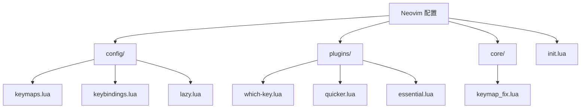
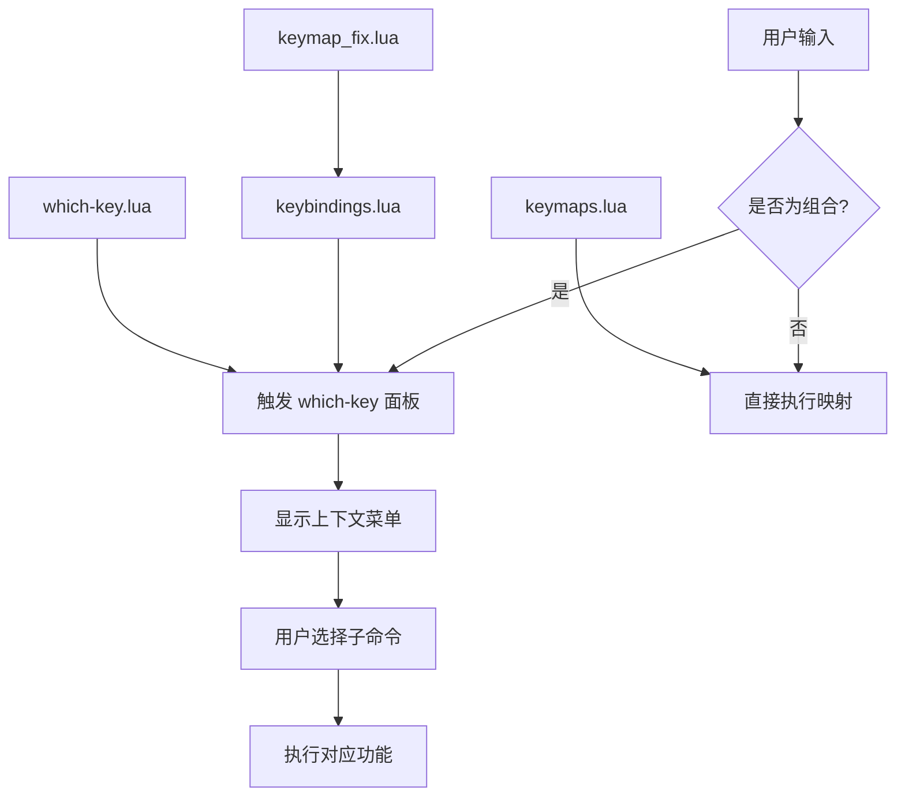
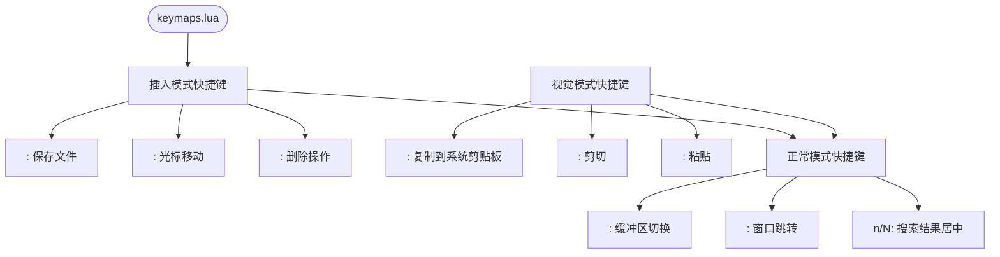
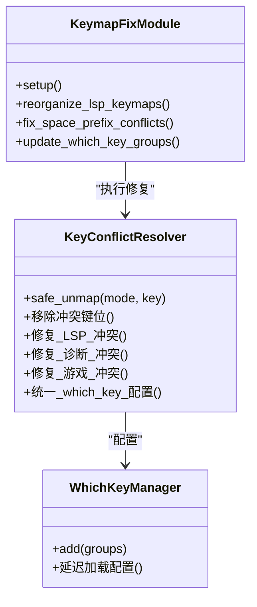
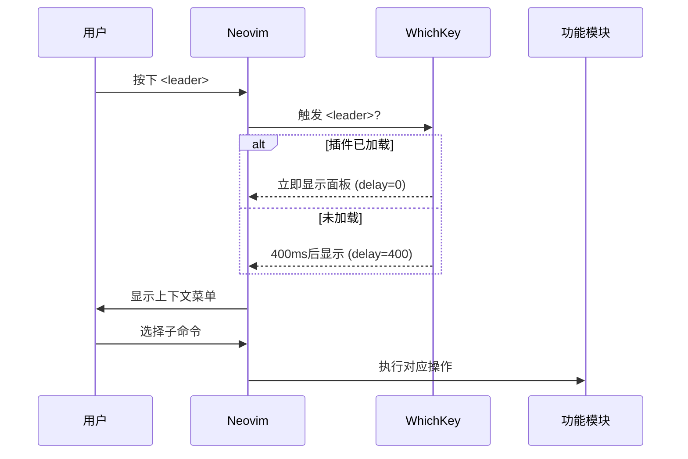
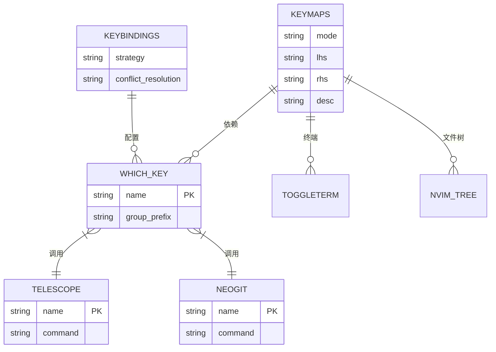

# 键位映射系统

<cite>
**本文档引用的文件**  
- [keymaps.lua](file://lua/config/keymaps.lua) - *基础键位定义*
- [keybindings.lua](file://lua/config/keybindings.lua) - *冲突解决与分组管理*
- [which-key.lua](file://lua/plugins/which-key.lua) - *上下文感知提示*
- [keymap_fix.lua](file://lua/core/keymap_fix.lua) - *核心键位修复模块*
- [keymap_conflict_fix_test.lua](file://lua/test/keymap_conflict_fix_test.lua) - *键位冲突验证测试*
</cite>

## 更新摘要
**变更内容**   
- 更新了键位系统架构描述，反映 `keymap_fix.lua` 模块的引入
- 修正了 LSP 功能组前缀从 `<leader>l` 到 `<leader>p` 的变更
- 更新了冲突解决机制，反映新的安全清理策略
- 修正了 which-key 组的配置方式，避免重复定义
- 添加了 Python 调试功能迁移至 `<leader>py` 前缀的说明
- 更新了用户验证命令 `:VerifyKeymapFix` 的功能描述

## 目录
1. [引言](#引言)
2. [项目结构](#项目结构)
3. [核心组件](#核心组件)
4. [架构概述](#架构概述)
5. [详细组件分析](#详细组件分析)
6. [依赖分析](#依赖分析)
7. [性能考虑](#性能考虑)
8. [故障排除指南](#故障排除指南)
9. [结论](#结论)

## 引言
本文档全面文档化 Neovim 配置中的键位映射系统，重点阐述 `<leader>` 与 `<localleader>` 前缀键的设计哲学及其在提升操作效率中的作用。通过分析 `keymaps.lua` 中的基础键位定义、`keybindings.lua` 的冲突解决机制以及 `which-key.lua` 的上下文感知提示功能，展示如何构建高效、无冲突的快捷键体系。同时提供实际映射示例和用户自定义指导。

## 项目结构
项目采用模块化 Lua 配置结构，将键位相关逻辑分离至独立文件以增强可维护性。

**图示来源**  
- [keymaps.lua](file://lua/config/keymaps.lua#L1-L220)
- [keybindings.lua](file://lua/config/keybindings.lua#L1-L139)
- [which-key.lua](file://lua/plugins/which-key.lua#L1-L56)
- [keymap_fix.lua](file://lua/core/keymap_fix.lua#L1-L200)

**本节来源**  
- [lua/config](file://lua/config)
- [lua/plugins](file://lua/plugins)
- [lua/core](file://lua/core)

## 核心组件
核心键位系统由四个主要文件构成：`keymaps.lua` 定义基础映射，`keybindings.lua` 处理冲突与分组，`which-key.lua` 提供可视化提示，`keymap_fix.lua` 作为核心键位修复模块，专门解决插件间的键位冲突问题。

**本节来源**  
- [keymaps.lua](file://lua/config/keymaps.lua#L1-L220)
- [keybindings.lua](file://lua/config/keybindings.lua#L1-L139)
- [which-key.lua](file://lua/plugins/which-key.lua#L1-L56)
- [keymap_fix.lua](file://lua/core/keymap_fix.lua#L1-L200)

## 架构概述
整个键位系统遵循“定义 → 冲突解决 → 可视化提示”的三层架构。基础映射在 `keymaps.lua` 中设置，`keybindings.lua` 统一管理前缀组并清理冲突，`keymap_fix.lua` 作为独立模块处理复杂的键位冲突，`which-key` 插件则在运行时提供动态帮助。

**图示来源**  
- [keymaps.lua](file://lua/config/keymaps.lua#L1-L220)
- [keybindings.lua](file://lua/config/keybindings.lua#L1-L139)
- [which-key.lua](file://lua/plugins/which-key.lua#L1-L56)
- [keymap_fix.lua](file://lua/core/keymap_fix.lua#L1-L200)

## 详细组件分析

### 基础键位定义分析
`keymaps.lua` 文件定义了跨模式的通用快捷键，包括插入模式的 `<C-s>` 保存、视觉模式的 `<C-c>` 复制到系统剪贴板等。同时通过 `noremap = true` 确保映射无递归风险。

**图示来源**  
- [keymaps.lua](file://lua/config/keymaps.lua#L1-L220)

**本节来源**  
- [keymaps.lua](file://lua/config/keymaps.lua#L1-L220)

### 冲突解决机制分析
`keybindings.lua` 采用主动清理策略解决键位冲突。通过 `safe_unmap` 函数移除潜在冲突的旧映射，并将 LSP、诊断、游戏等功能统一迁移到 `<leader>` 前缀下的不同子组（如 `<leader>p`、`<leader>d`、`<leader>G`），避免命名空间污染。同时，`keymap_fix.lua` 模块作为专门的冲突修复器，在插件加载后延迟执行，确保所有冲突都被彻底解决。

**图示来源**  
- [keybindings.lua](file://lua/config/keybindings.lua#L1-L139)
- [keymap_fix.lua](file://lua/core/keymap_fix.lua#L1-L200)

**本节来源**  
- [keybindings.lua](file://lua/config/keybindings.lua#L1-L139)
- [keymap_fix.lua](file://lua/core/keymap_fix.lua#L1-L200)

### 上下文感知提示分析
`which-key.lua` 配置通过 `filter` 函数过滤掉易冲突的单字母前缀（如 `g`, `s`），并使用 `preset = "modern"` 提供现代化面板样式。其 `delay` 函数实现插件加载时零延迟显示，提升用户体验。值得注意的是，which-key 组的定义已完全移至 `keybindings.lua`，避免了重复定义的问题。

**图示来源**  
- [which-key.lua](file://lua/plugins/which-key.lua#L1-L56)

**本节来源**  
- [which-key.lua](file://lua/plugins/which-key.lua#L1-L56)

## 依赖分析
键位系统依赖多个插件协同工作，`which-key` 提供界面，`telescope` 和 `neogit` 提供具体功能实现。

**图示来源**  
- [keymaps.lua](file://lua/config/keymaps.lua#L1-L220)
- [keybindings.lua](file://lua/config/keybindings.lua#L1-L139)
- [which-key.lua](file://lua/plugins/which-key.lua#L1-L56)
- [quicker.lua](file://lua/plugins/quicker.lua#L1-L247)
- [essential.lua](file://lua/plugins/essential.lua#L1-L535)

**本节来源**  
- [keymaps.lua](file://lua/config/keymaps.lua#L1-L220)
- [keybindings.lua](file://lua/config/keybindings.lua#L1-L139)
- [which-key.lua](file://lua/plugins/which-key.lua#L1-L56)

## 性能考虑
键位系统通过延迟加载（`event = "VeryLazy"`）减少启动开销，并使用 `vim.schedule` 延迟初始化 `which-key` 组，确保插件加载后再注册映射，避免性能瓶颈。

## 故障排除指南
若键位未生效，可使用 `:VerifyKeymapFix` 命令检查当前所有映射状态。该命令在 `keybindings.lua` 中定义，用于验证配置完整性并提供详细的冲突解决报告。

**本节来源**  
- [keybindings.lua](file://lua/config/keybindings.lua#L490-L549)

## 结论
本键位系统通过清晰的分层设计、主动的冲突管理与直观的可视化提示，实现了高效且可扩展的快捷键体系。用户可通过 `<leader>` 前缀快速访问 Telescope 文件查找（`<leader>ff`）、Neogit（`<leader>gg`）等核心功能，并能安全地自定义新映射而不引发冲突。架构调整后，`keymap_fix.lua` 模块的引入进一步增强了系统的稳定性和可维护性。