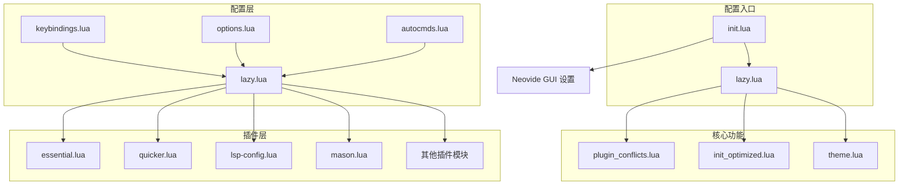
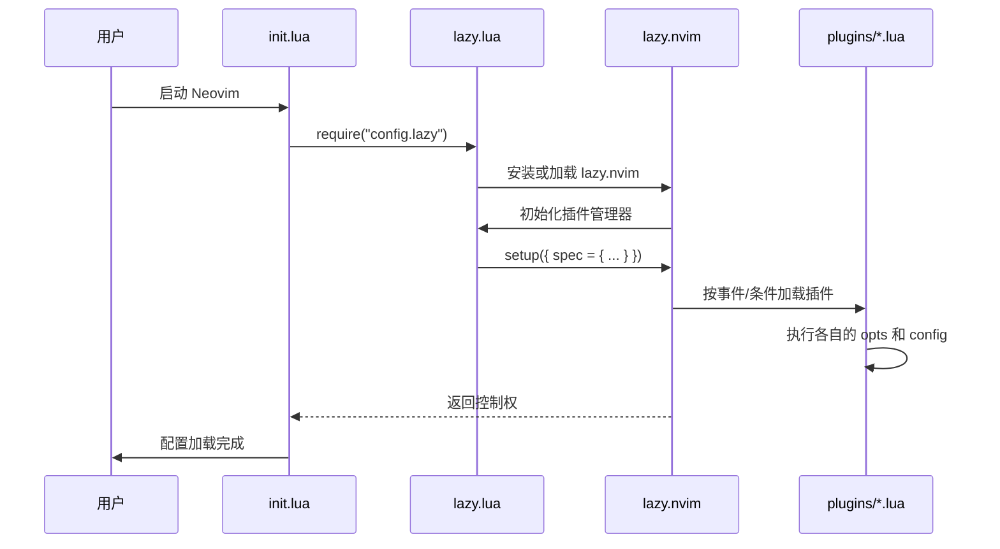
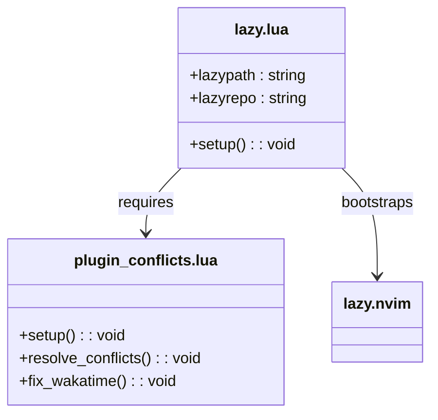
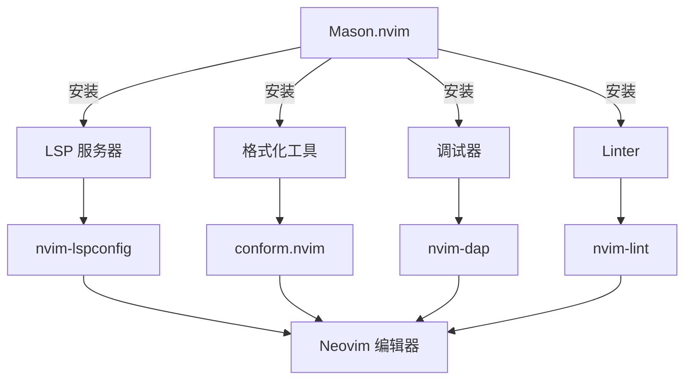
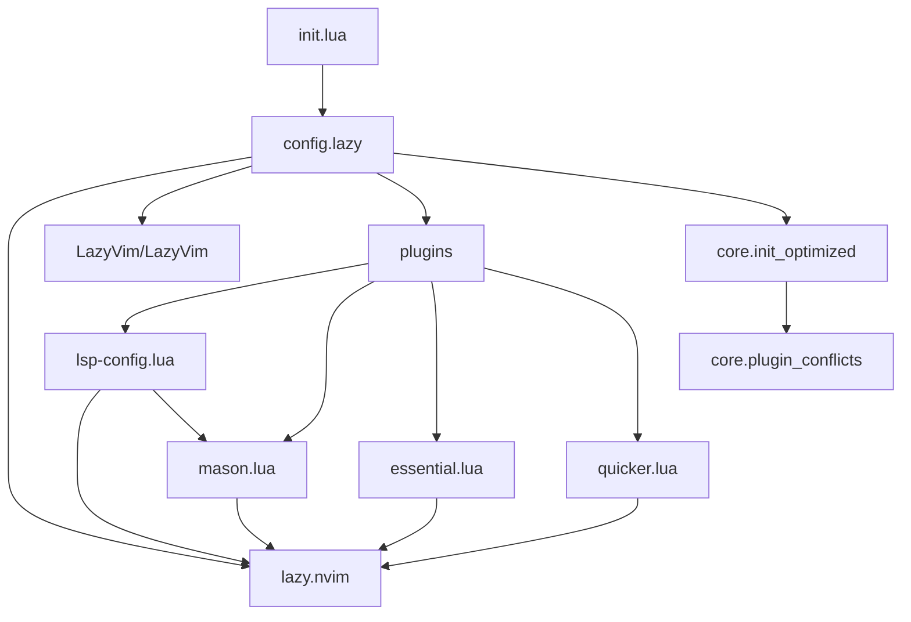

# 项目概述

<cite>
**本文档中引用的文件**  
- [init.lua](file://init.lua)
- [lazy.lua](file://lua/config/lazy.lua)
- [plugin_conflicts.lua](file://lua/core/plugin_conflicts.lua)
- [lsp-config.lua](file://lua/plugins/lsp-config.lua)
- [mason.lua](file://lua/plugins/mason.lua)
- [init_optimized.lua](file://lua/core/init_optimized.lua)
- [essential.lua](file://lua/plugins/essential.lua)
- [quicker.lua](file://lua/plugins/quicker.lua)
</cite>

## 目录
1. [简介](#简介)
2. [项目结构](#项目结构)
3. [核心组件](#核心组件)
4. [架构概览](#架构概览)
5. [详细组件分析](#详细组件分析)
6. [依赖分析](#依赖分析)
7. [性能考量](#性能考量)
8. [故障排除指南](#故障排除指南)
9. [结论](#结论)

## 简介
本项目是一个基于 **LazyVim** 的高度定制化 Neovim 配置，旨在为开发者提供一个现代化、AI 增强的高效开发环境。该配置通过模块化设计、智能插件管理与深度性能优化，实现了快速启动、稳定运行与高度可扩展性。其核心目标是融合最佳实践与前沿工具，支持 AI 辅助编程、Git 协作、视觉增强、自动化测试等现代开发需求。配置采用 Lua 编写，结构清晰，便于维护与二次开发，适用于从初学者到高级用户的广泛群体。

## 项目结构
项目采用分层模块化设计，将配置逻辑清晰地划分为 `core`（核心）、`config`（配置）和 `plugins`（插件）三大目录，确保了高内聚、低耦合。

**图示来源**  
- [init.lua](file://init.lua#L1-L50)
- [lazy.lua](file://lua/config/lazy.lua#L1-L60)

**本节来源**  
- [init.lua](file://init.lua#L1-L50)
- [项目结构](file://.)

## 核心组件
本配置的核心组件围绕 **LazyVim** 的继承与扩展构建，通过 `init.lua` 作为入口点，加载 `config.lazy` 模块来初始化插件管理器 `lazy.nvim`。核心优化逻辑（如插件冲突解决、系统集成）由 `core` 目录下的模块（如 `init_optimized.lua` 和 `plugin_conflicts.lua`）实现。`plugins` 目录则按功能分类组织插件，如 `lsp-config.lua` 负责语言服务器协议集成，`mason.lua` 管理外部工具安装。这种分层设计使得配置易于理解、维护和扩展。

**本节来源**  
- [init.lua](file://init.lua#L1-L50)
- [init_optimized.lua](file://lua/core/init_optimized.lua#L1-L236)
- [plugin_conflicts.lua](file://lua/core/plugin_conflicts.lua#L1-L158)

## 架构概览
整个配置的架构遵循“入口 -> 引导 -> 核心加载 -> 插件管理”的流程。`init.lua` 负责引导，`lazy.lua` 负责安装和配置 `lazy.nvim`，并声明插件规范。`lazy.nvim` 作为核心引擎，根据 `spec` 中的定义，按需加载 `LazyVim` 的基础插件和用户自定义的 `plugins` 模块。`core` 模块在早期介入，解决潜在的冲突并应用全局优化，确保了环境的稳定性和高性能。

**图示来源**  
- [init.lua](file://init.lua#L1-L50)
- [lazy.lua](file://lua/config/lazy.lua#L1-L60)

## 详细组件分析

### 插件管理与冲突解决
该配置采用 `lazy.nvim` 作为插件管理器，因其支持按需加载、并行安装、依赖管理和性能优化，能显著提升启动速度。`lazy.lua` 文件是其核心，它首先引导安装 `lazy.nvim` 自身，然后通过 `require("lazy").setup()` 定义插件规范。`spec` 中导入 `LazyVim` 的插件，并合并用户自定义的 `plugins` 模块。`defaults.lazy = false` 表示自定义插件在启动时加载，以确保关键功能（如键位、LSP）的即时可用性。

**图示来源**  
- [lazy.lua](file://lua/config/lazy.lua#L1-L60)
- [plugin_conflicts.lua](file://lua/core/plugin_conflicts.lua#L1-L158)

**本节来源**  
- [lazy.lua](file://lua/config/lazy.lua#L1-L60)
- [plugin_conflicts.lua](file://lua/core/plugin_conflicts.lua#L1-L158)

### LSP 与 Mason 集成策略
项目通过 `lsp-config.lua` 和 `mason.lua` 实现了强大的语言服务支持。`mason.lua` 统一管理所有外部工具（LSP 服务器、格式化工具、linter 等）的安装，其 `opts.ensure_installed` 列出了预设的工具列表，并通过 `mason-lspconfig` 和 `mason-nvim-dap` 与 LSP 和调试器集成。`lsp-config.lua` 则负责配置 `nvim-lspconfig`，为每个 LSP 服务器（如 `lua_ls`, `pyright`, `rust_analyzer`）提供精细化的设置，并统一管理 `on_attach` 回调、诊断显示和能力（capabilities）。

**图示来源**  
- [mason.lua](file://lua/plugins/mason.lua#L1-L169)
- [lsp-config.lua](file://lua/plugins/lsp-config.lua#L1-L324)

**本节来源**  
- [mason.lua](file://lua/plugins/mason.lua#L1-L169)
- [lsp-config.lua](file://lua/plugins/lsp-config.lua#L1-L324)

### AI 增强功能
项目深度集成了 AI 辅助功能，主要体现在 `essential.lua` 中。`substitute.nvim` 和 `grug-far.nvim` 插件启用了 AI 模式，利用 `deepseek` API 进行智能文本替换和全局查找替换。`neogit` 插件则利用 `openai` API 生成符合规范的 Git 提交信息。`diffview.nvim` 的合并工具甚至能提供 AI 冲突解决建议。这些功能极大地提升了代码重构和版本管理的效率。

**本节来源**  
- [essential.lua](file://lua/plugins/essential.lua#L1-L610)

## 依赖分析
配置的依赖关系清晰，`init.lua` 作为顶层入口，直接依赖 `config.lazy`。`lazy.lua` 作为核心枢纽，依赖 `lazy.nvim` 并导入 `LazyVim` 和 `plugins` 模块。`plugins` 模块之间存在明确的依赖，例如 `lsp-config.lua` 依赖 `mason.nvim` 来获取 LSP 服务器列表。`core` 模块（如 `plugin_conflicts.lua`）被 `init_optimized.lua` 调用，以解决 `plugins` 层可能出现的冲突。

**图示来源**  
- [init.lua](file://init.lua#L1-L50)
- [lazy.lua](file://lua/config/lazy.lua#L1-L60)
- [mason.lua](file://lua/plugins/mason.lua#L1-L169)

**本节来源**  
- [init.lua](file://init.lua#L1-L50)
- [lazy.lua](file://lua/config/lazy.lua#L1-L60)
- [mason.lua](file://lua/plugins/mason.lua#L1-L169)

## 性能考量
该项目在性能方面进行了多维度优化。首先，通过 `lazy.nvim` 的按需加载机制，避免了启动时加载所有插件。其次，在 `lazy.lua` 中通过 `performance.rtp.disabled_plugins` 禁用了 Neovim 自带的多个非必要插件（如 `gzip`, `matchit`），减少了运行时路径（RTP）的负担。`init_optimized.lua` 中设置了 `updatetime` 和 `timeoutlen` 等选项，优化了响应速度。此外，`mason.lua` 中的 `max_concurrent_installers` 允许并行安装，加快了环境搭建速度。

**本节来源**  
- [lazy.lua](file://lua/config/lazy.lua#L1-L60)
- [init_optimized.lua](file://lua/core/init_optimized.lua#L1-L236)
- [mason.lua](file://lua/plugins/mason.lua#L1-L169)

## 故障排除指南
当遇到配置问题时，可使用以下命令进行诊断：
- `:ReloadConfig`：重新加载配置文件。
- `:CleanPlugins`：清理未使用的插件。
- `:HealthCheck`：运行 Neovim 健康检查。
- `:FixConflicts`：手动触发插件冲突解决。
- `:ShowMappings`：查看当前的键位映射。

常见问题如 WakaTime API 密钥缺失，`plugin_conflicts.lua` 中的 `fix_wakatime()` 函数会自动创建配置文件并发出警告。对于剪贴板问题，`init_optimized.lua` 根据操作系统（WSL、Windows、其他）提供了不同的 `clipboard` 配置，确保了跨平台的兼容性。

**本节来源**  
- [init_optimized.lua](file://lua/core/init_optimized.lua#L1-L236)
- [plugin_conflicts.lua](file://lua/core/plugin_conflicts.lua#L1-L158)

## 结论
本 Neovim 配置项目成功构建了一个强大、高效且智能化的开发环境。它以 LazyVim 为基础，通过精心设计的模块化架构，实现了功能的灵活扩展与性能的极致优化。项目不仅集成了 LSP、Mason、Git、测试等现代开发所需的核心功能，更前瞻性地融入了 AI 辅助编程，显著提升了开发效率。其清晰的代码结构和详尽的注释，使其成为一个优秀的学习范例和可高度定制的生产力工具。