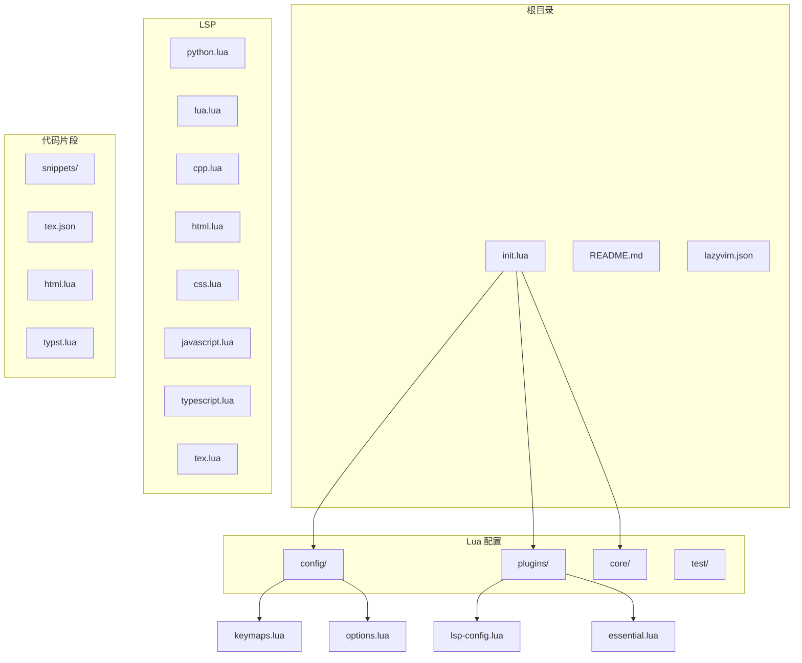
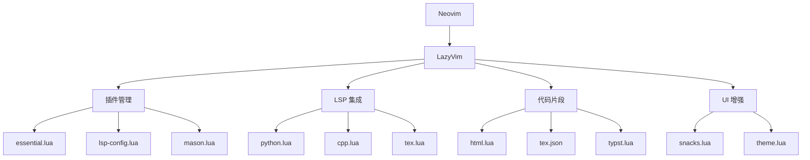
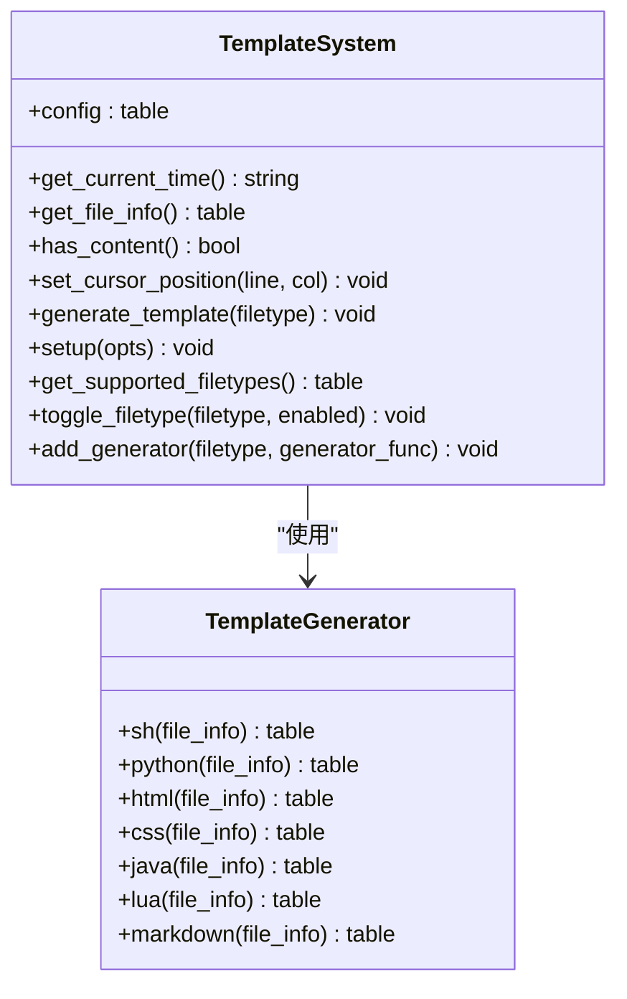
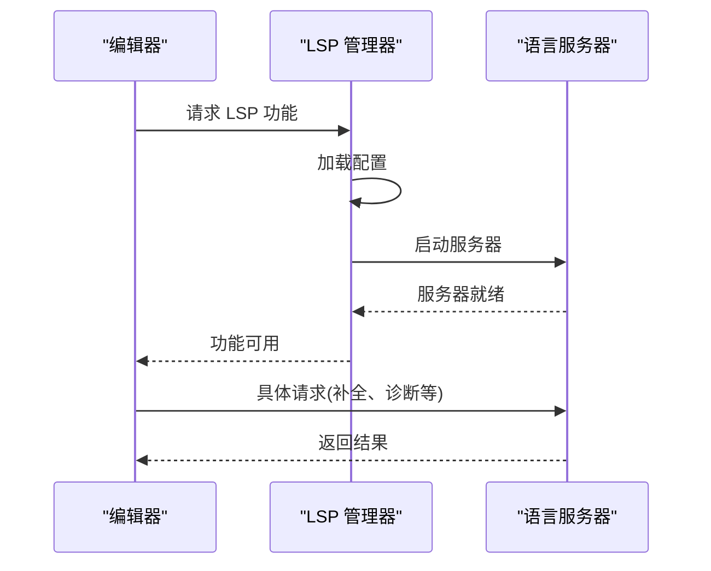
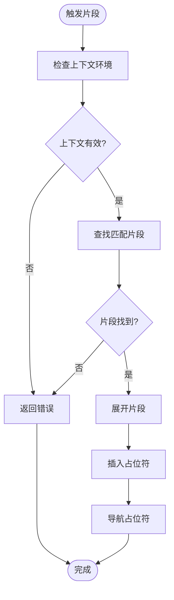
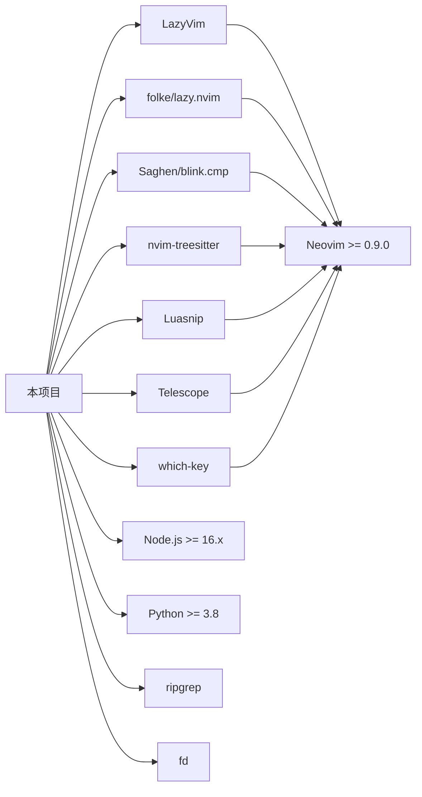

# 项目知识库集成

<cite>
**本文档引用的文件**   
- [init.lua](file://init.lua)
- [templates.lua](file://lua/core/templates.lua)
- [keymaps.lua](file://lua/config/keymaps.lua)
- [options.lua](file://lua/config/options.lua)
- [lsp-config.lua](file://lua/plugins/lsp-config.lua)
- [essential.lua](file://lua/plugins/essential.lua)
- [tex.json](file://snippets/tex.json)
- [html.lua](file://snippets/html.lua)
- [typst.lua](file://snippets/typst.lua)
</cite>

## 目录
1. [简介](#简介)
2. [项目结构](#项目结构)
3. [核心组件](#核心组件)
4. [架构概述](#架构概述)
5. [详细组件分析](#详细组件分析)
6. [依赖分析](#依赖分析)
7. [性能考虑](#性能考虑)
8. [故障排除指南](#故障排除指南)
9. [结论](#结论)

## 简介
本项目是一个基于 LazyVim 的个人 Neovim 配置，旨在提供现代化的开发体验和高效的编程环境。配置集成了 LSP、智能补全、语法高亮、代码片段和模糊搜索等核心功能，同时包含智能退出、键位优化、启动页面等增强功能。支持多种编程语言和文档格式，包括 Python、C/C++、Web 开发、Markdown 和 LaTeX 等。

## 项目结构
项目采用模块化结构，主要分为 LSP 配置、Lua 配置、代码片段和根目录文件。



**Diagram sources**
- [init.lua](file://init.lua)
- [lua/core/templates.lua](file://lua/core/templates.lua)

**Section sources**
- [init.lua](file://init.lua)
- [README.md](file://README.md)

## 核心组件
项目的核心组件包括模板系统、LSP 集成、代码片段和键位映射。

**Section sources**
- [templates.lua](file://lua/core/templates.lua)
- [lsp-config.lua](file://lua/plugins/lsp-config.lua)
- [html.lua](file://snippets/html.lua)
- [keymaps.lua](file://lua/config/keymaps.lua)

## 架构概述
系统架构基于 LazyVim 框架，采用插件化设计，各组件通过 Lua 模块进行组织和管理。



**Diagram sources**
- [init.lua](file://init.lua)
- [lua/plugins/lsp-config.lua](file://lua/plugins/lsp-config.lua)
- [lua/plugins/essential.lua](file://lua/plugins/essential.lua)

## 详细组件分析

### 模板系统分析
模板系统为新创建的文件提供预定义的结构和内容，支持多种文件类型。



**Diagram sources**
- [templates.lua](file://lua/core/templates.lua)

**Section sources**
- [templates.lua](file://lua/core/templates.lua)

### LSP 集成分析
LSP 集成提供了语言服务器支持，包括 Python、C/C++、LaTeX 等多种语言。



**Diagram sources**
- [lsp-config.lua](file://lua/plugins/lsp-config.lua)
- [tex.lua](file://LSP/tex.lua)

**Section sources**
- [lsp-config.lua](file://lua/plugins/lsp-config.lua)
- [tex.lua](file://LSP/tex.lua)

### 代码片段分析
代码片段系统使用 LuaSnip 提供智能代码片段，支持多种语言。



**Diagram sources**
- [html.lua](file://snippets/html.lua)
- [typst.lua](file://snippets/typst.lua)

**Section sources**
- [html.lua](file://snippets/html.lua)
- [typst.lua](file://snippets/typst.lua)

## 依赖分析
项目依赖于多个外部插件和工具，通过 Mason 进行管理。



**Diagram sources**
- [lazyvim.json](file://lazyvim.json)
- [lsp-config.lua](file://lua/plugins/lsp-config.lua)

**Section sources**
- [lazyvim.json](file://lazyvim.json)
- [README.md](file://README.md)

## 性能考虑
配置包含多项性能优化措施，确保快速启动和流畅运行。

- 懒加载插件系统，只在需要时加载插件
- 高性能补全引擎 blink.cmp
- 优化的启动时间，减少初始化开销
- 智能文件处理，避免不必要的操作
- 缓存机制，减少重复计算

## 故障排除指南
常见问题及解决方案：

**Section sources**
- [README.md](file://README.md)
- [essential.lua](file://lua/plugins/essential.lua)

### 插件安装失败
```vim
:Lazy sync
```

### LSP 不工作
```vim
:LspInfo
:Mason
```

### 键位冲突
```vim
:VerifyKeymapFix
```

### 补全不工作
```vim
:checkhealth blink
```

### Git 提交信息生成
在 Git 提交界面中使用 `<c-y>` 键生成 AI 提交信息。

**Section sources**
- [essential.lua](file://lua/plugins/essential.lua)

## 结论
该项目提供了一个功能丰富、性能优化的 Neovim 配置，通过模块化设计和插件化架构，实现了高度可定制的开发环境。模板系统、LSP 集成和代码片段等功能大大提高了开发效率，而详细的文档和故障排除指南确保了系统的可维护性。