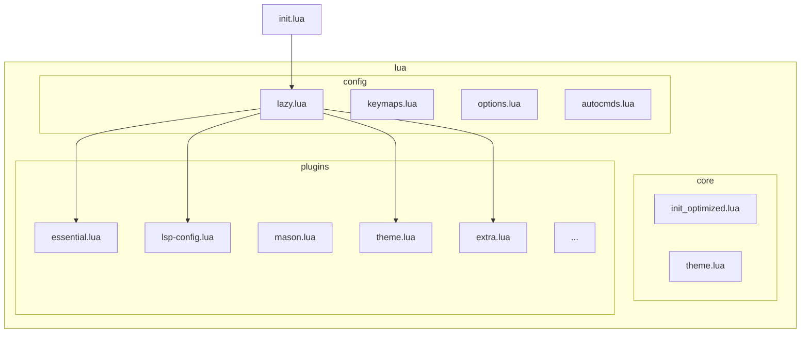
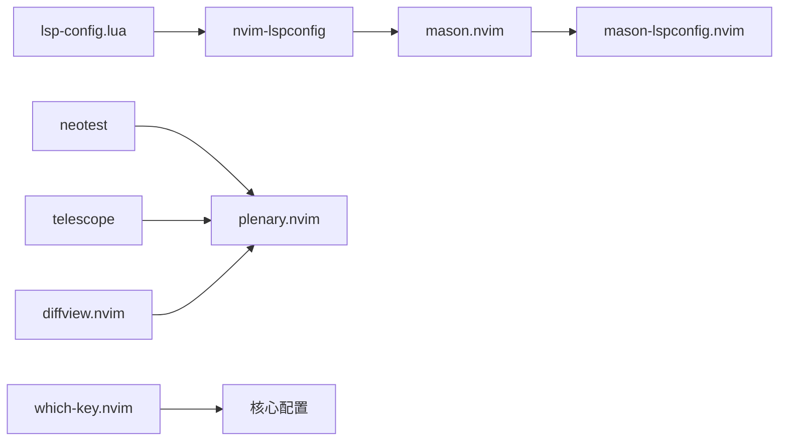

# 插件扩展指南

<cite>
**本文档引用的文件**
- [lazy.lua](file://lua/config/lazy.lua)
- [init.lua](file://init.lua)
- [lsp-config.lua](file://lua/plugins/lsp-config.lua)
- [mason.lua](file://lua/plugins/mason.lua)
- [essential.lua](file://lua/plugins/essential.lua)
- [extra.lua](file://lua/plugins/extra.lua)
- [which-key.lua](file://lua/plugins/which-key.lua)
- [theme.lua](file://lua/plugins/theme.lua)
</cite>

## 目录
1. [简介](#简介)
2. [项目结构](#项目结构)
3. [核心组件](#核心组件)
4. [架构概述](#架构概述)
5. [详细组件分析](#详细组件分析)
6. [依赖分析](#依赖分析)
7. [性能考虑](#性能考虑)
8. [故障排除指南](#故障排除指南)
9. [结论](#结论)

## 简介
本文档旨在指导用户如何在当前基于 `lazy.nvim` 的模块化 Neovim 配置中安全地集成第三方插件。通过分析现有配置结构，详细说明如何在 `lua/plugins/` 目录下创建新的 Lua 文件，并使用 `lazy.nvim` 的声明式格式管理插件依赖。涵盖插件加载顺序、条件加载（`opts` 判断）、子插件集成（如 `plenary.nvim`）等高级用法，并提供实际集成示例与最佳实践。

## 项目结构

Neovim 配置采用模块化设计，核心结构清晰分离功能与配置。



**图示来源**
- [lazy.lua](file://lua/config/lazy.lua)
- [init.lua](file://init.lua)

**本节来源**
- [lazy.lua](file://lua/config/lazy.lua#L1-L59)
- [init.lua](file://init.lua#L1-L49)

## 核心组件

核心组件包括 `lazy.nvim` 的引导逻辑、插件声明机制和模块加载流程。`init.lua` 负责初始化配置并加载 `lua/config/lazy.lua`，后者通过 `require("lazy").setup()` 声明所有插件及其依赖关系。插件按功能分组在 `lua/plugins/` 目录下的独立 Lua 文件中，便于维护和扩展。

**本节来源**
- [init.lua](file://init.lua#L1-L49)
- [lazy.lua](file://lua/config/lazy.lua#L1-L59)

## 架构概述

系统采用分层架构，由 `lazy.nvim` 作为插件管理核心，协调各功能模块的加载与初始化。

```mermaid
graph TD
A[Neovim 启动] --> B[执行 init.lua]
B --> C[设置 mapleader]
C --> D[加载 lazy.lua]
D --> E[引导 lazy.nvim]
E --> F[执行 require('lazy').setup()]
F --> G[导入 LazyVim 插件]
F --> H[导入用户自定义插件]
H --> I[加载 lua/plugins/*.lua]
I --> J[插件按事件/命令触发加载]
J --> K[运行插件配置函数 config()]
K --> L[完成初始化]
```

**图示来源**
- [init.lua](file://init.lua#L1-L49)
- [lazy.lua](file://lua/config/lazy.lua#L1-L59)

## 详细组件分析

### 插件加载机制分析

`lazy.nvim` 使用声明式语法定义插件，支持延迟加载、依赖管理和条件配置。

#### 插件声明格式
```lua
{
  "插件仓库地址",
  event = { "触发事件" },
  cmd = { "命令列表" },
  dependencies = { "依赖插件" },
  opts = { 配置选项 },
  config = function(_, opts) ... end
}
```

**本节来源**
- [lazy.lua](file://lua/config/lazy.lua#L30-L59)
- [lsp-config.lua](file://lua/plugins/lsp-config.lua#L1-L323)

### 条件加载与 opts 配置

通过 `opts` 字段可实现条件化配置，`config` 函数接收 `opts` 参数进行动态初始化。

#### 示例：LSP 诊断配置
```lua
opts = function()
  return {
    diagnostics = {
      virtual_text = { prefix = "●" },
      signs = { text = { ... } },
    },
    servers = {
      lua_ls = { settings = { ... } },
      pyright = { settings = { ... } }
    }
  }
end,
config = function(_, opts)
  vim.diagnostic.config(opts.diagnostics)
  -- 遍历 servers 并配置 LSP
end
```

**图示来源**
- [lsp-config.lua](file://lua/plugins/lsp-config.lua#L15-L100)

**本节来源**
- [lsp-config.lua](file://lua/plugins/lsp-config.lua#L1-L323)

### 子插件与依赖集成

插件可通过 `dependencies` 字段声明子依赖，确保加载顺序正确。

#### 示例：neotest 依赖 plenary.nvim
```lua
{
  "nvim-neotest/neotest",
  dependencies = {
    "nvim-lua/plenary.nvim",
    "nvim-treesitter/nvim-treesitter"
  },
  opts = { ... }
}
```

此模式确保 `plenary.nvim` 在 `neotest` 初始化前已加载，避免运行时错误。

**图示来源**
- [essential.lua](file://lua/plugins/essential.lua#L200-L220)

**本节来源**
- [essential.lua](file://lua/plugins/essential.lua#L1-L609)

### 实际集成示例：Telescope 扩展

创建 `lua/plugins/telescope.lua` 文件：

```lua
return {
  {
    "nvim-telescope/telescope.nvim",
    cmd = "Telescope",
    dependencies = {
      "nvim-lua/plenary.nvim",
      {
        "nvim-telescope/telescope-fzf-native.nvim",
        build = "make",
        cond = vim.fn.executable("make") == 1
      }
    },
    opts = {
      defaults = {
        layout_strategy = "horizontal",
        layout_config = { prompt_position = "top" }
      }
    },
    config = function(_, opts)
      require("telescope").setup(opts)
      require("telescope").load_extension("fzf")
    end
  }
}
```

并在 `lazy.lua` 的 `spec` 中添加 `{ import = "plugins.telescope" }`。

**本节来源**
- [essential.lua](file://lua/plugins/essential.lua#L200-L220)
- [lsp-config.lua](file://lua/plugins/lsp-config.lua#L1-L323)

### 自定义 LSP 服务器集成

通过 `lspconfig` 扩展支持新语言服务器。

#### 示例：添加 dart_language_server
```lua
-- 在 lsp-config.lua 的 servers 表中添加
dart_language_server = {
  cmd = { "dart", "language-server" },
  filetypes = { "dart" },
  root_dir = require('lspconfig').util.root_pattern("pubspec.yaml")
}
```

确保 `mason.lua` 中 `ensure_installed` 包含 `"dart"`。

**本节来源**
- [lsp-config.lua](file://lua/plugins/lsp-config.lua#L1-L323)
- [mason.lua](file://lua/plugins/mason.lua#L1-L168)

## 依赖分析

插件间存在明确的依赖关系，需正确声明以避免加载失败。



**图示来源**
- [lsp-config.lua](file://lua/plugins/lsp-config.lua#L5-L20)
- [mason.lua](file://lua/plugins/mason.lua#L5-L20)
- [essential.lua](file://lua/plugins/essential.lua#L200-L220)

**本节来源**
- [lsp-config.lua](file://lua/plugins/lsp-config.lua#L1-L323)
- [mason.lua](file://lua/plugins/mason.lua#L1-L168)
- [essential.lua](file://lua/plugins/essential.lua#L1-L609)

## 性能考虑

为优化启动性能，建议：

- 使用 `event` 或 `cmd` 延迟非核心插件加载
- 在 `lazy.lua` 中设置 `defaults.lazy = true` 以默认延迟所有自定义插件
- 避免在 `init.lua` 中直接 `require` 插件
- 利用 `lazy.nvim` 的并行安装与缓存机制

当前配置已在 `lazy.lua` 中禁用部分冗余的 runtime 插件，提升运行效率。

## 故障排除指南

常见问题及解决方案：

- **插件未加载**：检查 `event`/`cmd` 是否触发，或移除以立即加载
- **依赖缺失错误**：确认 `dependencies` 正确声明且网络可访问
- **命名冲突**：避免使用与其他插件相同的命令或键映射
- **版本兼容性**：使用 `version = "tag"` 锁定稳定版本，避免 `main` 分支变动
- **配置不生效**：确保 `config` 函数被调用，检查 `opts` 是否传递正确

**本节来源**
- [lazy.lua](file://lua/config/lazy.lua#L40-L50)
- [which-key.lua](file://lua/plugins/which-key.lua#L1-L56)
- [theme.lua](file://lua/plugins/theme.lua#L1-L677)

## 结论

通过遵循模块化结构，在 `lua/plugins/` 下创建独立 Lua 文件并利用 `lazy.nvim` 的声明式语法，可安全高效地扩展 Neovim 功能。合理使用 `opts`、`dependencies` 和条件加载机制，结合 `mason.nvim` 统一管理工具链，能构建稳定、可维护的开发环境。始终注意版本锁定与命名规范，以保障配置长期可用性。