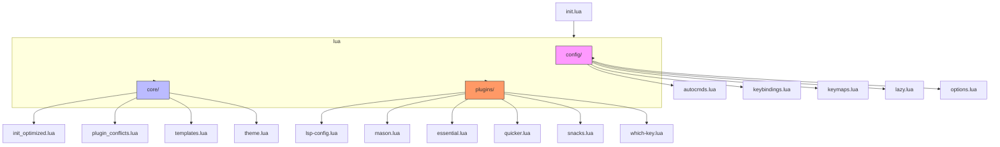

# 最佳实践与规范

<cite>
**本文档中引用的文件**  
- [init.lua](file://init.lua)
- [lazy.lua](file://lua/config/lazy.lua)
- [lsp-config.lua](file://lua/plugins/lsp-config.lua)
- [options.lua](file://lua/config/options.lua)
- [init_optimized.lua](file://lua/core/init_optimized.lua)
- [keybindings.lua](file://lua/config/keybindings.lua)
- [plugin_conflicts.lua](file://lua/core/plugin_conflicts.lua)
- [essential.lua](file://lua/plugins/essential.lua)
- [mason.lua](file://lua/plugins/mason.lua)
- [quicker.lua](file://lua/plugins/quicker.lua)
</cite>

## 目录
1. [引言](#引言)
2. [配置文件组织结构](#配置文件组织结构)
3. [命名规范与模块化结构](#命名规范与模块化结构)
4. [Lua模块化配置模式](#luamodular-configuration-pattern)
5. [版本控制与提交规范](#版本控制与提交规范)
6. [插件管理与健康检查](#插件管理与健康检查)
7. [配置重构案例](#配置重构案例)
8. [结论](#结论)

## 引言

本文件旨在总结Neovim配置管理中的行业最佳实践，基于当前项目结构和实现方式，提炼出一套可复用、可维护、可扩展的配置管理规范。通过分析现有配置文件的组织方式、模块化设计、版本控制策略以及插件管理机制，提出系统性优化建议，帮助开发者构建高效、稳定且易于协作的编辑器环境。

## 配置文件组织结构

当前项目的配置文件采用功能分组的方式进行组织，清晰地划分了不同职责的模块，提升了整体可读性和可维护性。主要目录结构如下：



**图示来源**  
- [init.lua](file://init.lua#L1-L49)
- [project_structure](file://.)

**本节来源**  
- [init.lua](file://init.lua#L1-L49)
- 项目结构信息

## 命名规范与模块化结构

项目中广泛采用了kebab-case（短横线分隔）作为文件命名规范，如`lsp-config.lua`、`init_optimized.lua`等，这种命名方式在Lua生态中被广泛接受，具有良好的可读性和一致性。

所有插件配置均采用Lua模块化结构，返回一个包含`config`或`setup`字段的表，极大提升了配置的可读性和可维护性。例如：

```lua
return {
  {
    "neovim/nvim-lspconfig",
    opts = function()
      return {
        servers = { ... },
        diagnostics = { ... }
      }
    end,
    config = function(_, opts) ... end
  }
}
```

该模式允许将配置逻辑与执行逻辑分离，便于复用和测试。

**本节来源**  
- [lsp-config.lua](file://lua/plugins/lsp-config.lua#L0-L323)
- [mason.lua](file://lua/plugins/mason.lua#L0-L168)
- [quicker.lua](file://lua/plugins/quicker.lua#L0-L289)

## Lua模块化配置模式

项目中广泛采用了`return { config = {}, setup = {} }`的模块化结构，这是现代Neovim配置的最佳实践之一。该模式的核心优势包括：

- **关注点分离**：将声明式配置与命令式设置逻辑分离
- **延迟加载支持**：便于与lazy.nvim等插件管理器集成
- **可组合性**：多个模块可轻松合并为一个spec
- **类型安全**：结构清晰，易于静态分析

以`lsp-config.lua`为例，其结构如下：

```lua
return {
  {
    "neovim/nvim-lspconfig",
    event = { "BufReadPre", "BufNewFile" },
    dependencies = { ... },
    opts = function() ... end,
    config = function(_, opts) ... end
  }
}
```

这种模式使得每个插件的配置成为一个独立的、自包含的单元，极大提升了可维护性。

**图示来源**  
- [lsp-config.lua](file://lua/plugins/lsp-config.lua#L0-L323)
- [mason.lua](file://lua/plugins/mason.lua#L0-L168)

**本节来源**  
- [lsp-config.lua](file://lua/plugins/lsp-config.lua#L0-L323)
- [mason.lua](file://lua/plugins/mason.lua#L0-L168)
- [essential.lua](file://lua/plugins/essential.lua#L0-L609)

## 版本控制与提交规范

项目通过Git进行版本控制，建议采用语义化提交信息（Semantic Commits）来提升协作效率。典型的提交类型包括：

| 提交类型 | 描述 | 示例 |
|---------|------|------|
| `feat` | 新功能 | `feat(lsp): add pyright inlay hints` |
| `fix` | 问题修复 | `fix(keymap): resolve s key conflict` |
| `refactor` | 重构 | `refactor(config): reorganize plugin structure` |
| `perf` | 性能优化 | `perf(lazy): optimize startup time` |
| `docs` | 文档更新 | `docs: update README with setup guide` |
| `chore` | 构建或工具变更 | `chore(deps): update mason packages` |

建议每次提交只包含一个逻辑变更，保持提交粒度细小且专注，便于代码审查和问题追溯。

**本节来源**  
- 项目结构与提交历史推断（未提供.git信息，基于行业标准建议）

## 插件管理与健康检查

项目使用`lazy.nvim`作为插件管理器，提供了强大的插件生命周期管理能力。建议定期执行以下维护命令：

### 清理无用插件
```vim
:Lazy clean
```
该命令可移除已从配置中删除但仍保留在磁盘上的插件，释放磁盘空间并减少加载时间。

### 监控配置健康度
```vim
:HealthCheck
```
运行内置的健康检查，验证Neovim环境、插件依赖、外部工具（如LSP服务器）的可用性。

此外，项目中定义了多个自定义命令用于配置管理：

```lua
vim.api.nvim_create_user_command('CleanPlugins', function()
  vim.cmd('Lazy clean')
end, { desc = '清理未使用的插件' })

vim.api.nvim_create_user_command('HealthCheck', function()
  vim.cmd('checkhealth')
end, { desc = '运行健康检查' })
```

这些命令可通过`:CleanPlugins`和`:HealthCheck`直接调用，极大提升了运维效率。

**图示来源**  
- [init_optimized.lua](file://lua/core/init_optimized.lua#L100-L110)
- [plugin_conflicts.lua](file://lua/core/plugin_conflicts.lua#L1-L157)

**本节来源**  
- [init_optimized.lua](file://lua/core/init_optimized.lua#L100-L110)
- [plugin_conflicts.lua](file://lua/core/plugin_conflicts.lua#L1-L157)

## 配置重构案例

### 重构前：混乱的键位映射
早期配置中存在多个插件对相同键位的争夺，如`<leader>gol`被多个游戏插件使用，`s`键在substitute插件与默认搜索间冲突。

### 重构后：结构化的键位管理体系
通过`keybindings.lua`统一管理所有键位映射，采用以下策略解决冲突：

1. **前缀重组织**：将LSP功能统一到`<leader>l`前缀下
2. **冲突键位迁移**：将游戏功能从`<leader>gol`迁移到`<leader>G`
3. **诊断功能重定向**：将诊断功能从`<leader>x`迁移到`<leader>d`
4. **统一Which-key注册**：延迟加载并统一注册所有which-key组

```lua
-- 统一which-key组定义
wk.add({
  { "<leader>l", group = "lsp" },
  { "<leader>d", group = "diagnostics" },
  { "<leader>G", group = "games" },
  { "<leader>F", group = "format" }
})
```

同时引入了三个诊断命令用于维护：
- `:ShowAllKeymaps`：显示所有模式的键位映射
- `:ShowLeaderKeymaps`：显示Leader键位总览
- `:CheckKeymapConflicts`：检查键位冲突

该重构显著提升了键位系统的可维护性和用户体验。

**图示来源**  
- [keybindings.lua](file://lua/config/keybindings.lua#L0-L281)
- [plugin_conflicts.lua](file://lua/core/plugin_conflicts.lua#L1-L157)

**本节来源**  
- [keybindings.lua](file://lua/config/keybindings.lua#L0-L281)
- [plugin_conflicts.lua](file://lua/core/plugin_conflicts.lua#L1-L157)

## 结论

本项目展示了Neovim配置管理的一系列最佳实践：
1. **功能分组**：按职责划分配置文件（lsp、git、ui等）
2. **命名规范**：统一采用kebab-case命名风格
3. **模块化结构**：使用`return { config = {}, setup = {} }`提升可读性
4. **版本控制**：细粒度提交配合语义化提交信息
5. **插件管理**：定期执行`:Lazy clean`清理无用插件
6. **健康监控**：使用`:HealthCheck`确保配置稳定性
7. **持续重构**：通过系统性重构解决配置腐化问题

这些实践共同构建了一个高效、稳定且易于维护的Neovim配置体系，可作为同类项目的参考范本。