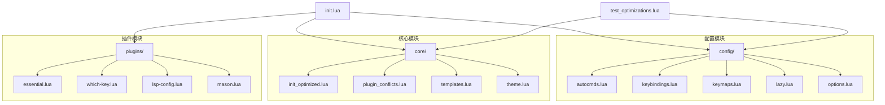
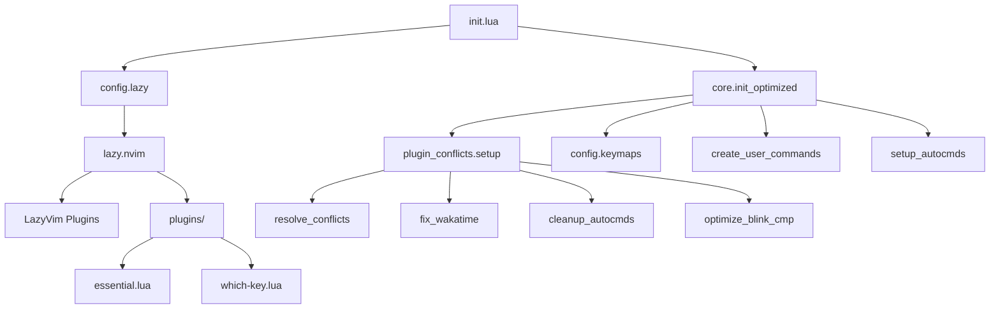
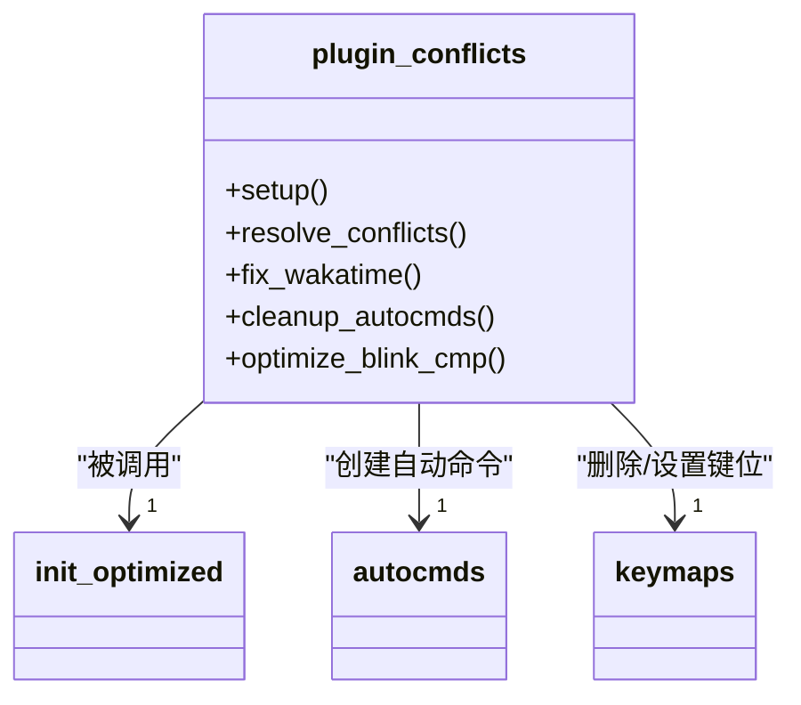
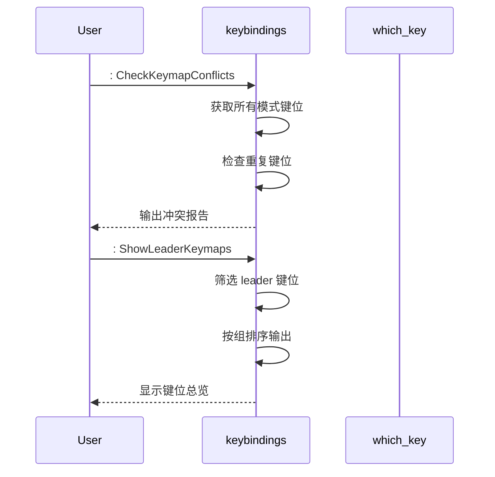
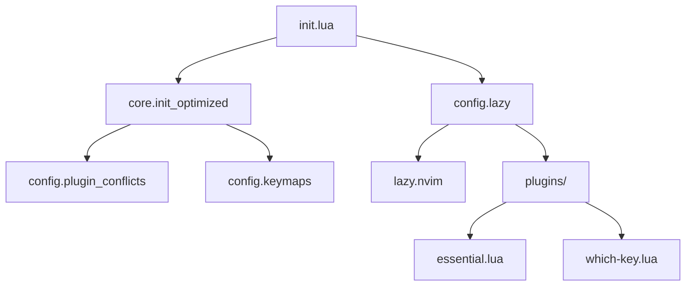
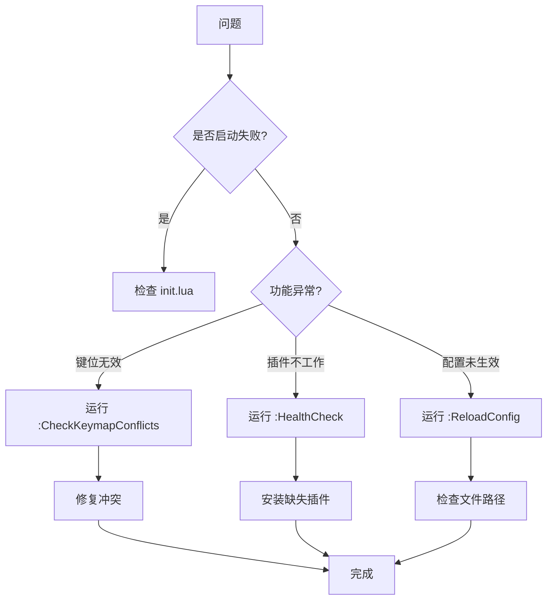

# 调试与性能优化

<cite>
**本文档引用的文件**
- [init.lua](file://init.lua)
- [test_optimizations.lua](file://test_optimizations.lua)
- [lua/config/lazy.lua](file://lua/config/lazy.lua)
- [lua/core/init_optimized.lua](file://lua/core/init_optimized.lua)
- [lua/core/plugin_conflicts.lua](file://lua/core/plugin_conflicts.lua)
- [lua/plugins/essential.lua](file://lua/plugins/essential.lua)
- [lua/plugins/which-key.lua](file://lua/plugins/which-key.lua)
- [lua/config/keybindings.lua](file://lua/config/keybindings.lua)
- [lua/config/options.lua](file://lua/config/options.lua)
</cite>

## 目录
1. [简介](#简介)
2. [项目结构](#项目结构)
3. [核心组件](#核心组件)
4. [架构概览](#架构概览)
5. [详细组件分析](#详细组件分析)
6. [依赖分析](#依赖分析)
7. [性能考量](#性能考量)
8. [故障排除指南](#故障排除指南)
9. [结论](#结论)

## 简介
本文档旨在指导高级用户诊断配置问题并优化 Neovim 启动性能。涵盖使用 `vim.inspect()` 调试 Lua 表结构、`:checkhealth` 检查环境状态、`:Lazy load` 验证插件加载情况等方法。结合 `test_optimizations.lua` 中的测试逻辑，说明如何测量关键路径耗时（如插件初始化、autocmd 触发），并提供延迟加载、避免重复 require、精简 which-key 注册等优化技巧。同时提供启动时间分析脚本模板和常见性能瓶颈的解决方案。

**Section sources**
- [init.lua](file://init.lua#L1-L50)
- [test_optimizations.lua](file://test_optimizations.lua#L1-L224)

## 项目结构
项目采用模块化结构，主要分为 `lua` 目录下的 `config`、`core` 和 `plugins` 子模块，以及根目录的 `init.lua` 和 `test_optimizations.lua` 测试脚本。



**Diagram sources**
- [init.lua](file://init.lua#L1-L50)
- [lua/config/lazy.lua](file://lua/config/lazy.lua#L1-L60)

**Section sources**
- [init.lua](file://init.lua#L1-L50)
- [lua/config/lazy.lua](file://lua/config/lazy.lua#L1-L60)

## 核心组件
系统核心由 `init_optimized.lua` 和 `plugin_conflicts.lua` 构成，前者负责基础选项设置、系统集成、用户命令创建和最终优化，后者解决插件间键位冲突、WakaTime 配置、自动命令清理等问题。`test_optimizations.lua` 提供完整的测试框架，验证配置的正确性和性能表现。

**Section sources**
- [lua/core/init_optimized.lua](file://lua/core/init_optimized.lua#L1-L236)
- [lua/core/plugin_conflicts.lua](file://lua/core/plugin_conflicts.lua#L1-L158)
- [test_optimizations.lua](file://test_optimizations.lua#L1-L224)

## 架构概览
系统采用 LazyVim 基础架构，通过 `lazy.nvim` 实现插件的按需加载和性能优化。`init.lua` 引导加载 `config.lazy`，后者配置插件管理器并导入 `plugins` 模块。核心优化逻辑在 `init_optimized.lua` 中执行，通过 `defer_fn` 延迟加载键位映射和最终设置，确保插件冲突已解决。



**Diagram sources**
- [init.lua](file://init.lua#L1-L50)
- [lua/config/lazy.lua](file://lua/config/lazy.lua#L1-L60)
- [lua/core/init_optimized.lua](file://lua/core/init_optimized.lua#L1-L236)

## 详细组件分析

### 初始化与优化组件分析
`init_optimized.lua` 是性能优化的核心，其 `setup()` 函数按顺序执行七步初始化，确保配置稳定高效。通过 `vim.defer_fn` 延迟加载 `keymaps` 和最终优化，避免与插件初始化冲突。

```mermaid
flowchart TD
Start([M.setup()]) --> A[setup_basic_options]
A --> B[require plugin_conflicts.setup]
B --> C[defer_fn: require keymaps]
C --> D[setup_system_integration]
D --> E[create_user_commands]
E --> F[setup_autocmds]
F --> G[final_optimizations]
G --> End([完成])
```

**Diagram sources**
- [lua/core/init_optimized.lua](file://lua/core/init_optimized.lua#L1-L236)

**Section sources**
- [lua/core/init_optimized.lua](file://lua/core/init_optimized.lua#L1-L236)

### 插件冲突解决组件分析
`plugin_conflicts.lua` 通过 `setup()` 和 `resolve_conflicts()` 函数解决多个插件间的冲突，包括 `nvim-autopairs` 与 `mini.pairs` 的键位冲突、`blink.cmp` 的回车键映射优先级等。



**Diagram sources**
- [lua/core/plugin_conflicts.lua](file://lua/core/plugin_conflicts.lua#L1-L158)

**Section sources**
- [lua/core/plugin_conflicts.lua](file://lua/core/plugin_conflicts.lua#L1-L158)

### 键位映射与 which-key 组件分析
`keybindings.lua` 统一管理所有键位映射，解决 `which-key` 报告的冲突问题。通过 `safe_unmap` 清理旧键位，将 LSP、诊断、游戏等功能迁移到统一前缀，并提供 `ShowAllKeymaps`、`CheckKeymapConflicts` 等调试命令。



**Diagram sources**
- [lua/config/keybindings.lua](file://lua/config/keybindings.lua#L1-L282)
- [lua/plugins/which-key.lua](file://lua/plugins/which-key.lua#L1-L57)

**Section sources**
- [lua/config/keybindings.lua](file://lua/config/keybindings.lua#L1-L282)
- [lua/plugins/which-key.lua](file://lua/plugins/which-key.lua#L1-L57)

## 依赖分析
系统依赖关系清晰，`init.lua` 作为入口点，直接依赖 `config.lazy` 和 `core.init_optimized`。`init_optimized` 依赖 `config.plugin_conflicts` 和 `config.keymaps`。插件通过 `lazy.nvim` 的 `spec` 配置导入，避免了硬编码依赖。



**Diagram sources**
- [init.lua](file://init.lua#L1-L50)
- [lua/config/lazy.lua](file://lua/config/lazy.lua#L1-L60)
- [lua/core/init_optimized.lua](file://lua/core/init_optimized.lua#L1-L236)

**Section sources**
- [init.lua](file://init.lua#L1-L50)
- [lua/config/lazy.lua](file://lua/config/lazy.lua#L1-L60)
- [lua/core/init_optimized.lua](file://lua/core/init_optimized.lua#L1-L236)

## 性能考量
系统通过多种方式优化性能：
- **延迟加载**：使用 `vim.defer_fn` 延迟非关键组件加载。
- **禁用冗余插件**：在 `lazy.lua` 中禁用 `gzip`、`matchit` 等内置插件。
- **减少自动命令**：`plugin_conflicts.lua` 清理不必要的自动命令。
- **优化键位映射**：避免重复定义，使用 `noremap` 提升响应速度。
- **剪贴板优化**：针对 WSL 和 Windows 环境配置高效的剪贴板集成。

**Section sources**
- [lua/config/lazy.lua](file://lua/config/lazy.lua#L1-L60)
- [lua/core/init_optimized.lua](file://lua/core/init_optimized.lua#L1-L236)
- [lua/core/plugin_conflicts.lua](file://lua/core/plugin_conflicts.lua#L1-L158)

## 故障排除指南
使用以下方法诊断配置问题：

1. **检查环境健康状态**：执行 `:HealthCheck` 或 `:checkhealth` 查看插件和系统状态。
2. **验证用户命令**：使用 `:ReloadConfig`、`:FixConflicts` 等命令测试功能。
3. **调试键位映射**：运行 `:ShowMappings` 或 `:ShowLeaderKeymaps` 查看当前映射。
4. **检查冲突**：使用 `:CheckKeymapConflicts` 发现重复键位。
5. **测试优化配置**：执行 `:TestOptimizations` 运行完整测试套件。
6. **调试 Lua 表**：使用 `vim.inspect(require('config.plugin_conflicts'))` 查看模块内容。



**Diagram sources**
- [test_optimizations.lua](file://test_optimizations.lua#L1-L224)
- [lua/core/init_optimized.lua](file://lua/core/init_optimized.lua#L1-L236)

**Section sources**
- [test_optimizations.lua](file://test_optimizations.lua#L1-L224)
- [lua/core/init_optimized.lua](file://lua/core/init_optimized.lua#L1-L236)

## 结论
本配置通过模块化设计、延迟加载、冲突解决和自动化测试，实现了高性能和高可维护性的 Neovim 环境。建议用户定期运行 `:TestOptimizations` 验证配置完整性，并利用提供的调试命令快速定位问题。未来可进一步优化启动时间，通过 `vim.start_time()` 测量关键路径耗时，针对性地改进性能瓶颈。