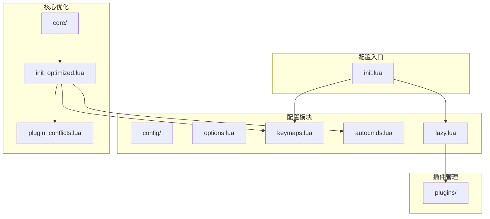
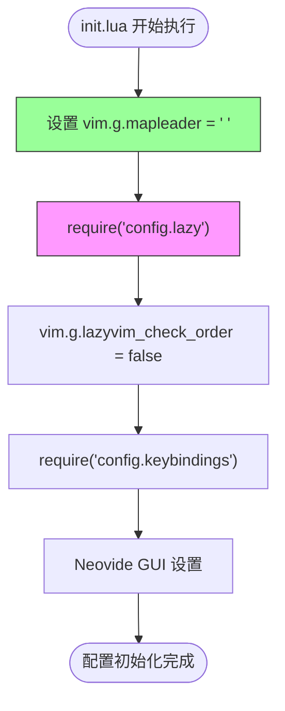
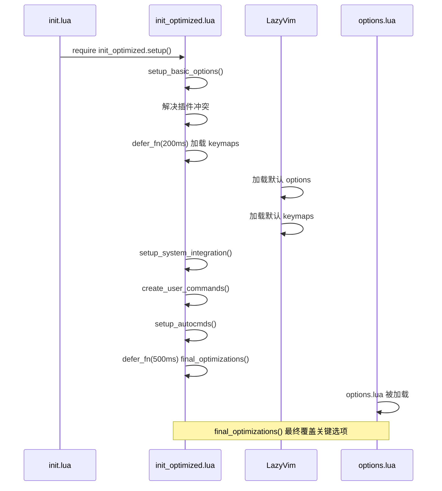
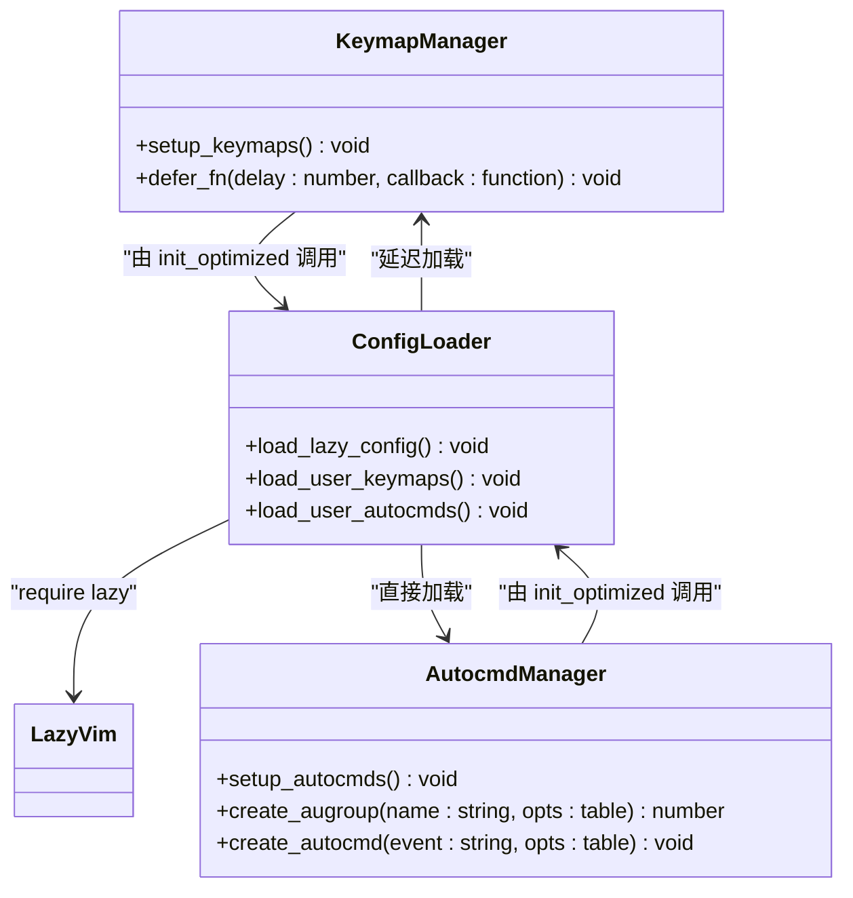
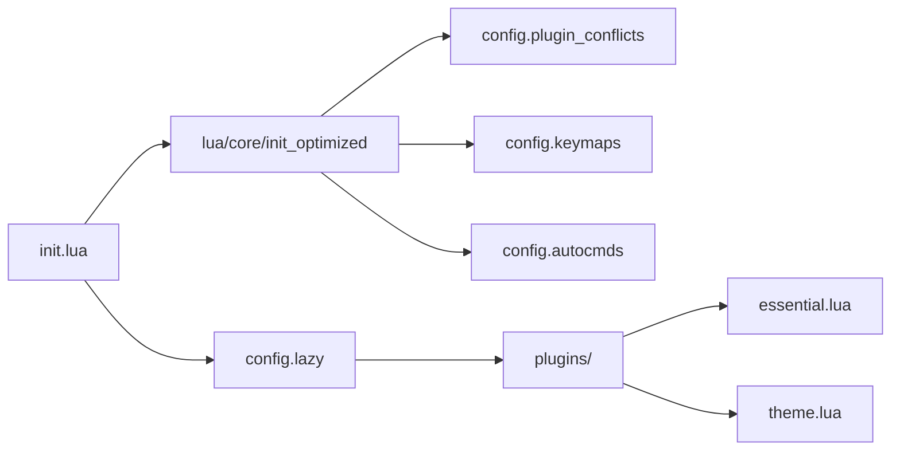

# 配置覆盖机制

<cite>
**本文档中引用的文件**
- [init.lua](file://init.lua)
- [lua/core/init_optimized.lua](file://lua/core/init_optimized.lua)
- [lua/config/options.lua](file://lua/config/options.lua)
- [lua/config/keymaps.lua](file://lua/config/keymaps.lua)
- [lua/config/autocmds.lua](file://lua/config/autocmds.lua)
- [lua/config/lazy.lua](file://lua/config/lazy.lua)
</cite>

## 目录
1. [简介](#简介)
2. [项目结构](#项目结构)
3. [核心组件](#核心组件)
4. [架构概览](#架构概览)
5. [详细组件分析](#详细组件分析)
6. [依赖分析](#依赖分析)
7. [性能考虑](#性能考虑)
8. [故障排除指南](#故障排除指南)
9. [结论](#结论)

## 简介
本文档深入解析如何安全地覆盖 LazyVim 及其默认行为。重点说明 `init.lua` 作为配置入口如何优先加载自定义设置，解释 `vim.opt` 选项的继承规则与覆盖时机。结合 `lua/core/init_optimized.lua` 中的系统级优化配置，阐述自动命令（autocmds）、键位映射（keymaps）和选项（options）的优先级链。提供具体示例：修改默认 leader 键、禁用内置插件、重定义颜色主题触发逻辑，并指出常见陷阱如延迟加载导致的覆盖失败。

## 项目结构
项目采用模块化 Lua 配置结构，将不同功能分离到独立文件中，便于维护和扩展。核心配置分为 `config` 和 `core` 两个目录，前者存放用户级配置，后者包含系统级优化逻辑。



**Diagram sources**
- [init.lua](file://init.lua#L1-L49)
- [lua/core/init_optimized.lua](file://lua/core/init_optimized.lua#L1-L236)
- [lua/config/lazy.lua](file://lua/config/lazy.lua#L1-L60)

**Section sources**
- [init.lua](file://init.lua#L1-L49)
- [lua/config/lazy.lua](file://lua/config/lazy.lua#L1-L60)

## 核心组件
`init.lua` 是整个 Neovim 配置的入口点，负责加载自定义配置并控制 LazyVim 的初始化流程。通过 `require("config.lazy")` 引入插件管理器配置，并显式设置 `vim.g.mapleader`，确保自定义键位映射优先于 LazyVim 默认行为。`lua/core/init_optimized.lua` 提供系统级优化，通过 `vim.defer_fn` 延迟加载关键配置，避免与插件初始化冲突。

**Section sources**
- [init.lua](file://init.lua#L1-L49)
- [lua/core/init_optimized.lua](file://lua/core/init_optimized.lua#L1-L236)

## 架构概览
整体架构遵循“先基础、后扩展”的原则。`init.lua` 首先加载 `config.lazy` 设置 leader 键，然后由 `init_optimized.lua` 按顺序执行：基础选项 → 插件冲突解决 → 键位映射 → 系统集成 → 自动命令 → 最终优化。这种分阶段加载机制确保了自定义配置能够正确覆盖默认行为。

```mermaid
graph TD
A[启动 Neovim] --> B[执行 init.lua]
B --> C[设置 mapleader]
C --> D[require config.lazy]
D --> E[LazyVim 初始化]
E --> F[require init_optimized.setup()]
F --> G[setup_basic_options]
G --> H[解决插件冲突]
H --> I[延迟加载 keymaps]
I --> J[系统集成]
J --> K[创建用户命令]
K --> L[设置自动命令]
L --> M[最终优化]
M --> N[配置完成]
```

**Diagram sources**
- [init.lua](file://init.lua#L1-L49)
- [lua/core/init_optimized.lua](file://lua/core/init_optimized.lua#L1-L236)

## 详细组件分析

### init.lua 入口机制分析
`init.lua` 作为配置入口，其执行顺序至关重要。它首先通过 `require("config.lazy")` 设置 `mapleader` 和 `maplocalleader`，这一步必须在 LazyVim 加载任何插件前完成，否则默认的 `<space>` leader 键将被固化。



**Diagram sources**
- [init.lua](file://init.lua#L1-L49)

**Section sources**
- [init.lua](file://init.lua#L1-L49)

### 选项覆盖优先级链
`vim.opt` 选项的覆盖遵循严格的执行顺序。`init_optimized.lua` 中的 `setup_basic_options()` 首先设置基础选项，随后 `options.lua` 中的配置可能被 LazyVim 覆盖，因此关键选项应在 `init_optimized.lua` 的 `final_optimizations()` 中通过 `vim.defer_fn` 延迟设置以确保优先级。



**Diagram sources**
- [lua/core/init_optimized.lua](file://lua/core/init_optimized.lua#L1-L236)
- [lua/config/options.lua](file://lua/config/options.lua#L1-L264)

**Section sources**
- [lua/core/init_optimized.lua](file://lua/core/init_optimized.lua#L1-L236)
- [lua/config/options.lua](file://lua/config/options.lua#L1-L264)

### 自动命令与键位映射优先级
自动命令和键位映射的优先级由加载时机决定。`init_optimized.lua` 使用 `vim.defer_fn` 在 200ms 后加载 `keymaps.lua`，确保在 LazyVim 插件初始化完成后才应用自定义映射，从而避免冲突。自动命令通过 `setup_autocmds()` 统一管理，并使用 `clear = true` 创建新组，防止重复。



**Diagram sources**
- [lua/core/init_optimized.lua](file://lua/core/init_optimized.lua#L1-L236)
- [lua/config/keymaps.lua](file://lua/config/keymaps.lua#L1-L221)
- [lua/config/autocmds.lua](file://lua/config/autocmds.lua#L1-L221)

**Section sources**
- [lua/core/init_optimized.lua](file://lua/core/init_optimized.lua#L1-L236)
- [lua/config/keymaps.lua](file://lua/config/keymaps.lua#L1-L221)
- [lua/config/autocmds.lua](file://lua/config/autocmds.lua#L1-L221)

## 依赖分析
配置文件之间存在明确的依赖关系。`init.lua` 依赖 `config.lazy` 设置 leader 键；`init_optimized.lua` 依赖 `config.plugin_conflicts` 解决冲突，并通过延迟加载依赖 `config.keymaps` 和 `config.autocmds`。这种依赖链确保了配置按正确顺序应用。



**Diagram sources**
- [init.lua](file://init.lua#L1-L49)
- [lua/core/init_optimized.lua](file://lua/core/init_optimized.lua#L1-L236)
- [lua/config/lazy.lua](file://lua/config/lazy.lua#L1-L60)

**Section sources**
- [init.lua](file://init.lua#L1-L49)
- [lua/core/init_optimized.lua](file://lua/core/init_optimized.lua#L1-L236)

## 性能考虑
`init_optimized.lua` 通过分阶段初始化和延迟加载优化启动性能。大文件优化自动命令根据文件大小动态调整配置，10MB 以上文件禁用 LSP 和语法高亮，1MB-10MB 文件适度优化。`vim.defer_fn` 的使用避免了阻塞主进程，确保编辑器快速响应。

## 故障排除指南
常见覆盖失败问题包括：leader 键未生效（未在 `lazy.lua` 中提前设置）、键位映射被覆盖（未使用 `defer_fn` 延迟加载）、自动命令重复执行（未使用 `clear = true`）。解决方案：确保 `mapleader` 在 `require("lazy")` 前设置；关键映射在 `init_optimized` 中延迟加载；自动命令使用独立 `augroup` 并清除旧组。

**Section sources**
- [lua/core/init_optimized.lua](file://lua/core/init_optimized.lua#L1-L236)
- [lua/config/keymaps.lua](file://lua/config/keymaps.lua#L1-L221)
- [lua/config/autocmds.lua](file://lua/config/autocmds.lua#L1-L221)

## 结论
安全覆盖 LazyVim 默认行为的关键在于掌握加载顺序和优先级机制。通过 `init.lua` 优先设置 `mapleader`，利用 `init_optimized.lua` 的分阶段初始化和 `vim.defer_fn` 延迟加载，可以确保自定义配置在正确时机覆盖默认行为。理解自动命令组管理、选项继承链和插件冲突解决机制，是构建稳定高效 Neovim 配置的基础。