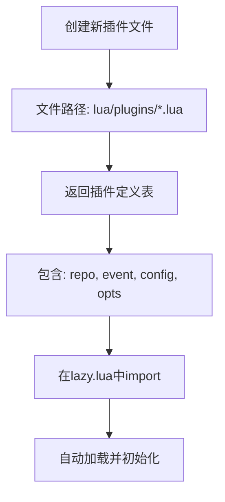
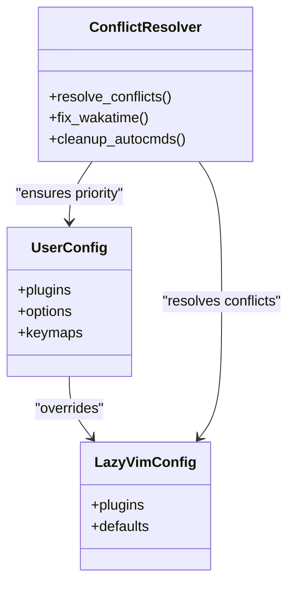
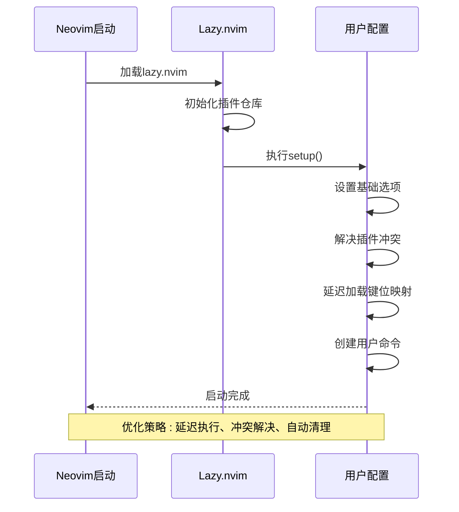

# 高级配置与扩展

<cite>
**本文档中引用的文件**  
- [init.lua](file://init.lua)
- [lua/config/lazy.lua](file://lua/config/lazy.lua)
- [lua/plugins/essential.lua](file://lua/plugins/essential.lua)
- [lua/plugins/extra.lua](file://lua/plugins/extra.lua)
- [lua/core/init_optimized.lua](file://lua/core/init_optimized.lua)
- [lua/config/options.lua](file://lua/config/options.lua)
- [lua/config/keymaps.lua](file://lua/config/keymaps.lua)
- [lua/core/plugin_conflicts.lua](file://lua/core/plugin_conflicts.lua)
- [lazyvim.json](file://lazyvim.json)
</cite>

## 目录
1. [引言](#引言)
2. [第三方插件添加指南](#第三方插件添加指南)
3. [配置覆盖与优先级机制](#配置覆盖与优先级机制)
4. [多设备配置同步策略](#多设备配置同步策略)
5. [Lua配置调试与性能分析](#lua配置调试与性能分析)
6. [最佳实践](#最佳实践)
7. [结论](#结论)

## 引言
本指南面向高级Neovim用户，旨在深入解析基于LazyVim框架的深度定制方法。通过分析当前配置结构，本文将系统性地介绍如何安全地扩展功能、覆盖默认设置、管理插件冲突，并实现跨设备同步与性能优化。整体配置采用模块化设计，以`lua/`目录为核心，分为`config`、`core`和`plugins`三大子模块，支持高度可维护的个性化定制。

**Section sources**
- [init.lua](file://init.lua#L1-L49)
- [lua/config/lazy.lua](file://lua/config/lazy.lua#L1-L60)

## 第三方插件添加指南
用户可通过在`lua/plugins/`目录下创建新的`.lua`文件来添加第三方插件。每个插件文件应返回一个包含插件定义的表，遵循Lazy.nvim的规范。例如，`essential.lua`中通过定义插件表集合引入了`nvim-surround`、`render-markdown.nvim`等插件，并配置其触发事件（`event`）、依赖项（`dependencies`）及初始化选项（`opts`或`config`）。

新插件文件命名应具有语义性（如`ai-assistants.lua`、`git-integration.lua`），并在`lazy.lua`的`spec`字段中通过`{ import = "plugins" }`自动加载。插件定义支持`ft`（文件类型触发）、`cmd`（命令触发）和`keys`（快捷键触发）等多种加载策略，确保按需加载以提升启动性能。

**Diagram sources**
- [lua/plugins/essential.lua](file://lua/plugins/essential.lua#L1-L610)
- [lua/config/lazy.lua](file://lua/config/lazy.lua#L1-L60)

**Section sources**
- [lua/plugins/essential.lua](file://lua/plugins/essential.lua#L1-L610)
- [lua/config/lazy.lua](file://lua/config/lazy.lua#L1-L60)

## 配置覆盖与优先级机制
本配置体系采用分层继承机制，允许用户覆盖LazyVim或本配置的默认设置。核心机制如下：

1. **加载顺序决定优先级**：在`init.lua`中，`require("config.lazy")`导入LazyVim插件后，用户自定义插件通过`{ import = "plugins" }`被引入，从而实现对默认行为的覆盖。
2. **模块化覆盖**：`config/`目录下的`options.lua`、`keymaps.lua`等文件用于覆盖全局选项和键位映射。例如，`keymaps.lua`中重新定义了`<C-s>`为保存文件，覆盖了原生行为。
3. **冲突解决机制**：`core/plugin_conflicts.lua`专门处理插件间键位冲突（如`mini.pairs`与`nvim-autopairs`），通过延迟执行（`vim.defer_fn`）和精确映射删除（`vim.keymap.del`）确保用户设定优先。

**Diagram sources**
- [init.lua](file://init.lua#L1-L49)
- [lua/config/lazy.lua](file://lua/config/lazy.lua#L1-L60)
- [lua/core/plugin_conflicts.lua](file://lua/core/plugin_conflicts.lua#L1-L158)
- [lua/config/keymaps.lua](file://lua/config/keymaps.lua#L1-L221)

**Section sources**
- [init.lua](file://init.lua#L1-L49)
- [lua/config/lazy.lua](file://lua/config/lazy.lua#L1-L60)
- [lua/core/plugin_conflicts.lua](file://lua/core/plugin_conflicts.lua#L1-L158)
- [lua/config/keymaps.lua](file://lua/config/keymaps.lua#L1-L221)

## 多设备配置同步策略
推荐使用Git对整个`~/.config/nvim`目录进行版本控制，实现多设备间的配置同步。具体步骤如下：

1. **初始化仓库**：在配置目录执行`git init`，创建`.gitignore`排除敏感文件（如API密钥）。
2. **提交配置**：将`init.lua`、`lua/`目录及`lazyvim.json`纳入版本管理。
3. **跨设备部署**：在新设备上克隆仓库至`~/.config/nvim`，启动Neovim后Lazy.nvim将自动恢复插件。
4. **环境变量管理**：将API密钥（如`OPENAI_API_KEY`）等敏感信息通过环境变量注入，避免硬编码。

此策略确保配置一致性，同时支持回滚、分支管理和团队协作。

**Section sources**
- [init.lua](file://init.lua#L1-L49)
- [lazyvim.json](file://lazyvim.json#L1-L10)

## Lua配置调试与性能分析
### 调试Lua配置错误
- **使用`:checkhealth`**：运行`HealthCheck`命令（或`:checkhealth`）检查Neovim及插件状态。
- **启用通知**：通过`vim.notify`输出调试信息，如`init_optimized.lua`中提示“优化配置已加载完成”。
- **错误捕获**：在关键函数使用`pcall`包裹，防止配置错误导致启动失败。
- **日志分析**：查看`~/.local/share/nvim/log`中的运行日志。

### 分析启动性能瓶颈
- **延迟加载**：利用`event`、`ft`、`cmd`等条件实现插件懒加载。
- **性能监控**：Lazy.nvim内置启动时间分析，可通过`:Lazy profile`查看各插件加载耗时。
- **优化关键路径**：`init_optimized.lua`通过`vim.defer_fn`延迟非关键配置，减少启动阻塞。
- **禁用冗余插件**：在`lazy.lua`的`performance.rtp.disabled_plugins`中禁用内置插件（如`netrwPlugin`）。

**Diagram sources**
- [lua/core/init_optimized.lua](file://lua/core/init_optimized.lua#L1-L236)
- [lua/config/lazy.lua](file://lua/config/lazy.lua#L1-L60)

**Section sources**
- [lua/core/init_optimized.lua](file://lua/core/init_optimized.lua#L1-L236)
- [lua/config/lazy.lua](file://lua/config/lazy.lua#L1-L60)

## 最佳实践
### 配置分组与命名规范
- **逻辑分组**：按功能将插件分组（如`essential.lua`、`extra.lua`），便于管理。
- **命名清晰**：插件文件名应反映其功能（如`git-integration.lua`）。
- **避免重复**：通过`{ import = "plugins" }`统一管理，避免在`init.lua`中直接require。

### 版本控制策略
- **原子提交**：每次变更一个功能点，提交信息清晰。
- **分支管理**：使用`main`分支稳定配置，`dev`分支测试新功能。
- **备份机制**：定期备份`~/.config/nvim`目录。

### 性能与可维护性
- **最小化修改**：仅覆盖必要配置，保留LazyVim默认行为。
- **文档化配置**：在关键配置处添加注释说明目的。
- **定期清理**：使用`CleanPlugins`命令清理未使用插件。

**Section sources**
- [lua/plugins/essential.lua](file://lua/plugins/essential.lua#L1-L610)
- [lua/plugins/extra.lua](file://lua/plugins/extra.lua#L1-L54)
- [lua/core/init_optimized.lua](file://lua/core/init_optimized.lua#L1-L236)

## 结论
本配置体系通过模块化设计、优先级继承和冲突解决机制，为高级用户提供了强大的定制能力。通过合理使用Lua插件扩展、Git同步和性能优化策略，用户可在保持系统稳定的同时，构建高度个性化的开发环境。建议遵循最佳实践，确保配置的可读性、可维护性和跨平台一致性。