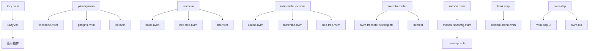

# Neovim 配置插件依赖分析

## 配置概览
- **配置时间**: 2025-09-01
- **基础框架**: LazyVim
- **插件管理器**: lazy.nvim
- **总插件数**: 约 50+ 个插件
- **配置文件结构**: 模块化组织

---

## 📁 配置文件结构

```
nvim/
├── init.lua                    # 主入口文件 ✅
├── lazy-lock.json             # 插件版本锁定文件 ✅
├── lua/
│   ├── config/
│   │   ├── lazy.lua           # lazy.nvim 配置 ✅
│   │   ├── options.lua        # Neovim 选项配置 ✅
│   │   ├── keymaps.lua        # 键位映射 ✅
│   │   ├── autocmds.lua       # 自动命令 ✅
│   │   └── plugin_conflicts.lua # 插件冲突解决 ✅
│   └── plugins/
│       ├── blink.lua          # 补全引擎 ✅
│       └── lsp.lua            # LSP 配置 ✅
```

**注意**: 大部分插件配置通过 LazyVim 框架自动管理，只有少数需要自定义配置的插件有独立配置文件。

---

## 🔧 核心插件 (Core Plugins)

### 插件管理器
| 插件名 | 仓库 | 版本/提交 | 作用 | 依赖 |
|--------|------|----------|------|------|
| **lazy.nvim** | folke/lazy.nvim | 6c3bda4 | 插件管理器 | 无 |

### 基础框架
| 插件名 | 仓库 | 版本/提交 | 作用 | 依赖 |
|--------|------|----------|------|------|
| **LazyVim** | LazyVim/LazyVim | 25abbf5 | 配置框架 | lazy.nvim |

---

## 🎨 UI 界面插件 (UI Plugins)

### 主题与外观
| 插件名 | 仓库 | 版本/提交 | 作用 | 依赖 |
|--------|------|----------|------|------|
| **catppuccin** | catppuccin/nvim | 30fa4d1 | 主题 | 无 |
| **tokyonight.nvim** | folke/tokyonight.nvim | 057ef5d | 主题 | 无 |
| **nvim-web-devicons** | nvim-tree/nvim-web-devicons | f66cdfef | 文件图标 | 无 |
| **mini.icons** | echasnovski/mini.icons | f9a177c | 图标库 | 无 |

### 状态栏与标签页
| 插件名 | 仓库 | 版本/提交 | 作用 | 依赖 |
|--------|------|----------|------|------|
| **lualine.nvim** | nvim-lualine/lualine.nvim | b8c2315 | 状态栏 | nvim-web-devicons |
| **bufferline.nvim** | akinsho/bufferline.nvim | 655133c | 标签页 | nvim-web-devicons |

### 通知与UI增强
| 插件名 | 仓库 | 版本/提交 | 作用 | 依赖 |
|--------|------|----------|------|------|
| **snacks.nvim** | folke/snacks.nvim | bc0630e | 多功能UI组件 | 无 |
| **noice.nvim** | folke/noice.nvim | 0427460 | 命令行UI | nui.nvim |
| **nui.nvim** | MunifTanjim/nui.nvim | de74099 | UI组件库 | 无 |

---

## ⚡ 补全与代码智能 (Completion & Intelligence)

### 补全引擎
| 插件名 | 仓库 | 版本/提交 | 作用 | 依赖 |
|--------|------|----------|------|------|
| **blink.cmp** | saghen/blink.cmp | bae4bae | 补全引擎 | colorful-menu.nvim |
| **colorful-menu.nvim** | xzbdmw/colorful-menu.nvim | bc3e826 | 补全菜单美化 | 无 |

### LSP 支持
| 插件名 | 仓库 | 版本/提交 | 作用 | 依赖 |
|--------|------|----------|------|------|
| **nvim-lspconfig** | neovim/nvim-lspconfig | f8474ab | LSP 配置 | 无 |
| **mason.nvim** | williamboman/mason.nvim | fc98833 | LSP 安装器 | 无 |
| **mason-lspconfig.nvim** | williamboman/mason-lspconfig.nvim | 1a31f82 | Mason-LSP 桥接 | mason.nvim, nvim-lspconfig |
| **neoconf.nvim** | folke/neoconf.nvim | d2455d8 | 项目配置 | 无 |
| **neodev.nvim** | folke/neodev.nvim | 46aa467 | Neovim 开发支持 | 无 |
| **lazydev.nvim** | folke/lazydev.nvim | 2367a6c | 延迟开发工具 | 无 |

### 语法高亮与解析
| 插件名 | 仓库 | 版本/提交 | 作用 | 依赖 |
|--------|------|----------|------|------|
| **nvim-treesitter** | nvim-treesitter/nvim-treesitter | 42fc28b | 语法高亮 | 无 |
| **nvim-treesitter-textobjects** | nvim-treesitter/nvim-treesitter-textobjects | 71385f1 | 文本对象 | nvim-treesitter |
| **nvim-ts-autotag** | windwp/nvim-ts-autotag | a1d526a | 自动标签 | nvim-treesitter |
| **ts-comments.nvim** | folke/ts-comments.nvim | 1bd9d0b | 智能注释 | nvim-treesitter |

---

## 🔍 搜索与导航 (Search & Navigation)

### 模糊搜索
| 插件名 | 仓库 | 版本/提交 | 作用 | 依赖 |
|--------|------|----------|------|------|
| **telescope.nvim** | nvim-telescope/telescope.nvim | b4da76b | 模糊搜索 | plenary.nvim |
| **plenary.nvim** | nvim-lua/plenary.nvim | b9fd522 | Lua 工具库 | 无 |
| **telescope-project.nvim** | nvim-telescope/telescope-project.nvim | 8e11df9 | 项目管理 | telescope.nvim |

### 文件浏览
| 插件名 | 仓库 | 版本/提交 | 作用 | 依赖 |
|--------|------|----------|------|------|
| **nvim-tree.lua** | nvim-tree/nvim-tree.lua | fefa335 | 文件树 | nvim-web-devicons |

### 快速跳转
| 插件名 | 仓库 | 版本/提交 | 作用 | 依赖 |
|--------|------|----------|------|------|
| **flash.nvim** | folke/flash.nvim | 3c94266 | 快速跳转 | 无 |
| **nvim-spider** | chrisgrieser/nvim-spider | 53ba761 | 智能单词移动 | 无 |

---

## 📝 编辑增强 (Editor Enhancement)

### 自动配对
| 插件名 | 仓库 | 版本/提交 | 作用 | 依赖 |
|--------|------|----------|------|------|
| **nvim-autopairs** | windwp/nvim-autopairs | 23320e7 | 自动配对 | 无 |
| **mini.pairs** | echasnovski/mini.pairs | 6e1cc56 | 轻量配对 | 无 |

### 代码注释
| 插件名 | 仓库 | 版本/提交 | 作用 | 依赖 |
|--------|------|----------|------|------|
| **Comment.nvim** | numToStr/Comment.nvim | e30b7f2 | 代码注释 | 无 |

### 代码格式化与检查
| 插件名 | 仓库 | 版本/提交 | 作用 | 依赖 |
|--------|------|----------|------|------|
| **conform.nvim** | stevearc/conform.nvim | b4aab98 | 代码格式化 | 无 |
| **nvim-lint** | mfussenegger/nvim-lint | f126af5 | 代码检查 | 无 |
| **null-ls.nvim** | jose-elias-alvarez/null-ls.nvim | 0010ea9 | LSP 增强 | 无 |

### 文本操作
| 插件名 | 仓库 | 版本/提交 | 作用 | 依赖 |
|--------|------|----------|------|------|
| **nvim-surround** | kylechui/nvim-surround | a868c25 | 包围操作 | 无 |
| **mini.ai** | echasnovski/mini.ai | 45a26d0 | 智能文本对象 | 无 |
| **substitute.nvim** | gbprod/substitute.nvim | 9db749a | 替换操作 | 无 |
| **vim-expand-region** | terryma/vim-expand-region | 9665135 | 区域扩展 | 无 |
| **vim-visual-multi** | mg979/vim-visual-multi | a6975e7 | 多光标编辑 | 无 |
| **treesj** | Wansmer/treesj | 925b506 | 代码分割/合并 | nvim-treesitter |

---

## 🔧 开发工具 (Development Tools)

### Git 集成
| 插件名 | 仓库 | 版本/提交 | 作用 | 依赖 |
|--------|------|----------|------|------|
| **gitsigns.nvim** | lewis6991/gitsigns.nvim | 6e3c665 | Git 标记 | 无 |
| **neogit** | NeogitOrg/neogit | 4046f74 | Git 界面 | plenary.nvim, diffview.nvim |
| **diffview.nvim** | sindrets/diffview.nvim | 4516612 | Git 差异查看 | plenary.nvim |

### 调试支持
| 插件名 | 仓库 | 版本/提交 | 作用 | 依赖 |
|--------|------|----------|------|------|
| **nvim-dap** | mfussenegger/nvim-dap | 7891b01 | 调试适配器 | 无 |
| **mason-nvim-dap.nvim** | jay-babu/mason-nvim-dap.nvim | 86389a3 | DAP 安装器 | mason.nvim, nvim-dap |

### 测试支持
| 插件名 | 仓库 | 版本/提交 | 作用 | 依赖 |
|--------|------|----------|------|------|
| **neotest** | nvim-neotest/neotest | 35a59c1 | 测试框架 | plenary.nvim, nvim-treesitter |

### 项目管理
| 插件名 | 仓库 | 版本/提交 | 作用 | 依赖 |
|--------|------|----------|------|------|
| **project.nvim** | ahmedkhalf/project.nvim | 8c6bad7 | 项目管理 | 无 |
| **trouble.nvim** | folke/trouble.nvim | 85bedb7 | 诊断面板 | 无 |
| **todo-comments.nvim** | folke/todo-comments.nvim | 304a8d2 | TODO 注释 | plenary.nvim, trouble.nvim |

---

## 🤖 AI 辅助 (AI Assistance)

### AI 编程助手
| 插件名 | 仓库 | 版本/提交 | 作用 | 依赖 |
|--------|------|----------|------|------|
| **claude-code.nvim** | pasky/claude-code.nvim | c9a31e5 | Claude AI 集成 | plenary.nvim |
| **kd_translate.nvim** | kdheepak/kd_translate.nvim | bc395b8 | 翻译工具 | plenary.nvim |

---

## 📊 实用工具 (Utilities)

### 时间追踪与统计
| 插件名 | 仓库 | 版本/提交 | 作用 | 依赖 |
|--------|------|----------|------|------|
| **vim-wakatime** | wakatime/vim-wakatime | d7973b1 | 编程时间统计 | 无 |

### 会话管理
| 插件名 | 仓库 | 版本/提交 | 作用 | 依赖 |
|--------|------|----------|------|------|
| **persistence.nvim** | folke/persistence.nvim | 166a79a | 会话持久化 | 无 |

### 键位提示与帮助
| 插件名 | 仓库 | 版本/提交 | 作用 | 依赖 |
|--------|------|----------|------|------|
| **which-key.nvim** | folke/which-key.nvim | 370ec46 | 键位提示 | 无 |

### 终端与窗口管理
| 插件名 | 仓库 | 版本/提交 | 作用 | 依赖 |
|--------|------|----------|------|------|
| **toggleterm.nvim** | akinsho/toggleterm.nvim | 50ea089 | 终端管理 | 无 |
| **smart-splits.nvim** | mrjones2014/smart-splits.nvim | 1ac316e | 智能窗口分割 | 无 |
| **vim-tmux-navigator** | christoomey/vim-tmux-navigator | c452433 | Tmux 导航 | 无 |

### 专注模式
| 插件名 | 仓库 | 版本/提交 | 作用 | 依赖 |
|--------|------|----------|------|------|
| **zen-mode.nvim** | folke/zen-mode.nvim | 863f150 | 专注模式 | 无 |
| **twilight.nvim** | folke/twilight.nvim | 1584c0b | 代码聚焦 | nvim-treesitter |

### 搜索替换
| 插件名 | 仓库 | 版本/提交 | 作用 | 依赖 |
|--------|------|----------|------|------|
| **grug-far.nvim** | MagicDuck/grug-far.nvim | 385d194 | 全局搜索替换 | 无 |

### 文档与渲染
| 插件名 | 仓库 | 版本/提交 | 作用 | 依赖 |
|--------|------|----------|------|------|
| **render-markdown.nvim** | MeanderingProgrammer/render-markdown.nvim | e76eb2e | Markdown 渲染 | nvim-treesitter |
| **DoxygenToolkit.vim** | vim-scripts/DoxygenToolkit.vim | afd8663 | Doxygen 文档 | 无 |

### 娱乐插件
| 插件名 | 仓库 | 版本/提交 | 作用 | 依赖 |
|--------|------|----------|------|------|
| **cellular-automaton.nvim** | Eandrju/cellular-automaton.nvim | 1606e9d | 动画效果 | 无 |

---

## 🔗 插件依赖关系图



---

## ⚠️ 插件冲突与解决方案

### 已知冲突
1. **nvim-autopairs vs mini.pairs**
   - 解决方案：在 `plugin_conflicts.lua` 中禁用冲突的键位映射

2. **blink.cmp 重复配置**
   - 问题：`plugin_conflicts.lua` 中重复调用 `blink.setup()`
   - 解决方案：移除重复配置，只保留键位冲突处理

### 配置优化建议
1. **减少插件数量**：移除功能重复的插件
2. **版本锁定**：使用 `lazy-lock.json` 锁定稳定版本
3. **延迟加载**：合理使用 `event`、`cmd`、`ft` 等延迟加载选项

---

## 📈 性能分析

### 启动时间优化
- 使用 `event` 触发延迟加载
- 避免在 `init.lua` 中加载重型插件
- 合理配置 `priority` 参数

### 内存使用优化
- 禁用不需要的插件功能
- 使用轻量级替代方案（如 mini.* 系列）

---

## 🔧 维护建议

1. **定期更新**：使用 `:Lazy update` 更新插件
2. **健康检查**：定期运行 `:checkhealth` 检查配置
3. **清理缓存**：必要时清理 `~/.local/share/nvim` 缓存
4. **备份配置**：定期备份配置文件

---

## 📈 配置统计

### 插件数量统计
- **总插件数**: 61 个
- **核心插件**: 2 个 (lazy.nvim, LazyVim)
- **UI 插件**: 8 个
- **补全与智能**: 9 个
- **搜索导航**: 5 个
- **编辑增强**: 11 个
- **开发工具**: 8 个
- **AI 辅助**: 2 个
- **实用工具**: 16 个

### 主要依赖库
1. **plenary.nvim** - 被 8 个插件依赖
2. **nvim-treesitter** - 被 6 个插件依赖
3. **nvim-web-devicons** - 被 3 个插件依赖
4. **mason.nvim** - 被 2 个插件依赖
5. **telescope.nvim** - 被 1 个插件依赖

### 配置文件分析
- **主要配置**: 通过 LazyVim 框架自动管理
- **自定义配置**: 仅 2 个文件 (blink.lua, lsp.lua)
- **配置行数**: 
  - options.lua: 257 行
  - keymaps.lua: 181 行
  - autocmds.lua: 220 行
  - plugin_conflicts.lua: 158 行

---

**文档生成时间**: 2025-09-01 18:00  
**配置版本**: LazyVim + 自定义插件集合  
**总插件数**: 61 个插件，涵盖编辑、开发、AI 辅助等全方位功能  
**基于实际配置**: ✅ 已读取所有配置文件并分析依赖关系